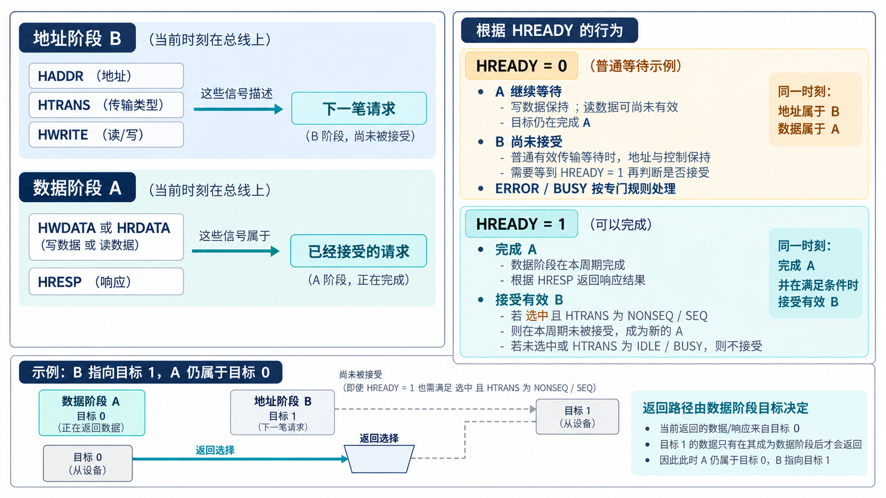

# AI 开发 AHB VIP，先看懂地址与数据的交错

简体中文｜英文版待补

[系列入口](../README.md) · [上一章](chapter-01.md) · [下一章](chapter-03.md)

假设发起端连续写两个地址：先写 A，再写 B。在 AHB 上，第二笔地址 B 可以与第一笔写数据同时出现。流水线通过这种重叠提高连续传输效率，也把一个容易忽略的问题交给验证环境：当前数据应该归到哪个地址？

## 一条总线上同时有两笔访问的信息

每笔传输有地址阶段和数据阶段。地址阶段给出地址、读写方向、传输尺寸等控制信息；数据阶段传递写数据或返回读数据，并给出响应。Manager 是发起访问的一端，Subordinate 是接受访问并响应的一端。

在无等待的连续传输中，一个有效采样边沿可以完成旧数据阶段，同时接受新地址阶段。对被选中的接口来说，接受新地址需要 HREADY 为高，且 HTRANS 表示 NONSEQ 或 SEQ。HREADY 为低时，正在进行的数据阶段延长，下一笔有效地址还没有被接受。读数据可以在等待期间尚未有效，不能每个周期都拿它去比对。

*原理示意：先分清 A 与 B 的归属，再看 HREADY。图中保持规则针对普通有效传输的等待；BUSY、IDLE 与 ERROR 的处理需要各自的规则。*

HREADYOUT 是某个目标给出的就绪输出，HREADY 是总线选择后反馈的就绪信号。若当前地址 B 指向目标 1，而正在完成的 A 属于目标 0，返回的 HREADY、HRESP 和 HRDATA 必须选目标 0。用当前 HADDR 直接选择返回信号，会把两个阶段混在一起。[第 6 章](chapter-06.md)的实际环境正是通过保存数据阶段目标解决这个问题。

## HTRANS 告诉我们哪些地址有效

HTRANS 的四种编码各有用途。IDLE 表示没有有效传输；NONSEQ 表示单笔传输或一组突发的第一拍；SEQ 表示延续当前突发；BUSY 表示发起端暂时不能给出下一拍，但仍保持相应突发上下文。Monitor 不能把 BUSY 当成一次存储访问。

一个常见但过宽的检查条件是“只要 HREADY 低，所有控制信号都不能变”。这会混淆普通有效访问等待与协议允许的特定转换。检查器需要保留前一状态，知道当前处于普通等待、BUSY 处理还是错误响应，而不是只比较相邻两个周期是否完全一致。

## 突发里的尺寸和长度是两件事

HSIZE 表达每拍的字节数，关系是 2 的 HSIZE 次方。size 0、1、2 分别对应 1、2、4 字节。数据总线为 32 位，并不意味着每拍都写四个字节；窄访问还需要根据地址判断有效字节通道。

HBURST 表达传输组织方式，包括 SINGLE、未定长 INCR，以及 4、8、16 拍的递增或回绕突发。这里的长度是拍数，不是字节数。地址必须满足传输尺寸的对齐要求，递增突发不能跨越 1 KB 边界。

以四拍、每拍四字节的 WRAP4 为例，回绕窗口为 16 字节。若起始地址为 0x80C，后面依次是 0x800、0x804、0x808，而不是继续到 0x810。这组地址已经进入现有独立向量，适合人工核算。让 AI 同时调用同一个地址函数去产生激励和预期，可能把一个算法错误复制到两边；[第 4 章](chapter-04.md)会进一步解释怎样避免。

## ERROR 为什么需要两个周期

AHB-Lite 的 ERROR 响应分两步：第一周期给出 ERROR 并把就绪拉低，第二周期保持 ERROR 并把就绪拉高，结束这笔失败访问。若目标此前需要额外等待，前面的普通等待仍使用 OKAY。

这个安排给发起端留下处理已摆出的下一笔地址的时间。发起端可以取消下一笔候选访问；协议并不要求每次 ERROR 都必须永久放弃突发的全部剩余访问。对 Monitor 来说，失败的旧请求与尚未接受的候选请求必须分开，不能凭总线上出现过一个地址就生成完成记录。Arm 的[采样与 ERROR 时序说明](https://community.arm.com/support-forums/f/soc-design-and-simulation-forum/56514/questions-regarding-amba-ahb-sampling-time-ihi0033c_amba_ahb_protocol_spec/185133)给出了具体解释。

## 先选协议配置，再谈扩展

Lite32 是本文的基础解释配置。AHB5 在相应配置下增加安全属性、独占访问、字节选通等机制；Classic AHB 有 RETRY、SPLIT 等响应及相关仲裁语义。RETRY 和 SPLIT 不能直接套进 AHB-Lite 的两种响应模型。

这些差异需要进入接口类型和测试计划。当前 VIP 对 AHB5_128 与 Classic32 的资格结论是定向能力，详细范围见[第 5 章](chapter-05.md)。先把具体配置写明，后面的“支持”“通过”和“复用”才有确定含义。
