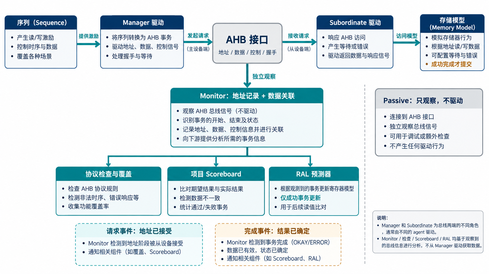

# AI 设计的 AHB VIP，怎样分开驱动、观察与判断？

简体中文｜英文版待补

[系列入口](../README.md) · [上一章](chapter-02.md) · [下一章](chapter-04.md)

一个验证组件既产生请求，又判断请求是否正确，职责如果没有分开，很容易形成自我证明：驱动说自己发了什么，检查器就相信总线上发生了什么。

这套 AHB VIP 的架构从总线观察重新建立事实。驱动处理激励，Monitor 根据接口采样重建事务，设备模型处理存储语义，项目检查器再判断 IP 的行为是否符合预期。

## 三种角色共用事务语言

ahb_agent 根据配置装配角色。主动发起端创建 sequencer 和 Manager driver；主动目标端创建 Subordinate driver；Passive 模式只观察，不驱动接口。各角色都有 Monitor，覆盖组件在启用时接收完成事务。

序列通过 ahb_item 描述访问。submit 用于提交请求，get_response 获取完成结果，transfer 将两步组合；也提供读写和突发操作。提交给驱动与总线接受不是同一时刻，驱动还需要保留请求所属的 sequence，才能把后续结果送回正确的序列。

*原理示意：Monitor 从接口采样，不从驱动意图复制结果。等待与响应由目标端策略决定，存储模型承担数据和副作用；图中的完成数据只在相应成功条件下用于功能比较。*

一个环境可以提交多笔软件请求，但这不等于 AHB 总线支持 AXI 式的多 ID 乱序完成。软件队列与协议流水必须分清，否则 AI 容易把另一种协议的调度模式迁移过来。

## Monitor 保存的是阶段关系

实际 Monitor 的处理顺序很重要：先处理复位；在就绪时完成已有数据阶段；然后再根据选择信号、就绪和 HTRANS 接受新的地址。这样同一个采样点可以“交付上一笔、记录下一笔”，又不会用新地址覆盖旧事务。

它提供不同用途的观察端口：request_ap 发布地址接受事件，transaction_ap 发布事务结果，cycle_ap 提供周期观察，error_ap 提供诊断，burst_ap 提供有界突发分组。项目应按问题选择端口：要检查请求是否到达，观察地址接受；要更新寄存器镜像或比较读值，观察完成结果。

有界分组用于控制长期运行时的历史规模，分组结束不自动等于协议突发结束。订阅者也应将收到的对象视为只读，需要修改时先复制。这些细节让多种检查可以共存，避免一个订阅者影响另一个订阅者的判断。

## 目标模型把响应与提交分开

Subordinate driver 可以通过响应策略选择等待长度和响应类型。策略在地址被接受时形成快照，因此已经开始的访问不会因为外部随后改了策略而改变含义。

ahb_memory 是稀疏存储模型，只为实际使用的地址维护数据，并提供后门访问和初始化能力。它还支持只读、只写、读清除、写一清零和 FIFO 等设备语义。读清除意味着读操作会清除状态，写一清零意味着写入的 1 清除对应位，因此“读到了值”与“状态何时改变”必须一起定义。

本实现将这些副作用绑定到成功完成。等待三个周期不会提交三次，失败的写操作默认不更新存储。未初始化的读数据也不能仅凭协议合法就推导为零；项目必须给出初始化或预加载预期。

## RAL 与桥接适配把通用能力送到项目层

RAL 是 UVM 的寄存器抽象层，用寄存器对象描述地址、字段与访问属性。ahb_reg_adapter 负责寄存器操作和总线事务之间的转换，预测器从 Monitor 的成功完成事务更新镜像。没有字节选通信号支持时，适配器会拒绝不能直接表达的稀疏字节使能，不偷偷补一轮读改写。

ahb_bridge_scoreboard 则面向桥接路径，将上下游完成事务转换成可比较的有效字节，允许显式指定地址、位宽、端序和错误映射。USER 信息如何变换也需要项目给出策略。能够比较一条路径的数据，并不自动证明系统级独占或原子性。

接入时，interface、参数化 agent 与 config_db 中的 virtual interface 类型必须一致，包含数据宽度、协议配置和可选信号。结构配置在构建时冻结，动态响应策略另行管理。这样 AI 修改连接时，类型和配置检查可以较早暴露不一致，而不是等到读回数据错误才发现。
