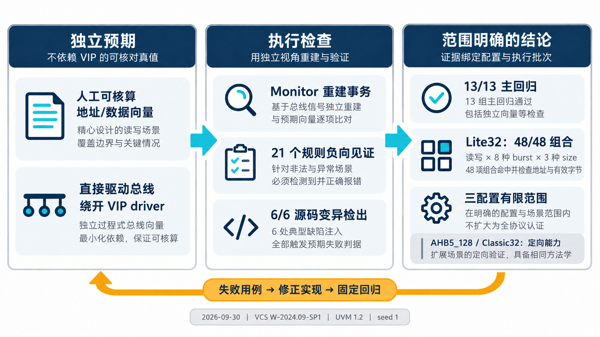

# AI 设计的 AHB VIP，现有证据说明了什么？

简体中文｜英文版待补

[系列入口](../README.md) · [上一章](chapter-04.md) · [下一章](chapter-06.md)

“回归通过”需要一个分母：通过的是哪些配置、哪些场景，以及哪次执行？同一个 VIP 的历史报告可能包含不同阶段的数据，把其中最大的数字拼在一起，会得到一个实际上从未执行过的验收结果。

本文采用 AHB VIP 0.1.0 的三配置有限范围资格结论。最终资格批次为 ahb-0.1.0-release-20260930-r3，实际执行来自 r2，工具为 VCS W-2024.09-SP1、UVM 1.2、FuseSoC 2.4.7，seed 为 1。本次写作核对既有实现和报告，没有重新运行 EDA 仿真。

## 数字对应哪些检查

下面的数字来自当前资格报告的结果摘要，不是本次生成的仿真日志。

| 已记录结果 | 可以据此判断什么 |
| --- | --- |
| 13/13 组主回归通过 | 冻结范围内的主测试组完成检查 |
| Lite32 48/48 组合命中 | 读写 × 8 种 burst × size 0/1/2，检查地址推进与有效字节 |
| WAIT=0/1/3/15/256 | 覆盖无等待到较长等待的五档设置 |
| 21 个关键规则负向见证 | 选定非法场景能够触发对应诊断 |
| 6/6 源码变异检出 | 六类已植入错误触发指定失败判据 |
| FuseSoC smoke/regression 通过 | 从组件描述快照独立构建并执行两个目标 |

48/48 的分母是一个具体配置下的三维组合，不是整个 AHB 协议的所有交叉覆盖。命中组合之外，报告还要求定向预期检查地址与有效字节；只有活动计数而没有结果比较，不能得到同样的结论。

*原理示意：证据由不同检查构成。图中的数字属于 2026 年 9 月 30 日资格基线；反馈箭头表达研发方法，不是新增执行记录。*

## 三种配置的结论不等宽

Lite32 的范围包括读写、合法突发、size 0/1/2，以及等待、ERROR 和复位处理。AHB5_128 的结果集中于 SINGLE、size 2/4，以及字节选通、USER、安全属性和独占成功/失败等定向能力。Classic32 集中于 SINGLE、size 2、RETRY/SPLIT 重放、成功提交和读回。

因此，使用者可以从这些场景选择已验证的接入起点；若新项目改变宽度、配置或扩展组合，就需要为新增范围建立检查。本次资格不是全协议认证，也不能直接外推到另一模拟器。这个条件决定怎样使用结果，适合与结果一起阅读。

## 为什么还要检查“检查器”

合法流量通过，只能说明测试中没有报出问题。负向见证反过来要求某个已知违规出现，并检查对应规则、时刻和数量。源码变异再向前一步：如果组件内部真的出现一个典型实现错误，现有测试是否会失败？

[第 4 章](chapter-04.md)的阶段错配就是其中一项。另有地址步长、写掩码、独占预约、奇偶校验和 ERROR 规则相关变异。六项全部被检出说明这些指定检查具有作用，不意味着任何未知错误都能被发现。

## 报告整理与重新仿真要分开

r3 的变化是将组件包校验与功能验收计划分层，支持范围、设计、测试、工具和覆盖模型没有变化。实际执行日志按原字节保留，并关联 r2 的执行记录。因此文章可以引用这批证据，但不能声称 r3 又独立跑了一次全回归。

当前候选文件校验为 87/87 项哈希一致。这说明本地候选文件与记录相符，和功能测试承担不同职责，也不代表组件已上传公共仓库。类似地，历史阶段出现过的种子数量或长运行数据，不应自动拼进本次资格数字。

AI 能协助整理这些关联，但最终报告必须让人能够看清“哪份代码、哪组配置、哪次执行、哪种判据”。这才是把测试结果交给下一项目时最有用的信息。
