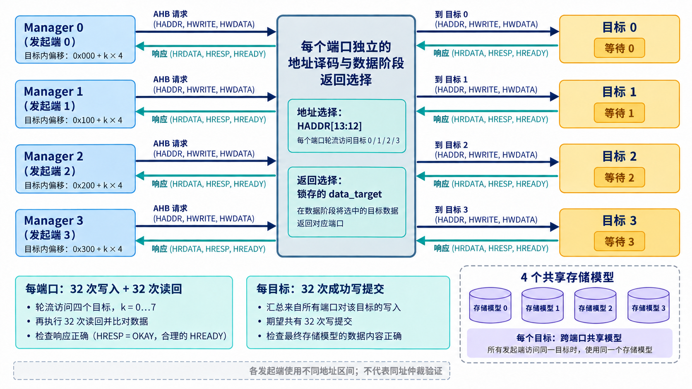

# AI 设计的 VIP 实战：四个发起端怎样访问四个 AHB 目标？

简体中文｜英文版待补

[系列入口](../README.md) · [上一章](chapter-05.md) · [下一章](chapter-07.md)

单接口读写成功之后，下一个问题是连接：地址已经切到目标 1，目标 0 还在等待，返回信号应该听谁的？一套 VIP 如果只在自身最简单的直连环境里运行，很难暴露这种装配问题。

现有自验证环境给出了更有解释力的例子：四个 Manager 端口，每个端口都可以访问四个目标。各目标使用不同等待长度，多个端口通过目标模型共享存储。这里的连接逻辑是测试夹具，不是已交付的产品互连 IP；它用来检查组件组合和阶段关系。

## 先看地址怎样分配

目标由 HADDR[13:12] 选择。每个发起端执行 32 次写入，轮流访问目标 0、1、2、3；之后按原顺序读回。第 i 次写入的地址由三部分组成：

```text
目标基址 = (i % 4) × 0x1000
端口偏移 = manager_id × 0x100
目标内位置 = floor(i / 4) × 4
地址 = 目标基址 + 端口偏移 + 目标内位置
```

例如端口 1 的前四笔分别访问 0x0100、0x1100、0x2100、0x3100；第五笔回到目标 0，地址为 0x0104。不同发起端使用不同的目标内区域，避免在这个用例里引入同址写冲突。



*原理示意：每个端口都访问全部四个目标。图中目标按逻辑目标聚合；实际有 4×4 个目标 agent，共享 4 个存储模型，不能把图读成一对一连线或共享仲裁器。*

目标 0、1、2、3 分别插入 0、1、2、3 个等待周期。不同等待长度让返回选择接受更有区分度的检查：如果只用四个永远立即响应的目标，某些选错就绪来源的问题更难显现。

## 返回选择为什么要保存一份状态

每个端口维护 data_target，记录当前数据阶段属于哪个目标。只有 HREADY 为高时，才根据当前有效地址更新它；没有有效传输时记录空闲。返回的 HRDATA、HRESP 和 HREADY 都由这份状态选择。

这意味着普通等待期间，即使下一笔地址已经指向另一个目标，返回选择也不会提前跳过去。目标端 HSEL 描述的是地址阶段选择，不能替代数据阶段归属。把“译码地址”与“选择响应”拆开，是整个夹具最值得复用的机制。

空闲时 data_target 没有目标，夹具提供就绪的默认返回，使第一笔有效请求能够开始。复位则清除这份阶段状态，避免复位后的第一笔数据被错误归到旧目标。

## 数据和次数怎样共同检查

写数据编码了发起端编号和访问序号，因此读回可以按请求逐笔比较。每个发起端写 32 次并读 32 次；四个端口总计 128 次写和 128 次读。每个目标分得每端口的 8 次写，所以共享存储模型应记录 32 次成功写提交。

这里的 128 和 32 来自用例循环与地址分配的推导，不是吞吐测量。测试对写响应、读响应与数据逐项检查，并在结束时检查各目标提交计数。源码中的 AHB_SYSTEM_PASS 是完成标记，判定仍需结合错误计数和执行退出状态，不能只搜索这一行文字。

提交次数尤其有价值：重复写相同数据可能不改变最终读值，却会增加提交计数。对 FIFO、计数寄存器或写触发命令而言，这类重复副作用会直接改变功能。

## 怎样迁移到新的 IP 环境

若 DUT 是 AHB 目标，主动 Manager VIP 产生输入，项目模型给出寄存器或存储预期；若 DUT 是 AHB 发起端，Subordinate VIP 模拟外部设备并施加等待和错误。若 DUT 是桥或互连，可以在两侧分别观察，再根据地址与数据变换建立项目 Scoreboard。

AI 可以辅助生成参数一致的实例、配置与连接，但项目仍要明确自己的行为。例如越权请求应返回什么、未命中地址怎样响应、复位是否保留寄存器，以及桥接后哪些字节应出现。这些预期不能由通用总线 VIP 自动猜出。

本例使用不同地址区间，没有验证多个端口对同一地址竞争时的仲裁和全局次序。接入真正的多发起端互连时，需要增加该设计的仲裁模型与竞争场景。保留这个边界，才能既利用已有装配证据，又准确知道新项目还需要验证什么。
