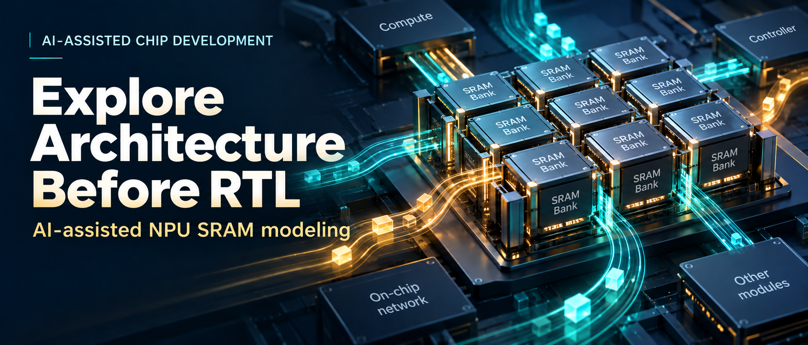
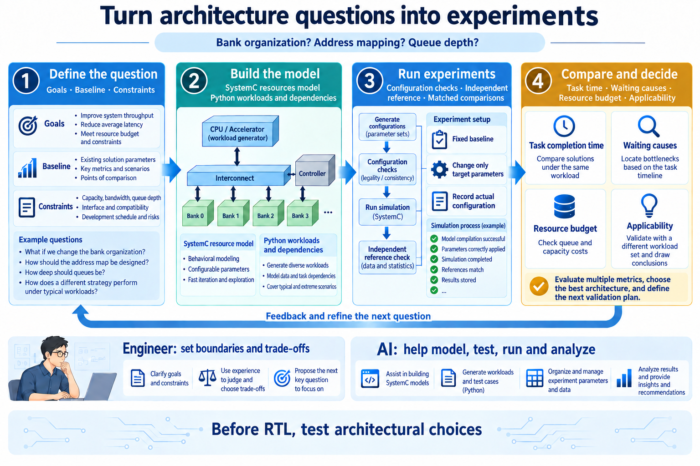
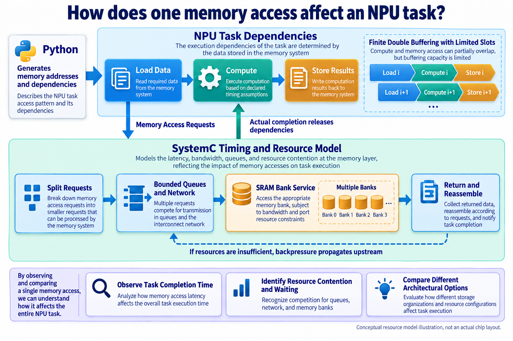
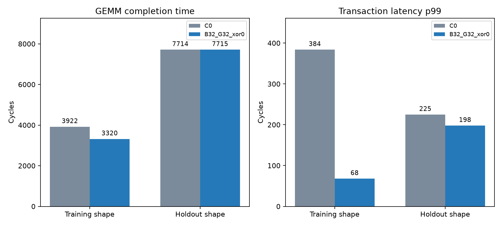
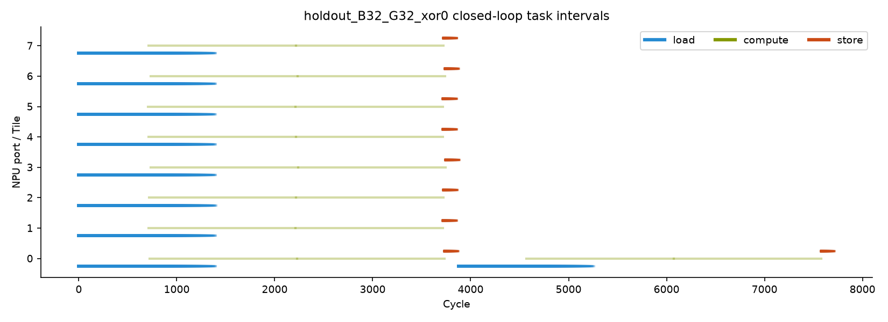
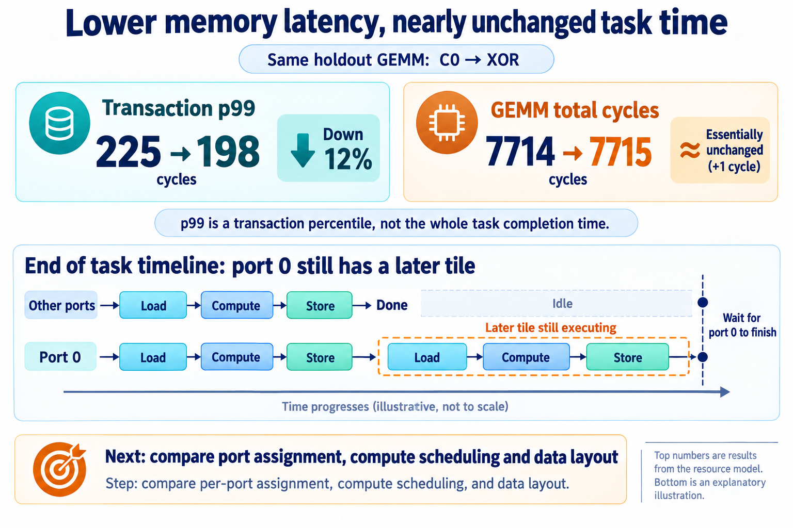

# Explore Architecture Before RTL: AI-Assisted ESL Modeling of NPU SRAM

[简体中文](README.md) | English



Designing shared SRAM for an NPU quickly raises specific questions. How many banks? How should addresses be interleaved? How deep should request queues be? Is the read-return path wide enough?

Experience can suggest a starting point for each. Their combined effects are harder to predict. More banks may improve parallelism while adding queue and interconnect costs. A mapping that handles sequential traffic well may behave differently with matrix strides.

Before committing those choices to RTL, I wanted AI to help build an architecture experiment that could run, compare alternatives, and explain the results.

The target was an NPU shared-SRAM controller. A SystemC performance model supported **1,045 main-sweep runs and eight arbitration comparisons**. One XOR address mapping reduced the training GEMM completion time from 3,922 to 3,320 cycles, about **15.35%**. More interestingly, the model helped explain why it worked and what to examine when the workload changed.

This article follows AI's role in model development, verification, and architecture exploration, and how those activities informed engineering decisions.

## Turn an architecture question into an experiment

ESL means electronic system-level modeling. It can support functional verification, software development, and performance analysis. Here, we focus on request queues, resource contention, and task completion.

A simple latency model may answer how many cycles one SRAM access takes. A shared controller has multiple ports, banks, and interacting requests. Front-end queues, network transfers, bank service, and data returns can all affect the result.

We therefore first defined the question: within a resource budget, which bank organization and address mapping let NPU tasks finish sooner?

That question determines the necessary detail. Comparing interleaving requires correct request splitting and dispatch. Comparing queue structures requires finite capacities and backpressure. Evaluating NPU benefit requires tracking task completion, not just SRAM byte counts.

The `esl-development-suite` organizes this into four steps: define, build, run, and compare. Each iteration builds on existing work. Change parameters where possible; extend the model when a new capability is needed.



*Figure 1. AI-assisted architecture exploration. The engineer defines goals and tradeoffs; AI helps implement models, extend checks, and organize experiments. Results inform the next question. AI-generated explanatory diagram.*

This gives AI specific work: add configurations for a parameter change, add tests for a strategy, and produce comparable results. The engineer evaluates whether the experiment asks the right question and whether the evidence supports the next decision.

## How does a memory access affect the whole task?

The model has eight access ports, multiple SRAM banks, and request and return networks. Python generates addresses, task dependencies, and configurations. SystemC advances time and models resource contention.

A read arrives at the front end, is split according to the address mapping, enters bounded queues, and traverses the network to its bank. After service, data traverses the return path and is reassembled into a complete beat before delivery.

If any stage runs out of capacity, pressure must propagate upstream. When the receiver stops consuming data, the model cannot let banks emit unlimited results. Requests sharing a resource cannot be treated as independent fixed delays.

NPU tasks also advance according to actual memory completion. A task dependency graph describes load, compute, and store operations, including dependencies that constrain finite double buffering. A task waits until its input data returns; only then can dependent compute begin.



*Figure 2. Requests enter shared resources; actual completion releases task dependencies. Compute stages use declared timing assumptions. This AI-generated diagram describes traffic and resource relationships.*

Without this feedback, a slower memory configuration might leave a pre-scheduled request stream unchanged, hiding its effect on the task. Propagating waits through dependencies allows us to examine compute-transfer overlap and shifting bottlenecks.

AI's work therefore extends beyond one SystemC module. It connects workloads, model behavior, observations, and configurations so a design change can be compared end to end.

## Easier model changes require stronger checks

AI makes it easier to add implementations and try strategies. Tests must cover the resulting configurability; otherwise, more runs simply produce unreliable numbers faster.

The Skill requires three kinds of checks: legal configurations, correct results, and internally consistent performance. Several examples show why.

A maximum 128-byte AXI beat crossing 32-byte bank words must split into fragments. Interleave granularity and word size may differ, so dispatch cannot be reduced to shifting a few address bits. The model groups fragments by physical word. Verification enumerates forward and inverse mappings within a 32 KiB test address space and checks bytes against a reference indexed by logical address.

For backpressure, reducing reassembly and completion capacity to one and stopping read-data consumption tests whether the system actually stalls and then drains correctly when consumption resumes. This exposes bounded-resource interactions more effectively than an uncongested transfer.

Service latency and initiation interval also differ. Eight cycles per bank operation do not necessarily mean a new operation can start only every eight cycles. Exact completion-boundary tests check pipelining behavior.

The report records 14 SystemC cases, 47 Python regressions, and independent consumer checks using source, installed, and relocated deployments. Each performance run also checks transaction and fragment conservation, queue capacities, and service bounds.

AI can implement references, extend boundary cases, locate mismatches, and revise code from tool feedback. Engineering judgment still determines whether the reference is independent and the tests cover the assumptions. A model and test that share the same bug can agree without being correct.

These checks become reusable infrastructure. After changing a mapping or queue policy, we can focus on the change rather than reassess the model from scratch.

## Why did XOR mapping speed up GEMM?

Baseline C0 uses 32 banks, 32-byte words, and 32-byte interleaving. Each 32-byte address increment selects the next bank; bank selection repeats after 32 × 32 = 1,024 bytes.

If adjacent matrix rows are also 1,024 bytes apart, corresponding positions tend to repeat the same bank selection pattern. XOR mapping mixes higher address bits into bank selection to distribute rows differently.

Candidate `B32_G32_xor0` uses the following mapping, with byte addresses. `xor0` means an XOR shift of zero, not disabled XOR.

```text
Baseline: bank = floor(address / 32) % 32
Candidate: bank = (floor(address / 32) % 32)
                  XOR (floor(address / 1024) % 32)
```

The training GEMM has 1,024-byte A/B row strides. With the same queue and link budgets, XOR reduces completion time from 3,922 to 3,320 cycles, about 15.35%.

The bank-conflict counter alone suggests the opposite: zero for C0 and 3,049 for XOR.

The report explains that baseline requests were already restricted before reaching the banks. Relieving front-end pressure lets more requests arrive at the banks, exposing more contention there. Failed front-end admission or expansion attempts fall from 972,431 to 4,432. These are attempt counts, not waiting cycles.

A smaller counter does not necessarily identify a better design. Looking at the front end, banks, and task completion together explains where behavior changes.

## Test the conclusion on another workload

Architecture exploration can stop too early at an attractive result. This experiment selected candidates on a training set, froze them, and then checked a holdout set with changed shapes, layouts, or random seeds.

“Training set” here means experiments used for architecture selection, not neural-network training. The 1,045 main runs comprise 420 microbenchmarks, 576 training instances, 48 holdout instances for frozen candidates, and one long-traffic check. This is a staged, constrained search, not the full Cartesian product of all parameters.

The holdout GEMM changes to 192×192×128, with 1,040-byte A/B row strides and a different task assignment. XOR still improves transaction-latency p99, but total task time barely changes.



*Figure 3. Original simulation output. Training completion is 3,922/3,320 cycles. Holdout p99 is 225/198 cycles and total time is 7,714/7,715 cycles. Compare C0 and XOR within each group; absolute times across the two different inputs are not directly comparable.*

The original task timeline offers a clue. After most ports finish, port 0 still has later tiles to load, compute, and store. Overall completion must wait for it.



*Figure 4. Original simulation output. Lines show task start-to-end intervals, not transfers in every cycle. The tail suggests examining port assignment and compute scheduling.*

Transaction p99 falls by 12%, while total time differs by just one cycle. The next diagram highlights port 0's later work to explain why analysis must follow the task tail.



*Figure 5. The upper panels reproduce metrics from the same holdout GEMM. The lower panel summarizes later tiles on port 0 in the recommended configuration; it is not to scale and does not claim a specific task became shorter because p99 improved. AI-assisted explanatory diagram; original evidence is in Figures 3 and 4.*

The recommendation is to retain XOR as a configurable option and select it against actual workloads. Across eight holdout workload classes, the equal-weight geometric mean duration decreases by 0.318%. The 15.35% training-GEMM gain has specific workload conditions.

The timeline also identifies the next experiments: hold other conditions fixed while comparing port assignment, compute scheduling, and data layout. This round changed shape and layout together, so it cannot attribute the changed benefit to either factor alone. It does narrow the question.

## Give the next RTL investment a stronger basis

AI assisted model implementation, workload construction, verification, and analysis. The Skill connected these activities into a repeatable method; the model and tests remain useful for subsequent work.

New questions now have an executable starting point. A different mapping, return bandwidth, or task assignment can be compared under common assumptions. Engineers can discuss running results rather than rely only on static block diagrams.

That is the role I want AI to play in chip development: make more design ideas executable, keep verification and comparisons aligned with changes, and bring implementation-sensitive questions into the discussion earlier.

The next design round starts with an extensible NPU SRAM model and clearer architecture questions. Knowing what to verify, and why it matters, is useful preparation before writing RTL.

---

**Data and images:** Experiment records are current through 2026-09-18. Numbers are resource-model results for the stated workloads and assumptions, not chip performance calibrated against RTL or SRAM macros. Figures 3 and 4 retain the original English-language simulation plots. Other figures are AI-assisted explainers; Figure 5 repeats measured model metrics above a conceptual task-tail diagram.
