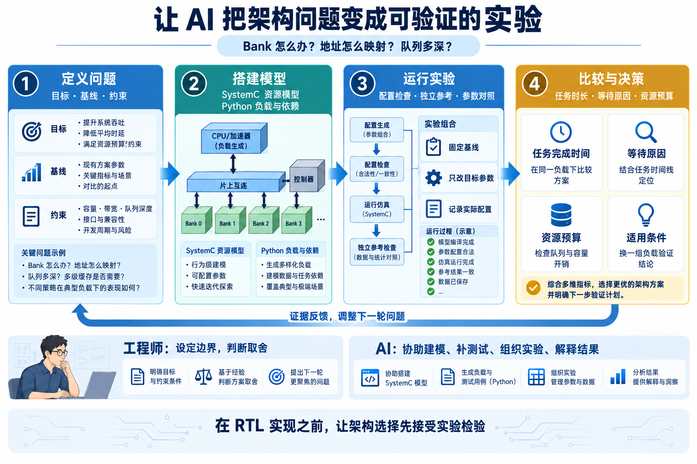
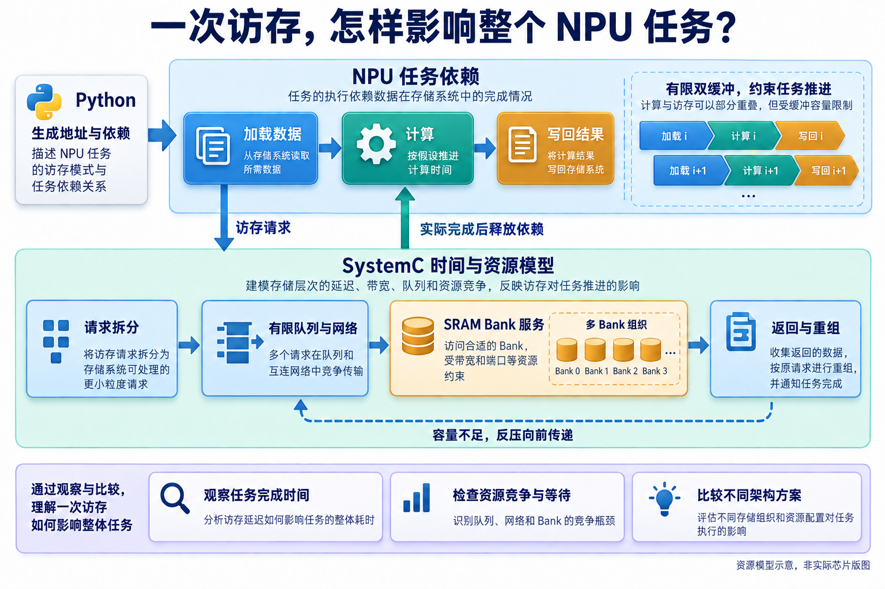

# 让 AI 先跑一轮架构实验：NPU SRAM 的 ESL 建模实践

简体中文 | [English](README.en.md)


给 NPU 配一片共享 SRAM，设计很快就会碰到一串具体问题：分成多少个 Bank？地址怎样交织？请求队列开多深？读数据的返回通路够不够宽？

每个问题都能凭经验给出一个起点。但把它们放在一起，答案就未必直观了。增加 Bank 可能提高并行度，也会增加队列和互连开销；一种映射在连续访问中表现很好，换成矩阵运算的步长，结果又可能不同。

我想做的是，在这些选择落到 RTL 之前，先让 AI 帮忙搭起一套能运行、能比较、能解释结果的架构实验环境。

这次选择的对象是 NPU 共享 SRAM 控制器。项目用 SystemC 建立性能模型，组织了 **1045 次主扫描和 8 次仲裁对照**。其中，一个 XOR 地址映射方案让训练集 GEMM 的完成时间从 3922 降到 3320 个周期，缩短约 **15.35%**。更有意思的是，模型还能继续解释：为什么这次优化有效，换一个负载后又该看什么。

这篇文章就沿着这次实践，讲讲 AI 怎样参与模型开发、验证和架构探索，以及这些工作怎样帮助工程师做设计决定。

## 先把架构问题变成一场实验

ESL 是 Electronic System Level，即电子系统级建模。它可以服务于功能验证、软件开发和性能分析；在这次项目里，我们主要关心请求如何排队、资源如何争用，以及任务什么时候完成。

如果问题只是“一次 SRAM 访问需要几拍”，一个简单延迟模型可能就够了。但共享 SRAM 控制器面对的是多个端口、多个 Bank，以及相互影响的请求。前端排队、网络传输、Bank 服务、数据返回，都可能改变最终结果。

因此，开始建模之前，得先确定要比较什么。这个项目的一个主要问题是：在资源预算约束下，怎样选择 Bank 组织和地址映射，让 NPU 任务更早完成？

有了这个问题，模型该保留哪些细节就容易判断了。要比较交织方式，就需要正确拆分与分派访问；要比较队列结构，就必须有有限容量和反压；要判断 NPU 是否受益，就不能只统计 SRAM 出了多少字节，还要跟踪上层任务的完成时间。

`esl-development-suite` 把这类工作组织成四步：定义问题、搭建、运行、比较。每次从已有成果继续推进，能改参数就先改参数，需要新能力时再补模型。



*图 1｜AI 辅助架构探索的工作方式。工程师确定目标与取舍，AI 协助实现模型、补充检查和组织实验，工具结果再反馈到下一轮问题。AI 生成的流程讲解图。*

这种安排使 AI 有了具体的工作对象。它可以围绕一次参数变化补配置，围绕一个新策略补测试，再把运行结果整理成同口径的比较。工程师则把注意力放在实验是否问对了问题，以及结果是否足以支持下一步选择。

## 一次访存，怎样传导到整个任务？

这份模型包含八个访问端口、多个 SRAM Bank，以及中间的请求与返回网络。Python 负责生成地址、任务依赖和实验配置，SystemC 负责推进时间并处理资源竞争。

可以跟着一笔读请求看一遍。请求到达前端后，先按地址映射拆成片段，进入有限队列，经过网络抵达目标 Bank。Bank 完成服务后，数据还要经过返回通路，凑齐一个完整 beat，再交还给请求方。

任何一步没有空位，后面的压力都应当向前传递。返回端不再消费数据，模型就不能假装 Bank 还能无限向外送结果；多个请求争用同一个资源，也不能把它们当作互不影响的独立延迟。

上层 NPU 任务同样要跟着存储完成情况推进。项目用任务依赖图描述 load、compute、store，并通过依赖约束有限双缓冲的使用。数据尚未返回，依赖它的任务就继续等待；数据返回后，后续计算才有机会启动。



*图 2｜模型把任务与存储连接起来：请求向下进入共享资源，实际完成情况向上释放依赖。计算阶段使用声明的时间假设，图中描述的是流量与资源关系。AI 生成的模型结构讲解图。*

这个反馈关系很关键。如果预先把所有请求时间都排好，换一个慢一些的存储结构，上层仍按原计划发请求，就难以看清访存变化对任务的影响。现在，等待会沿依赖关系传下去，模型才能讨论计算和搬运是否重叠、瓶颈是否转移。

这也让 AI 的工作超出了编写一个 SystemC 模块：它需要把负载、模型、观测指标和实验配置连接起来，使一次设计变化能够被完整地比较。

## 模型越容易改，检查越要跟得上

AI 让补充实现和尝试新策略变得更方便，但参数可调之后，测试也必须覆盖这些变化。否则，多跑一些配置，只会更快地得到一组不可靠的数字。

这套 Skill 要求保留三类检查：配置是否合法、结果是否正确、性能是否自洽。项目中有几个例子，很能说明这些检查为什么值得做。

先看地址拆分。最大 128 字节的 AXI beat 遇到 32 字节的 Bank word，一笔传输就需要拆成多个片段。交织粒度和 word 大小还可以不同，因此不能只右移几个地址位，就认为分派结束了。模型按物理 word 聚合片段；验证在 32 KiB 测试地址空间内枚举正逆映射，并用按逻辑地址组织的逐字节参考检查数据。

再看反压。把重组槽和完成槽容量压到 1，然后停止消费读数据，就能检验系统是否真的停下来，以及恢复消费后能否有序排空。这比观察一条畅通无阻的读写路径，更容易暴露有限资源之间的关系。

还有服务延迟与启动间隔。一次 Bank 服务需要八拍，不意味着每八拍才能开始下一次服务。项目用精确完成边界检查流水行为，避免把资源的并行能力算错。

项目报告记录了 14 个 SystemC 用例、47 项 Python 回归，以及源码、安装、搬迁三种方式的独立消费者检查。每次性能运行还核对事务与片段守恒、队列容量和服务上界。

这些工作里，AI 可以帮助实现参考、扩展边界用例、定位失配，再根据工具反馈修改。但参考逻辑是否独立、测试是否覆盖了设计假设，仍需要工程判断。模型和测试共享同一个错误，即使结果一致，也不足以证明正确。

对后续探索而言，这些检查有一个直接价值：改动映射或队列策略后，可以沿用已有的验证基础，把精力集中在变化本身，而不必从头判断整个模型还能不能用。

## 一个 XOR 映射，为什么能让 GEMM 更快？

有了模型和检查，接下来就可以围绕架构假设做实验。

基线 C0 使用 32 个 Bank、32 字节 word 和 32 字节交织。简化来看，地址每前进 32 字节，就换到下一个 Bank；走过 32 × 32 = 1024 字节后，Bank 选择重复一次。

如果矩阵相邻两行的步长也恰好是 1024 字节，对应位置的访问就容易落入相同的 Bank 选择规律。XOR 映射的思路，是把更高地址位混进 Bank 选择，让不同行的访问分布发生变化。

这次候选 `B32_G32_xor0` 的计算方式如下，address 的单位为字节。其中 `xor0` 表示 XOR shift 为 0，并不是关闭 XOR。

```text
基线：bank = floor(address / 32) % 32
候选：bank = (floor(address / 32) % 32)
             XOR (floor(address / 1024) % 32)
```

训练 GEMM 的 A/B 行步长正是 1024 字节。在保留相同队列和链路预算的情况下，XOR 方案把任务时长从 3922 降到 3320 个周期，约缩短 15.35%。

但只看 Bank 冲突计数，反而会得到相反印象：基线是 0，XOR 方案是 3049。

报告给出的解释是，基线请求已经在 Bank 之前受限；XOR 缓解前端压力后，更多请求能抵达 Bank，于是出现了更多可见竞争。与之对应，前端接纳或展开失败尝试数从 972431 降到了 4432。这里记录的是尝试次数，不能直接换算为等待周期。

这就是把多个层次连起来观察的好处。一个更小的计数器，未必意味着更好的设计；把前端、Bank 和任务时间放在一起，才能解释变化发生在哪里。

## AI 帮忙多走一步：让结论经得起换负载

架构探索很容易停在一组漂亮的结果上。这次实验多安排了一步：先用训练集选择方案，冻结候选，再用改变了形状、布局或随机种子的保留集检查。

这里的“训练集”是架构选型用的实验集，不是在训练神经网络。1045 次主扫描分为 420 次微基准、576 次训练实例、48 次冻结候选的保留实例，以及一次长流量检查。它是有阶段和约束的搜索，不是所有参数的完整笛卡尔积。

把实验分开之后，就能看清收益的适用范围。保留集 GEMM 改为 192×192×128，A/B 行步长变成 1040 字节，任务分配也随之改变。XOR 仍然改善了事务延迟的 p99，但整个任务的完成时间基本不变。


*图 3｜项目原始仿真输出。训练组时长为 3922/3320 周期；保留组 p99 为 225/198 周期，总时长为 7714/7715 周期。每组内部比较 C0 与 XOR，两组不同输入的绝对时长不能直接比较。*

再看原始任务时间线，原因就有了线索：大部分端口完成后，port 0 还在处理后续 tile 的 load、compute、store，整体任务要继续等它。


*图 4｜项目原始仿真输出。横线表示任务起止跨度，并非每一拍都在传输。任务尾部提示我们继续检查端口分配与计算调度。*

把两组指标并排看，差别就清楚了：事务 p99 降低了 12%，任务总时长却只差 1 个周期。下图再把 port 0 的后续任务单独标出来，说明为什么分析还需要继续追到任务尾部。


*图 5｜上半部呈现同一保留集 GEMM 的仿真指标；下半部概括推荐方案中 port 0 仍有后续 tile 的现象，不按比例，也不代表某个具体任务因 p99 下降而缩短。AI 辅助制作的讲解图，原始结果见图 3、图 4。*

因此，这轮探索给出的建议是保留 XOR 作为可配置能力，再围绕实际负载继续选择。候选在保留集八类负载上的等权几何平均时长降低了 0.318%，说明训练 GEMM 的 15.35% 收益有明确的场景条件。

同时，时间线把下一轮值得做的实验指出来了：保持其他条件不变，对照端口任务分配、计算调度和数据布局。这一轮同时改变了 shape 和 layout，还不能把收益变化单独归因于某一个因素，但已经把问题收窄到了更具体的位置。

## 把下一轮 RTL 投入放在更有依据的地方

这次实践中，AI 辅助工作覆盖了模型实现、负载组织、验证和结果分析。Skill 把这些工作串成可重复的方法，模型与测试则沉淀为后续可以继续使用的工程资产。

一套模型建立之后，新问题就有了落脚点：换一种映射，可以对照；调整返回带宽，可以对照；怀疑任务尾部拖慢整体，也可以沿着依赖和时间线继续设计实验。工程师不必只在几张静态框图之间讨论，而是能够带着同一组假设看运行结果。

这正是我希望 AI 在芯片研发中发挥的作用。让更多设计想法拥有可执行的版本，让验证和比较跟上变化，也让那些原本要到实现后才会显现的问题，有机会更早进入讨论。

对于下一轮设计，我会带走两样东西：一套可以继续扩展的 NPU SRAM 模型，以及一组更清楚的架构问题。进入 RTL 之前，先知道该验证什么、为什么值得做，这份准备本身就有价值。

---

**数据与配图说明**：文中实验记录截至 2026-09-18。数字为所述负载与假设下的资源模型结果，用于架构比较，尚非经过 RTL／SRAM Macro 校准的芯片性能。图 3、图 4 保留原始仿真输出；其余为 AI 辅助制作的讲解图，图 5 上半部复述已给出的指标，下半部是任务尾部示意。
