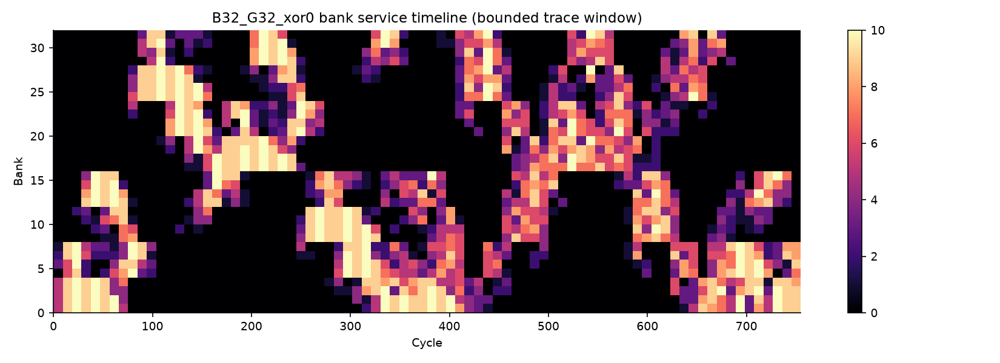
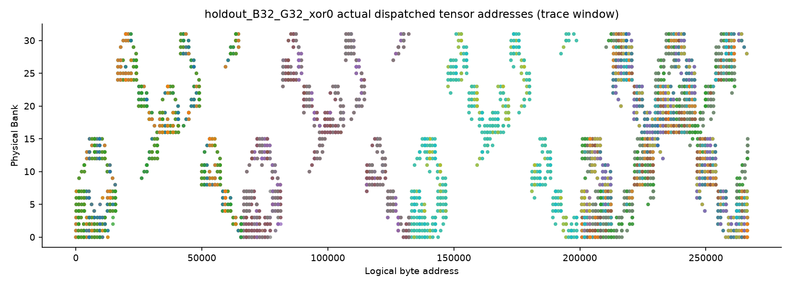

# ESL 博客编辑证据与补充资料

核对日期：2026-09-26。本文编辑读取本地项目快照及 Skill，不修改参考仓库，不重跑仿真。下列运行结果来自既有报告，不表示本次重新验证了模型。

## 核对材料

项目快照根路径（相对博客仓库）：

`reference/aixsilicon_esl_repo-main/aixsilicon_esl_repo-main/models/npu_sram_controller/`

| 文件 | 用途 |
| --- | --- |
| `README.md` | SystemC/Python 分工、端口、接入方式、交付范围 |
| `reports/20260918/report.md` | 扫描计数、选型结果、训练与保留集、指标解释 |
| `docs/design.md` | beat 拆分、有限资源、反压、DAG 与计算时间假设 |
| `docs/verification.md` | 正逆映射测试空间、独立参考、精确时序、反压与接入检查 |

Skill 快照根路径：

`reference/aixsilicon_skill_repo-main/aixsilicon_skill_repo-main/skills/esl-development-suite/`

| 文件 | 用途 |
| --- | --- |
| `SKILL.md` | 定义问题→搭建→运行→比较；先复用再扩展；三类检查 |
| `skills/esl-performance-analysis/SKILL.md` | 基线、观测、候选比较与有针对性的对照实验 |
| `skills/esl-performance-analysis/references/reporting.md` | 瓶颈解释纪律、统计窗口、因果与条件 |
| `skills/esl-verification/SKILL.md` | 配置、正确性、性能自洽及状态分层 |

以上 Skill 作为文章的方法论资料读取，没有执行其模型开发、环境安装或仿真流程。

## 主要事实核对

| 正文事实 | 依据及口径 |
| --- | --- |
| 1045 次主扫描 + 8 次仲裁对照 | 报告首段及 Benchmark：420 + 576 + 48 + 1 = 1045；不是 1045 个独立架构，也不是完整笛卡尔积 |
| 训练/保留集 | 先冻结 4 个候选，再跑 12 个保留实例；八类负载，embedding 的五 seed 先类内聚合，再按类等权 |
| 训练 GEMM 3922→3320 周期 | 报告逐类表现；时长降低 (3922−3320)/3922 ≈15.35%，不是吞吐提升百分比 |
| 基线与推荐映射 | C0 为 B32、32 B word、32 B modulo 交织；候选混入 floor(address/1024)%32，xor_shift=0 仍启用 XOR |
| 训练与保留 GEMM 差异 | 256×128×128→192×192×128；行步长 1024→1040 B；shape 与 layout 同时变更，不能单归因于 padding |
| 保留 GEMM p99 与总时长 | p99 225→198；任务 7714→7715；p99 不是任务时长，局部改善不保证端到端收益 |
| Bank 冲突与前端压力 | 冲突 0→3049；前端失败尝试 972431→4432；失败尝试不是周期，不以冲突计数单独判优劣 |
| 14 / 47 / 三种消费者 | 报告与 verification：14 个 SystemC 用例、47 项 Python 回归，source/install/relocated 消费者 |
| 映射穷举范围 | verification 明确为 32 KiB 测试空间，不声称枚举默认 8 MiB 的全部映射组合 |
| 八类保留集综合变化 | 时长比 0.996820，即降低 0.318%；不能把单个训练 GEMM 的 15.35% 描述为普遍 NPU 收益 |
| 端口任务尾部 | 原始时间线及报告指向 port 0 后续 tile；作为后续调度与布局实验依据，未声称已单变量证明全部瓶颈归因 |

## 保留在编辑资料中的范围说明

- 原目标为综合时长降低 10%；训练比 0.968282，保留比 0.996820，目标未达成。正文采用具体结果与可配置选型结论，不写“全部性能目标达成”。
- 模型尚无 RTL/实测校准，buffer/switch 为资源代理，不能代替准确 PPA。
- NPU 部分是带任务依赖的 traffic model，不执行数学 GEMM/Attention 数值计算；不能声称已验证完整 NPU 数值正确性。
- direct channel API 不是 pin-level AXI VIP；本地 PE 端口争用、多时钟等不在本轮范围，正文不将其列成已具备能力。
- AI 辅助开发没有人工工时对照，不量化“开发提效倍数”，不虚构 Agent 对话、调试亲历或执行日志。
- 生成图是方法与模型关系示意，不是从代码自动提取的完整微架构，数据图保持原始输出。

## 原始 Bank 图

此图仅显示有上限 trace 的观察窗口，不能据此宣布全程没有热点或竞争。

用于观察实际派发中的映射分布，不替代完整指标或映射双射测试。原始四张图均保留，只有这两张从正文移到补充资料。

## 本次编辑取舍

以 AI 辅助架构实验的工程价值为主线；保留正面结果的具体条件，将内部待办与非主线成熟度细节放在此处。删去 ESL“第一次”变得现实、人工建模三成/验证七成、AI 能扫遍全空间等无证据断言。正文通过自然段与具体工程例子展开，降低口号、排比及重复总结的密度。
