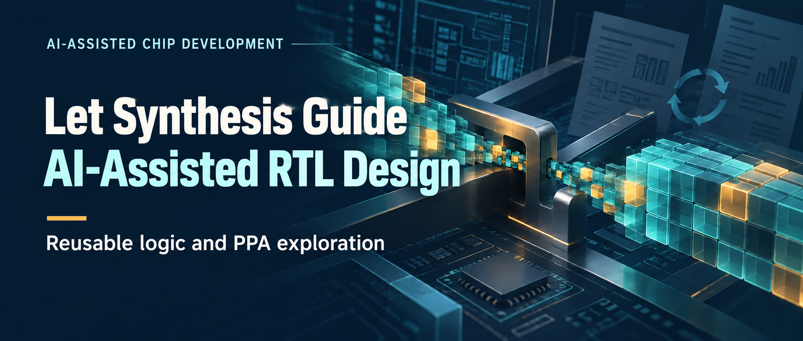
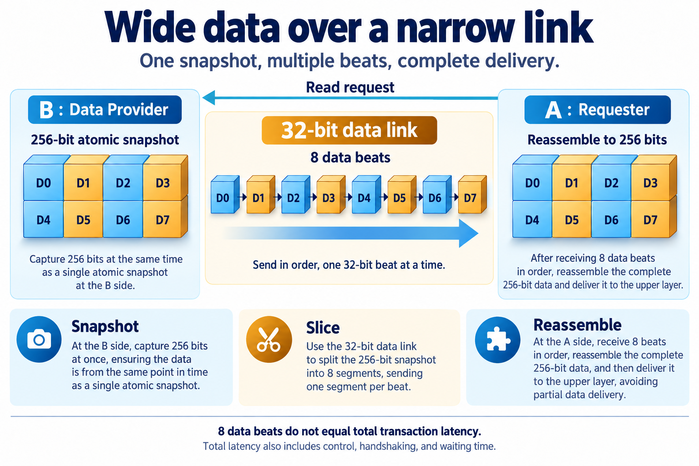
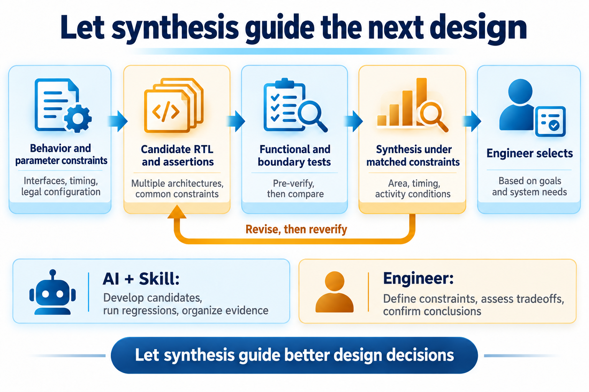
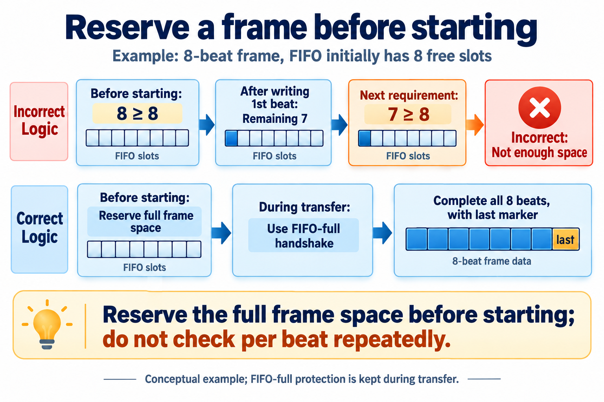
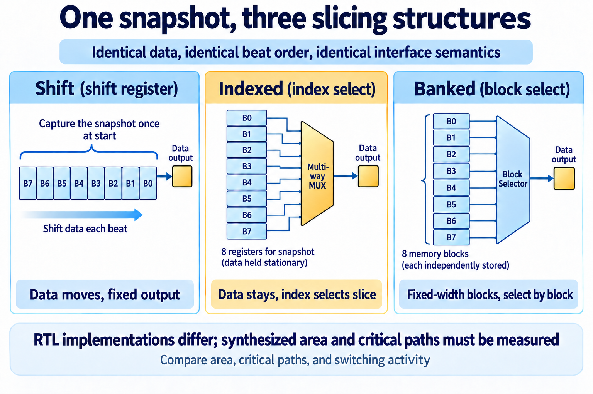

# Let Synthesis Guide AI-Assisted RTL Design: A CBB and PPA Exploration

[简体中文](README.md) | English

Two modules on a chip need to exchange data. If they are far apart and the data is wide, connecting them directly requires many signal wires. But if the receiver reads only occasionally and can wait for the result, a narrower link can carry the data in several pieces.

It is a small requirement with several design choices: how to split the data, how much buffering to provide, and how to coordinate endpoints that run at different rates. Several implementations may deliver the correct result, yet differ in area, achievable speed, and power. We need to build and verify them, then examine the tool reports.

I used this module to explore AI-assisted chip development. AI helped clarify requirements, develop candidate implementations, organize verification, and compare circuit costs through synthesis. The engineer defined the application constraints, reviewed the results, and chose what to explore next.

Some structural differences produced less area variation than expected. Changing a buffer parameter had a much larger effect. Following those results shows how AI can contribute to concrete engineering work—and how tool feedback can change a design decision.

## A small block with real design tradeoffs

A CBB is a parameterized, reusable common building block: a FIFO, arbiter, or width converter, for example. It may be small but used by several IP blocks—reusable chip functions. Parameterization lets one design support different widths or buffer depths without rewriting the circuit for every configuration.

These circuits are usually described in RTL, or register-transfer level: where data is stored, how it moves each clock cycle, and what logic processes it. Synthesis maps that description to gates, registers, and other library cells, producing area and timing reports.

Changing the width, clock relationship, or buffering also changes the implementation constraints. Reusing the code is only the beginning of design reuse.

Our block, `parallel_data_fetch`, lets endpoint A occasionally read a wide value from endpoint B without requiring a single-cycle response.

B captures an atomic snapshot, splits it into beats, and sends them over a narrow link. A reassembles the beats and delivers the result only when the complete frame has arrived. Even if B's original data changes during transmission, the read still represents one snapshot.

“Atomic” means capturing the whole value at once, rather than mixing its first half from one moment with its second half from another. Each piece sent over the link is a *beat*. All beats in a snapshot form a *frame*. The complete request-to-result operation is a *transaction*. These distinctions explain why eight data beats do not imply an eight-cycle read.

*Figure 1. Architecture concept. A 256-bit value needs eight beats on a 32-bit link. Total transaction latency also includes the request, data preparation, and waiting.*

This design exchanges transfer time for a narrower datapath. Routing benefits require physical implementation analysis; this experiment first compares logic synthesis results.

Data and link widths determine the frame length. Synchronous or asynchronous operation determines how clock crossings are handled. Pipeline depth affects register cost. Asynchronous FIFO depth determines how much return data can be buffered. Three slicing structures provide alternative microarchitectures.

A FIFO is a first-in, first-out queue. A depth of eight means it can hold eight beats. Here, asynchronous operation means the clocks at A and B have no fixed phase relationship. An asynchronous FIFO transfers data between their clock domains and adds storage and control circuitry, with an associated area cost.

The engineer sets the exploration boundaries. The link width must divide the data width. This design permits only one outstanding transaction. The asynchronous return FIFO must have a power-of-two depth large enough to hold an entire frame.

These constraints drive RTL, verification, and synthesis scans. Their meanings must remain consistent across all three.

## AI starts with a checkable design contract

A Skill is a set of engineering instructions for AI: what inputs to use, which tools to invoke, what to produce, and how to check the results. The Skill used here connects behavior and legal parameters to architecture candidates, RTL and assertions, functional and configuration-boundary tests, and synthesis under common constraints.

Assertions are automatic checks in the verification environment—for example, data must remain stable while a transfer is stalled. Regression testing reruns a set of tests after a change to detect effects on existing behavior. Both provide specific feedback for AI's iterations.

During design, AI must establish when the snapshot is captured, how failed transactions end, and which parameters may be combined. Verification checks those decisions. Synthesis compares candidates that have passed functional checks and feeds results back into structure selection.

The engineer still decides what the application needs, which costs are acceptable, and whether the reports support the conclusion. AI can develop candidates, organize regressions, and summarize evidence so those decisions are easier to make.

*Figure 2. Method overview. Structural changes require re-verification; synthesis results inform the next design iteration.*

## A parameter boundary exposes a missed bug

This verification round included 21 positive compilation checks, 15 illegal-parameter checks, 12 synchronous functional cases, and eight asynchronous dual-clock regressions. A further 215 configuration combinations were generated. The first round executed 13 representative points covering extremes, non-default values, and high-risk interactions. The 215 figure counts generated combinations, not completed passing runs.

The configuration space is the set of parameter combinations a design supports. Checking width and FIFO depth separately is insufficient: particular combinations may fail. Representative points target these boundaries and interactions.

One such check found a useful bug: **a whole-frame reservation condition had been reused as the condition for sending every beat.**

Suppose a frame has eight beats and the FIFO initially has exactly eight free slots. Checking for at least eight slots before starting is correct.

After the first beat is written, seven slots remain if the receiver has not consumed anything. If the next beat still requires eight free slots, the sender blocks itself. A frame that initially fit can no longer finish normally. In the actual boundary regression, this interrupted transmission, lost the final-beat marker, and caused a protocol error.

*Figure 3. Conceptual example. Whole-frame reservation controls admission. During transmission, FIFO-full protection still governs acceptance. `last` marks the final beat.*

The fix separates the two conditions: check whole-frame capacity before starting; once sending, retain FIFO-full protection without repeatedly requiring a whole frame of free space. Boundary configurations with four beats and depth four, and 512 beats and depth 512, then passed regression.

This also shows how a Skill can make AI's verification work more specific. “Test more parameters” is vague. “Test a FIFO whose depth exactly equals the frame length” directly exercises resource-reservation semantics. The parameter constraints already contain useful test ideas.

## Why did three RTL structures synthesize so similarly?

After functional verification comes implementation cost. PPA stands for power, performance, and area. These often compete: adding registers may enable a higher clock frequency while increasing area and power. This round began with area and timing reports.

The shift implementation moves the wide register each beat and reads a fixed position. The indexed implementation keeps the snapshot stationary and selects a slice using the beat counter. The banked implementation organizes the snapshot into fixed-width blocks and selects a block.

*Figure 4. Microarchitecture concepts. All three preserve the same external behavior; synthesis measures their hardware costs.*

The RTL looks quite different, but the 256/32 baseline—256-bit data over a 32-bit link—produced similar results:

| Slicing implementation | Synthesized cell area (µm²) | Timing slack (ns) |
| --- | ---: | ---: |
| Shift | 3187.7 | 0.03 |
| Indexed | 3187.5 | 0.04 |
| Banked | 3204.9 | 0.00 |

Cell area is the sum of mapped library-cell areas, not the final chip footprint. Timing slack is the required arrival time minus the actual arrival time. Positive slack means margin remains; negative slack means the path is late. The reported 0.00 ns met this run's constraint but was close to the boundary.

These results use the same synthesis conditions: GF 28nm LP HVT library, TT corner, 1.0 V, 25°C, Synopsys DC V-2023.12-SP3, a 2.5 ns target period, 0.5 ns input and output delays, and 0.01 pF output load. HVT denotes high-threshold-voltage cells; TT denotes typical process conditions. Holding the library and constraints constant makes the structure comparison meaningful.

The RTL and reports help explain the similarity.

All three implementations retain a snapshot at B. They also share a reassembly register and a result register at A. Much of the module's storage cost therefore remains unchanged, diluting the effect of local selection logic.

Also, declared RTL registers do not directly count final hardware. An early version unconditionally declared and wrote a snapshot register that some implementations never read. Synthesis had already removed that dead logic. Later, `generate` branches gave each implementation its own storage, making the structure easier to inspect. That cleanup cannot be credited with removing another full register bank from the synthesized circuit.

In a corrected 4096/16 rerun, the three areas were 47052.0, 47207.4, and 47141.2 µm², with the same sequential-cell count. The structures differ, but their RTL appearance alone does not tell us how much.

For this requirement, the useful result is a common comparison of candidates that satisfy the same contract. We can select based on measured costs without assuming one coding style is inherently superior.

## Put optimization effort where the cost is

The same experiment compared link pipelining and asynchronous FIFO depth. These changed module cost more directly than the slicing style.

Pipelining inserts registers to split a long propagation path into stages, each of which may fit within one clock period. It adds registers and latency. The critical path is the path with the least timing slack. If that path lies inside an endpoint, adding stages only to the link may not improve overall timing.

For the synchronous 256/32 banked implementation, adding eight pipeline stages increased area from 3204.9 to 3973.1 µm², about 24%, while slack changed from 0.00 to only 0.02 ns. The critical-path reports pointed toward endpoint logic. The later large-beat-count rerun also placed the critical path on A's reassembly side.

That suggests examining the least-slack paths first. Link pipelining can still help long-distance communication, but its routing-delay benefit requires physical implementation analysis.

The asynchronous configurations reveal another tradeoff:

| 256/32 configuration | Synthesized cell area (µm²) |
| --- | ---: |
| Synchronous baseline | 3204.9 |
| Asynchronous, FIFO depth 8 | 4519.7 |
| Asynchronous, FIFO depth 16 | 5787.4 |

Both asynchronous points constrain the A and B clocks to 2.5 ns and apply asynchronous clock-group exceptions. The synchronous point provides cost context; the two asynchronous points isolate the depth choice.

A 256/32 frame has eight beats, so depth eight already meets this design's whole-frame reservation requirement. Reducing depth from 16 to eight cuts module area by about 21.9%. Matching capacity to the requirement matters more here than repeatedly refining the three slicing styles.

This article emphasizes area and timing because they have clear synthesis comparisons. Dynamic power depends on switching activity. This round used default activity estimates rather than workload activity, so it does not establish which slicing structure is more energy-efficient. All numbers are synthesis results under the stated library and constraints.

## Make the next design decision less speculative

The work made the reasoning behind the RTL inspectable: which behaviors must agree, which parameter combinations are risky, what each candidate costs, and where the critical path lies.

AI followed the Skill through constraints, implementations, verification, and synthesis feedback. Boundary checks found the per-beat reservation bug. Area comparisons exposed FIFO-depth cost. Timing reports narrowed the optimization target.

For chip development, this is a useful collaboration. An engineer can turn a structural hypothesis into a constrained, verified comparison, then use the results to decide where to invest the next round of effort. AI's contribution becomes visible in those evidence-backed decisions.
