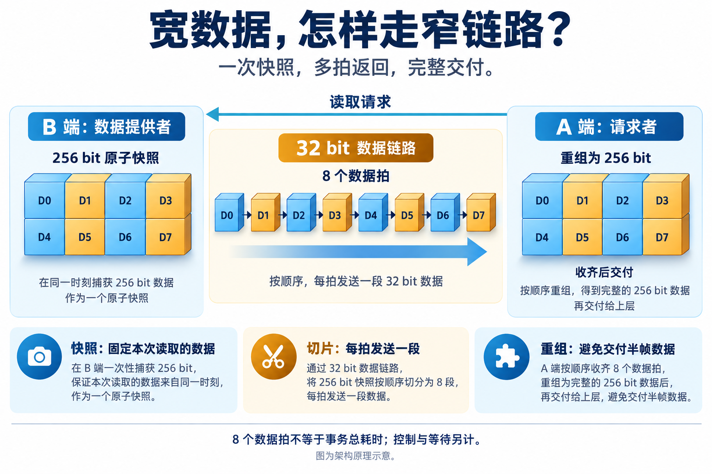
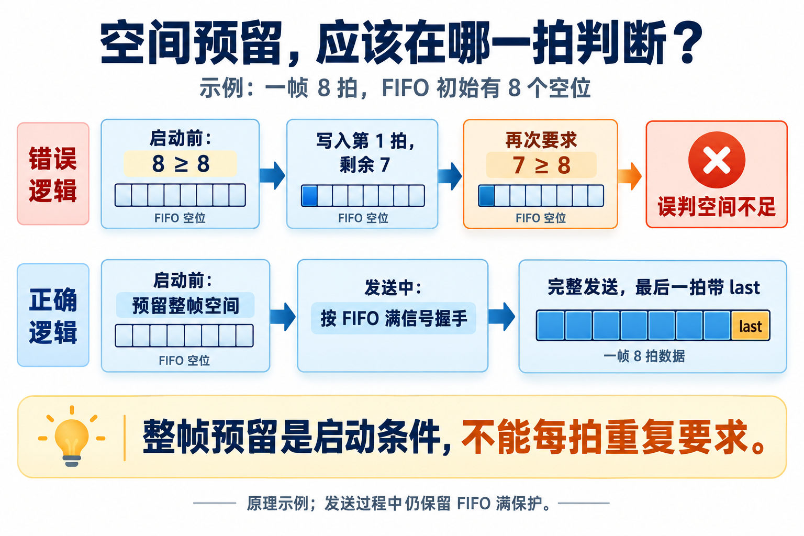
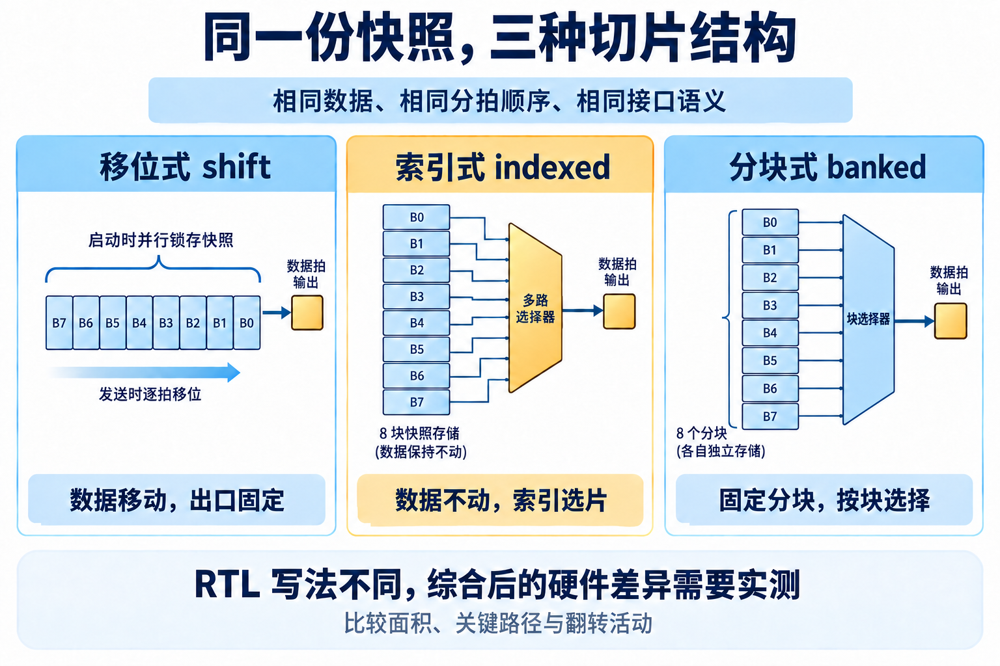

# 让 AI 带着综合结果改 RTL：一次 CBB 设计与 PPA 探索

简体中文 | [English](README.en.md)

芯片里的两个模块需要交换数据。如果它们相距较远，数据又比较宽，直接连接就需要铺设不少信号线。但如果接收方只是偶尔读取一次，也不急着拿到结果，就可以考虑少用一些线，把数据分成几次传过去。

这是一个不大的设计需求，却有不少选择：数据怎样拆分，中间需要多少缓存，两端工作节奏不一致时如何配合。几种方案都可能把数据正确送到，最终占用的电路面积、能达到的速度和功耗却未必一样。工程师需要把方案做出来、验证，再结合工具报告判断。

这次，我把这样一个模块作为 AI 辅助芯片研发的实践对象，让 AI 参与需求梳理、提出不同实现、组织验证，以及调用综合工具比较电路成本。工程师确定应用约束、审视结果，再决定下一轮往哪里调整。

过程中，有的结构差异没有带来预想中的面积差距，一个缓存参数的调整却产生了更明显的收益。下面就沿着这个模块的设计过程，看看 AI 怎样参与这些具体工作，以及工具给出的反馈如何影响设计选择。

## 一个小模块，足够展开真实的设计取舍

CBB 是可参数化、可复用的公共逻辑构件，可以把它理解为芯片里的基础积木，例如缓冲队列、仲裁器或位宽转换模块。它通常规模不大，却可能被多个 IP（可复用的芯片功能模块）使用。“参数化”意味着同一份设计可以按需设置位宽、缓存深度等选项，无需为每种规格重写一遍电路代码。

这些电路通常用 RTL（寄存器传输级）来描述：数据存在哪里、每个时钟周期怎样流动、经过哪些逻辑处理。综合工具再将这份描述转换成由逻辑门、寄存器等单元组成的电路，并给出面积和时序报告。

但换了位宽、时钟关系或缓存深度，电路也会面对不同的实现约束。能复用代码，只是设计复用的起点。

这里的模块叫 `parallel_data_fetch`。场景是：A 端偶尔需要读取 B 端的一份宽数据，但不要求一个周期返回。

设计采用窄链路传输。B 端准备好数据后，先锁存一份原子快照，再拆成多个数据拍发送；A 端逐拍重组，收到完整结果后才交付。这样，即使 B 端的原始数据在传输期间变化，本次读取仍对应同一份快照。

这里的“原子”强调一次性捕获完整数据，避免前半段来自一个时刻、后半段来自另一个时刻。链路每次传送的一段数据称为一“拍”（beat），一份完整快照对应一“帧”；从发起读取到返回结果，则是一笔“事务”。这些单位区分开，就容易理解为什么 8 个数据拍不等于 8 个周期完成读取。

*图 1｜架构原理示意。256 bit 经 32 bit 链路需要 8 个数据拍；事务总耗时还包括请求、数据准备和等待。*

这个选择用传输时间换取更窄的数据通路。实际布线收益还要结合物理实现评估，本次实验先比较逻辑综合结果。

决定结构的几个参数也很直接：数据位宽与链路位宽决定一帧有多少拍；同步或异步决定跨时钟处理方式；流水级数影响寄存器开销；异步 FIFO 深度决定能容纳多少返回数据。切片方式则提供了三种可比较的微架构。

FIFO 是“先进先出”的队列：先写入的数据先被取走，“深度 8”表示能暂存 8 拍。这里的异步，是指 A、B 两端时钟没有固定的相位关系，发送和接收各按自己的节奏工作。异步 FIFO 负责在两个时钟域之间安全地传递数据；它需要额外的存储和控制电路，因此也带来面积成本。

工程师先确定这些约束，AI 才有明确的探索范围。例如，链路位宽必须整除数据位宽；本设计一次只处理一笔未完成事务；异步返回 FIFO 的深度必须是 2 的幂，并至少容纳一整帧。

这些约束既是 RTL 的输入，也是验证与综合扫描的输入。三者使用同一组含义，后面的比较才站得住。

## AI 的工作，从一份可检查的设计约定开始

这里的 Skill 是交给 AI 使用的一套工程操作说明，规定每一步依据什么输入、调用哪些工具、产出哪些材料，以及怎样检查结果。这次使用的 Skill 把 CBB 开发拆成了相互衔接的工作：描述行为和合法参数，展开架构候选，生成 RTL 与断言，验证功能与配置边界，再在统一约束下做综合。

“断言”是写进验证环境的自动检查规则，例如发送受阻时数据必须保持稳定；“回归”则是在设计变化后重新运行一组测试，检查修改是否影响已有行为。它们为 AI 的迭代提供具体反馈。

这种组织方式让 AI 每一步都有具体依据。设计阶段要回答快照何时锁存、失败事务如何结束、哪些参数能够组合；验证阶段要检查这些约定是否落实；综合阶段则比较通过功能检查的候选，并把结果带回结构选择。

人的判断仍然集中在几个关键位置：应用需要什么，哪些代价值得接受，报告是否支持当前结论。AI 可以承担候选展开、回归组织和结果整理，让工程师更容易把精力放在这些选择上。

*图 2｜方法示意。结构调整后重新验证；综合结果成为下一轮设计的输入。*

## 参数边界，找到了一处常规用例没暴露的问题

这轮验证包含 21 组正向编译检查、15 组非法参数检查，以及 12 组同步功能用例和 8 组异步双时钟回归。配置空间另外生成了 215 条组合，首轮执行其中 13 个代表点，覆盖极值、非默认值和高风险交互；这里的 215 条是生成数量，并非全部执行通过。

“配置空间”就是所有参数组合形成的设计范围。单独检查位宽和缓存深度还不够，两者同时取某些值时也可能出问题。选代表点，就是有针对性地检查这些边界与交互。

这一轮代表点检查找到了一个很有解释价值的问题：**整帧空间预留，被误用成了每拍的发送条件。**

用一个简单例子来看：一帧需要 8 拍，FIFO 初始恰好有 8 个空位。启动前检查“空位数至少为 8”，没有问题。

写入第一拍后，如果接收端尚未取走数据，空位变成 7。假如下一拍仍要求“空位数至少为 8”，发送就会被自己刚写入的数据挡住。原本已经满足容量条件的一帧，反而无法连续发完。实际边界回归中，这个错误导致发送中断、末拍标记丢失，最终表现为协议错误。

*图 3｜原理示例。整帧预留控制是否启动；发送过程中仍按 FIFO 满信号握手，即接收侧有空间时才接受数据。last 是最后一拍的标记。*

修正后的分工很清楚：发送启动前确认整帧空间，进入发送阶段后保留 FIFO 满保护，不再逐拍重复要求一整帧的空位。修正后，4 拍对应深度 4、512 拍对应深度 512 的边界配置通过了回归。

这个例子也说明了 Skill 怎样帮助 AI 把验证做得更具体。“多测几个参数”很模糊；检查“缓存深度恰好等于一帧长度”的组合，则直接触及了资源预留的语义。参数约束里已经包含了验证线索，值得系统地展开。

## 三种 RTL，综合后为什么如此接近？

功能验证之后，就要比较实现的成本。这里用到 PPA：功耗（Power）、性能（Performance）和面积（Area）。它们往往互相牵制，例如增加寄存器可能让电路跑得更快，同时也会增加面积和功耗开销。本轮先从面积和时序报告看起。

切片部分保留了三个候选：移位式每拍移动宽寄存器，从固定位置取数；索引式保持快照不动，用拍计数选择当前片段；分块式把快照组织成固定宽度的数据块，再按块选择。

*图 4｜微架构原理示意。三种结构保持相同的对外行为，硬件代价通过综合比较。*

直觉上，这几种写法差别不小。但在 256/32（数据位宽 256 bit、链路位宽 32 bit）的基线配置中，结果非常接近：

| 切片实现 | 综合单元面积（µm²） | 时序裕量（ns） |
| --- | ---: | ---: |
| 移位式 shift | 3187.7 | 0.03 |
| 索引式 indexed | 3187.5 | 0.04 |
| 分块式 banked | 3204.9 | 0.00 |

读这张表，需要区分两个量。“综合单元面积”是映射后各电路单元的面积之和，并非最终芯片占地；“时序裕量”（slack）是要求数据到达的时间减去实际到达时间。正数表示还有余量，负数表示来不及。表中的 0.00 ns 是报告值，表示本轮满足约束但已接近边界。

这组数据来自同一轮综合：GF 28nm LP HVT 库，TT、1.0 V、25°C，Synopsys DC V-2023.12-SP3，目标周期 2.5 ns，输入输出延迟均为 0.5 ns，输出负载 0.01 pF。其中 HVT 指高阈值电压单元，TT 指典型工艺条件。保持工艺库、温度、电压和时序约束一致，才能把比较重点放在结构差异上。

继续检查 RTL 和综合报告，原因就更清楚了。

首先，三种实现都需要保留一份 B 端快照。A 端还共享一份重组寄存器和一份结果寄存器；这两份存储不随切片实现变化。整个模块的大量存储开销是共同的，局部选择逻辑的差异自然会被稀释。

其次，源码里的寄存器声明不能直接当作最终硬件计数。早期写法中有一份无条件声明、写入的快照寄存器，在某些实现下没有功能读取，综合时已经被当作死逻辑移除。后来用 `generate` 隔离各个实现，让每个分支只维护自己的存储，结构更容易检查；不能据此声称又省掉了一整份实际存在的寄存器。

在修正写法后的 4096/16 重测中，三种实现的面积分别为 47052.0、47207.4、47141.2 µm²，时序单元数量仍相同。这说明候选结构确有差异，但不能只凭 RTL 外观判断差异有多大。

对这一组需求，我更看重的是：AI 已经能够把多个满足共同约定的候选摆到同一张比较表上。选择哪一个，可以讨论具体成本；没有必要先给某种写法贴上“天然更优”的标签。

## 把优化注意力放到更有分量的地方

同一轮实验还比较了链路流水和异步 FIFO。它们比切片写法更直接地改变了模块成本。

流水是在数据通路中插入寄存器，把一段较长的传播过程分成几段，让每段有机会在一个时钟周期内完成。代价是增加寄存器和传输延迟。而“关键路径”是时序裕量最小、最限制频率的路径：如果它位于端点内部，只给连接两端的链路加流水，就未必能改善整体时序。

同步 256/32、分块式实现中，从不加流水到增加 8 级流水，面积由 3204.9 增至 3973.1 µm²，增加约 24%；时序裕量仅由 0.00 ns 增至 0.02 ns。结合关键路径报告来看，本轮更应关注端点内部逻辑。后续大拍数重测中的关键路径也落在 A 端重组侧。

这给出了明确的设计方向：继续优化时，先沿报告检查裕量最小的路径。链路流水仍有长距离传输的用途，只是它对实际布线延迟的帮助，需要放到物理实现条件下评估。

异步配置则给出另一类取舍：

| 256/32 配置 | 综合单元面积（µm²） |
| --- | ---: |
| 同步基线 | 3204.9 |
| 异步，FIFO 深度 8 | 4519.7 |
| 异步，FIFO 深度 16 | 5787.4 |

两个异步点的 A、B 时钟各约束为 2.5 ns，并设置了异步时钟组例外。同步基线用于理解功能成本，深度选择则比较两个异步点。

256/32 一帧为 8 拍，深度 8 已满足本设计整帧预留的容量要求。由深度 16 调整到 8，模块面积减少约 21.9%。在这里，选择与需求匹配的容量，比反复打磨三种切片写法更有面积收益。

这篇主要展开 PPA 中的面积与时序，是因为它们有明确的综合对比依据。动态功耗与电路信号翻转的频繁程度有关，本轮仍采用默认活动率估计，没有业务活动数据，因而不据此判断某种切片结构更省电。以上数字都是当前工艺与约束下的综合结果。

## 让下一次设计少一些盲猜

这次实践把一份 RTL 背后的设计依据整理了出来：哪些行为必须一致，哪些参数组合容易出问题，几个候选分别花费多少面积，以及关键路径究竟在哪里。

AI 在这里承担了连续的工程工作。它沿着 Skill 整理约束、展开实现和验证，再把综合结果带回设计。参数边界检查找到了逐拍预留的问题，面积对比指出了 FIFO 深度的成本，关键路径报告又帮助缩小了时序优化范围。

对芯片研发来说，这样的协作很实用。工程师提出一个结构假设后，可以更快地组织起一轮有约束、有验证、有结果的比较，再据此决定下一步把时间花在哪里。**让 AI 辅助设计的价值，落到一次次有依据的选择上。**
