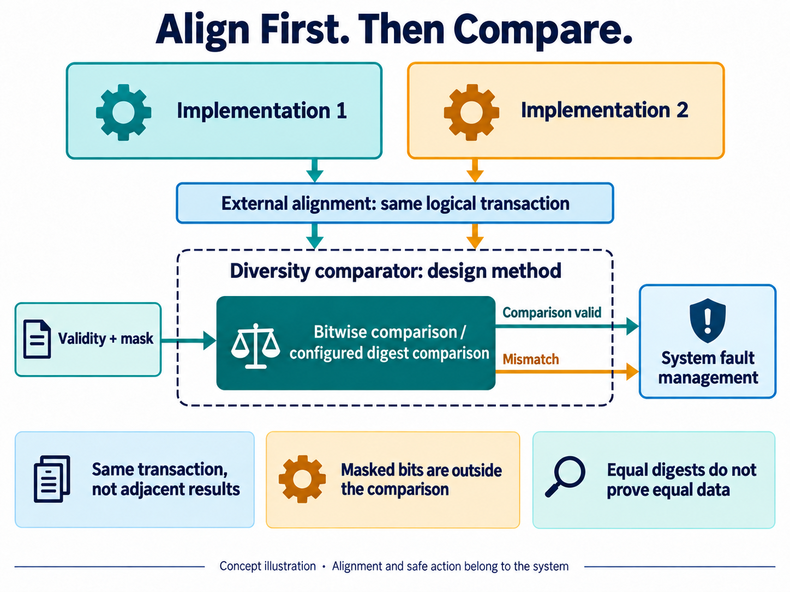
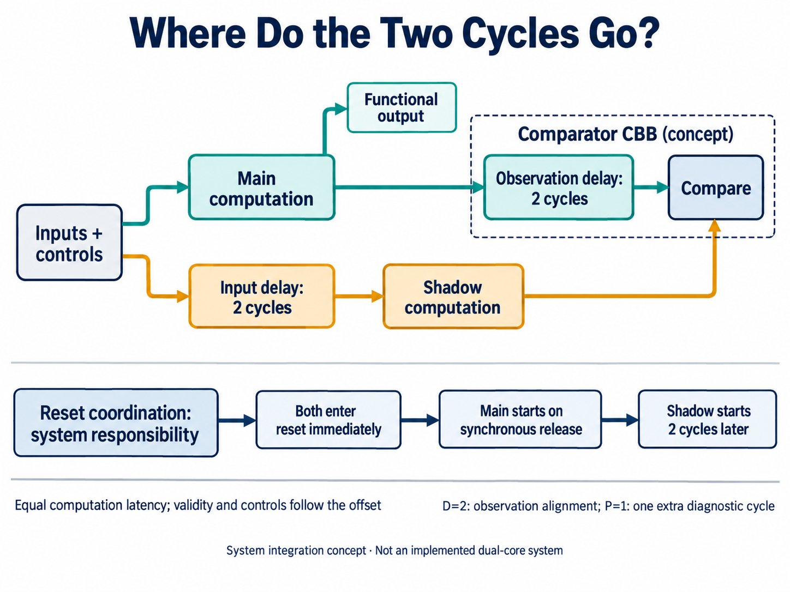
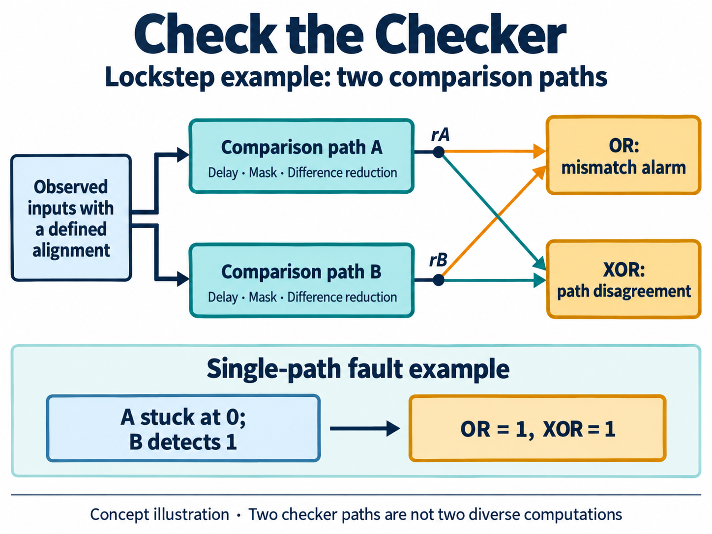

[简体中文](README.md) | English

# Who Checks the Comparator? AI-Assisted Diversity Comparator Design and PPA Trade-offs

Imagine a control system that computes the same result using two different implementations. The intent is to catch an error in either channel before it causes a problem. Connect their outputs to a comparator and raise an alarm when they differ: it sounds like a few lines of RTL.

But what if the computations finish at different times? What if the comparator checks the current result against the previous one? And what happens if the alarm logic itself gets stuck at “no error”?

These questions determine whether the comparator is a useful safety building block. They also determine where AI should start. Generating an XOR operation is straightforward. Defining when comparison is meaningful, which faults must become visible, and how much hardware to spend requires engineering decisions first.

This article uses the requirements for `diversity_comparator` to explore how AI can turn those decisions into checkable constraints. That component is currently at the requirements planning stage. The implementation, verification, and PPA results below come from a separate RTL candidate, `lockstep_comparator`; the two are kept distinct throughout.

## What agreement between two computations actually tells us

Functional safety addresses the risk created when an electronic system malfunctions. If a control result is wrong, for example, the system needs to detect the problem within an allocated time and take an appropriate safe action. A comparator performs only the local detection part of that job.

Diverse implementations aim to reduce the chance that certain shared design defects affect both computation channels. Shared inputs, clocks, power supplies, and other common factors still need analysis. Infineon’s [introduction to functional safety](https://documentation.infineon.com/aurixtc3xx/docs/vln1745575913166) distinguishes homogeneous and diverse redundancy and also explains why faults in the comparator itself need to be detected.

There are two different pairs here: **two computation implementations** produce the results being checked; **two comparison paths** strengthen the checker itself. Duplicating a comparator does not automatically introduce diversity into the preceding computation.

For a diversity comparator, the first question is whether its inputs represent the same thing. Different microarchitectures may have different pipeline depths, output ordering, or numerical representations. The proposed comparison core accepts already aligned data or explicitly configured digests. It does not reorder transactions for the system or automatically discover that two values belong to the same operation.

*Concept illustration: establish the correspondence between logical transactions outside the comparison core, then interpret comparison validity and mismatch. This is a design method, not an implemented diversity_comparator circuit.*

The resulting contract is more precise than “equal means pass”:

| Condition | Meaning of the result |
| --- | --- |
| Same logical transaction, both inputs valid, comparison enabled | A conclusion can be drawn for the specified comparison scope |
| One input is not valid, or the baseline is not established after reset | No mismatch must not be interpreted as a successful comparison |
| Some bits are masked out | The conclusion covers only the participating bits |
| Digests are compared | Equal digests can still represent different original data |

A digest compresses a longer data item into a shorter signature. This can reduce the comparison interface, but different data can produce the same signature—a collision or alias. The algorithm, width, initial value, and data boundaries need to be defined together. Simply saying “we use a CRC” does not establish a universal undetected-error probability or safety guarantee.

This gives AI a useful requirements task: separate data meaning, validity conditions, and diagnostic timing, then generate counterexamples for each. Two equal numbers from adjacent transactions, for example, should expose an alignment problem rather than count as evidence of a successful comparison.

## Give AI constraints that can be checked

A CBB is a reusable common logic building block. Its interface may be small, but reuse across systems makes parameter combinations and boundary behavior important.

The diversity comparator requirements already address reset, validity, masks, parameter legality, consistency across implementation variants, and PPA characterization. AI can turn these into interface questions, implementation constraints, and verification scenarios instead of repeatedly guessing the intent of a vague instruction.

Reset, for example, must clear comparison validity and diagnostic pipeline state as well as data registers. After re-enabling the block, a valid comparison baseline must be established. Static errors such as zero width or an invalid digest configuration should be rejected before building. If multiple implementations are introduced, their output sequences and latency relationships must be specified; checking only the final value is insufficient.

At this stage, AI can prepare scenarios for single-bit and multi-bit differences, fully masked inputs, misalignment, reset and restart, enable changes, and digest collisions. These are targets for future verification, not tests that this component has already passed.

Human judgment is needed elsewhere: which input combinations are meaningful, how the system guarantees alignment, how much detection latency is acceptable, and which bits may not be masked. AI can develop those decisions into engineering artifacts. It cannot invent the system’s safety goals on the designer’s behalf.

## A real implementation lesson: synthesis blurred the redundancy boundary

The lockstep comparator provides a concrete example of how these constraints affect hardware. A few concepts help explain why the two-cycle delay is there.

### Use an additional computation to check the running computation

Lockstep maintains a defined execution relationship between two computation channels and continuously compares corresponding observations. Dual-Core Lockstep, or DCLS, applies this to two cores running the same task: one supplies functional results and the other serves as a checker. The additional core generally buys runtime checking rather than twice the task throughput. Arm’s [comparison of lockstep and redundant execution](https://developer.arm.com/community/arm-community-blogs/b/embedded-and-microcontrollers-blog/posts/comparing-lock-step-redundant-execution-versus-split-lock-technologies) explains this resource trade-off. The same idea can also be applied to state machines and datapaths, not just CPUs.

For example, a flipped register bit becomes visible as a mismatch only if it affects an observed signal while comparison is valid. The selected data and control observations, and the time it takes an error to reach them, shape detection capability. Disagreement alone generally cannot identify which channel is correct. The comparator reports the anomaly; the system decides whether to isolate, retry, or enter a safe state.

Same-cycle lockstep advances corresponding operations together. Delayed lockstep deliberately offsets the checking channel by a fixed number of cycles, then compensates before comparison. This temporal diversity aims to reduce the chance that one brief disturbance affects both channels at the same execution stage. Infineon’s [AURIX lockstep description](https://documentation.infineon.com/aurixtc3xx/docs/ztz1745575952703) gives an example with two-cycle delays on checker-core inputs and main-core output observations. Two cycles is a design choice, not a universal lockstep requirement.

Temporal diversity and implementation diversity are different dimensions. Running identical RTL two cycles apart does not remove a shared logic-design defect; a sustained common-cause fault can also affect both channels. “Common cause” means that one cause, such as a shared power-supply problem, affects multiple channels. Delayed lockstep therefore works alongside other system safety mechanisms.

Engineering decisions must account for both detection coverage and reaction time. Coverage concerns how much of the analyzed fault population can be detected; a test pass rate is not a substitute. Reaction timing must extend through the necessary system safety action, rather than stop when the comparator raises its alarm. Adding a comparison pipeline stage later in this article consumes part of that timing budget.

The characterized block aligns observed inputs using a fixed delay relationship. It neither reorders arbitrary transactions in a heterogeneous system nor produces the protected functional data.

### A two-cycle offset: inputs, observed outputs, and reset

Consider a delayed-lockstep integration using a common clock. Main receives the input immediately; shadow receives the same input bundle two cycles later. Assuming identical deterministic behavior and computation latency, shadow produces the corresponding result two cycles after main. The delayed bundle must include data, validity, and controls that affect state advancement, rather than just the data bus.

To compare the same computation, **delay main’s output observation branch by two cycles and feed shadow’s output directly to the comparator**. The input delay is on the shadow branch; the output delay is on the main observation branch. These delays compensate across different branches. They do not make shadow four cycles behind main, nor do they require delaying the main functional output by two cycles.

*Concept illustration: the integrator provides shadow’s input delay and coordinates the two instances’ resets. The main observation delay inside the boundary corresponds to D=2 in this comparator. Main/shadow are the protected computation instances, distinct from the comparator’s internal A/B checker paths.*

Transaction identity makes the relationship clearer. Suppose main accepts transaction T in cycle k, computation takes L cycles, and there are no unaligned stalls:

| Event | Cycle |
| --- | --- |
| Main accepts T | k |
| Shadow accepts the same T | k+2 |
| Main produces T’s result | k+L |
| Main’s result completes the observation delay | k+L+2 |
| Shadow produces T’s result for comparison | k+L+2 |

In steady state, the comparison is between `main_result[n-2]` and `shadow_result[n]`, not the two undelayed outputs in the same cycle. L is the computation latency, excluding the two-cycle observation delay. Independent stalls or different computation latencies require a different alignment contract.

Reset must preserve the corresponding state histories as well. In this complete input-time-shift example, both instances can enter reset immediately, while shadow starts running two working clock edges after main during controlled synchronous release. The input delay and startup validity must follow that schedule, so the first valid input processed by shadow corresponds to the first one processed by main. **A two-cycle reset offset means a controlled release and startup relationship, not shifting an asynchronous reset signal as ordinary data.** The exact reset scheme belongs to system integration; two registers alone do not establish reset correctness or safety.

The characterized CBB contains only the comparator. It generates neither shadow’s inputs nor the main/shadow resets. It has its own active-low `rst_ni`: asynchronous assertion clears local delay registers, startup counters, optional comparison pipelines, and sticky fault state; synchronous release is the integrator’s responsibility. Local alignment becomes ready after `D+G` rising edges following release, where G is an additional startup guard. With default D=2 and G=0, the local delay chain waits two edges. This does not establish that both computation instances are ready: comparison enable and main/shadow activity conditions must also hold. The integrator must align transaction-dependent valid/mask information to the current comparison.

The P parameter discussed below serves a separate purpose. D=2 compensates the main observation data by two cycles. P=1 registers the diagnostic difference for one additional cycle after alignment and difference computation. The D delay chain continues advancing while comparison is disabled. If P=1 has already captured a difference, disabling comparison does not immediately erase that pipeline result; reset immediately suppresses live reports.

### Preserve redundant comparison paths through synthesis

The implementation supports several redundancy levels. R1 has two comparison paths but shares input-delay and startup state. R2 keeps separate A and B paths for delay, startup, masking, difference computation, and result pipelining. R2 is the main safety configuration discussed here.

Let the mismatch results from the two paths be `rA` and `rB`. The external mismatch report uses `rA OR rB`, so either path can raise an alarm. Internal path disagreement uses `rA XOR rB`, providing diagnostic information when the judgments differ.

If A’s result is stuck at 0 while B correctly detects 1, the OR output still raises an alarm and the XOR output exposes disagreement. Requiring both paths to report a fault would lose that behavior. If both paths incorrectly return 0, however, neither expression detects it; coverage must be assessed against the fault model.

*Concept illustration: A and B are comparison paths inside the lockstep example, not two diverse computation implementations. The worked example covers one result stuck low while the other path correctly detects a mismatch.*

An early synthesis result preserved the default configuration’s 166 register bits, yet flattened the combinational logic inside the generate blocks into anonymous cells. The register count looked intact, but the separate masking and enable logic boundaries were no longer easy to constrain reliably.

The design was then revised to express A and B as private submodules in the same RTL file, creating explicit synthesis hierarchy. Cross-boundary optimization, automatic ungrouping, and register merging were restricted. The interfaces and parameter timing semantics remained unchanged, followed by another functional regression and synthesis check.

This is a concrete role for AI-assisted development: use tool feedback to revise the structural expression of the design so the mapped result better preserves its intent. The evidence includes mapped hierarchy and delay-register counts, not merely two instances in the RTL. These checks still do not prove physical independence after placement and routing; shared resources and final aggregation logic require separate analysis.

## PPA: what does one extra pipeline stage buy?

PPA stands for power, performance, and area. In a safety comparator, performance includes detection latency as well as clock timing. A circuit can become easier to time while reporting a fault one cycle later. Whether that is acceptable is a system decision.

Consider one direct comparison from the lockstep example: width W=128, main observation-alignment delay D=2, and redundancy level R=2. P=0 adds no comparison-result pipeline stage. P=1 registers a 128-bit difference vector in each path and adds one cycle of detection latency. The table covers only the comparator, excluding the system-level shadow input delay, computation instances, and reset coordination circuitry.

| Metric | P=0 | P=1 |
| --- | ---: | ---: |
| Synthesized area, library units | 3227.796 | 4097.808 |
| Register bits | 646 | 902 |
| Register-to-register timing slack, ns | 0.98 | 1.56 |
| Estimated dynamic power, µW | 1636.700 | 2100.600 |
| Relative detection latency | Baseline | +1 cycle |

These results are from the lockstep candidate characterization dated September 10, 2026: Design Compiler V-2023.12-SP3, GF CMOS28LP SC9 HVT library, TT at 1.00 V and 25 °C, targeting 400 MHz. Input and output delays were 0.25 ns, clock uncertainty 0.05 ns, input transition 0.05 ns, and output load 0.01 pF. Hierarchy was preserved, with no cross-boundary optimization or retiming. Area is reported in library units, not measured layout area. Power uses input probability 0.5 and toggle_rate 0.1, with tool-propagated sequential activity and no SAIF activity file; clock-related cell internal power is included.

Timing slack is the remaining margin against the constraint; a positive value indicates margin under the analyzed conditions. P=1 gains 0.58 ns of register-to-register slack while increasing area by about 27% and estimated dynamic power by about 28%. The additional 256 register bits correspond exactly to the two 128-bit difference vectors.

At 400 MHz, a cycle is 2.5 ns. Whether this trade is worthwhile depends on the time allocated to detection and subsequent system reaction. Each configuration has a cost; larger timing slack alone does not make P=1 the better choice. These are synthesis estimates under fixed conditions, not silicon measurements or maximum-frequency results.

Other apparent area improvements require even more care. At W=32, D=2, and P=0, R1 has an area of 610.038 versus 829.530 for R2. R1 shares some state, so the safety coverage conditions have changed. Masking every comparison bit also reduces area, but cannot be counted as an optimization of an operational detector.

The lesson for the diversity comparator is practical: **fix the comparison semantics, diagnostic requirements, and acceptable latency before asking AI to explore implementations and parameters.** If the set of errors that must be detected changes between candidates, an area ranking loses its basis.

## Check that the checks actually work

The Skill workflow used for the lockstep example organized requirements and parameter constraints, architecture, RTL, verification, and synthesis characterization into concrete steps. A Skill here is a way to structure executable engineering work: each step has inputs, artifacts, and checks, and tool results can drive the next revision.

The final RTL regression covered 147 configurations and 220,794 pre- and post-clock-edge checks within the selected parameter sampling domain, not an exhaustive proof over every legal integer parameter combination. A separately implemented, cycle-by-cycle state model checked the results. Separate implementation of the model and RTL does not imply an independent third-party safety assessment.

An especially useful question is whether the tests detect deliberately introduced errors. Ten adversarial tests covered illegal parameters, unknown-valued inputs, and mutations. One mutation changed the alarm aggregation from OR to AND and was expected to fail verification. This tests whether the requirement that either path can raise an alarm is actually being checked.

Eight configurations also completed formal equivalence checks between RTL and mapped netlists, checking that synthesis preserved behavior. Parameter regression, mutation testing, equivalence, and structural checks answer different questions. A single “all passed” label cannot replace them. These counts describe the lockstep candidate’s verification; they neither establish completion of the diversity comparator nor constitute certification or a diagnostic-coverage result.

Applied to the diversity comparator, the next step is specific: turn logical-transaction correspondence, validity windows, digest boundaries, and the detection budget into checkable requirements; implement candidate circuits; then compare PPA under consistent conditions.

AI can perform much of the elaboration, implementation, and checking. The engineer must keep asking whether each revision still detects the errors the system needs it to detect. For a functional-safety building block, that question follows the design until both the mapped circuit and the system behavior provide the corresponding evidence.
