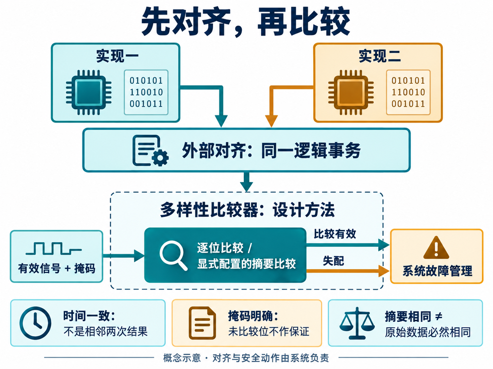
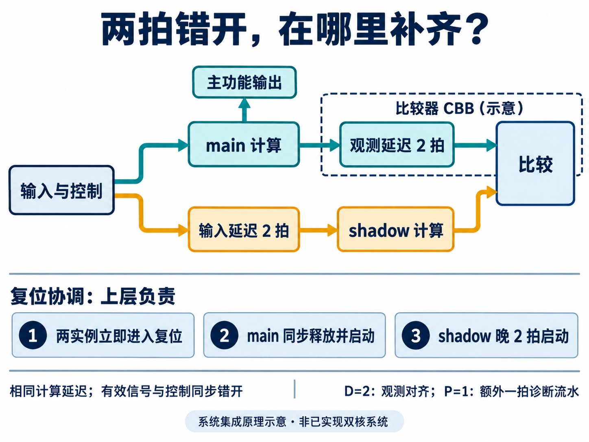
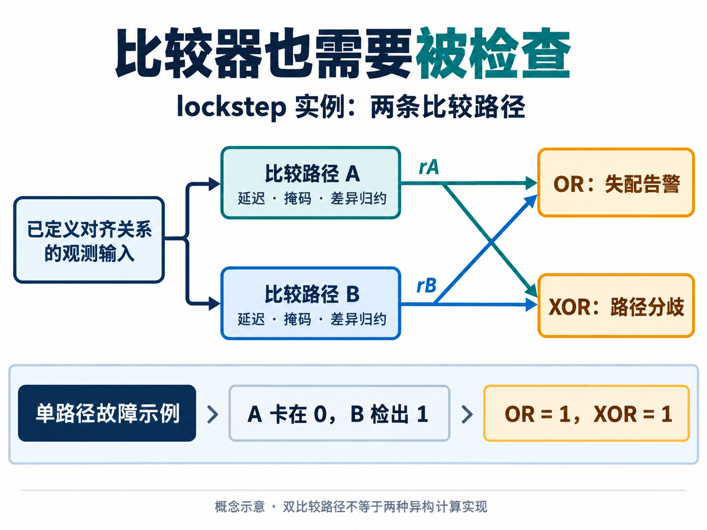

[English](README.en.md) | 简体中文

# 谁来检查比较器？AI 辅助多样性比较器设计与 PPA 取舍

设想一个控制系统，用两种实现计算同一个结果，希望在其中一路出错时及时发现异常。把两路输出接到比较器上，不一致就报警，看起来只差几行 RTL。

但如果两路计算结束的时间不同呢？如果比较器拿本次结果和上次结果作了比较呢？更麻烦的是，如果负责报警的逻辑本身卡在了“没有错误”，系统还能发现问题吗？

这些问题决定了比较器能否成为一块有用的安全构件，也决定了 AI 应该从哪里开始工作。异或运算很容易生成；什么情况下允许比较、哪些故障必须暴露、为此愿意付出多少硬件成本，需要先讲清楚。

本文以 `diversity_comparator`（多样性比较器）的需求设计为主线，讨论 AI 如何帮助把这些问题变成可检查的工程约束。它目前处于需求规划阶段。实现、验证与 PPA 数据则来自另一项已形成 RTL 候选的 `lockstep_comparator`（锁步比较器）实践，下面会明确区分两者。

## 两路计算一致，究竟说明了什么

功能安全关心的是：电子系统出现故障时，怎样降低由错误行为带来的风险。例如，一个控制结果出错后，系统能否在允许的时间内检测到异常，再由上层采取合适的安全动作。比较器只承担其中的局部检测职责。

多样性设计让两条计算通道采用不同实现，目的是减少某些共同设计缺陷同时影响两路的机会；它仍然需要分析共享输入、时钟、电源等共同因素。Infineon 的[功能安全入门说明](https://documentation.infineon.com/aurixtc3xx/docs/vln1745575913166)也将同构与多样性冗余区分讨论，并指出比较器自身的故障同样需要检测。

这里有两层容易混淆的“两个”：**两种计算实现**产生待检查的结果；**两条比较路径**用于增强检查逻辑本身。复制比较器，不会自动让前面的计算获得设计多样性。

对于多样性比较器，首先要回答的是：两个输入是否表达同一件事。不同微架构可能采用不同流水深度、输出顺序或数值表示。需求中的比较核心接收的是已经对齐的数据或明确配置的摘要，不负责替系统完成事务重排，也没有自动识别“这两个数属于同一次计算”的能力。

*原理示意：先在比较核心之外建立同一逻辑事务的对应关系，再解释比较有效信号和失配结果。此图描述设计方法，不代表已经实现的 diversity_comparator 电路。*

把这件事写成约束，会比一句“相等就通过”具体得多：

| 条件 | 应当怎样理解结果 |
| --- | --- |
| 同一逻辑事务、双方有效、比较使能 | 可以对约定范围给出比较结论 |
| 一路尚未有效，或复位后尚未建立基准 | 不能把没有失配当作本次比较通过 |
| 某些位被掩码排除 | 结论只覆盖参与比较的位 |
| 采用摘要比较 | 摘要相同仍可能对应不同原始数据 |

摘要是把较长数据压缩成较短特征值。这样可以缩小比较接口，但不同数据可能产生相同摘要，称为碰撞或别名。算法、位宽、初值和数据边界必须一起定义，不能仅凭“用了 CRC”就给出通用的漏检概率或安全保证。

这也是 AI 参与需求工作的一个实用切入点：把“比较结果”拆成数据含义、有效条件和诊断时序，要求它逐项给出反例。比如，两路数值刚好相同，但属于相邻两次事务，这应当暴露对齐问题，而不能成为比较通过的证据。

## 让 AI 先生成可检查的约束

CBB 是可复用的公共逻辑构件。它的接口通常不大，但会被放进不同系统，参数组合和边界行为需要足够清楚。

这份多样性比较器需求已经把复位、有效信号、掩码、参数合法性、实现变体一致性和 PPA 表征列入设计范围。对 AI 来说，它们可以分别转成接口讨论、实现约束和验证场景，而不必依赖一段含糊的自然语言指令反复猜测。

例如，复位不只是把寄存器清零，还要清除比较有效状态和诊断流水状态；重新使能后，要等到有效比较基准成立。位宽为零、摘要配置不合法等静态错误，应在构建前被拒绝。若未来存在不同实现变体，则需要明确它们的输出序列与延迟关系，而不是只检查最后一个数值相同。

在这个阶段，可以让 AI 形成一组待实现的检查场景：单比特与多比特差异、全部位被掩码、错位输入、复位重启、使能切换，以及摘要碰撞。这些是后续验证的目标，尚不是该模块已经通过的测试。

人的判断集中在另一处：哪些输入组合有意义，系统怎样提供对齐保证，允许多少检测延迟，哪些位不能屏蔽。AI 能把这些决定展开成更完整的工程材料，但不能替系统设计者凭空决定安全目标。

## 一个实际案例：综合工具把冗余边界打散了

要看这些约束怎样影响电路，可以参考锁步比较器的实际实现。先补上锁步的几个概念，再看两拍延迟怎样落到电路上。

### 锁步用一份额外计算，检查正在运行的计算

锁步（Lockstep）让两路计算保持约定的执行关系，并持续比较对应的观测结果。双核锁步常写作 DCLS（Dual-Core Lockstep）：两核处理同一任务，其中一路提供功能结果，另一路承担检查职责。因此，两核的硬件投入通常不会换来两倍任务吞吐；它换来的是运行时检查能力。Arm 对[锁步与冗余执行的介绍](https://developer.arm.com/community/arm-community-blogs/b/embedded-and-microcontrollers-blog/posts/comparing-lock-step-redundant-execution-versus-split-lock-technologies)也强调了这种资源取舍。类似思想可用于状态机或数据通路，并不只限于 CPU。

例如，一个寄存器发生翻转，只有当它影响到被比较的信号、且比较处于有效状态时，失配才会显现。观测哪些数据和控制信号、多久能看到错误传播，直接影响检测能力。仅有两路结果不一致，通常还不能判断哪一路正确；比较器报告异常，后续隔离、重试或进入安全状态由系统决定。

同拍锁步让对应操作在同一时刻推进；延迟锁步则让检查通道有意落后固定拍数，比较前再补偿时间差。这种时间错开称为时间多样性：它试图降低一次短时扰动在同一执行阶段同时影响两路的机会。Infineon 的[AURIX 锁步说明](https://documentation.infineon.com/aurixtc3xx/docs/ztz1745575952703)给出了检查核输入和主核观测输出各延迟两拍的实例。两拍是具体设计选择，不是所有锁步系统的通用要求。

时间多样性与前文的实现多样性是两个维度。把相同 RTL 错开两拍运行，不会消除两路共有的逻辑设计错误；持续的共因故障也可能同时影响两路。这里的“共因”是指同一个原因，例如共享电源异常，使多个通道一起失效。延迟锁步需要与其他系统安全机制配合。

工程上还要同时考虑检测覆盖和反应时间：覆盖描述在所分析故障中能够检出多少，不能用“测试通过率”代替；反应时间则要算到系统完成必要安全动作，而不只算比较器拉起告警的那一拍。后文给比较逻辑增加流水级，正是在消耗这份时间预算。

本文实际表征的构件按照固定延迟关系对齐观测数据，不处理异构系统中的任意事务重排，也不输出被保护的功能数据。

### main 和 shadow 差两拍，输入、输出和复位怎样配合

先看一种同一时钟下的延迟锁步集成方式。main 立即接收输入，shadow 接收延迟两拍的同一组输入；假设两个计算实例具有相同的确定性行为和计算延迟，shadow 就会比 main 晚两拍产生对应结果。这里延迟的应是完整的输入上下文，包括数据、有效信号以及影响状态推进的控制，而不只是数据总线。

为了比较同一次计算，**main 的输出观测支路再延迟两拍，shadow 的输出直接进入比较器**。因此，“输入打两拍”在 shadow 的输入侧，“输出打两拍”在 main 的观测输出侧，两者在不同分支上补偿时间关系。它们不会让 shadow 比 main 慢四拍，也不意味着要把主功能输出整体延后两拍。

*原理示意：shadow 输入延迟与两实例复位协调由上层集成负责；框内 main 观测值的两拍延迟对应本例比较器的 D=2。图中的 main/shadow 是被检查的计算实例，与比较器内部的 A/B 两条检查路径不同。*

用事务编号看最直观。假设 main 在周期 k 接收事务 T，计算延迟为 L 拍，且中间没有未对齐的停顿：

| 事件 | 对应周期 |
| --- | --- |
| main 接收 T | k |
| shadow 接收同一事务 T | k+2 |
| main 产生 T 的结果 | k+L |
| main 结果经过两拍观测延迟 | k+L+2 |
| shadow 产生 T 的结果，进入比较 | k+L+2 |

稳态下比较的是 `main_result[n-2]` 与 `shadow_result[n]`，而不是同拍的两个原始输出。L 表示计算实例自身的延迟，不包括两拍观测延迟。若两路存在独立停顿或不同计算延迟，就不能直接套用这张时序表，需要重新定义对齐机制。

复位也必须保持对应的状态历史。在这个完整输入时移的集成示例中，可以让两实例都立即进入复位，而在同步释放时让 shadow 比 main 晚两个工作时钟沿开始运行，同时让输入延迟链与启动有效信号配合这一节奏。这样，shadow 退出复位后处理的第一笔有效输入，才对应 main 退出复位后处理的第一笔。**“rst 差两拍”应明确为受控的释放与启动关系，不能把异步复位信号当普通数据移位两拍。** 具体复位方案属于上层设计，不能仅凭两级寄存器就宣称满足复位或安全要求。

本次实际表征的 CBB 只包含比较器，既不生成 shadow 的输入，也不生成 main/shadow 的复位。它只有自己的低有效 `rst_ni`：异步复位清空本地延迟寄存器、启动计数、可选比较流水和历史故障状态；上层负责同步释放。释放后经过 `D+G` 个上升沿，内部对齐就绪，其中 G 是额外启动保护周期。默认 D=2、G=0，意味着本地延迟链等待两个沿；它不自动证明两个计算实例都已准备好，仍需比较使能和 main/shadow 活动条件共同成立。数据相关的 valid/mask 也应由上层对应到当前比较的事务。

还要区分后文的 P 参数：D=2 是给 main 观测数据补偿两拍；P=1 是在已经对齐并计算差异之后，再寄存一拍诊断结果。两者位置和用途不同。比较暂时禁用时，D 对应的延迟链仍持续移位；如果 P=1 已捕获一项差异，撤销使能也不会立即抹去该流水结果，复位则会立即屏蔽实时报告。

### 冗余比较路径要保留到综合之后

该实现支持多个冗余级别。R1 有两条比较路径，但共享输入延迟和启动状态；R2 则分别保留 A、B 两条路径的延迟、启动、掩码、差异计算及结果流水逻辑。下面讨论的主要安全配置采用 R2。

设两条比较路径的失配结果分别是 `rA` 和 `rB`，向外报告失配使用 `rA OR rB`：任意一路发现差异，都能够触发告警。内部路径分歧使用 `rA XOR rB`：两路判断不一致时，提供额外诊断信息。

若 A 的失配结果卡在 0，而 B 正确检出 1，OR 输出仍为 1，XOR 也能暴露路径分歧。这解释了为什么这里不能要求两路都报错才报警。但两路同时错误地输出 0，仍不会被这两个公式识别；双路径的覆盖范围必须结合故障模型分析。

*原理示意：图中的 A、B 是锁步实例内部的比较路径，不是两种异构计算实现。例子只说明一路结果卡零、另一路正确检出时的行为。*

这一实现中有个很有启发性的综合反馈：早期结果保留了默认配置的 166 个寄存位，但生成块内的组合逻辑被展平成匿名单元。寄存器数量看起来没少，却已经难以可靠地约束两条路径各自的掩码和使能逻辑边界。

随后，设计把 A、B 路径改成同一 RTL 文件中的私有子模块，形成明确的综合层次，同时限制跨边界优化、自动打散层次和寄存器合并。接口及参数时序含义保持一致，再重新执行功能回归与综合检查。

这段实践体现了 AI 辅助研发的一种具体价值：沿着工具反馈修改结构表达，让综合结果更接近设计意图。判断依据包括映射后路径层次和延迟寄存位，而不只是 RTL 里有没有写两个实例。这样的结构检查仍不等于布局布线后的物理独立性证明，共享资源和最终汇总逻辑也需要单独分析。

## PPA：多打一拍，买到什么，又付出什么

PPA 分别指功耗、性能和面积。对于安全比较器，“性能”除了时钟约束，还必须包含检测延迟：电路更容易满足时序，但告警晚了一拍，系统是否接受？

下面只看锁步实例的一组直接对比：数据宽度 W=128，main 观测对齐延迟 D=2，冗余级别 R=2。P=0 不增加比较结果流水级；P=1 在每条路径上寄存 128 位差异向量，增加一拍检测延迟。表中面积和功耗只覆盖比较器，不包含上层 shadow 输入延迟、计算实例和复位协调电路。

| 指标 | P=0 | P=1 |
| --- | ---: | ---: |
| 综合面积（库单位） | 3227.796 | 4097.808 |
| 寄存位数量 | 646 | 902 |
| 寄存器间时序裕量（ns） | 0.98 | 1.56 |
| 动态功耗估计（µW） | 1636.700 | 2100.600 |
| 相对检测延迟 | 基准 | 增加 1 拍 |

数据来自 2026-09-10 的锁步比较器候选表征：Design Compiler V-2023.12-SP3，GF CMOS28LP SC9 HVT 库，TT、1.00 V、25 °C，目标 400 MHz。输入/输出延迟均为 0.25 ns，时钟不确定性 0.05 ns，输入转换时间 0.05 ns，输出负载 0.01 pF；保留层次、禁止跨边界优化且不做 retiming。面积使用库报告单位，并非实测版图面积。功耗采用输入概率 0.5、toggle_rate 0.1 的活动假设，由工具传播时序单元活动，未使用 SAIF 活动文件，包含时钟相关单元内部功耗。

时序裕量可以理解为相对于约束的剩余时间，正值表示该分析条件下还有余量。这里 P=1 的寄存器间裕量增加了 0.58 ns，同时面积约增加 27%，动态功耗估计约增加 28%。新增的 256 个寄存位，恰好对应两条路径各自的 128 位差异向量。

在 400 MHz 下，一拍是 2.5 ns。这笔交易是否值得，取决于系统分配给检测和后续反应的时间预算。两种配置各有代价，不能只凭更大的时序裕量就把 P=1 判为“更优”。这些结果是固定条件下的综合估计，不能当作硅片实测或最高工作频率。

另外一些“面积优化”更需要辨别。32 位、D=2、P=0 时，R1 面积为 610.038，R2 为 829.530；前者共享了部分状态，安全覆盖条件已经变化。把全部比较位屏蔽后面积更小，也不能作为有效检测配置的优化成绩。

对多样性比较器的启发是：**先固定比较语义、诊断要求与允许延迟，再让 AI 搜索实现和参数。** 如果连“需要检测什么”都在变化，面积排行榜就失去了比较基础。

## 怎样知道 AI 做出的检查确实在工作

锁步实例采用的 Skill 流程，把需求与参数约束、架构、RTL、验证和综合表征串成了具体步骤。Skill 在这里是可执行工作的组织方式：让 AI 每一步有输入、产物和检查依据，工具结果能够反过来驱动修改。

最终 RTL 的参数化回归覆盖 147 个配置，完成 220,794 次时钟边沿前后检查；这是所选参数采样域的验证，不是所有合法整数参数组合的穷尽证明。检查使用独立编写的逐周期状态参考模型；这里的“独立”指模型实现与被测 RTL 分开，不等于获得独立第三方安全评估。

更值得关注的是测试有没有能力发现故意放进去的错误。10 项对抗测试包含非法参数、未知态输入以及变异测试：例如，把告警汇总的 OR 改成 AND，验证应当失败。这样才能检验“单条路径报错也必须告警”的要求是否真的被检查到了。

8 个配置还完成了 RTL 与综合映射网表的形式等价检查，用于确认映射前后行为一致。参数回归、变异测试、等价检查和结构检查各自回答不同问题，不能由一个“全部通过”替代。这些数字属于锁步实例的候选验证，不构成多样性比较器的完成证明，也不构成安全认证或诊断覆盖率结论。

把这套方法带回多样性比较器，最有价值的下一步已经很具体：先把逻辑事务对应关系、有效窗口、摘要边界和检测预算写成能被检查的要求，再实现候选电路，最后在同一组条件下比较 PPA。

AI 可以承担大量展开、实现和核对工作。工程师要持续追问的则是：这一轮修改以后，电路仍在检查原本需要检查的错误吗？对于功能安全构件，这个问题会一直跟着设计，直到综合结果和系统行为都能给出对应的证据。
