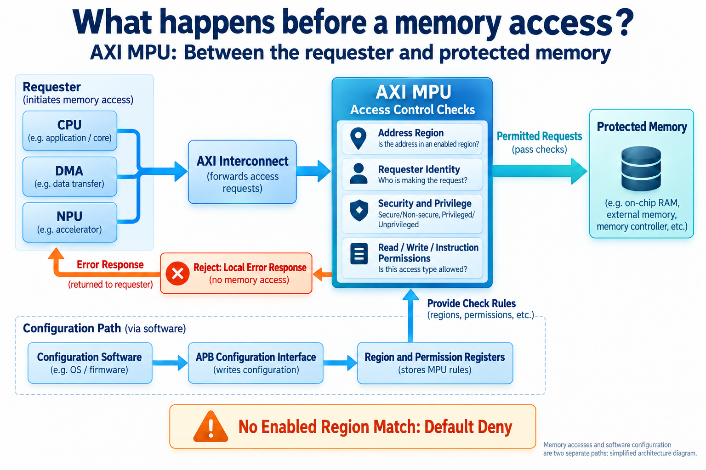
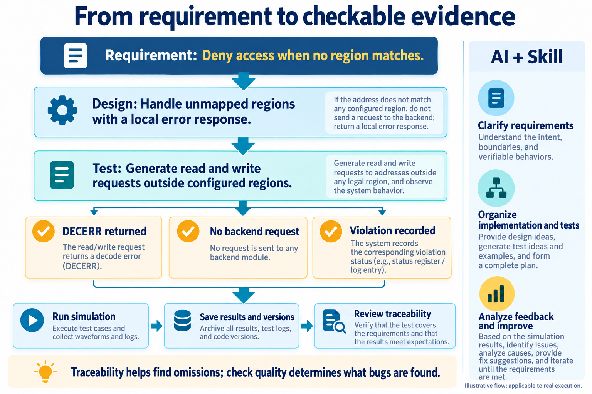
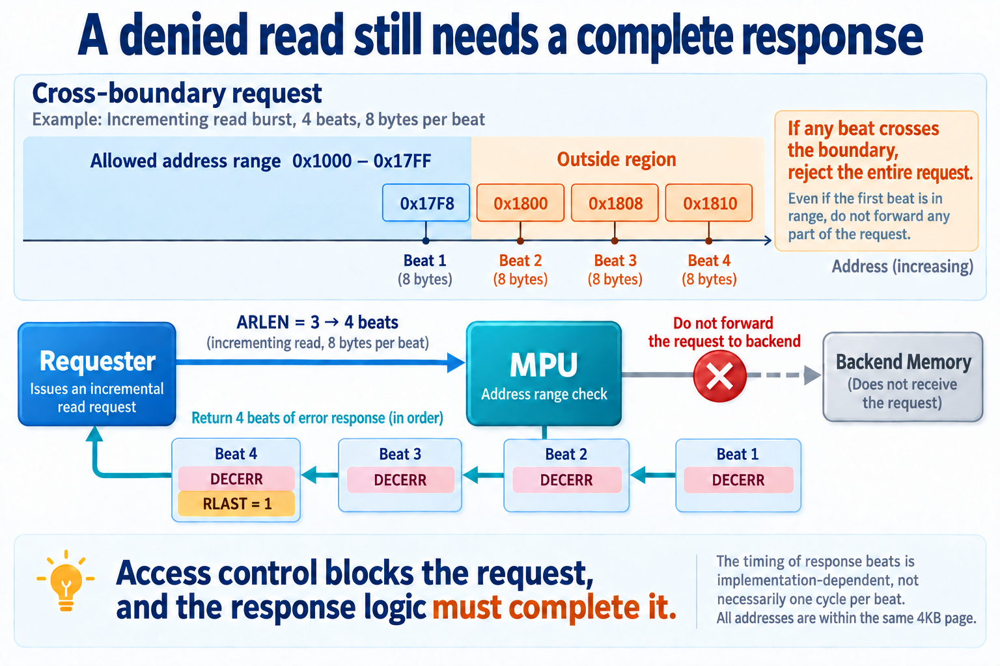
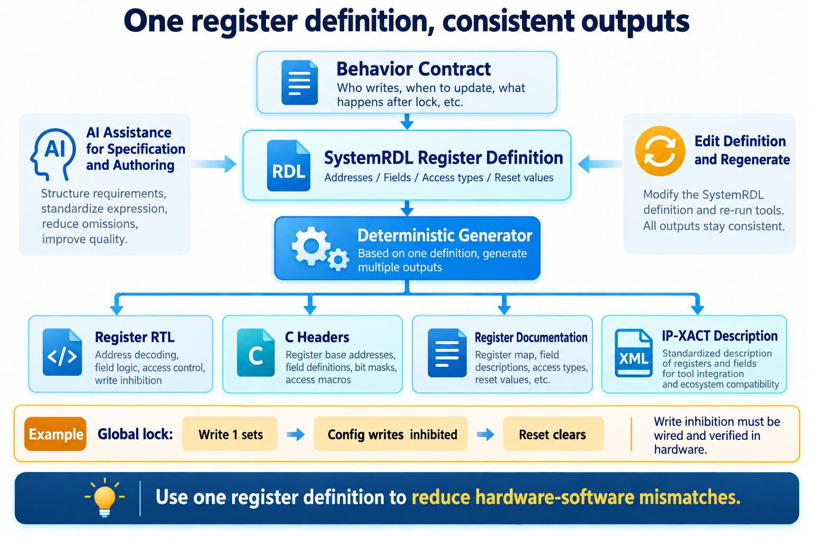

# Checking Access to On-Chip Memory: AI-Assisted AXI MPU Development

[简体中文](README.md) | English


A CPU executes software, a DMA engine moves data, and an NPU reads inputs for computation. They may share memory, but they should not share every permission. An ordinary transfer may access a working buffer while being barred from sensitive regions.

Hardware must enforce that distinction along the access path. Before a request reaches memory, it must check the address range, the requester, and whether the operation is a read or write. A denied request also needs an error response so the system can continue operating.

I used an AXI memory protection unit for this AI-assisted development exercise. AI participated in requirements, detailed design, RTL, test organization, and synthesis analysis. The engineer defined policy, checked protocol semantics, and assessed whether implementation and tests supported the conclusions.

This relatively small IP connects bus protocols, software configuration, hardware state, and verification rules. Several concrete decisions show how AI can participate in that everyday engineering work.

## What are we protecting?

An IP is a reusable chip function. MPU stands for memory protection unit. AXI is an on-chip bus protocol defining how requests, data, and responses are exchanged. This AXI MPU sits between requesters and protected memory.



*Figure 1. Architecture concept. Permission checks determine whether requests are forwarded; software programs the rules through a separate configuration interface.*

Software configures address regions with start and end addresses, permitted readers and writers, and allowed security and privilege attributes. Secure versus Non-secure and privileged versus unprivileged are separate dimensions.

For each request, the MPU selects a region and checks identity and permissions. No matching enabled region means default deny. If several regions match, the lowest-numbered region wins. Denied requests receive local errors, and the MPU records the violation.

The attributes a requester declares must also agree with its system-assigned capabilities. A master that lacks Secure capability cannot gain access merely by labeling a request Secure. This design checks master capabilities; integration must supply requester identity through trusted system connections.

These behaviors need agreement before RTL begins. “Build a memory protection unit” leaves enough unstated policy for otherwise reasonable implementations to disagree.

## Give AI work with explicit inputs and checks

This round organized 71 requirements covering regions, attributes, errors, configuration registers, and parameter constraints. These fed architecture, detailed design, and verification planning.

A Skill supplies engineering instructions to AI: what to read at each stage, what to produce, which tools to use, and how to check completion. It turns a broad IP-design request into concrete work.

For example, default deny requires a local error-response path and tests that access unconfigured regions. Reviewing those tests means checking the error code, absence of backend requests, and recorded violation status together.



*Figure 2. Method overview. Expand expected behavior into observable checks and retain actual execution results.*

RTL describes what information is stored, when data moves, and how state changes. AI can help write it and derive tests from the requirements. Traceability between requirements, design elements, and tests helps expose requirements without corresponding checks.

This round had no unlinked entries in four traceability relationships: requirements to architecture, architecture to detailed design, detailed design to RTL, and requirements to tests. Complete links establish association; the quality of the checks still depends on the individual cases.

## One security bit connects the protocol to the test

The first example concerns Secure/Non-secure decoding.

AXI uses `ARPROT` and `AWPROT` for read and write protection attributes, collectively `AxPROT`. Bit `AxPROT[1]` is zero for Secure and one for Non-secure, as defined in the access-permissions section of the [Arm AXI specification](https://developer.arm.com/-/media/Arm%20Developer%20Community/PDF/IHI0022H_amba_axi_protocol_spec.pdf).

An internal signal called `secure`, with one meaning Secure, therefore requires inversion:

```systemverilog
cap_secure <= ~s_axi_arprot[1];  // Read-request security attribute
```

An early implementation captured the bit directly, reversing its internal meaning. Review identified the error. Both read and write decoding were corrected and directed checks added.

Those checks keep the address fixed while varying request attributes and master capabilities. A Secure request from a capable master should access a Secure-only region. A Non-secure request should be denied. A master without Secure capability should also be denied even if it declares Secure. This distinguishes a region's permission from a requester's authority to claim an attribute.

The bug is not syntactic: the code compiles but interprets a protocol bit incorrectly. After AI fixes it, the engineer must ensure test expectations come from the protocol, rather than reproducing the implementation's misunderstanding.

## Blocking a request still means completing its transaction

A bus transaction extends from the initial request to the final response. An AXI burst contains multiple data beats, so permission checks must account for the whole access range.

Consider an allowed region `0x1000–0x17FF` and a four-beat incrementing read starting at `0x17F8`, with eight bytes per beat. The first beat is inside; the next three are outside. This design denies the entire request before forwarding any part of it.



*Figure 3. Conceptual example entirely within one 4KB page. Four beats specify the response count, not necessarily four clock cycles.*

Denial cannot simply stop bus interaction: the requester still expects a response. The MPU must return four beats with `DECERR` and assert `RLAST` on the final beat. This design uses AXI's `DECERR` response to indicate denial. `ARLEN = 3` encodes four beats because the burst length is the field value plus one; a burst cannot terminate early. These rules are described in the transaction-structure section of the [Arm AXI specification](https://developer.arm.com/-/media/Arm%20Developer%20Community/PDF/IHI0022H_amba_axi_protocol_spec.pdf).

This development round fixed a final-beat counting error. With a zero-based counter, four beats correspond to 0, 1, 2, and 3; the final-beat check must align with 3. The early check was one beat off, making the response count and state exit inconsistent. The fix aligned `RLAST` and state exit. A four-beat denied read checked both the response count and subsequent legal-transaction progress.

Writes add coordination because address and data use separate channels. Permission is determined at the address, but later data must still be handled. For a denied write, this design accepts and discards the data without writing the backend, then returns a write error. The address decision remains valid until the transaction ends.

“Reject unauthorized access” thus becomes concrete hardware behavior: where to block, how to respond, and when to accept the next request.

## One register definition connects hardware and software

Software sets permission rules and reads violations through control and status registers, or CSRs. Each register is addressed by software and contains fields.

Those fields appear in hardware, software headers, documentation, and verification. Maintaining each separately makes address or width changes prone to version mismatches.

Here, SystemRDL defines register addresses, fields, access properties, and reset values. Deterministic tools generate register RTL, C headers, documentation, and IP-XACT—a machine-readable hardware interface and register description.



*Figure 4. AI helps define behavior and fields; deterministic tools generate derived artifacts. Special hardware behavior still needs explicit integration and verification.*

A configuration lock illustrates the distinction. “Configuration cannot change after locking” requires both a lock that ordinary software writes cannot clear and actual inhibition of writes to protected registers.

The global lock is write-one-to-set, unaffected by writing zero, and cleared by reset. Configuration-register write enables must also depend on the lock. A field named `lock` does not automatically tell the circuit which other fields it protects.

An early register structure omitted write inhibition. Review added the control and regenerated the hardware. Directed tests configured a region, set the lock, attempted changes, and compared readback. They also checked that writing zero did not unlock it and reset did clear it.

AI helps specify behavior, write descriptions, and respond to feedback. Tools expand one definition into several artifacts, and consistency checks establish that they correspond to the same version. This reduces duplicated maintenance and clarifies what to check after a change.

## Results from actual execution

Verification progressed from modules to the IP. The permission engine first passed 13 directed checks covering default deny, region selection, masters, and attributes. Basic configuration and legal read/write tests established that the environment worked before the full regression.

Regression means rerunning tests against the current design. This project uses UVM, a SystemVerilog verification methodology and class library for stimulus, checking, and environment management.

| Scope | Result in this round |
| --- | --- |
| Permission-engine unit checks | 13 directed checks passed |
| IP regression | 14 cases executed, zero failures |
| Requirements/design/test associations | No unlinked entries in four traceability relationships |
| Synthesis exploration | Seven configuration/frequency points characterized |

Simulation used VCS W-2024.09-SP1, with seed 1 for the full regression record. These figures describe executed checks, not every parameter and traffic combination. What each case checks, and which requirement it addresses, matters more than the count alone.

The engineering records also retain hashes linking results to file versions. A hash is a file fingerprint: it helps identify the input revision behind a result, but does not establish test quality.

## Synthesis makes integration targets concrete

Beyond function, we need area and frequency estimates. Synthesis maps RTL into process-library cells and reports area and timing, part of power, performance, and area—or PPA—analysis.

Three points with 16 regions and the pipeline parameter disabled illustrate the result:

| Target frequency | Synthesized cell area (µm²) | Timing slack (ns) |
| --- | ---: | ---: |
| 200 MHz | 22839.9 | 0.00 |
| 400 MHz | 25785.4 | −1.50 |
| 500 MHz | 25650.6 | −2.01 |

Slack is required arrival time minus actual arrival time. Negative slack fails the timing constraint. The reported 0.00 ns at 200 MHz meets this run's constraint without substantial margin. Cell area is a sum of mapped cells, not final chip footprint.

This characterization dates to September 10, 2026, using a GF 28nm LP high-threshold-voltage library at typical process conditions, 1.0 V, 25°C, and Synopsys DC V-2023.12-SP3. Synthesis options, 0.4 ns I/O delays, and 10 fF load are shared; only the target clock changes. Power uses default activity estimates, so it is not presented as workload power.

The round selected the 16-region, 200 MHz target configuration as the basis for further integration assessment. Increasing the requested frequency does not mean the circuit achieves it. Reports help define a suitable target and where optimization is needed.

Future work can use AI to explore region comparators, priority selection, and pipeline boundaries, verifying and synthesizing each candidate. That is also a direction for a generator: produce structures from configuration and retain evidence for each. Parameterized RTL can change structure too; the relevant questions are whether it actually does and whether the changed structure is verified. This round characterized the existing implementation, without claiming those future explorations as completed results.

## What this collaboration leaves behind

Requirements led into design, RTL, and register descriptions. Review findings returned to implementation, and verification and synthesis supplied feedback.

The useful connections are specific: security semantics to decoding and tests; denial policy to complete error responses; configuration locks to write enables; integration frequency to timing reports. Engineers can follow those links to inspect AI's work and plan the next change.

This organization lets AI support a continuous sequence of everyday chip-development tasks. Engineers still make the judgments, with concrete designs and results available to inspect and compare.
