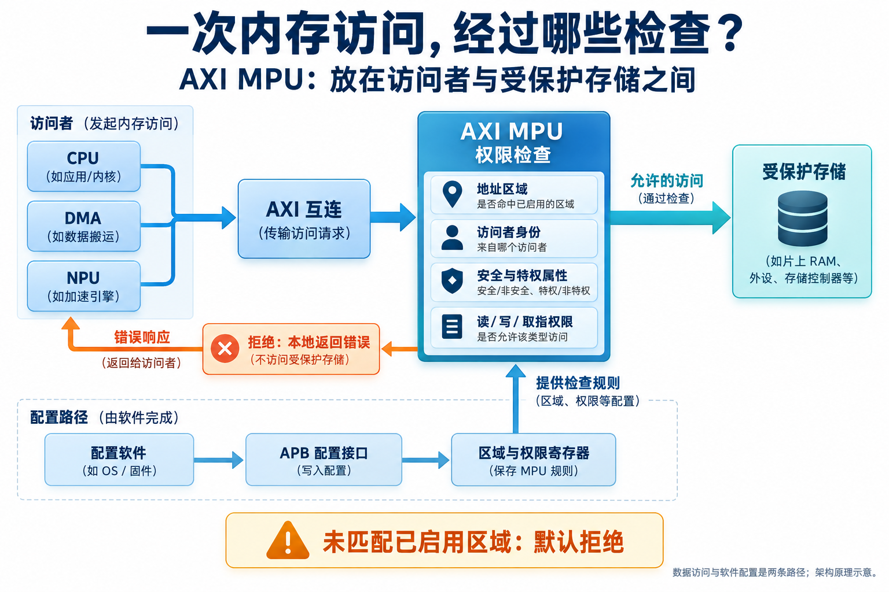
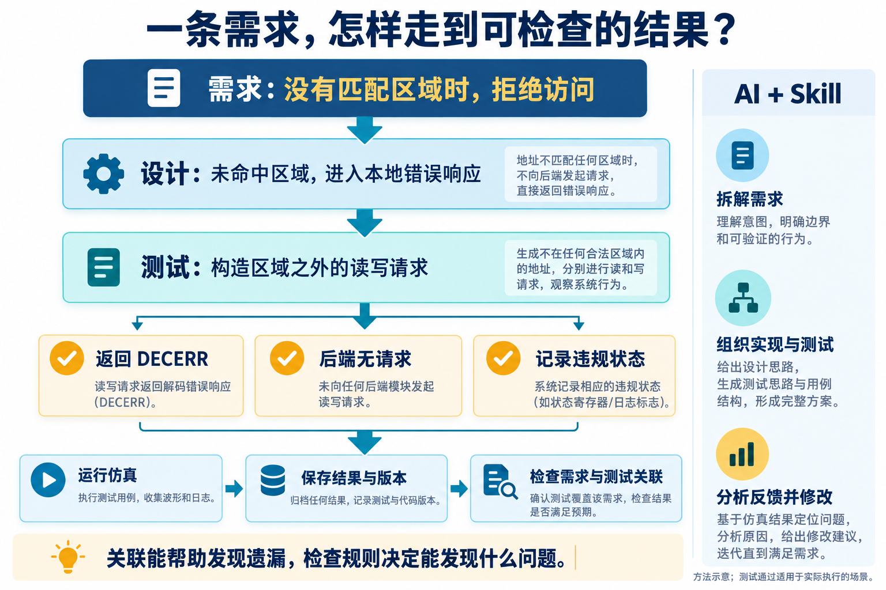
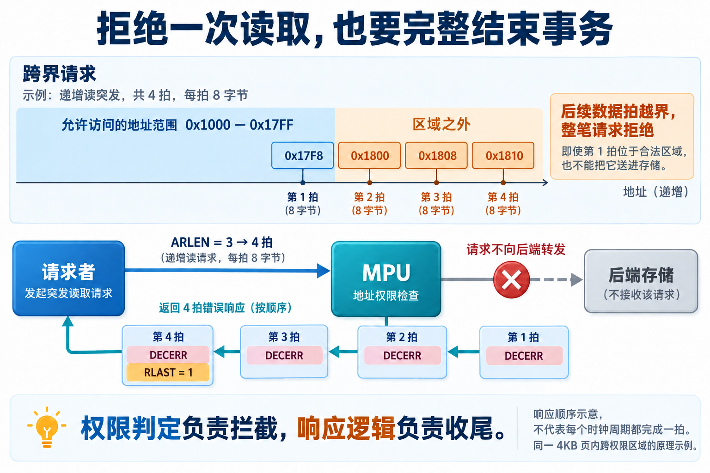
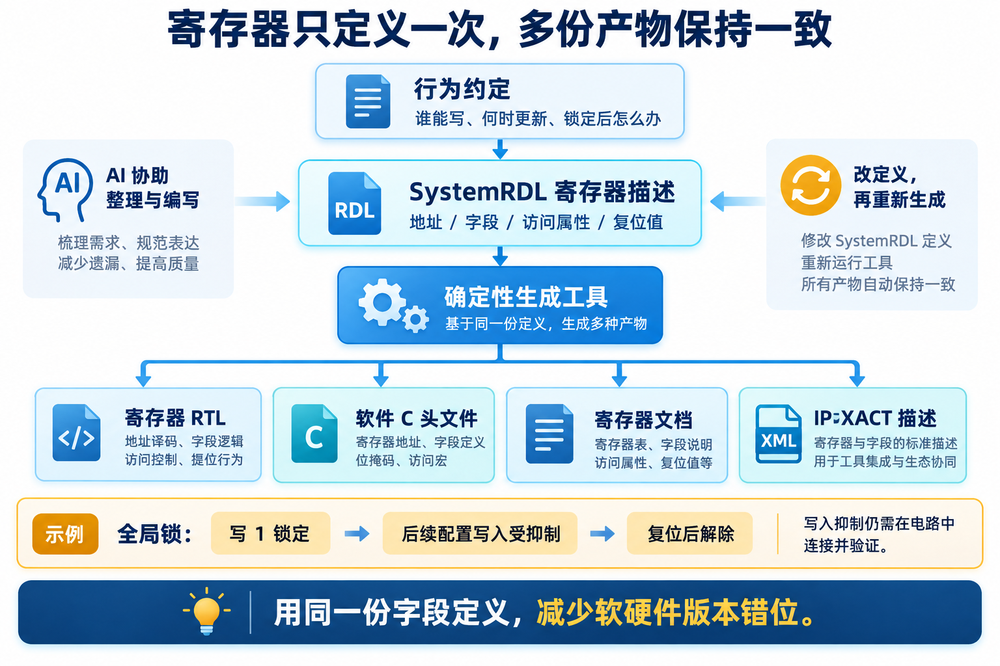

# 给片上内存加一道权限检查：AI 辅助 AXI MPU 研发实践

简体中文 | [English](README.en.md)


一颗芯片里，CPU 在执行程序，DMA 在搬运数据，NPU 在读取计算所需的内容。它们可能共用一片存储，但访问权限并不相同：普通的数据搬运可以读写工作缓冲区，却不应该碰到存放敏感信息的区域。

要把这种区别落实到硬件上，就需要在访问路径中加入权限检查。地址是否在允许范围内、请求来自哪个模块、这次是读还是写，都要在请求抵达存储之前判断。遇到不允许的访问，还要把错误返回给发起方，让系统能够继续运行。

这次，我用一个 AXI 内存保护单元做了 AI 辅助研发实践。围绕这个 IP，AI 参与需求整理、设计细化、电路代码编写、测试组织和综合结果分析；工程师负责明确策略、检查协议语义，以及判断实现和测试是否支撑结论。

这个案例适合观察 AI 怎样进入日常芯片研发：一个不算庞大的模块，会同时牵动总线协议、软件配置、硬件状态和验证规则。下面沿着几处具体设计，看这些工作如何衔接起来。

## 先看清：我们要保护什么

这里的 IP 指可复用的芯片功能模块。MPU 是 Memory Protection Unit，即内存保护单元；AXI 则是芯片内部常用的一种总线协议，规定访问请求、数据和响应如何交换。这个 AXI MPU 位于访问者与受保护存储之间。



*图 1｜架构原理示意。权限检查决定请求是否转发，软件通过独立配置接口设置规则。*

软件先配置若干个 Region，也就是地址区域。每个区域有起止地址，并指定哪些访问者可以读、可以写，以及允许什么安全与特权属性。“安全属性”用于区分 Secure 与 Non-secure 访问；“特权属性”用于区分具有管理权限的访问与普通访问，两者是不同的判断维度。

收到请求后，MPU 根据地址范围选择区域，再检查身份与权限。如果没有匹配的已启用区域，本设计默认拒绝；如果多个区域同时匹配，则按编号从小到大选择。被拒绝的请求由 MPU 本地返回错误，并记录违规信息。

还有一条容易忽略的边界：总线上的属性声明需要与系统赋予访问者的能力一致。例如，一个未被允许发起 Secure 访问的主设备，不能只把请求标为 Secure 就得到放行。本设计为此增加了主设备能力检查，集成时主设备身份也需要由可信的系统连接提供。

这些行为必须在动手写电路前说清楚。否则，“做一个内存保护单元”这句话留下的空白，足以让不同实现得到不同结果。

## 把需求写成 AI 可以沿着执行的工作

这轮工程整理了 71 条需求，涉及地址区域、访问属性、错误处理、配置寄存器和参数约束。它们随后进入架构设计、详细设计与验证计划。

这里使用的 Skill，是交给 AI 的一套工程操作说明：当前阶段读什么、需要产出什么、调用哪些工具，以及怎样检查结果。它让一次宽泛的“帮我设计 IP”，变成一组有输入和完成条件的工作。

例如，“没有匹配区域时默认拒绝”，在架构中对应本地错误响应路径，在测试中对应未配置区域的读写请求。检查结果时，要同时关注返回的错误码、后端是否出现请求，以及违规状态是否被记录。



*图 2｜方法示意。把预期行为展开为可检查的条件，再保存实际执行结果。*

电路实现使用 RTL，也就是寄存器传输级描述：哪些信息要保存，数据何时流动，状态如何变化。AI 可以协助编写这些代码，也可以据需求组织测试。连接需求、设计对象和测试的追踪记录，则帮助工程师发现“写在需求里，却没有对应检查”的遗漏。

这轮记录中，需求到架构、架构到详细设计、详细设计到 RTL、需求到测试这四类关联都没有未链接项。这个结果说明关联关系齐全；检查内容是否准确，仍要看具体用例。下面两个例子，就体现了这种检查为什么重要。

## 一位安全属性，需要从协议读到测试

第一个例子出现在 Secure / Non-secure 属性的解码。

AXI 用 `ARPROT` 和 `AWPROT` 分别携带读、写请求的保护属性，统称 `AxPROT`。其中 `AxPROT[1]` 为 0 表示 Secure，为 1 表示 Non-secure。这个定义来自 [Arm AXI 协议规范的访问权限章节](https://developer.arm.com/-/media/Arm%20Developer%20Community/PDF/IHI0022H_amba_axi_protocol_spec.pdf)。

如果内部信号命名为 `secure`，并约定 1 表示 Secure，就要做一次取反：

```systemverilog
cap_secure <= ~s_axi_arprot[1];  // 读请求的安全属性
```

早期实现直接保存了这一位，内部含义与协议定义相反。评审定位后，读写两条路径都修正了输入属性解码，并增加相应的定向检查。

验证时选择同一地址，改变请求属性与主设备能力：有相应能力的 Secure 请求访问 Secure-only 区域，应允许；Non-secure 请求应拒绝；没有 Secure 能力却声明 Secure 的主设备，也应拒绝。这样才能分清“区域允许什么”和“访问者有资格声明什么”。

这种错误通常不会表现为语法问题。代码可以编译，但它对协议位的解释错了。AI 修复代码之后，工程师需要确认测试依据的是协议定义，而不是把实现中的同一个误解再写进预期结果。

## 拦住请求之后，还要把事务结束好

一次总线事务，是从发起访问到完成响应的整个过程。AXI 支持突发传输（burst）：一笔请求可以包含多个数据拍，每拍传输一段数据。因此，权限检查还需要考虑整笔访问覆盖的范围。

以一个原理示例来看：允许区域为 `0x1000—0x17FF`，请求从 `0x17F8` 开始，递增读取 4 拍，每拍 8 字节。第一拍仍在区域内，后三拍已经越过区域上限。本设计的处理原则是拒绝整笔请求，不能先让第一拍进入后端，再处理后面的越界。



*图 3｜原理示例，所有地址位于同一 4KB 页内。四拍是响应数量，不表示必定四个时钟周期完成。*

请求被拒绝，并不意味着总线交互可以直接停止。发起方仍在等待响应。对图中的四拍读取，MPU 需要返回四拍带 `DECERR` 的错误响应，并在最后一拍给出 `RLAST` 标记。`DECERR` 是 AXI 的一种错误响应编码，本设计用它表示访问被拒绝。`ARLEN = 3` 对应四拍，因为拍数编码为长度字段加一；突发不能提前结束。这些规则可在 [Arm AXI 协议规范的事务结构章节](https://developer.arm.com/-/media/Arm%20Developer%20Community/PDF/IHI0022H_amba_axi_protocol_spec.pdf)中核对。

这轮研发就修正过一个末拍计数问题：计数从 0 开始，四拍对应 0、1、2、3，末拍判断应与计数 3 对齐。早期实现的判断多偏了一拍，导致错误响应数量和退出时机不一致。修正后，将末拍标记与状态退出对齐，并用长度为四拍的错误读取用例检查响应数量，以及后续合法事务能否继续。

写请求还多一层协调：AXI 的写地址和写数据走不同通道。权限在收到地址时判断，但后续数据也要妥善处理。本设计对被拒绝的写事务接收并丢弃其数据，不向后端写入，再返回写错误响应。地址判定的结果必须一直保留到这笔事务结束。

这个过程让“拒绝非法访问”变成了明确的硬件行为：在哪里阻断、怎样响应、何时恢复接收下一笔请求，都有对应的实现和检查。

## 一份寄存器定义，连接硬件与软件

权限规则需要软件设置，违规信息也需要软件读取。这些入口通常是控制与状态寄存器（CSR）：软件通过地址访问某个寄存器，再操作其中的字段。

同一个字段会出现在电路、软件头文件、寄存器文档和验证环境中。地址或位宽改了之后，如果这些材料分别维护，很容易出现软件与硬件使用不同版本定义的情况。

这次使用 SystemRDL 描述寄存器的地址、字段、访问属性和复位值，再由工具生成寄存器 RTL、软件 C 头文件、文档及 IP-XACT 描述。IP-XACT 是一种机器可读的硬件接口与寄存器描述格式，便于其他工具继续使用这些信息。



*图 4｜方法示意。AI 协助整理行为与字段定义，确定性工具生成派生产物；特殊硬件行为仍需连接和验证。*

配置锁是其中一个具体例子。需求说“锁定后不能修改配置”，至少包含两件事：锁本身不能被普通软件写操作解除，配置寄存器也必须实际停止接受写入。

全局锁在 SystemRDL 中定义为写 1 置位、写 0 无效，复位后才清除。与此同时，配置寄存器的写使能要受到锁状态控制。只定义一个名为 `lock` 的字段，电路不会自动理解它要保护哪些其他字段。

早期寄存器结构遗漏了写入抑制，评审后补入相应控制，再重新生成寄存器电路。定向用例执行“配置区域—置锁—尝试改写—读回比较”，并检查向全局锁写 0 不会解锁、复位能够清除锁状态。

在这里，AI 的工作落在行为梳理、描述编写与反馈处理上。工具负责把一份结构定义展开成多份产物，一致性检查再确认它们对应同一个版本。这能减少重复维护，也让修改后的检查范围更明确。

## 用实际执行结果支撑这轮设计

验证按模块到系统逐步展开。最核心的权限引擎先做了 13 项定向检查，覆盖默认拒绝、区域选择、主设备及访问属性等规则；再运行包含配置、合法读写的基础测试，确认环境能够工作，随后执行完整回归。

“回归”就是重新运行一组测试，检查当前设计是否仍符合预期。本项目使用 UVM 组织测试；它是一套常用的 SystemVerilog 验证方法与类库，用于安排激励、检查结果和管理测试环境。

这轮记录可归纳为：

| 检查范围 | 本轮结果 |
| --- | --- |
| 权限引擎模块检查 | 13 项定向检查通过 |
| IP 级回归 | 14 个用例执行，0 失败 |
| 需求与实现、测试关联 | 四类追踪关系无未链接项 |
| 综合探索 | 完成 7 个配置与频率组合的表征 |

仿真使用 VCS W-2024.09-SP1，完整回归记录对应随机种子 1。这些数字描述的是本轮实际检查范围，不能等同于覆盖了所有参数与流量组合。阅读结果时，更有价值的是知道每个用例检查了什么，以及它对应哪条需求。

为便于追溯，工程记录还保存了结果与文件版本的哈希。哈希可以理解为文件指纹，用于核对“这份结果对应哪一版输入”。它帮助管理证据版本，但不会代替对测试质量的判断。

## 综合结果，让集成目标更具体

功能之外，还要考虑电路需要多少面积、能否满足目标频率。综合工具把 RTL 映射成工艺库中的逻辑单元，并给出面积与时序估计。这是 PPA 分析的一部分；PPA 分别指功耗、性能和面积。

以 16 个区域、未启用流水参数的三个点为例：

| 目标频率 | 综合单元面积（µm²） | 时序裕量（ns） |
| --- | ---: | ---: |
| 200 MHz | 22839.9 | 0.00 |
| 400 MHz | 25785.4 | −1.50 |
| 500 MHz | 25650.6 | −2.01 |

时序裕量是要求数据到达的时间减去实际到达时间，负数表示未满足当前时序约束。200 MHz 点的报告值为 0.00 ns，说明这一轮满足约束，但没有可观的额外裕量。综合面积是映射后单元面积的总和，并非最终芯片占地。

这组数据来自 2026 年 9 月 10 日的表征，使用 GF 28nm LP 高阈值电压单元库，典型工艺条件、1.0 V、25°C，Synopsys DC V-2023.12-SP3。三个点采用相同综合选项，输入输出延迟为 0.4 ns、负载为 10 fF，仅目标时钟约束不同。功耗采用默认活动率估计，因此这里不把它展开为实际业务功耗结论。

据此，本轮选用了 16 区域、200 MHz 目标的配置作为后续集成评估依据。提高约束中的频率数值，并不代表电路已经达到那个速度；综合结果帮助工程师明确当前结构适合的目标，以及继续优化时需要投入的位置。

后续可以让 AI 协助探索不同的区域比较、优先级选择和流水划分方式，再逐一验证与综合。这也是生成器值得继续推进的方向：根据配置生成候选结构，并为每个候选保留检查结果。参数化 RTL 本身同样可以改变结构，关键在于结构是否实际发生变化、改变后是否经过验证；本轮完成的是现有实现的配置表征，尚不把后续结构探索计为已经取得的成果。

## 这次协作留下了什么

这个 AXI MPU 案例把 AI 放进了一段连续的研发过程：需求进入设计，设计进入电路和寄存器描述，评审发现的问题回到实现，再由测试和综合工具提供反馈。

其中最值得保留的是那些具体联系。安全属性的定义连接到解码和定向测试；拒绝策略连接到完整错误响应；配置锁连接到寄存器写使能；集成频率连接到综合时序报告。工程师可以顺着这些联系检查 AI 的工作，也可以据此安排下一轮修改。

对 AI 辅助芯片研发而言，这样的组织方式让更多日常工作能够连续推进。工程师仍需要做判断，但手边已经有了可以讨论、检查和比较的设计与结果。
