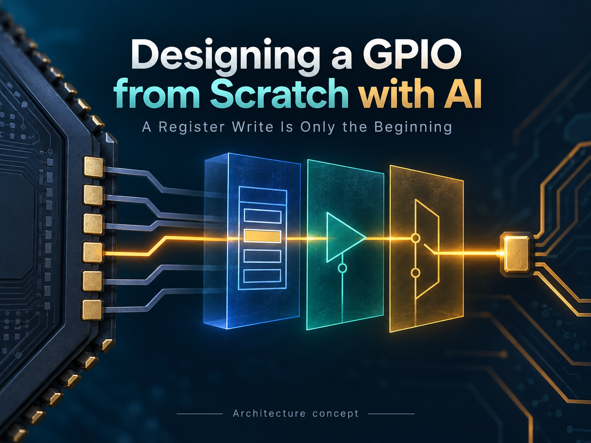
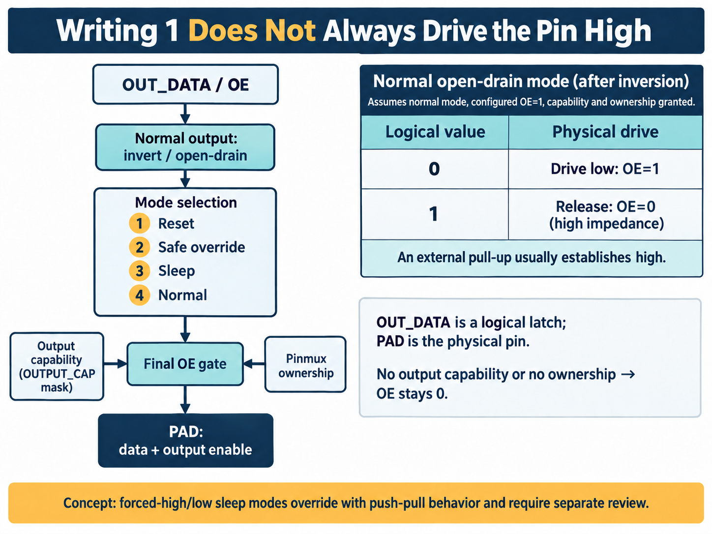
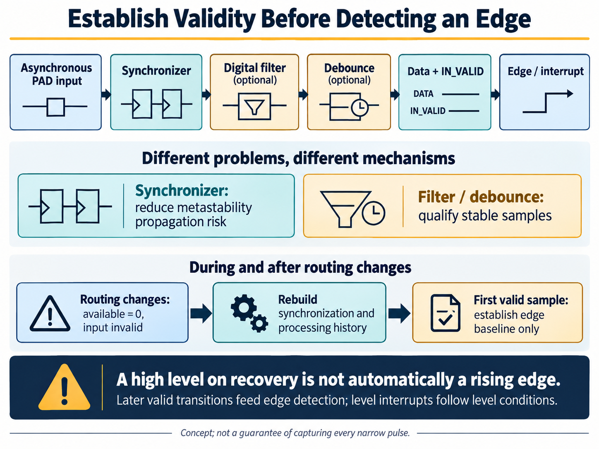

[中文版](README.md)

# Designing a GPIO from Scratch with AI



Write 1 to an output register, then read it back. It still contains 1. Does that mean the external pin must be high?

Not necessarily. Output enable may be off. Another peripheral may own the pin. Or the output may be open-drain, relying on an external pull-up. Software observes a register; the device on the board observes a pin. The path between them needs careful design.

GPIO—general-purpose input/output—is often the first peripheral an engineer encounters: turn on an LED, read a button, receive an alarm, or control an enable signal. Building a reusable IP exposes more questions. Who receives a wake-up signal after the main clock stops? What happens when software clears an interrupt on the same cycle as a new event? If a pin returns from another function and reads high, should that count as a rising edge?

This article follows an AI-assisted GPIO development effort through those decisions, from requirements to RTL, tests, and integration guidance. “From scratch” means starting with a behavioral contract, not rewriting every existing building block. AI helps organize requirements, partition the architecture, develop implementation and verification material, and revise them using tool feedback. Engineers set system boundaries and judge whether the evidence supports the result.

## Define what a pin actually means

The design uses APB4, a bus suited to control operations such as peripheral register reads and writes. It supports 1–128 GPIOs, organized for software in banks of up to 32 pins, together with interrupts, input filtering, sleep output policies, and always-on wake-up functions.

Ask AI only to “implement a configurable GPIO,” and it may produce a convincing register block while leaving critical integration behavior implicit.

The requirements therefore distinguish three objects. **Registers hold software's intent. GPIO digital logic applies control rules. PAD cells provide the electrical interface to the outside world.** A pin multiplexer, or Pinmux, selects whether a physical pin belongs to GPIO, a serial interface, or another function. Setting an output-enable bit must not override that ownership decision.

Two interface signals make the distinction explicit: `input_available` tells GPIO whether the input route is valid, while `output_owned` tells it whether it has output control. Per-pin input and output capability masks further define which operations are supported.

AI can help turn these statements into detailed rules. “Do not drive a pin we do not own” must hold during normal operation, reset, sleep, and safe override, and must map to both implementation and tests. The project organized the design into 258 requirements and 12 modules. Those counts describe the level of decomposition; quality still depends on consistent rules and evidence that they are satisfied.

## Output: stored intent versus physical drive

A conventional push-pull output actively drives high or low. An open-drain output can pull low or release the pin. Release means high impedance; an external pull-up usually establishes the high level.

In this GPIO's normal output mode, the data passes through optional inversion before open-drain control determines the output data and OE—output enable. Assuming configured OE is 1 and both capability and ownership permit output, a post-inversion value of 0 drives low in open-drain mode. A value of 1 disables OE and releases the pin. A simple assignment such as `gpio_out = OUT_DATA` would miss that behavior.

System state can override normal output. The defined priority is reset, then safe override, then sleep, then normal operation. Safe override means selecting a predefined output state; the mechanism alone does not establish functional safety certification.

After mode selection, every path passes through the same final output-enable gate:

```text
PAD_OE = selected_OE & OUTPUT_CAP & output_owned
```

Even during reset or safe override, final OE remains 0 if the pin lacks output capability or GPIO does not own it. Placing this rule at the common output makes review easier: ownership cannot be accidentally omitted from one mode branch.



*Concept illustration. The open-drain table assumes normal mode, configured OE=1, and output capability and ownership granted. Digital PAD interface control does not replace electrical checks for voltage, loading, or pull-ups.*

Sleep behavior also needs its own contract. This implementation supports hold, forced low, forced high, and high impedance. Forced high and low use push-pull overrides. For a board signal that relies on open-drain operation, selecting “force high in sleep” without reviewing the connection would be a mistake. Hold or high impedance may be appropriate, depending on the system requirements.

These details are useful work for AI to expand, provided engineers define the priorities and interface boundaries first. AI can then implement the modes and develop scenarios for mode changes, ownership withdrawal, and overlapping reset conditions.

## Input: establish validity before detecting edges

The input side presents a different problem. External signals are not necessarily synchronous to the main clock, and mechanical contacts may bounce repeatedly during one action. Synchronizers, filters, and debounce logic serve different purposes.

A synchronizer uses multiple register stages to reduce the risk of metastability propagating into downstream logic; this design supports 2–4 stages. The digital filter requires a candidate value to persist for enough consecutive samples. Debounce logic combines stable-sample qualification with a sampling interval for slower signals. These mechanisms introduce waiting, and they do not guarantee capture of every narrow pulse.

Two definitions are particularly susceptible to off-by-one mistakes in generated code. Filter and debounce threshold registers store the actual threshold minus one: 0 means one sample, and 255 means 256 samples. The debounce divider `DIV` produces one sample every `DIV + 1` main-clock cycles. Keeping those definitions consistent across requirements, RTL, and expected test results is more useful than guessing from a waveform when a counter starts.

There is also a more fundamental distinction: **a readable value is not necessarily a valid value.**

When Pinmux removes an input route, `input_available` goes low and the input becomes invalid. After the route returns, synchronization and processing history must be rebuilt. If the first valid sample is high, comparing it against a placeholder zero from the invalid interval would invent a rising edge.

The design therefore uses the first valid sample only to establish an edge-detection baseline. Subsequent valid transitions feed edge detection. Level interrupts still follow their own level conditions. Software reading processed input must also check `IN_VALID`: a zero returned while invalid does not prove that the external pin is low.



*Concept illustration. Synchronization, stable-sample qualification, and edge detection have separate responsibilities. A high level on route recovery does not automatically become a rising edge.*

Interrupt clearing needs an explicit concurrency rule as well. Software commonly uses W1C—write one to clear—to acknowledge status. If a new event arrives on that same cycle, this design preserves the new event. For a level-triggered interrupt, an active external level can cause the status to assert again after clearing; the driver must not automatically interpret that as a failed clear.

The priority can be expressed as a state-update rule. Omitting test injection:

```text
pending_next = (pending & ~software_clear) | hardware_event
irq_to_cpu   = pending & IRQ_ENABLE
```

If software clears an old event while a new edge arrives, `hardware_event` still leaves pending set for the next cycle. Giving the clear operation priority could lose the new event. Tests derived from this rule need the combination of an existing pending bit, a software clear, and a simultaneous new event—not just separate tests of setting and clearing.

`IRQ_DETECT_EN` controls event detection, while `IRQ_ENABLE` controls whether pending status is reported. Disabling only the latter allows detection and pending accumulation to continue; re-enabling it may immediately assert an interrupt for an earlier event. Software can therefore mask notification while retaining status, but “disable interrupts” must specify which layer it means. Per-pin interrupts are then reduced into their configured groups for the processor interface.

## Generated registers still need a precise update point

Registers are a natural application for AI assistance. It can organize fields, access permissions, and reset values, then use a description file to generate CSR—control and status register—logic. This removes repetitive work, but the generated front end still needs verification together with its bus adapter.

The engineering record contains a concrete fix. In a regression scenario with an extended APB Setup phase, the register front end responded too early, causing a later byte write in the Access phase to be lost.

The relevant distinction is between APB's two phases: Setup prepares address and control information; Access performs the transfer. Peripheral selection alone cannot mean that a register write has completed. In this design, a normal functional write must wait for an Access handshake with no access error.

The fix changed the CSR interface to native passthrough. The outer adapter issues the request only during Access, when `PSEL && PENABLE` is true, avoiding conflicting interpretations of transaction timing between front ends. APB4's `PSTRB` byte enables also expand into a register bit mask so only selected bytes change. Permission, capability, and lock checks occur before committing the write.

For an ordinary read/write register, the adapter forms a candidate value before deciding whether to commit:

```text
candidate = (old_value & ~write_mask) | (write_data & write_mask)
commit    = PSEL & PENABLE & PREADY & ~PSLVERR
```

For example, `PSTRB=0001` selects only the low eight bits. Validation must consider the bytes actually written and the relevant fields after merging, rather than treating irrelevant data in other bus lanes as invalid configuration. If a write covers both locked and unlocked implemented fields, the entire functional write is rejected instead of leaving a partially updated state. Error diagnostics may still change.

Command registers have different semantics: this design requires full byte strobes for command and MASKED-class writes, including writes of zero. They cannot simply inherit ordinary partial-write behavior. A register specification supplied to AI therefore needs access classes, byte-write policies, lock scope, and error side effects in addition to addresses, widths, and reset values.

This example says more about AI-assisted development than a count of generated RTL lines. Requirements define the update point, a test exposes disagreement, diagnosis identifies the boundary between the bus and generated CSR logic, and the adapter is revised and tested again. A specific failing scenario and a clear rule give AI a basis for correction. Successful compilation cannot establish that a register changes on the correct cycle.

## From modules to IP: reuse and clock boundaries

An existing module is not automatically the right module. The event FIFO provides a useful example. A FIFO—first-in, first-out queue—buffers input events for software or downstream logic.

The candidate general-purpose FIFO rejects a push when full, even if an old item is popped in the same cycle. The GPIO event queue requires a full queue to accept a new event when a simultaneous POP frees space, and it also requires defined FLUSH behavior. Those differences affect whether events are lost. Reuse review therefore went beyond port count and data width: a queue with GPIO-specific semantics was implemented, while an existing parity generation/checking module could be reused under its interface contract.

AI should compare behavior before choosing reuse, adaptation, or implementation. Matching module names do not establish matching concurrency semantics.

The event queue also makes an explicit throughput trade-off. The implementation accepts at most one record per cycle. A tree selects the lowest-numbered eligible pin event while counting all candidates that cycle; events not enqueued contribute to the loss count. Increasing FIFO depth can absorb a backlog across cycles, but cannot resolve multiple events arriving in the same cycle. That requires evaluating architectures such as multiple writes, aggregated records, or upstream buffering.

The boundary cases show why an ordinary FIFO may not be sufficient:

| Events in the same cycle | Behavior in this design |
| --- | --- |
| Full queue, POP, and a new event | Remove the old head and allow one new record |
| Empty queue, POP, and a new event | Ignore POP and retain the new record |
| FLUSH and new events | Clear the old queue and count current candidates as lost |
| Multiple candidate events | Accept at most one and count the remainder as lost |

Each event record is 128 bits and includes a pin number, edge direction, and timestamp. Software reads it through four 32-bit HEAD registers; those reads do not remove the record. POP follows the complete read, preventing the first word read from advancing to a different record. The integration still needs a controlled consumer: another thread must not POP or FLUSH between the four reads. The loss counter saturates at its maximum rather than wrapping a large loss count into an apparently small number.

Another boundary lies between the main clock domain and AON—the always-on domain. Wake-up detection may need to continue after the main clock stops, so input handling cannot all depend on that clock. Software stages wake-up configuration and transfers it to AON through a commit handshake. An APB write completing is not enough to show that the remote configuration has taken effect; software must observe completion status.

The transaction contract includes a subtle rule: a timeout does not cancel the remote transaction. A late acknowledgment must still be handled before the interface is reused, or a later transaction could mistake an old response for its own. Making this explicit gives AI enough information to develop the sender, receiver, and timeout tests, rather than merely connecting synchronization registers.

The implementation uses a mailbox with one outstanding request. When the main domain accepts a command, it latches the complete configuration and toggles a request token. That token passes through a two-stage synchronizer into AON, where the receiver recognizes the change and processes the held data. AON saves the response and returns an acknowledgment token; the main domain synchronizes that acknowledgment before releasing the transaction slot.

This transfers a multi-bit configuration by holding data stable while synchronizing control. Independently adding two registers to every configuration bit would not automatically produce a coherent snapshot. Implementation and integration must still satisfy data-stability windows and clock-domain crossing constraints. A timeout does not immediately release the slot. A main-domain warm reset also preserves the transport request token and outstanding-request state, allowing recovery to drain the old acknowledgment. Tests developed with AI should consider a slow AON clock, late acknowledgments, and warm reset during an active request together.

Sleep and clock-stop behavior do not establish power-off retention. Before removing power, the system must arrange PAD takeover, isolation, and retention where needed. The wake-up path must also avoid a main domain that has already lost power. These are integration obligations for the chip.

## Use tests and synthesis to judge the result

The AI-assisted effort produced requirements, architecture, RTL, module tests, system regressions, synthesis reports, and hardware/software guidance. These outputs must agree: do boundary conditions in the requirements appear in tests, what changed after a failure, and which configuration was synthesized?

Archived execution records show 13 passing module unit tests; 14 dynamic tests run with three random seeds each, for 42 passing runs; and one passing static test. Parameter checks covered seven configurations in eight executions. These passes apply to the scenarios that ran. They do not establish completion of every parameter combination or coverage target, and agreement between AI-generated implementation and tests is not by itself independent proof.

Synthesis answers a different question: what does this control behavior cost in hardware? PPA means power, performance, and area. More GPIO pins bring more input processing, output control, and state, so cost cannot be estimated simply by counting external wires.

The microarchitecture makes corresponding cost choices. Each bank shares a debounce sampling tick while individual pins retain their own stability state, reducing duplicated divider logic. Interrupt reduction and event selection use tree structures rather than long serial decision chains. Configurable hardware features are handled statically when generating the design instead of relying solely on software to disable them. These choices address replicated resources, combinational paths, and unnecessary logic; their benefit still needs synthesis of the actual configuration rather than assumptions based on RTL style.

The same flow produced these synthesized areas for three width configurations:

| GPIO count | Synthesized area (µm²) |
| --- | ---: |
| 8 | 15,252.003 |
| 32 | 41,078.700 |
| 128 | 127,828.933 |

The results use Design Compiler V-2023.12-SP3 with `compile_ultra`, the GF28nm SC9 HVT standard-cell library, and a TT corner at 1.0 V and 25°C. The main-clock constraint is 100 MHz and the AON clock is 10 MHz. These are synthesis estimates, not placed-and-routed results with routing parasitics or silicon measurements.

The three points show area cost at different capacities. An eight-pin configuration being smaller than a 128-pin configuration is not an equivalent-function optimization. A useful next step is to have AI organize candidate configurations that meet actual pin-count and feature requirements, compare them under common constraints, and explain which resources account for the differences. Without such evidence, an “AI optimization percentage” would be misleading.

The flow also corrected report parsing: timing needed the worst slack across the relevant clocks, and power needed the top-level totals. AI-assisted work extends to these scripts, which deserve review too. Incorrect measurements can steer the next design decision in the wrong direction.

## Finish with a design someone else can integrate

Delivering GPIO requires more than RTL. Integrators need to know which inputs are asynchronous PAD signals and which ownership and route-status signals the system must supply synchronously. Drivers need a defined configuration order and a way to tell when input data can be trusted.

For output initialization, a clear sequence follows directly from the design: discover actual capabilities and confirm GPIO ownership; disable OE; configure inversion, open-drain behavior, and sleep policy; write the intended output value; then enable OE. During operation, `OUT_SET`, `OUT_CLR`, and `OUT_TOGGLE` provide atomic updates that avoid unprotected read-modify-write sequences overwriting another execution context's changes.

AI can turn these rules into driver examples, checklists, and tests. Engineers still need to check that the software-visible state, RTL action, and eventual pin control agree.

GPIO logic is not mysterious. The challenge is defining its boundaries and preserving those definitions through implementation. In this example, AI contributes by carrying related work forward: turning vague requirements into behavior, mapping behavior to modules, bringing failing scenarios back into the implementation, and using test and synthesis results to assess the choices.

The next time someone asks why writing 1 did not drive a pin high, the answer can follow a concrete path: register state, mode selection, output enable, ownership, and the PAD interface. Each step has a rule that can be checked.
