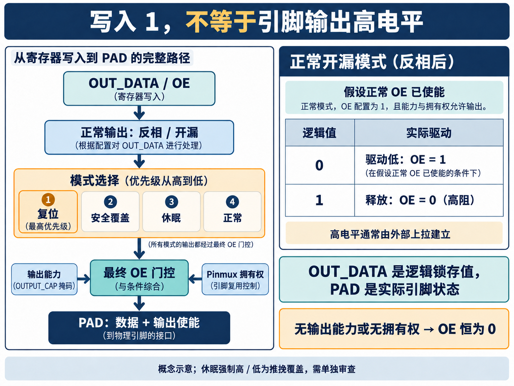
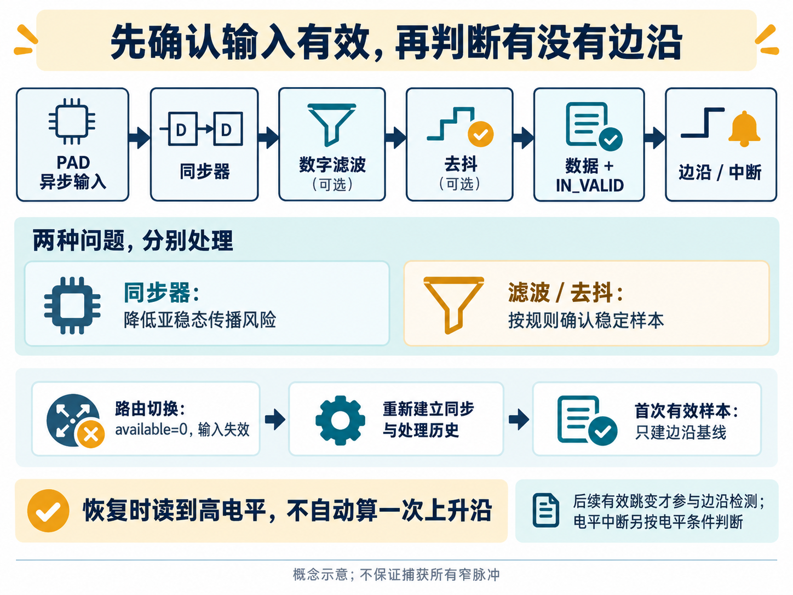

[English](README.en.md)

# 用 AI 从头开始设计一款 GPIO


给输出寄存器写入 1，再读回来，值也是 1。外面的引脚就一定是高电平吗？

未必。输出使能可能还没打开，引脚可能已经交给另一个外设，也可能工作在开漏模式，正在等待外部上拉。软件看到的是寄存器，板子上的器件感受到的是引脚，两者之间还有一段需要认真设计的路。

GPIO，也就是通用输入输出接口，常被当作最容易上手的外设：点灯、读按键、接收告警、控制使能。但当我们准备把它做成一款可集成的 IP，问题很快会变多：主时钟停了，谁来接收唤醒？软件清中断的同一拍又来了新事件，该留下哪一个？一个引脚刚从其他功能切回来，读到高电平，算不算上升沿？

这篇文章沿着一次 AI 辅助 GPIO 研发实践，讲清这些选择怎样进入需求、RTL、测试和集成说明。这里的“从头开始”，指从行为约定开始建立设计，而不是把所有模块重新写一遍。AI 参与整理需求、拆分架构、生成实现与验证材料，再根据工具反馈修正；工程师负责确定系统边界和判断证据是否足够。

## 先把“一个引脚”说清楚

这次设计采用 APB4 总线接口。APB 是处理器访问片上外设的一种总线，适合寄存器读写这类控制操作。GPIO 数量可配置为 1～128 个，软件按每组最多 32 个引脚访问；此外还有中断、输入滤波、休眠输出和常开域唤醒等能力。

如果给 AI 的任务只有“实现一个可配置 GPIO”，它很容易交付一套看起来完整的寄存器和读写逻辑，却把系统最关心的细节留给集成人员猜。

因此，需求阶段先要明确三个不同的对象。**寄存器保存软件的意图，GPIO 数字逻辑执行控制规则，PAD 单元负责与芯片外部电气连接。** 引脚复用器 Pinmux 决定某个物理引脚此刻由 GPIO、串口还是其他功能使用。GPIO 不能因为软件写了输出使能，就越过这个决定。

这个区分落实为两类接口信息：`input_available` 表示当前输入路由是否有效，`output_owned` 表示 GPIO 是否拥有输出控制权。再加上每个引脚是否支持输入、输出的能力掩码，设计才知道哪些动作可以执行。

AI 在这里适合承担细化工作：把“引脚不归我时不能驱动”继续展开成正常、复位、休眠和安全覆盖等模式下都必须满足的规则，再把规则对应到模块与测试。该项目最终整理出 258 条需求、12 个模块；这些数量说明了拆分粒度，设计质量仍要看规则之间是否一致，以及是否真正得到验证。

## 输出路径：写了什么，和真正驱动什么

最普通的推挽输出会主动驱动高或低电平。开漏输出则不同：它可以拉低，也可以释放引脚；释放意味着高阻态，高电平通常由外部上拉建立。

在这款 GPIO 的正常输出模式下，数据先经过可选反相，再根据开漏配置决定数据和输出使能。如果配置的 OE（Output Enable，输出使能）为 1，且输出能力、拥有权都允许，那么反相后的逻辑值为 0 时，开漏驱动低；为 1 时，OE 被关闭，引脚释放。把这个行为简单写成 `gpio_out = OUT_DATA`，就已经漏掉了关键语义。

输出还可能被系统状态覆盖。这里确定的优先级是：复位高于安全覆盖，高于休眠，高于正常输出。“安全覆盖”指进入预先配置的输出状态，不意味着单靠这个机制就获得了功能安全认证。

模式选定之后，所有路径还要经过最后一道输出使能门控：

```text
PAD_OE = selected_OE & OUTPUT_CAP & output_owned
```

这意味着，即使进入复位或安全覆盖，只要引脚不支持输出，或者控制权不在 GPIO 手里，最终 OE 仍然为 0。规则放在共同出口，审查时就不必逐个寻找某条模式分支是否漏了拥有权判断。



*概念示意。右侧开漏表假设正常模式、OE 配置为 1，且能力与拥有权允许输出。图中的 PAD 接口控制不能替代电压、负载和上拉等电气检查。*

休眠策略也需要单独定义。这次实现支持保持、强制低、强制高和高阻；其中强制高、低是推挽覆盖。如果板上连的是需要开漏协作的信号，不能看到“休眠强制高”就直接使用，通常应根据系统需求选择保持或高阻，并审查整个连接关系。

这些都是很适合交给 AI 展开、却不适合让它自行猜测的设计细节。工程师先定优先级和接口边界，AI 再据此实现各模式，并生成模式切换、拥有权撤回、复位重叠等测试场景。

## 输入路径：先确认有效，再判断边沿

输入端的难点换了一种形式。芯片外部的信号不一定和主时钟同步，机械按键还可能在一次动作中反复抖动。同步器、滤波器和去抖逻辑处理的是不同问题。

同步器用多级寄存器降低亚稳态传播到后续逻辑的风险，本设计支持 2～4 级。数字滤波要求候选值连续保持足够的样本数；去抖则结合采样间隔，判断较慢的信号是否已经稳定。它们会引入等待，也不保证捕获所有窄脉冲。

这里有两个容易在代码生成时被“差一”弄错的定义：滤波与去抖阈值寄存器存的是“实际阈值减 1”，配置 0 表示确认 1 个样本，255 表示 256 个样本；去抖分频值 `DIV` 对应每隔 `DIV + 1` 个主时钟周期采样一次。把这些规则同时写入需求、实现和测试预期，比事后对着波形猜计数器何时起步有效得多。

还有一个比计数更重要的问题：**读到一个值，不代表这个值已经有效。**

例如，Pinmux 切走输入路由时，`input_available` 变为 0，GPIO 应使输入失效；恢复后，需要重新建立同步和处理历史。如果恢复时第一个有效样本恰好为高，不能拿它与失效期间输出的占位 0 比较，凭空报一次上升沿。

这次设计让首次有效样本只建立边沿检测基线，后续有效跳变才参与边沿判断。电平中断仍按自己的电平条件工作。软件读取处理后的输入时，也需要结合 `IN_VALID`：无效状态下返回的 0，不能解释为外部引脚确实为低。



*概念示意。同步处理、稳定样本确认和边沿检测各有职责；路由恢复时的高电平不会自动成为一次上升沿。*

中断清除同样需要明确并发行为。软件常用 W1C，也就是“写 1 清除”，清掉已经处理的状态；如果同一拍又出现新事件，这次设计让新事件优先保留。对于电平触发，如果外部有效电平一直存在，清除后再次置位是合理行为，驱动程序不能把它误判为清除失败。

这个优先级可以用一条状态更新规则表达。省略测试注入后：

```text
pending_next = (pending & ~software_clear) | hardware_event
irq_to_cpu   = pending & IRQ_ENABLE
```

假设软件正在清除旧事件，同时又来了一个新边沿，右侧的 `hardware_event` 仍会让下一拍 pending 保持为 1。若把清除写成优先分支，新事件就可能消失。让 AI 根据这条规则补测试时，必须覆盖“已有 pending、软件清除、新事件同拍”的组合，不能只分别测试置位与清除。

此外，`IRQ_DETECT_EN` 控制是否检测事件，`IRQ_ENABLE` 控制是否把 pending 上报出去。只关闭后者，检测仍可继续、pending 仍可积累；重新打开时，历史事件可能立刻拉起中断。这使软件能够暂时屏蔽通知而保留状态，也意味着“关闭中断”必须说明关闭的是哪一层。各引脚产生的中断再按配置分组归约，送给处理器侧。

## AI 生成了寄存器，仍要核对“哪一拍生效”

寄存器是 AI 很容易发挥作用的地方：整理字段、访问权限、复位值，再利用描述文件生成 CSR（控制与状态寄存器）逻辑，可以减少大量重复劳动。但生成出来的前端，仍要与外围总线适配逻辑一起验证。

这次工程记录中有一个实际修复：在拉长 APB Setup 阶段的回归场景下，寄存器前端过早响应，后续 Access 阶段的字节写入出现丢失。

理解这个问题，只需要抓住 APB 的两个阶段：Setup 准备地址和控制信息，Access 才进行访问。不能只看到外设被选中，就把寄存器写入当作已经完成。该设计中，正常业务写入需要等到 Access 握手成立且没有访问错误。

修复时，CSR 改为原生透传接口，由外层适配器仅在 `PSEL && PENABLE` 对应的 Access 阶段发出请求，避免两个前端对事务时点的理解不一致。与此同时，APB4 的 `PSTRB` 字节使能要展开成寄存器位掩码：只更新被选中的字节，并在提交之前完成权限、能力与锁定条件检查。

具体到一次普通读写寄存器的写入，适配器先形成候选值，再决定是否提交：

```text
candidate = (old_value & ~write_mask) | (write_data & write_mask)
commit    = PSEL & PENABLE & PREADY & ~PSLVERR
```

例如 `PSTRB=0001` 只选择低 8 位。检查应围绕实际被写入的字节及合并后的相关字段展开，不能把总线其他字节上的无关数据当成非法配置；若这次写入同时覆盖锁定和未锁定的有效字段，则整笔业务写入被拒绝，不能留下“改了一半”的状态。错误诊断本身仍可以更新。

命令寄存器又是另一类语义：这次设计要求命令及 MASKED 类写入使用完整字节使能，包括写零的情况。它们不能机械套用普通数据寄存器的部分写规则。因此，给 AI 的寄存器表除了地址、位宽和复位值，还需要访问类别、字节写策略、锁定范围及出错时的副作用。

这个例子比“AI 一次生成了多少行 RTL”更能说明研发过程。需求给出更新时点，测试暴露不一致，问题定位到总线与生成 CSR 的边界，再修改适配方式并回归。AI 有了明确的失败场景和规则，才有依据继续修正；代码能编译，并不能回答寄存器是否在正确的那一拍变化。

## 从单模块到 IP：复用与跨时钟也要有约定

设计里已有通用模块，是不是直接拿来就行？事件 FIFO 给出了一个具体的取舍。FIFO 是先进先出的缓冲队列，这里用于暂存输入事件，供软件或后续逻辑处理。

候选通用 FIFO 在满状态下拒绝新写入，即使同一拍也在弹出旧数据；GPIO 的事件队列则要求“满队列同时 POP 时允许接收新事件”，还需要明确的 FLUSH 清空行为。这两个差异足以改变是否丢事件的判断。因此，复用审查没有停在端口数量和数据宽度，而是选择实现满足 GPIO 语义的队列。已有的奇偶校验模块则可按其接口约定复用。

对 AI 来说，这类工作应当是先比较行为，再决定复用、适配或实现。模块名字相同，不能替代并发语义的一致。

事件队列本身也有明确的吞吐取舍。当前实现每拍最多写入一条记录，通过树形选择逻辑选取编号最小的有效事件，同时统计该拍候选事件总数。其余未入队事件计入丢失计数。因此，增加 FIFO 深度可以吸收连续积压，却不能解决多个引脚在同一拍同时产生事件的问题；后者需要评估多写入、聚合记录或上游缓冲等不同架构，不能靠加深队列替代。

把边界情形列出来，读者也能看出为何一个普通 FIFO 未必够用：

| 同一拍发生的情况 | 本设计的处理 |
| --- | --- |
| 队列已满，同时 POP 和新事件到达 | 弹出旧队首，允许写入一条新记录 |
| 队列为空，同时 POP 和新事件到达 | POP 不生效，新记录留在队列中 |
| FLUSH 与新事件同时到达 | 清空旧队列，当拍候选事件计为丢失 |
| 多个候选事件同时到达 | 最多收下一条，其余计为丢失 |

每条事件记录为 128 位，包含引脚编号、边沿方向和时间戳。软件分四个 32 位 HEAD 寄存器读取，读取本身不弹出记录，读完才执行 POP。这避免了“读第一个字就换到下一条”的错位；使用时仍需保证只有受控的消费者推进队首，不能让另一个线程在四次读取之间 POP 或 FLUSH。丢失计数采用饱和累加，到最大值后保持，不通过回绕把大量丢失伪装成一个小数字。

另一个边界是主时钟与 AON（Always-On，常开）时钟域。主时钟停下之后，唤醒检测仍可能需要工作，因此不能把所有输入处理都绑在主域。软件先暂存唤醒配置，再通过提交握手交给 AON 域；配置是否已经生效，要看完成状态，不能只看 APB 写入成功。

这里还规定了一个细节：提交超时不等于远端事务取消。迟到的确认仍需处理，才能避免后续事务把旧确认认作自己的结果。把这个约定写清楚，AI 才能同时生成发送端、接收端和超时测试，而不只是拼接几个同步寄存器。

实现采用一次只允许一笔在途请求的 mailbox。主域接受命令时锁存整份配置，并翻转一个请求标记；请求标记经过两级同步到 AON 域，接收端识别标记变化后处理保持稳定的数据。处理结束，AON 保存响应并返回确认标记，主域同步确认后才释放事务槽。

这种做法依靠“数据保持稳定、控制标记跨域同步”完成多位配置交接，不能理解为给配置的每一位各加两拍，就能自动获得一致快照。实现与集成仍需满足数据稳定窗口和跨时钟约束。超时后事务槽不会立即开放；主域暖复位也不直接清掉传输用的请求标记与在途状态，而是进入恢复过程，等待旧确认排空。AI 编写测试时，应把慢 AON 时钟、迟到确认、请求处理中暖复位放在一起考虑。

这套设计的休眠与停钟行为，也不能直接解释为断电保持。真正关闭电源前，系统还需要处理 PAD 接管、隔离和保持，唤醒路径也不能经过已经断电的主域。这属于芯片集成需要兑现的条件。

## 用测试和综合，把“写完了”变成可判断的结果

这轮 AI 辅助工作的产物包括需求、架构、RTL、模块测试、系统回归、综合报告和软硬件使用说明。它们之间要能相互核对：需求描述的边界场景是否进入测试，测试失败后修改了哪里，综合使用的是哪种配置。

已归档的执行记录显示，13 项模块单元测试通过；14 个动态测试各运行 3 个随机种子，共 42 次运行通过，另有 1 项静态测试通过；参数化检查覆盖了 7 种配置、8 次执行。这里的“通过”对应这些已执行场景，不等于所有参数组合或全部覆盖目标已经完成，也不能仅凭 AI 生成的实现与测试一致就认定得到独立证明。

综合则回答另一个问题：加入这些控制行为之后，电路的成本如何变化？PPA 指功耗、性能和面积。对于 GPIO，增加引脚数会同时增加输入处理、输出控制和状态资源，不能只按外部信号线的数量估计成本。

微架构里也有对应的成本选择：每个 Bank 共享去抖采样节拍，每个引脚保留自己的稳定性判断状态，减少重复的分频逻辑；中断和事件选择采用树形组织，避免把大量引脚串成过长的优先判断链；可裁剪功能在生成硬件时静态处理，而不是只靠软件关闭。它们分别针对重复资源、组合路径和无用逻辑，但是否带来预期收益，仍需对实际配置综合，不能只凭 RTL 写法判断。

下面是同一轮流程中三个宽度配置的综合面积：

| GPIO 数量 | 综合面积（µm²） |
| --- | ---: |
| 8 | 15,252.003 |
| 32 | 41,078.700 |
| 128 | 127,828.933 |

这些数据来自 Design Compiler V-2023.12-SP3 的 `compile_ultra`，使用 GF28nm SC9 HVT 标准单元库，TT、1.0 V、25°C 条件，主时钟约束为 100 MHz，AON 时钟为 10 MHz。它们是综合估计，不是包含布线寄生参数的版图结果，更不是硅片实测。

三个点展示了不同规模配置的面积成本，不能把 8 路比 128 路小，写成一次等功能优化。更有价值的下一步，是在满足实际引脚数和功能需求的前提下，让 AI 整理候选配置、执行相同约束下的对比，并解释变化由哪些资源带来。没有这样的同条件证据，就不应给出“AI 优化了多少”的百分比。

这次流程还修正过报告解析方式：时序取所有相关时钟中的最差余量，功耗读取顶层汇总。AI 能参与的不只有 RTL，报告脚本也需要审查，否则错误的数字会把后续设计引向错误方向。

## 最后一步，是让别人能把它接进芯片

GPIO 的交付不止一份 RTL。集成人员需要知道哪些输入是异步 PAD 信号，哪些拥有权和路由状态应由系统同步提供；驱动程序需要知道先配置什么，什么时候可以相信读回的数据。

以输出初始化为例，一条清楚的使用路径是：先读取实际能力，确认引脚归 GPIO 控制；关闭 OE，配置反相、开漏和休眠策略；写好输出值，再打开 OE。运行中修改一部分输出时，优先使用 `OUT_SET`、`OUT_CLR`、`OUT_TOGGLE` 这样的原子操作，避免多个执行上下文用未保护的“读—改—写”互相覆盖。

这些步骤能从前面的设计规则自然推导出来。AI 可以帮助把规则转成驱动示例、检查表和测试，但工程师仍要检查软件看到的状态、RTL 执行的动作，以及引脚最终受到的控制是否一致。

一款 GPIO 的逻辑并不神秘，难的是把每个边界讲清楚并坚持到实现。这个案例中，AI 的价值体现在持续处理这些相互关联的工作：把含糊需求拆成行为，把行为落实到模块，把失败场景带回实现，再用测试和综合结果校验选择。

当我们再次问“写入 1，引脚为什么没有变高”，答案就不必停留在猜测。它可以沿着寄存器、模式、输出使能、拥有权和 PAD 接口，一层一层查清楚。
