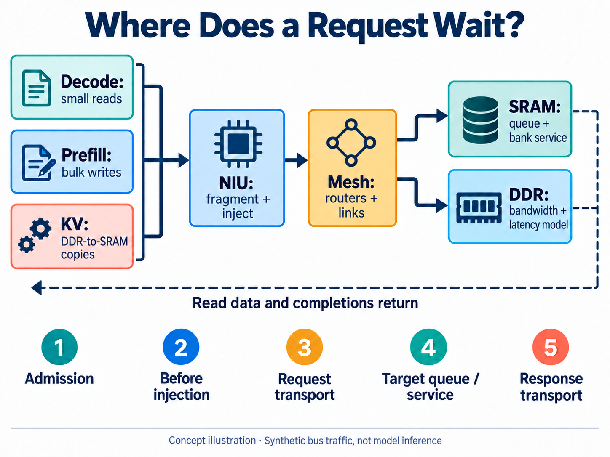
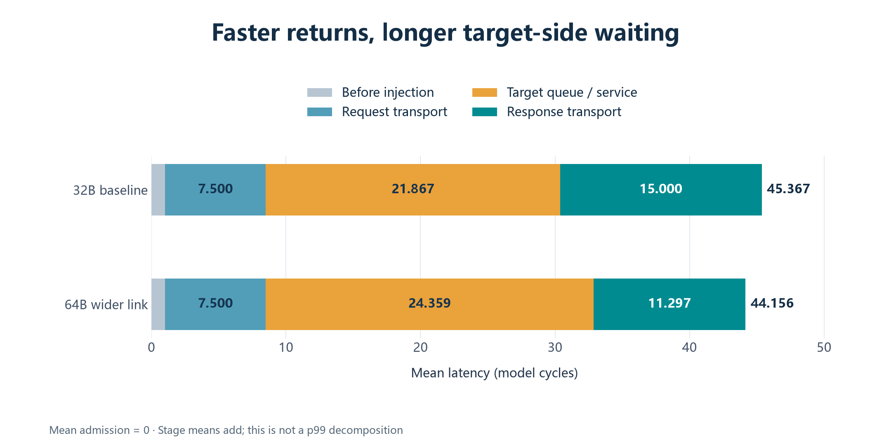
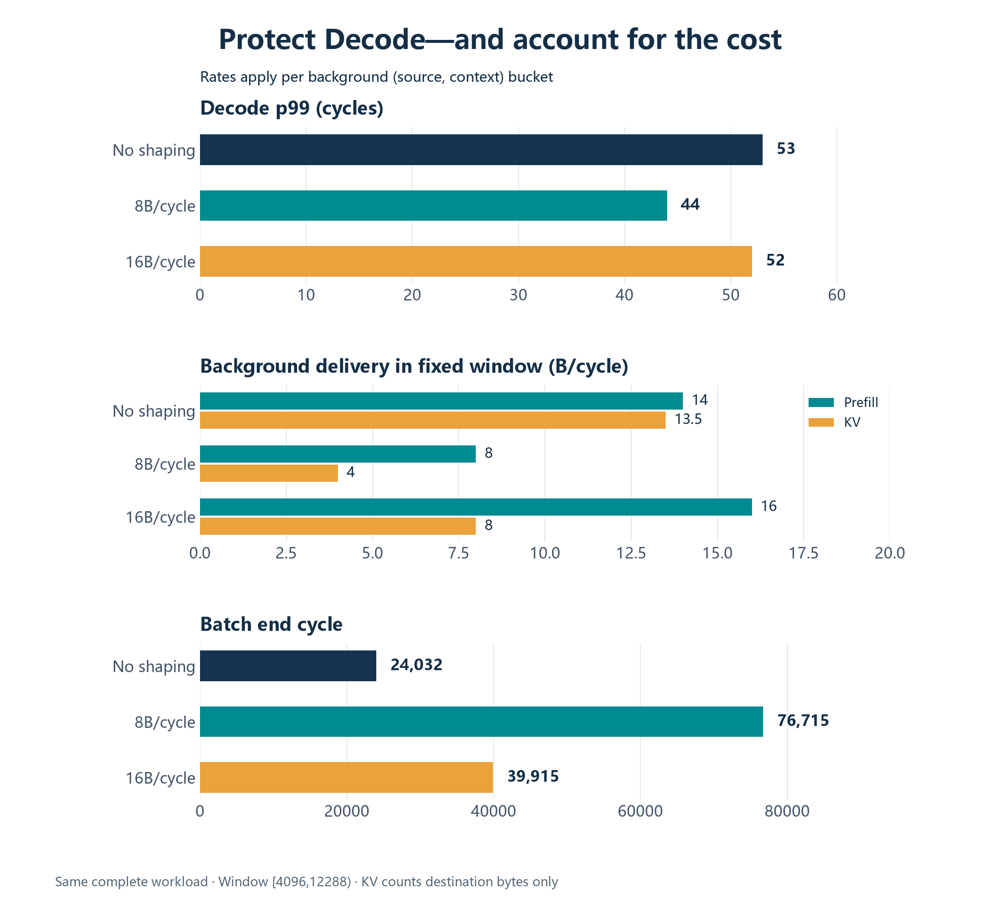

[简体中文](README.md) | English

# A Wider Link, a Slower Decode Tail: AI-Assisted NPU Mesh Exploration

Widening the NPU’s on-chip network links from 256 to 512 bits helped this mixed workload finish sooner. The batch end cycle fell from 24032 to 14893, a reduction of about 38%. Yet the same Decode requests had a worse latency tail: p99 rose from 53 to 59 cycles.

Judged by batch completion, the change deserves further study. Judged by the responsiveness of the critical requests, the answer is less straightforward.

These results come from an AI-assisted electronic system-level, or ESL, exploration. ESL puts behavior, resource limits, and timing relationships into an executable model so architecture options can be compared before RTL implementation. This experiment uses a SystemC NPU Mesh bus-subsystem model with synthetic traffic. It does not execute model inference and has not been cycle-calibrated against RTL. The cycles below compare model configurations; they are not measurements of token latency on silicon.

The engineering question was specific: when reads, bulk writes, and data copies share the network, should we widen links, improve memory service, or regulate background traffic? AI helped extend the model, organize experiments, and build checks. The engineering judgment lies in identifying what each change improves and what it costs.

## Faster for whom?

An NPU is a processor specialized for neural-network computation. Its compute and memory nodes need a network to move data. A Mesh connects routers in a grid, carrying transactions hop by hop toward their destinations.

In language-model inference, Prefill processes the prompt, Decode generates subsequent tokens incrementally, and the KV cache retains historical information used by attention. Their memory-access patterns differ. This experiment represents that competition with small Decode reads, bulk Prefill writes, and DDR-to-SRAM KV copies. These are bus-traffic proxies, without operator execution.

Batch completion asks when all work finishes. Tail latency asks how long the slower requests wait. Finishing bulk background work sooner and reducing the wait for critical small requests are distinct objectives.

The experiment fixes 128 Decode requests and measures scheduled release to completion, including admission waiting and completions after the release window. Its nearest-rank p99 is the 127th value after sorting those 128 latencies. This describes a finite sample, not a probabilistic bound across arbitrary workloads.

*Figure 1. Redrawn from archived experiment data for the same mixed workload. The left panel measures batch completion; the right measures the Decode latency tail. Both use cycles, but answer different questions.*

## Give AI an experiment in which queues actually matter

A model that simply attaches a fixed delay to each access cannot explain this kind of waiting.

Here, the network interface unit, or NIU, fragments and injects transactions. Routers use XY routing and transfer packets in link-sized units. Buffers are finite: upstream traffic cannot continue indefinitely while it waits for downstream credits indicating available capacity. At the destination, requests compete for endpoint slots and memory service.

The SRAM endpoint directly integrates an existing controller model, including its modeled interface, address mapping, bank arbitration, and bounded queues. DDR uses explicit bandwidth, read/write latency, direction-switching, and queuing behavior, without modeling DRAM commands or the PHY. Links, ingress queues, and memory service can all introduce delays, and changing one resource alters the arrival pattern seen by others.

*Figure 2. AI-generated concept illustration organized by responsibility, not the physical grid layout. The dashed line summarizes the return direction; responses still pass through the Mesh and NIU to their respective sources. “Target queue / service” is a combined measurement, not pure bank service time.*

One concrete role for AI was to develop these responsibilities into executable interfaces, configurations, and experiment entry points: extending memory integration, adding NIU/DMA concurrency windows, and organizing interference comparisons around a fixed request cohort. The model carries actual bytes. A separately implemented Python byte oracle checks read results and final memory contents, so an elapsed simulation time alone cannot conceal an incorrect copy.

The engineer still has to decide what remains fixed. If one experiment removes background tasks while another widens links, their completion times do not isolate the benefit of the hardware parameter. Automated sweeps make execution easier; experiment constraints make the comparison meaningful.

## Where did the waiting move?

The interference and QoS data below come from archived experiments dated September 24, 2026, using SystemC 3.0.2 and C++17. The interference experiment uses a 4×2 Mesh, initially with 32-byte-per-cycle links, eight SRAM banks, and 16 slots at each memory endpoint. Decode traffic runs from source 3 to SRAM at router 0: 128 reads of 256 bytes, released every 64 cycles starting at cycle 4096. Background traffic consists of 1KB Prefill writes and 4KB DDR-to-SRAM KV copies, with addresses separate from Decode.

Resource comparisons preserve initialization, addresses, identifiers, dependencies, and release times. The wider-link point changes 32B to 64B without removing background tasks.

| Scenario | Decode p99, cycles | Batch end cycle |
| --- | ---: | ---: |
| Decode alone | 43 | 12269 |
| Mixed baseline | 53 | 24032 |
| Mixed, 64B links | 59 | 14893 |
| Mixed, bank initiation interval 2→1 | 47 | 24029 |

The standalone row provides a reference without background competition. Its task set differs from the mixed cases, so batch times cannot be used directly to compare configurations across that boundary. The other three rows retain the same mixed workload. Bank initiation interval is the minimum spacing between new operations accepted by a bank; reducing it changes modeled service capability, not hardware at zero physical cost.

Each Decode request is then split into admission, NIU waiting before injection, request transport, target queue/service, and response transport.

*Figure 3. Stage means for the same Decode cohort, in model cycles. Means add; stage p99 values do not. Mean admission time is zero here. This locates aggregate waiting changes, rather than decomposing an individual p99 request.*

Widening links reduces mean response transport from 15 to 11.297 cycles, but increases target queue/service from 21.867 to 24.359. The overall mean still improves slightly, from 45.367 to 44.156, while p99 rises to 59. A better average and a worse tail can coexist.

This supports the interpretation that faster upstream transport changes contention at the target. Aggregate data cannot attribute all the extra waiting to one particular arbitration rule. It does, however, provide a reason to investigate the target rather than simply widen the network again.

Another comparison helps: reducing bank initiation interval from 2 to 1 lowers Decode p99 to 47 while barely changing batch completion. Doubling endpoint slots from 16 to 32 changes neither metric. More waiting space did not solve the problem for this workload.

Every comparison completes all 128 Decode reads, with a fixed-window Decode delivery rate of 4B/cycle. The tail changes do not result from dropping slow requests or truncating the drain phase. That delivery rate is also not a measure of inference throughput.

## What does protecting Decode cost the background work?

Once contention is visible, the next question is quality of service, or QoS: how service is allocated between traffic classes.

The next AI-assisted extension adds token-bucket shaping at NIU injection. Credits accumulate over time; a request waits if its sending allowance is insufficient. This controls background injection rate and burst size without changing the routers’ round-robin arbitration. Charges are in logical bytes, not a direct cap on physical-link utilization.

The QoS comparisons retain the full set of 128 Decode requests, 288 Prefill writes, 72 KV copies, and nine initialization transactions. Every mixed configuration uses the same input file. Delivery counts bytes successfully completed within `[4096,12288)`, while simulation continues until all tasks drain.

*Figure 4. The QoS sweep retains the complete mixed task set. The 8B and 16B settings are logical-byte refill rates per background `(source, context)` bucket. Work not delivered inside the fixed window completes later.*

At 8B/cycle, shaping lowers Decode p99 from 53 to 44, close to the standalone value of 43. But Prefill window delivery falls from 14 to 8B/cycle, KV delivery from 13.5 to 4B/cycle, and the batch end cycle grows from 24032 to 76715—about 3.19 times the baseline.

The KV figure needs context. Both source reads and destination writes consume tokens, while useful KV delivery counts only destination bytes. Counting both accesses as useful task throughput would overstate delivery. Buckets are also independent for each `(source, context)` pair; an 8B/cycle bucket is not a system-wide aggregate quota.

The 16B/cycle setting reduces p99 by only one cycle, to 52, while the batch ends at cycle 39915. Neither rate is established as a suitable default. What the experiment provides is a view of both the benefit and the cost of protecting the critical stream.

Memory-ingress priority was tested too. With the native outstanding limit held at four, no benefit was measured. Restricting concurrency to one made p99 substantially worse. Further work should preserve enough memory concurrency while exploring gentler rates, bursts, and shared quotas, rather than create a new bottleneck just to give a priority selector waiting requests to choose from.

## AI-generated experiments must be open to being disproved

A useful detail from this work is the first interference run’s negative admission time: a request appeared to be accepted before it was scheduled for release.

The replay loop was one cycle ahead of model time. The fix made release decisions use the model’s cycle counter and checked `release ≤ accepted ≤ done`. The initial results were invalidated and the final comparisons regenerated. The experiment’s time base was corrected rather than hiding the inconsistency with a plotting offset.

Validation went beyond checking an exit code. Each exploration point checked read data and final memory bytes, resource bounds, completion and byte conservation, and the correspondence between stage events and transactions. QoS checks also recomputed token charges for successful injections, preventing a limiter from appearing correct while missing DMA child requests.

The final QoS stage passed 49 CTest tests, 51 Mesh Python checks, and 94 shared compatibility checks. Those counts belong to that stage. They support functional and statistical consistency, not timing calibration against RTL. A separately written reference model does not itself constitute independent third-party validation.

AI can help extend a model, organize sweeps, investigate anomalies, and revise implementations. The engineer must keep the evidence constrained: are the requests the same, are all tasks retained, are the measurement and drain windows consistent, and does the parameter change also change the question? Encoding these conditions as automatic checks makes later exploration less dependent on repeatedly inspecting logs by hand.

## Which question should guide the next RTL investment?

This experiment does not select an unconditional winner. It gives more specific guidance: wider links help the batch finish sooner without necessarily protecting the Decode tail; target service warrants further analysis; background shaping can protect critical requests, but delivery and completion time must be considered alongside latency.

If only one area could be explored next, I would investigate target-side contention and moderate shaping while preserving concurrency, then vary load intensity, phase, source/destination placement, and address mapping. Deciding whether wider links justify their cost also requires area, routing, and power evidence.

That is a practical role for ESL in AI-assisted chip development: turn plausible architectural choices into comparisons that can be checked and revised when counterexamples appear. By the time RTL work begins, the team should at least know which kind of waiting the additional hardware is intended to improve.
