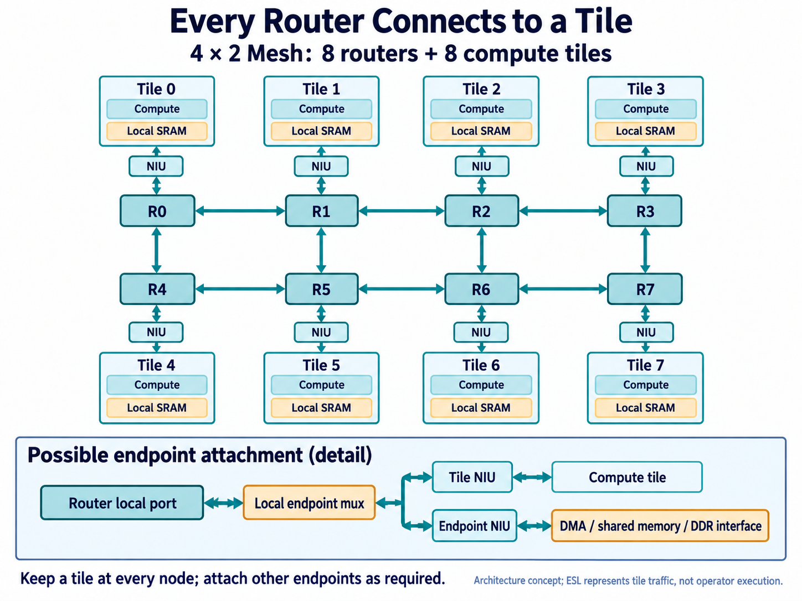
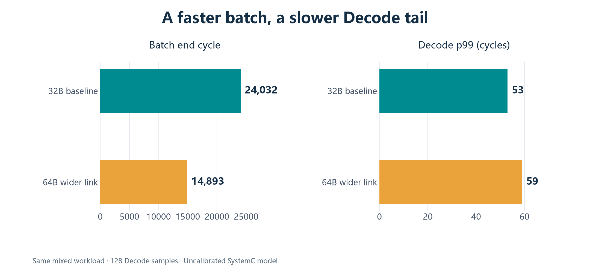

[简体中文](README.md) | English

# How Does Data Move Inside an AI Core? Exploring Mesh Architecture with AI-Assisted ESL

Keeping an AI core busy requires more than arithmetic units. Weights and inputs must arrive on time, and results must leave before they block the next operation. With multiple compute tiles, practical questions emerge: when several tiles fetch data at once, who waits for whom? If two destinations need the same input, how many reads and network transfers are required? Can a background copy delay a small read needed by the next computation?

The answers affect how the network, memory system, and scheduler divide their work. Discovering a bottleneck after RTL is written can require more than a parameter change.

This project used AI to help build an executable NPU Mesh communication and memory model, then compare architectural choices before RTL. Electronic system-level modeling, or ESL, describes behavior, finite resources, and timing so that workloads can expose their interactions. AI helped extend interfaces and models, organize experiments, diagnose anomalies, and implement checks. The designer defined the system boundary, chose meaningful workloads, and judged which decisions the evidence could support.

We will first place Mesh inside an AI core, then examine its exploration space and several measured findings. The experiments use synthetic SystemC traffic, not neural-network operator execution. They have not been calibrated against RTL; their cycles compare model configurations, not real-chip inference latency.

## Where Mesh fits

An NPU is a processor designed for neural-network computation. The target architecture here is a regular multi-tile grid: every router connects through a local NIU to a compute tile containing compute units and local SRAM. A 4×2 grid therefore has eight routers and eight tiles. Routers deliver data to the right location; tiles use that data for computation.

This makes it a candidate for connecting tiles, local and shared memories, and data-movement ports. Regular transfers between multiply-accumulate units inside a compute array can still use dedicated wiring. Every arithmetic unit need not become a Mesh endpoint.

*Figure 1. AI-generated target architecture. Each of the eight nodes retains a compute tile. The detail shows a possible local attachment for additional endpoints; data and responses travel in both directions. This is an integration concept, not a screenshot of eight compute tiles executing in ESL.*

How does this map to the model's eight nodes? ESL provides a request source and local injection resources at each router position. A request's source identifies its injection node, while address mapping selects its destination endpoint. The memory experiments in this article configure an SRAM endpoint at R0 and a DDR endpoint at R7; other nodes can originate traffic. They do not automatically instantiate a compute model and local SRAM at every node. This abstraction isolates inter-node communication and memory contention. Exploring complete tile-local reuse requires per-node memory endpoints and the corresponding compute access streams.

The attachment locations for DMA, shared SRAM, and DDR interfaces are architectural choices too. The figure retains every tile while illustrating how additional endpoints might share local access. The model allows a source and a memory endpoint at the same router position, but the hardware multiplexing structure in the detail still needs integration design. An address mapping in the model is not an implemented hardware interface.

One useful division of responsibility is to **carry bulk data over Mesh, use a separate path for commands and completion events, and retain a management path for configuration and diagnosis.** Large weight transfers should not occupy the same data queue needed by scheduling commands. A congested network should still be observable and drainable. Separate paths can still experience receiver backpressure; they do not make commands immune to waiting.

Each tile connects through a network interface unit, or NIU. It handles transaction identifiers, fragmentation, response collection, and ordering, leaving forwarding to the routers. AXI, a common on-chip access interface, can be adapted at the network boundary rather than extending all five AXI channels through every router. SRAM bank arbitration stays in the memory controller. A bank is a memory partition that can serve accesses with some degree of independence.

The current ESL implementation has separate command queues and event mechanisms, with management operations exposed through direct API calls. These establish responsibility and timing boundaries; they are not a complete scheduler or management-bus RTL implementation.

The candidate architecture uses explicit data movement rather than global CPU-style cache coherence. Software and scheduling logic must track buffer ownership and when data becomes readable. Mesh provides transport; responsibility for the data's lifetime remains elsewhere.

## Follow an input block until compute can start

Suppose the next operation needs an input block moved from DDR into a tile's local SRAM. DDR provides capacity, while local SRAM stages data near the compute units. A workable sequence first reserves the destination buffer, then asks Tensor DMA to perform the copy. DMA moves data without requiring compute units to participate byte by byte.

DMA issues reads, and the NIU divides larger transactions into network-sized fragments. Data traverses routers to the memory endpoint, returns, and is written into the destination SRAM. That destination may wait for an ingress slot or a bank conflict to clear. Sending the final packet is therefore insufficient grounds to start the consumer.

**The scheduler needs a completion event with the right meaning: destination data is visible and the relevant child transactions have completed.** In this model, DMA waits for accepted child requests to drain before reporting final completion and releasing the associated resources. Integration with a real compute tile must align this meaning with the tile's start condition. Command, event, and buffer-reservation mechanisms exist in the model; the complete operator scheduling flow is a further integration step.

If two tiles need the same input, DMA can read each source chunk once and write it to both destinations. This avoids repeated source reads, but destination writes still traverse the network separately. It is source-side fanout, not router multicast that replicates one injection along its route.

Following that transfer exposes several central design considerations.

The first is locality. Data reused locally need not repeatedly cross the network. Shared SRAM placement and frequent tile-to-tile exchanges affect hop count and hot spots. Mesh permits simultaneous use of non-conflicting links, but a larger grid cannot automatically increase the service capacity of a memory port targeted by many flows.

The second is concurrency. While one transaction waits for its response, can another proceed? A wider link helps only when its source can supply data and its destination can accept it. NIU outstanding capacity, read-return reservations, DMA windows, and memory ingress slots jointly constrain this behavior.

The third is the relationship between traffic classes. Bulk writes, read requests, read data, and completion responses matter for different reasons. A tiny response may determine when a buffer is released. Holding it behind bulk data can slow system progress even when some links still have spare capacity.

## Making those constraints real in an AI-assisted model

A fixed delay attached to every access cannot expose these trade-offs.

### How a router chooses its next hop

The implementation organizes each router around East, West, South, North, and Local ports. Edge nodes use only their existing neighboring links. Local serves injection and reception at that node, which its tile accesses through the NIU. Transit traffic passes through routers without entering the compute units or SRAM of intermediate tiles.

XY routing first reaches the destination column, then its row. With the numbering in Figure 1, R3-to-R4 traffic follows R3→R2→R1→R0→R4 and leaves through Local at R4. The reverse direction follows R4→R5→R6→R7→R3. The two directions do not necessarily traverse the same links.

This baseline is easy to explain and check, and makes placement questions measurable: which flows share a horizontal link, and which endpoints attract concentrated traffic? The implementation does not automatically reroute around congestion. Adding routers alone therefore need not relieve a hot spot. Adaptive routing would require a model extension before comparison.

### Why a wide link can still wait for credits

Packets advance in flits, the units carried by a link transfer. Every virtual channel at each input port has a bounded flit queue. Outputs use round-robin arbitration, and each physical input or output channel advances at most one flit per cycle. Requests for the same output compete; non-conflicting outputs can operate in parallel.

A packet owns its input VC until its tail flit departs. Upstream transmission requires a credit representing a downstream slot. Only actual dequeue releases that slot, and the credit becomes usable again after its return delay. Every cycle, the model checks that free credits, queued flits, forward traffic in flight, and returning credits sum to queue depth. Buffer capacity cannot appear out of nowhere.

Three delays matter separately: preparation inside the router, forward link transit, and credit return. A shallow queue can leave a link waiting for credits; a deeper queue may merely hold more waiting traffic. ESL can vary one factor and observe how peak occupancy, blocking locations, and delivery rate change together.

Payload bytes also differ from physical traffic. The model charges a 16B header, an optional byte mask, and rounding to link width. A 256B data packet without a mask takes nine flits on a 32B link, not eight. Every hop consumes link capacity again. Packet size, path length, and local reuse all affect network demand; application bytes divided by link width are insufficient to predict completion time.

### Design traffic isolation, transaction windows, and memory together

The model separates REQ, WRITE, RDATA, and RESP into four virtual networks with isolated VC resources. Virtual channels provide buffering and arbitration contexts, not additional physical bandwidth. All four classes still compete for transmission on the default shared physical link. The optional split configuration uses three physical channels: narrow REQ, a wide channel shared by WRITE and RDATA, and narrow RESP. It lets us assess separating small requests and responses from bulk data while acknowledging the added wiring cost.

Outside the network, the NIU limits transaction count, reserves complete read-return storage, and reassembles fragments by offset. Ordered external transactions with the same source/context/op/id issue serially; other permitted transactions can overlap. Unconsumed completions still occupy resources. A slow completion consumer can block new admission, a behavior that an unlimited return queue would hide.

NIU fragment windows and DMA windows control different levels of concurrency. With a maximum DMA chunk of 4KB and a packet payload limit of 256B, an aligned 8KB copy contains two source chunks. Each 4KB child transaction requires 16 network fragments. The DMA window controls concurrent chunks; the NIU window controls fragments in flight within one child transaction. Increasing one window may leave the other limit untouched.

The destination is more than a fixed delay too. An arriving packet header must reserve an ingress slot covering assembly, queuing, service, and waiting to inject the response. SRAM requests enter the existing controller's address mapping, bank arbitration, and bounded queues. A bank is a memory partition that can serve accesses with some degree of independence. DDR explicitly models shared read/write bandwidth, separate latencies, and direction-change costs, without DRAM-command or PHY detail.

Insufficient destination slots block Local delivery and propagate backpressure upstream. This is why routers, NIUs, and memory must be explored together: with unchanged target throughput, a wider link can simply bring requests to the same queue sooner.

AI's contributions produced concrete artifacts: native SRAM integration, NIU/DMA concurrency windows, traffic with release times and dependencies, stage events, and automated sweep checks. The model carries actual bytes. A separate Python byte-reference model checks read responses and final memory contents, so completion is examined for both data correctness and timing consistency.

Experiment machinery also needs constraints. An initial interference run recorded acceptance before release because the replay loop led the model clock by one cycle. The fix made release decisions use model time and added `release ≤ accepted ≤ done` checks. Initial results were discarded and regenerated. AI can help extend an experimental platform quickly, but errors must have a way to surface: successful execution alone does not make a result trustworthy.

## What ESL can explore

Exploration should begin with a question rather than a Cartesian product of every parameter. Is the network unable to deliver data, or is memory unable to accept it? Is a critical request slow because its route is long, or because background traffic interrupts its progress?

| Design dimension | Candidate choices | Measurements to consider together |
| --- | --- | --- |
| Topology and placement | Grid shape, endpoint positions, source/destination mapping | Hop count, hot links, destination concentration |
| Transport and flow control | Link width, packet size, channel split, VCs, queue depth, credit delay | Useful byte rate, overhead, backpressure, buffer occupancy |
| Concurrency and movement | NIU fragment and DMA windows, return reservations, single- and multi-destination copies | Outstanding work, source reads, completion time |
| Memory organization | Banks and mapping, acceptance interval, ingress slots, DDR bandwidth and turnaround | Bank conflicts, target waiting, network backpressure |
| Workload and service policy | Small-read/bulk-write mix, release phase, dependencies, background shaping | Critical-flow tail latency, background delivery, batch completion |

This is a map of the exploration space. Existing experiments compare link and channel configurations, windows, memory resources, background traffic, and selected QoS policies. Topology and endpoint placement are configurable directions for further work; this article does not present a complete placement search. Area, power, and wiring costs require physical implementation evidence and cannot be inferred from these cycle counts.

A practical AI-assisted workflow starts with human-defined objectives and invariants. AI turns candidate choices into configurations and workloads. Functional and resource checks precede parameter sweeps. Unexpected results lead back to event traces, where model bugs must be distinguished from architectural effects. Promising candidates can then move to RTL evaluation.

Workloads need not begin with a complete neural network. Dependency-aware synthetic traffic describes initialization, reads, writes, copies, and multi-destination movement while controlling particular sources of contention. Later integration of real operator traces must preserve dependencies, address mapping, and release timing to assess suitability for the target AI core.

## Three findings that sharpen the choices

The following results come from archived experiments dated September 24, 2026, using SystemC 3.0.2 and C++17. Each experiment has its own fixed workload; comparisons stay within that experiment.

### Expose concurrency before widening the link

One multi-destination experiment uses a 4×2 Mesh, 256-bit links, and 256B packets. Four 8KB source tasks each have two destinations. Initialization, source reads, dual-destination writes, and readback total 196608 logical access bytes.

| NIU / DMA window | Batch completion cycles | Logical access B/cycle |
| --- | ---: | ---: |
| 1 / 1 | 8074 | 24.351 |
| 4 / 2 | 6331 | 31.055 |
| 8 / 2 | 5883 | 33.420 |
| 8 / 4 | 5883 | 33.420 |

Without widening the link, moving from windows 1/1 to 8/2 reduces batch cycles by 27.1% and increases logical access throughput by 37.2%. This metric includes initialization and checking traffic, as well as fill and drain time. It is not useful NPU compute throughput.

Increasing the DMA window from 2 to 4 brings no further improvement for a specific reason: each 8KB task contains only two source chunks at the 4KB maximum chunk size. That helps size the window for this workload; it does not establish that a DMA concurrency of two is universally sufficient.

### Wider links finish the batch sooner but do not protect small reads

The experiment represents three inference-related access patterns: Prefill processes input prompts, Decode generates successive tokens, and the KV cache retains attention history. Bulk writes, small reads, and DDR-to-SRAM copies stand in for those traffic patterns; the model does not execute the inference operations themselves.

The 4×2 Mesh initially transfers 32B/cycle per data link, with eight SRAM banks and 16 ingress slots at each memory endpoint. A fixed cohort of 128 Decode reads, each 256B, accesses SRAM at router 0 from source 3. Releases begin at cycle 4096 and occur every 64 cycles. Background traffic includes 1KB Prefill writes and 4KB KV copies, using addresses separate from Decode. Resource comparisons preserve requests, dependencies, and release times.

*Figure 2. Redrawn archived data. Widening from 32 to 64B/cycle reduces the batch end cycle from 24032 to 14893, about 38%, while Decode p99 rises from 53 to 59 cycles.*

Here, p99 describes the tail of this finite cohort. Sorting the 128 release-to-completion latencies and applying nearest-rank selects the 127th value. Admission waiting and final drain are included. It is not a probability guarantee for arbitrary workloads.

Stage records offer a clue: mean response transport falls from 15 to 11.297 cycles, but target queuing/service rises from 21.867 to 24.359. The total mean decreases slightly while the tail worsens. Faster upstream delivery changing target-side contention is an interpretation supported by the data; aggregate statistics cannot uniquely attribute the additional waiting to a particular arbitration rule.

Reducing the bank acceptance interval from two cycles to one lowers p99 to 47, with a batch end cycle of 24029. Doubling ingress slots from 16 to 32 provides no improvement. These comparisons direct attention toward target service, beyond network width. Every configuration completes the same 128 Decode requests; slow requests are not discarded to improve the statistics.

### Protecting a critical flow has a background cost

Quality of service, or QoS, addresses trade-offs between traffic classes. A token bucket at the NIU replenishes sending allowance each cycle; requests wait when they lack tokens. This experiment shapes background logical-byte injection without changing router round-robin arbitration.

The identical full workload contains 128 Decode reads, 288 Prefill writes, 72 KV copies, and nine initialization transactions. An 8B/cycle refill rate for each background `(source, context)` reduces Decode p99 from 53 to 44, close to its isolated value of 43. However, over the fixed window `[4096,12288)`, Prefill delivery falls from 14 to 8B/cycle and KV delivery from 13.5 to 4B/cycle. All tasks continue to drain, and the batch end cycle increases from 24032 to 76715, about 3.19 times the baseline.

Both the source read and destination write consume KV tokens, while useful delivery counts destination bytes only. Charging both accesses does not double task throughput. Buckets are independent, so 8B/cycle is not a global system quota either.

The experiment demonstrates both protection and its cost. Which configuration makes sense depends on the product's priorities. A better p99 in isolation can lead to the wrong choice.

## Enter RTL with specific questions

This work gives AI-assisted Mesh exploration concrete, checkable tasks: building resource models, generating controlled workloads, extending concurrency and service policies, checking data and timing relationships, and comparing candidates. The final QoS stage passed 49 CTest cases, 51 Mesh Python checks, and 94 shared compatibility checks. Those counts support functional and statistical consistency for that stage; they do not replace RTL calibration or independent third-party verification.

For the next AI-core design iteration, I would first establish how tiles reuse data and where memory endpoints belong, then set separate objectives for critical and background flows. That provides a basis for choosing windows, target service capacity, and moderate shaping across workload intensities and phases. Only then would I assess whether wider links justify their area, wiring, and power costs.

ESL helps make those decisions explicit. By the time RTL work starts, a designer should be able to explain why a queue needs its depth, why a link needs its width, and which waiting condition the added resource is intended to address. AI helps turn those questions into executable, repeatedly checked experiments, bringing evidence into architectural discussions earlier.
