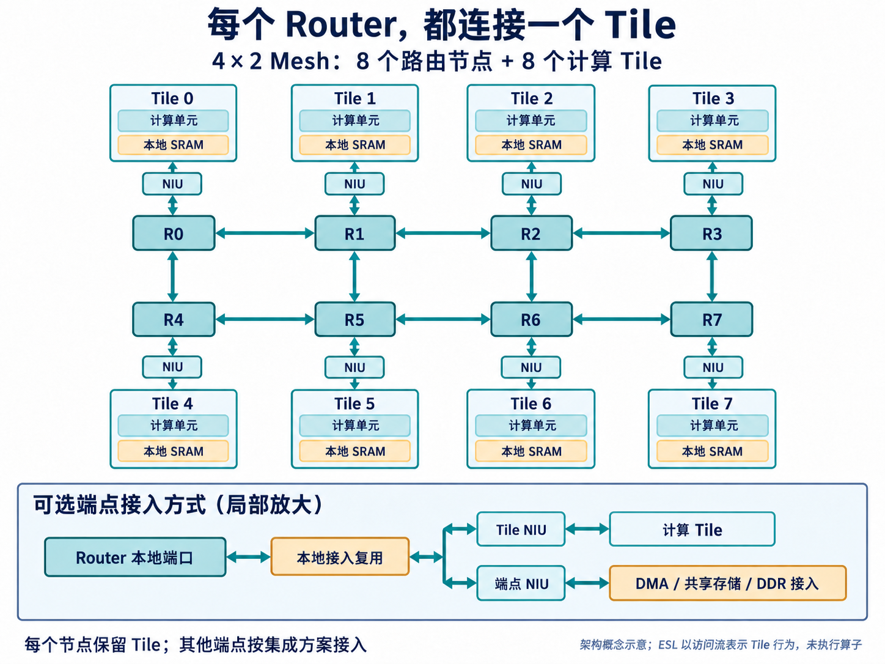
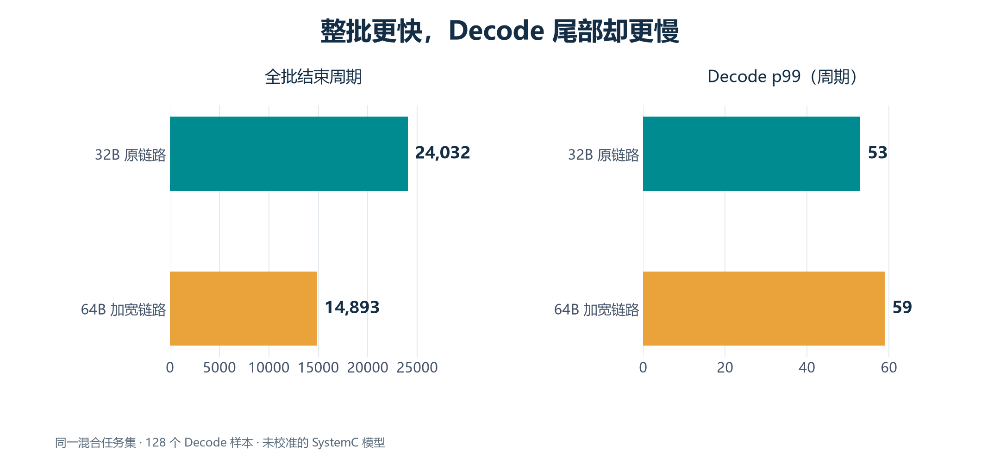

[English](README.en.md) | 简体中文

# AI 核里的数据怎样流动？用 AI 辅助 ESL 探索 Mesh 架构

一颗 AI 核里，计算单元要持续工作，权重和输入就得按时送到，计算结果也得及时搬走。当设计扩展到多个计算 Tile，问题会变得具体：几个 Tile 同时取数，谁在等谁？同一份数据要送给多个目的地，要读几次、走哪些链路？后台搬运会不会挡住下一步计算急需的小请求？

这些问题会影响网络、存储和调度的分工。等 RTL 写完再发现瓶颈，调整的往往已经不只是一个参数。

这次实践用 AI 辅助构建一个可运行的 NPU Mesh 通信与存储模型，在 RTL 之前比较架构选择。ESL，即电子系统级建模，让我们先描述模块行为、有限资源和时间关系，再把工作负载放进去观察。AI 参与接口与模型扩展、实验组织、异常定位和检查；设计者负责规定系统边界、选择有意义的负载，并判断结果能支持什么决策。

文章先讲 Mesh 怎样放进 AI 核，再讲 ESL 可以探索什么，最后看几组实际发现。这里的实验使用 SystemC 合成访问流，没有执行真实神经网络算子，也没有经过 RTL 周期校准；周期用于比较模型配置，不代表真实芯片的推理时延。

## Mesh 放在 AI 核的哪一层

NPU 是面向神经网络计算的处理器。这里采用的目标架构是规则的多 Tile 网格：每个 Router 都通过本地 NIU 连接一个计算 Tile，Tile 内包含计算单元和本地 SRAM。因此，4×2 网格对应八个 Router 和八个 Tile。Router 负责把数据送到正确的位置，Tile 负责使用这些数据进行计算。

它适合连接 Tile、本地存储、共享存储和数据搬运端口。一个计算阵列内部，乘加单元之间的规则数据传递仍可以使用专门连线；没有必要把每个乘加单元都变成 Mesh 节点。

*图 1｜AI 生成的目标架构示意。八个节点各自保留计算 Tile；下方局部图表示其他端点可通过本地接入复用连接网络，数据与响应双向传输。它说明集成方式，不是当前 ESL 已运行八个计算 Tile 的截图。*

这与模型里的“八个节点”如何对应？ESL 为每个路由位置提供访问源和本地注入资源，用请求的 source 标识注入节点，再按地址映射找到目的端。本文存储实验在 R0 配置一个 SRAM 端点、在 R7 配置一个 DDR 端点，其他节点可发起流量；它没有自动为每个节点实例化一套计算模型和本地 SRAM。这样的抽象先把跨节点通信与存储竞争单独拿出来研究。要探索完整的 Tile 本地复用，还需要逐节点配置存储端点，并接入相应计算访问流。

DMA、共享 SRAM 和 DDR 接口的接入位置也是架构选择。图中保留每个节点的 Tile，同时示意额外端点如何复用本地接入。模型允许访问源与存储端点位于同一路由位置，但局部图中的硬件复用结构仍需在集成时设计，不能把一次模型地址映射当作已经实现的硬件接口。

一种清楚的职责划分是：**数据走 Mesh，命令与完成事件走独立路径，配置和诊断另有管理通道。** 大块权重不应占住调度命令所需的同一条数据队列；网络拥塞时，也应保留观察状态和发起排空的手段。独立路径仍可能因接收端忙而背压，它并不意味着命令永远不会等待。

计算 Tile 通过 NIU（网络接口单元）接入网络。NIU 处理事务标识、分片、返回收集和保序，路由器主要负责转发。AXI 是常用的片内访问接口，可以在网络边界适配，不必把它的五个通道原样铺到每个路由器里。SRAM 的 bank 仲裁则留在存储控制器中；bank 可以理解为能够按一定规则独立服务的存储分区。

当前 ESL 已有独立的命令队列和事件机制，管理操作通过直接 API 调用；它们用于建立职责与时序边界，并不代表已经实现了完整的调度器或管理总线 RTL。

这套候选架构采用显式数据搬运，而不依赖全局 CPU 式缓存一致性。软件与调度侧需要知道缓冲区归谁使用、数据何时可读。Mesh 提供传输能力，这些数据生命周期责任仍要有人承担。

## 跟着一块输入，走到计算真正能开始

假设下一项计算需要把 DDR 中的一块输入搬进 Tile 的本地 SRAM。DDR 提供较大容量，本地 SRAM 提供靠近计算单元的暂存空间。一个可用的流程应先预留目的缓冲区，再交给 Tensor DMA 执行搬运；DMA 是负责数据复制的单元，让计算单元不必逐字节参与传输。

DMA 发起读请求，NIU 将较大事务拆成网络能处理的片段。数据经过路由器到达存储端，返回后再写入目的 SRAM。目的端可能因为入口槽位不足或 bank 冲突而等待，所以“最后一个包已经发出”还不足以启动消费者。

**调度侧需要等待符合约定的完成事件：目的数据已经可见，相关子事务已经完成。** 在这个模型里，DMA 要等已接受的子请求排空，才能报告最终完成和释放相应资源。接入真实计算 Tile 时，还要把这一完成语义与 Tile 的启动条件对齐。当前模型具有命令、事件和缓冲区预留机制，完整的算子调度流程属于后续系统集成。

如果两个 Tile 需要同一份输入，DMA 可以对每个源块读取一次，再分别写到两个目的端。这样减少了重复源读取，但目的写仍各自经过网络；它是源端 fanout，不等于路由器已经支持一次注入、沿途复制的硬件组播。

沿着这次搬运，就能看出架构的几个核心考量。

首先是局部性：能在本地复用的数据，不必反复穿过网络。共享 SRAM 放在哪里、哪些 Tile 经常交换数据，会影响跳数和热点。Mesh 允许不冲突的链路同时工作，但多个流都访问同一个存储端口时，网格规模增加也不会自动增加这个端口的服务能力。

其次是并发：一笔事务等待返回时，是否还能发送下一笔？更宽的链路只有在上游供得上、下游接得住时才有价值。NIU 的在途事务、读返回预留空间、DMA 窗口和存储入口槽位共同决定这一点。

还有流量之间的关系。大块写入、读请求、读返回和完成响应不能只按总字节数看待。一个很小的响应可能决定缓冲区何时释放；如果让它长期堵在大数据后面，系统即使还有局部带宽，也可能推进缓慢。

## AI 辅助搭建的实验台，必须让这些约束发生作用

为了研究上述取舍，模型不能只给每次访问加一个固定延迟。

### Router 怎样决定下一跳

实现中，每个 Router 按东、西、南、北和 Local 五个方向组织端口；边界节点只使用实际存在的邻接链路。Local 连接本节点的注入和接收侧，Tile 通过 NIU 使用这条路径。数据在网格中经过其他 Router 时，不需要进入沿途 Tile 的计算单元或 SRAM。

下一跳采用 XY 路由：先把横坐标走到目的列，再走到目的行。例如，按图中编号，R3 到 R4 的路径是 R3→R2→R1→R0→R4；到达 R4 后，再从 Local 交付目的端。反向 R4 到 R3 则走 R4→R5→R6→R7→R3。两个方向并不一定经过相同链路。

这个基线便于解释和核对，也让布局问题变得可测：哪些流共享同一段横向链路，哪些端点会集中接收请求？当前实现不会因为一条路径拥塞而自动绕行，因此不能把增加 Router 数量直接等同于缓解热点。要研究自适应路由，需要扩展模型再比较。

### 宽链路为什么也会等 credit

包按 flit——一次链路传输的单位——向前推进。每个输入端口的每个虚拟通道都有有限的 flit 队列；输出采用轮询仲裁，每条物理输入或输出通道每周期最多推进一个 flit。同一输出前的多个请求必须竞争，互不冲突的输出则可以并行工作。

模型为包保留输入 VC 的归属，直到尾 flit 离开才释放；上游发送前必须拿到下游槽位对应的 credit。槽位真正出队后，额度经过返回延迟才重新可用。模型逐周期核对“可用额度＋已排队＋前向在途＋返还在途＝队列深度”，避免凭空增加缓冲容量。

这里有三个不同的时间：Router 内准备转发的延迟、链路上的前向延迟，以及 credit 的返回延迟。队列太浅时，链路会等额度；只加深队列，又可能只是容纳更多等待。ESL 可以改变其中一项，观察占用峰值、阻塞位置和交付率如何联动。

有效载荷也不等于物理流量。模型按 16B 包头、可选字节掩码和链路宽度取整计费。以一个无掩码的 256B 数据包为例，在 32B 链路上需要 9 个 flit，而不是 8 个；经过多跳，每一跳都占用链路。因此包大小、路径长度和本地复用都影响网络负担，不能只拿应用字节数除以位宽估计完成时间。

### 流量隔离、事务窗口和存储，要一起设计

模型将请求 REQ、写数据 WRITE、读返回 RDATA 和响应 RESP 分成四类虚拟网络，各自使用隔离的 VC 资源。虚拟通道提供缓冲与仲裁上下文，本身不增加物理带宽。默认共享物理链路时，这四类流仍会竞争传输机会；可选 split 配置则使用三条物理通道：窄 REQ、WRITE 与 RDATA 共用的宽通道、窄 RESP。这样可以研究小请求和响应与大数据分流的价值，同时承认新增连线的成本。

网络之外，NIU 还要限制事务数、预留完整读返回空间，并按偏移重组分片。同一 source/context/op/id 的外部有序事务串行发出，其他允许的事务可以并发；没有被调用方取走的完成结果仍占用资源。接收方消费得慢，也会让新请求无法准入，不能用一个无限返回队列把这个问题藏起来。

NIU 分片窗口与 DMA 窗口控制的是不同层级。例如，在最大 DMA 子块 4KB、包载荷上限 256B 的配置下，一个对齐的 8KB 搬运任务会分成两个源块，每个 4KB 子事务又需要 16 个网络片段。DMA 窗口决定能同时推进几个块，NIU 窗口决定一笔子事务能有多少片段在途。增大一层窗口，未必能突破另一层限制。

目标端也不是一个固定延迟。包头到达时要先预留入口槽位，槽位覆盖组包、排队、服务和等待响应注入。SRAM 端直接进入已有控制器的地址映射、bank 仲裁和有限队列；bank 是能够按一定规则独立服务的存储分区。DDR 端则显式建模读写共用带宽、各自延迟和方向切换成本，不细化到 DRAM 命令与 PHY。

目标槽位不足会阻塞 Local 交付，并沿网络向上游传递背压。这正是需要把 Router、NIU 和存储放在一起探索的原因：目标吞吐不变时，加宽链路可能只让请求更早赶到同一条等待队列。

AI 在这里的工作有明确产物：扩展原生 SRAM 接入与 NIU/DMA 并发窗口，组织具有释放时间和依赖关系的访问流，输出逐阶段事件，再为参数扫描加入自动检查。模型传递真实字节，Python 字节参考模型核对读返回和最终存储内容，让“搬运完成”同时接受数据和时间两方面的检查。

实验组织也要受到约束。首次干扰试跑曾出现接受时间早于释放时间：回放器的外层循环比模型周期领先一拍。修复统一使用模型周期，并加入 `release ≤ accepted ≤ done` 检查，原结果作废后重新生成。这类错误说明，AI 能帮助快速扩展实验台，也需要让错误有机会暴露；程序跑完和结果可信之间，还隔着一组明确的不变量。

## ESL 可以探索哪些空间

模型搭好以后，探索不应从“把所有参数排列组合”开始，而应先提出一个问题。例如：是网络送不动，还是存储来不及接？关键请求慢，是自身路径长，还是被背景流打断？

| 设计维度 | 可以比较的选择 | 应一起观察什么 |
| --- | --- | --- |
| 拓扑与布局 | 网格形状、端点位置、源目的映射 | 跳数、热点链路、目的端集中度 |
| 传输与流控 | 链路位宽、包大小、通道划分、VC 与队列深度、credit 延迟 | 有效字节率、传输开销、背压、缓冲占用 |
| 并发与搬运 | NIU 分片窗口、DMA 窗口、返回预留、单目的与多目的搬运 | 在途量、源读取次数、完成时间 |
| 存储组织 | bank 数与映射、接受间隔、入口槽位、DDR 带宽与读写切换 | bank 冲突、目标等待、网络是否被拖住 |
| 工作负载与服务策略 | 小读与大写比例、释放相位、依赖、后台整形 | 关键流尾延迟、后台交付率、全批完成时间 |

这张表是探索地图。现有实验已比较链路与通道配置、窗口、存储资源、背景流和部分 QoS 策略；拓扑与端点布局可以通过模型配置继续研究，但本文没有给出完整布局寻优结果。面积、功耗和布线代价仍需后续物理实现证据，不能由这些周期直接推导。

一个实用的 AI 辅助流程是：人先确定目标和不变量，AI 将候选选择转成配置和工作负载；功能与资源检查通过后，再扫描参数；发现反常结果时回到事件轨迹，区分模型错误和架构现象，最后把值得保留的候选交给 RTL 评估。

负载也不必一开始就绑定完整神经网络。这里用带依赖关系的合成访问描述初始化、读写、复制和多目的搬运，可以控制某一类竞争。进一步接入真实算子轨迹时，需要保留数据依赖、地址映射和释放节奏，才能判断这些候选是否适合目标 AI 核。

## 三组发现，让架构选择更具体

以下结果来自 2026-09-24 的归档实验，使用 SystemC 3.0.2、C++17。不同实验各有固定负载，数值只在各自对照内比较。

### 先把链路喂饱，再考虑加宽

在一组多目的搬运实验中，4×2 Mesh 使用 256-bit 链路和 256B 包。四个 8KB 源任务各有两个目的端；初始化、源读、双目的写和读回合计 196608B 逻辑访问量。

| NIU / DMA 窗口 | 全批完成周期 | 逻辑访问 B/cycle |
| --- | ---: | ---: |
| 1 / 1 | 8074 | 24.351 |
| 4 / 2 | 6331 | 31.055 |
| 8 / 2 | 5883 | 33.420 |
| 8 / 4 | 5883 | 33.420 |

链路没有加宽，窗口 1/1→8/2 就让本批周期减少 27.1%，逻辑访问吞吐提高 37.2%。这里的吞吐包含初始化与检查流量，以及填充、排空时间，不是 NPU 有效计算吞吐。

DMA 窗口从 2 加到 4 没有进一步改善，原因也很具体：单任务 8KB，而最大子块为 4KB，只有两个源块可以并发。这个结果帮助我们决定该负载需要多大的窗口，不能推广成“DMA 并发达到 2 就够了”。

### 加宽链路改善了全批时间，却没有保护关键小读

另一组实验出现了反直觉的结果。实验用三类流量模拟推理中的竞争：Prefill 批量处理输入提示，Decode 逐步生成 token，KV cache 保存注意力所需的历史信息。模型分别用批量写、小块读和 DDR→SRAM 搬运表示它们的访问特点，并未执行这些推理过程。

4×2 Mesh 的原链路为 32B/cycle，SRAM 有 8 个 bank，存储端各有 16 个入口槽位。固定 128 个 256B Decode 读，从 source 3 访问 router 0 的 SRAM，自周期 4096 起每 64 周期释放一次；背景包含 1KB Prefill 写和 4KB KV 搬运，地址与 Decode 隔离。资源对照保留相同请求、依赖和释放时间。

*图 2｜归档数据重绘。链路 32→64B/cycle，全批结束周期 24032→14893，缩短约 38%；Decode p99 却从 53 升至 59 周期。*

p99 表示这批请求尾部的时延：将 128 个从计划释放到完成的时延排序，按 nearest-rank 取第 127 个，包含准入等待和排空。它不是任意负载下的概率保证。

阶段记录给出了一条线索：返回传输均值从 15 降到 11.297 周期，目标排队/服务却从 21.867 增至 24.359。总均值略降，尾部仍可能变差。上游更快改变了目标端的竞争节奏，这是数据支持的解释；聚合统计尚不能把新增等待唯一归因于某条仲裁规则。

把 bank 接受间隔从 2 改为 1 时，p99 降至 47，全批结束周期仍为 24029；入口槽位从 16 加到 32 则没有改善。这些对照把下一步注意力引向目标侧服务，而不只是网络位宽。所有配置都完成同一批 128 个 Decode 请求，未通过丢弃慢请求改善统计。

### 保护关键流，要同时看后台账单

QoS，即服务质量策略，用来处理不同流量之间的取舍。NIU 的令牌桶按周期补充发送额度，额度不足就等待；本次整形限制后台逻辑字节注入，不改变路由器的轮询仲裁。

完整相同任务集包含 128 个 Decode、288 个 Prefill 写、72 个 KV 搬运和 9 个初始化事务。按每个后台 `(source, context)` 设置 8B/cycle 补充速率，Decode p99 从 53 降到 44，接近独占的 43；但在固定窗口 `[4096,12288)`，Prefill 交付率从 14 降至 8B/cycle，KV 从 13.5 降至 4B/cycle。全部任务继续排空，全批结束周期从 24032 增至 76715，约为原来的 3.19 倍。

KV 源读与目的写都消耗令牌，有效交付只计目的字节，因此不能把两次收费都算作吞吐。各桶相互独立，8B/cycle 也不是全系统总配额。

这说明关键请求确实可以受到保护，同时也给出了代价。架构选择取决于产品更在意哪一种等待；单看一个更漂亮的 p99，很容易选错配置。

## 带着具体问题进入 RTL

这轮实践把“AI 帮忙探索 Mesh”落到了可检查的工作上：建立资源模型，生成受控负载，扩展并发和服务策略，检查数据与时间关系，再比较候选。最后的 QoS 阶段通过了 49 项 CTest、51 项 Mesh Python 检查和 94 项共享兼容性检查；这些是该阶段的功能与统计自洽证据，并不代替 RTL 校准或独立第三方验证。

对 AI 核的下一轮设计，我会先确定常用数据怎样在 Tile 间复用、存储端放在哪里，再为关键流与后台流规定各自目标。在此基础上，选择合适的窗口、目标服务能力和适度整形，检查不同负载强度与相位，最后评估是否值得付出更宽链路的面积、布线和功耗成本。

ESL 的价值就在这些选择逐渐清楚的过程中：开始写 RTL 时，已经能说出某个队列为什么需要这么深、某条链路为什么需要这么宽，以及增加这份资源准备解决哪一种等待。AI 帮助把这些问题变成可以运行和反复检查的实验，让架构讨论更早获得证据。
