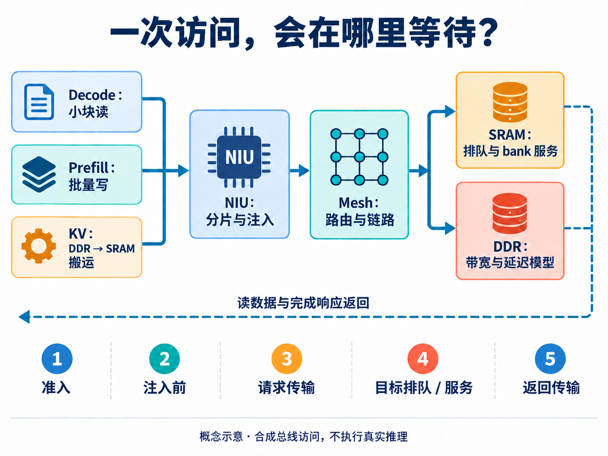
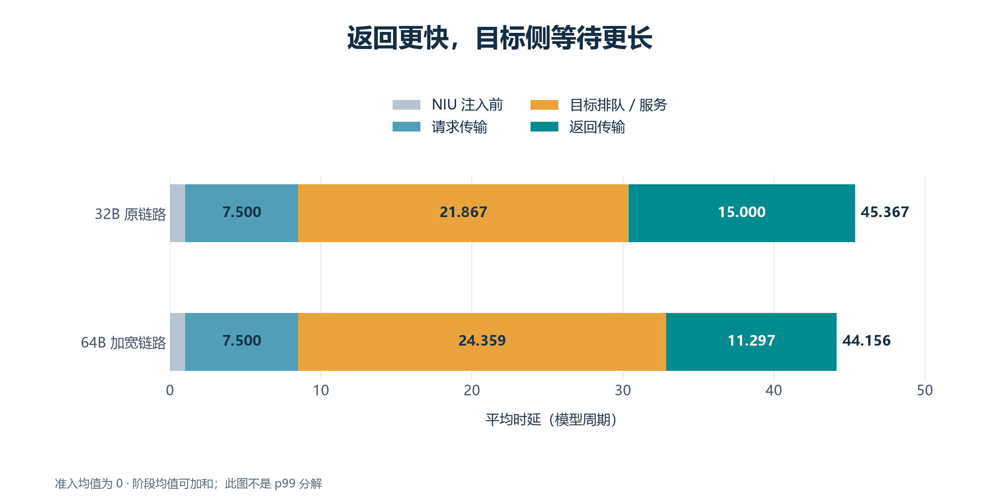
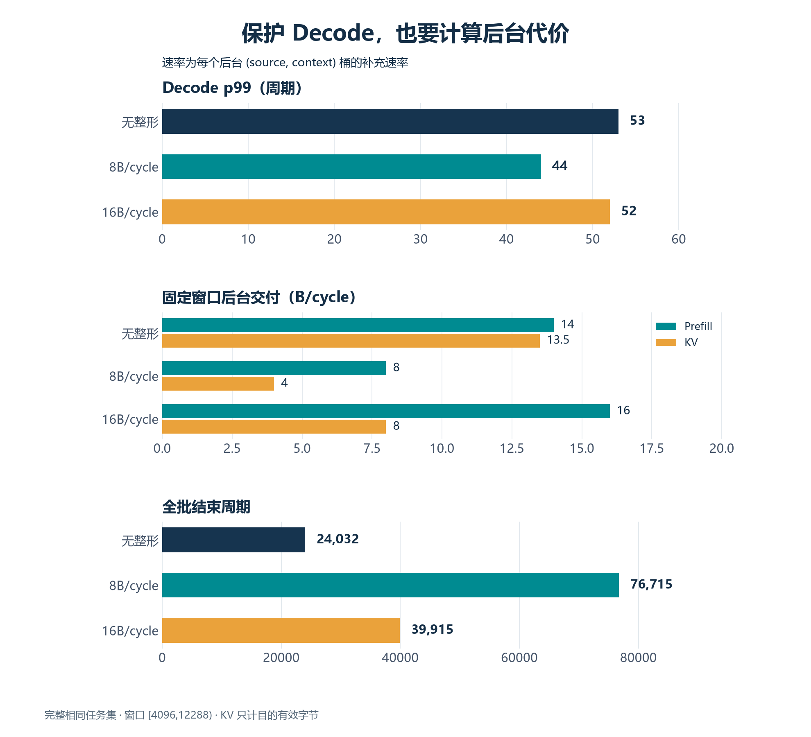

[English](README.en.md) | 简体中文

# 链路加宽了，为什么 Decode 反而更慢？一次 AI 辅助 NPU Mesh 架构探索

把 NPU 片上网络的链路从 256 bit 加宽到 512 bit，这组混合任务确实更快结束了：全批结束周期从 24032 提前到 14893，缩短约 38%。但同一组 Decode 请求的尾延迟却变差了，p99 从 53 升到了 59 周期。

如果只看批次完成时间，这次改动值得继续研究。如果目标是保护关键请求的响应时间，结论就没那么简单。

这组结果来自一次 AI 辅助的 ESL 探索。ESL（电子系统级）建模把系统行为、资源容量和时间关系放进可运行模型，用于在 RTL 实现之前比较架构方案。这里使用 SystemC 构建 NPU Mesh 总线子系统，回放合成访问流；它没有执行真实模型推理，也没有经过 RTL 周期校准。文中的周期用于比较这些模型配置，不代表真实芯片的 token 延迟。

这次实践关心的事情很具体：当读请求、批量写入和数据搬运同时进入片上网络，应该先加宽链路、调整存储服务，还是控制后台流量？AI 参与模型扩展、实验组织与检查，工程判断则要落在每种改动到底改善了什么、代价在哪里。

## 先分清：谁的“更快”

NPU 是面向神经网络计算的处理器。多个计算和存储节点之间，需要网络搬运数据；Mesh 则把路由节点连成网格，让事务逐跳到达目的地。

在语言模型推理中，Prefill 处理输入提示，Decode 逐步生成后续 token，KV cache 保存注意力计算所需的历史信息。它们给存储系统带来的访问方式不同。这次实验用三类总线流量表现这种竞争：Decode 对应小块读，Prefill 对应批量写，KV 对应 DDR 到 SRAM 的搬运。它们是访问模式的替身，并不包含算子执行过程。

全批完成时间关心所有工作何时结束；尾延迟关心较慢的那部分请求等了多久。后台大流量更快搬完，和关键小请求更少等待，是两个可以分开优化的目标。

本次固定 128 个 Decode 请求，统计从计划释放到完成的时延，包含准入等待和窗口结束后的排空。p99 采用 nearest-rank 方法，即把 128 个时延从小到大排序后取第 127 个。它描述这批有限样本的尾部，不是任意负载下的概率上界。

*图 1｜归档实验数据重绘，同一混合任务集。左边衡量整批结束时间，右边衡量 Decode 尾延迟；两边单位相同，但回答的问题不同。*

## 让 AI 搭一个会真实排队的实验台

为了研究等待，模型不能只给每次访问附加一个固定延迟。

这套模型让 NIU（网络接口单元）负责事务分片和注入；路由器按 XY 路径逐跳转发，把包分成链路传输单元。缓冲容量有限，下游返还可用容量的 credit 之前，上游不能无限发送。到达存储端后，请求还要竞争入口槽位和服务资源。

SRAM 端直接接入已有的控制器模型，经过实际建模的接口、地址映射、bank 仲裁与有限队列。DDR 端则使用明确的带宽、读写延迟、方向切换和排队模型，不细化到 DRAM 命令或 PHY。这样，链路、入口和存储服务都可能形成等待，修改一处参数会改变其他模块看到的到达节奏。

*图 2｜AI 生成的机制示意。流程按职责展开，不表示实际网格布局；虚线概括返回方向，响应仍经 Mesh 与 NIU 回到相应请求源。“目标排队/服务”是合并统计项，不能直接当作纯 bank 服务时间。*

AI 辅助工作的一个落点，是把这些职责转成可运行的接口、配置和实验入口：扩展存储接入，加入 NIU/DMA 并发窗口，再组织固定请求集的干扰对照。模型同时传递真实字节，读返回和最终存储内容由单独的 Python 字节参考模型核对，避免“时间跑完了，数据其实没搬对”。

这里仍需人来规定什么必须保持相同。若一次实验减少了后台任务，另一次又增加了链路宽度，两组完成时间就不能直接说明硬件参数的收益。能够自动扫很多点，只解决了执行问题；对照是否公平，要靠实验约束。

## 链路更快以后，等待转移到了哪里

以下干扰与 QoS 数据来自 2026-09-24 的归档实验，使用 SystemC 3.0.2、C++17。干扰实验采用 4×2 Mesh，原链路每周期传输 32B，SRAM 为 8 个 bank，存储端各有 16 个入口槽位。Decode 固定从 source 3 访问 router 0 的 SRAM：128 个 256B 读，从周期 4096 开始，每 64 周期释放一次。背景流量包括 1KB Prefill 写和 4KB DDR→SRAM KV 搬运，地址与 Decode 隔离。

每个资源对照保留相同的初始化、请求地址、标识、依赖和释放时间。加宽链路只把 32B 改为 64B，不删除后台任务。

| 场景 | Decode p99（周期） | 全批结束周期 |
| --- | ---: | ---: |
| Decode 独占 | 43 | 12269 |
| 混合原配置 | 53 | 24032 |
| 混合，链路加宽至 64B | 59 | 14893 |
| 混合，bank 接受间隔 2→1 | 47 | 24029 |

独占行用于观察 Decode 没有背景竞争时的表现，其任务集与混合不同，不能直接据全批时间比较配置。其他三行保留相同混合任务集。bank 接受间隔表示一个 bank 两次接受新操作之间的最小间隔；缩短它属于模型服务能力变化，不意味着物理电路能够免费做到。

接着把每个 Decode 请求拆成准入、NIU 注入前、请求传输、目标排队/服务和返回传输五段。

*图 3｜同一批 Decode 的阶段均值，单位为模型周期；均值可以相加，阶段 p99 不能相加。本批准入均值为 0。此图定位聚合等待变化，不是某个 p99 请求的逐段分解。*

链路加宽后，返回传输均值从 15 降到 11.297 周期，但目标排队/服务从 21.867 增加到 24.359 周期。总均值仍从 45.367 略降至 44.156，p99 却升到了 59：平均更快和尾部更慢可以同时发生。

这一结果支持一个解释：上游传输变快，改变了请求到达目标端的竞争时序。仅靠聚合数据，还不能把额外等待全部归因于某一条具体仲裁规则，但已经足以提醒我们，下一步要看目标侧，而不只是继续加宽网络。

另一个对照也很有用：把 bank 接受间隔从 2 改为 1，Decode p99 降到 47，全批结束周期却几乎不动。反过来，入口槽位从 16 加到 32，两项指标都没有变化。这组负载下，更多排队位置并没有解决问题。

全部对照都完成了 128 个 Decode 读，固定窗口内的 Decode 交付率都是 4B/cycle。尾延迟变化没有依靠丢弃慢请求或截断排空来制造，也不能把这个交付率换算成真实推理吞吐。

## 把 Decode 保护好，后台要付出多少

既然竞争影响尾部，接下来就可以研究 QoS，也就是不同流量之间的服务质量取舍。

这轮 AI 辅助扩展加入了 NIU 令牌桶整形：发送额度按周期补充，额度不够，请求就等待；它限制后台流量的注入速率与突发，不修改 Router 的轮询仲裁。这是按逻辑字节计费的机制，不是对物理链路利用率直接设上限。

QoS 对照保留完整的 128 个 Decode、288 个 Prefill 写、72 个 KV 搬运及 9 个初始化事务，所有混合配置使用相同输入文件。统计固定窗口 `[4096,12288)` 内成功交付的字节，同时继续运行到所有任务排空。

*图 4｜QoS 批次的完整相同混合任务集。8B 和 16B 均为每个后台 `(source, context)` 的逻辑字节补充速率；固定窗口交付减少的任务会在之后继续完成。*

8B/cycle 整形把 Decode p99 从 53 降到了 44，接近独占时的 43。但 Prefill 窗口交付从 14 降到 8B/cycle，KV 从 13.5 降到 4B/cycle，全批结束周期从 24032 增至 76715，约为原来的 3.19 倍。

KV 的 4B/cycle 也需要解释：源读与目的写都消耗令牌，KV 有效交付只计目的字节，不能把两次访问的收费额都记成任务吞吐。不同 `(source, context)` 的桶彼此独立，也不能把单桶 8B/cycle 当作全系统总配额。

16B/cycle 整形则只把 p99 降到 52，全批结束周期仍增至 39915。当前结果不足以把这两个速率中的任一个推荐为默认配置。它提供的价值，是让“保护关键流”的收益和账单出现在同一张图里。

存储入口优先级也做了对照：保持原生在途上限为 4 时，尚未测得收益。仅仅把并发压低到 1，反而让 p99 大幅恶化。因此后续方向应保留足够存储并发，再研究更温和的整形速率、突发和共享配额，而不是为了让优先级有机会选择请求，先制造一个新的瓶颈。

## AI 做出的实验，也要能被检查推翻

这轮工作里，一个比“全部通过”更有解释力的细节，是首次干扰试跑出现了负准入等待：请求被接受的时间，竟然早于计划释放时间。

问题出在回放器的外层循环比模型周期领先了一拍。修复后，释放判断统一使用模型周期，并检查 `release ≤ accepted ≤ done`。初次结果被作废，最终对照重新生成。这里没有用一个偏移量把图表修得好看，而是纠正了实验时基。

数据核对也不止检查一个退出码。每个探索点要核对读返回和最终存储字节、资源容量、完成和字节守恒，以及阶段事件与事务的一一对应。QoS 还逐次复算成功注入时的令牌收费，避免看似限速、实际漏计 DMA 子请求。

最后的 QoS 阶段通过了 49 项 CTest、51 项 Mesh Python 检查和 94 项共享兼容性检查。这些数量属于该阶段；它们支持功能与统计自洽，不等于性能已经与 RTL 对齐。独立编写的参考模型，也不自动构成独立第三方验证。

AI 能帮助扩展模型、组织扫描、追踪异常和修改实现；人的工作是持续约束证据：是否比较了同一组请求，是否保留全部任务，统计窗口和排空是否一致，改变的参数是否同时改变了问题本身。把这些约束写进自动检查，后续探索才不必每次靠人工翻日志重新确认。

## 下一轮 RTL 投入，先回答哪一个问题

这次实验没有选出一个无条件最优配置。它给出了更有用的方向：链路加宽对全批搬运有帮助，但不会自动改善 Decode 尾部；目标服务能力值得继续分析；后台整形确实能保护关键请求，但需要把交付率与完成时间一起评估。

如果下一轮只允许改一处，我会先围绕目标侧竞争和适度整形设计更细的对照，保持足够并发，再检查不同负载强度、相位、源目的位置和地址映射。是否值得增加链路位宽，还需要另外补上面积、布线和功耗证据。

对 AI 辅助芯片研发而言，这就是 ESL 实验的实际用途：把几个看起来都合理的架构选择，提前变成可以比较、可以被反例修正的问题。等到开始写 RTL 时，至少知道这次新增的硬件资源，准备改善哪一类等待。
