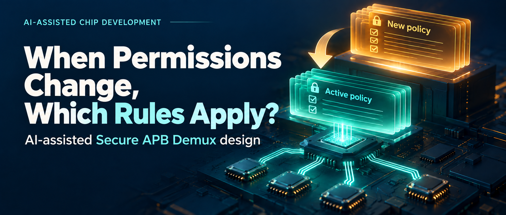
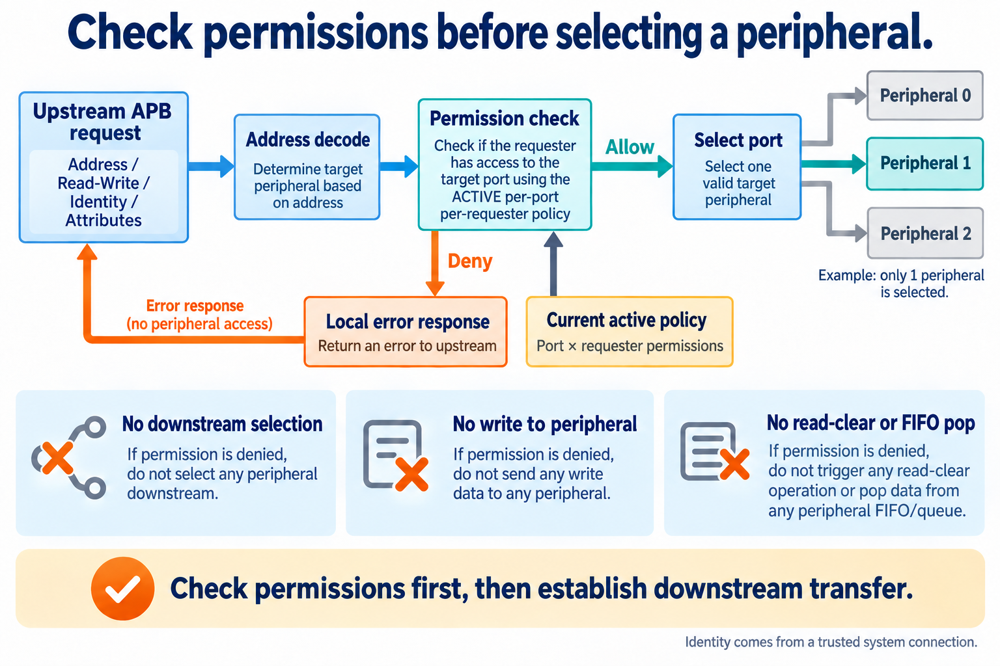
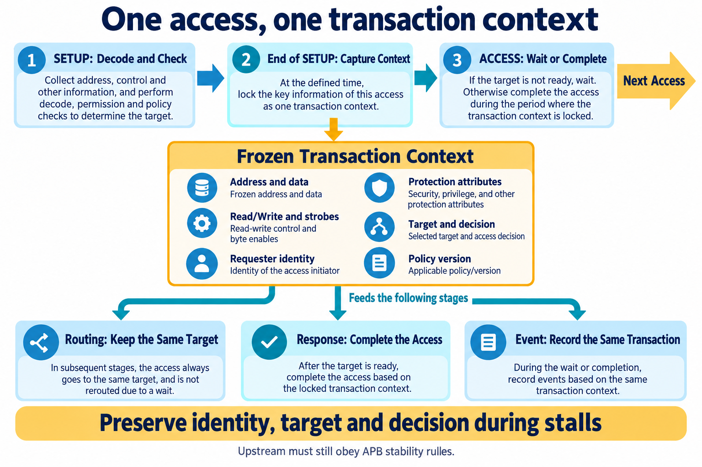
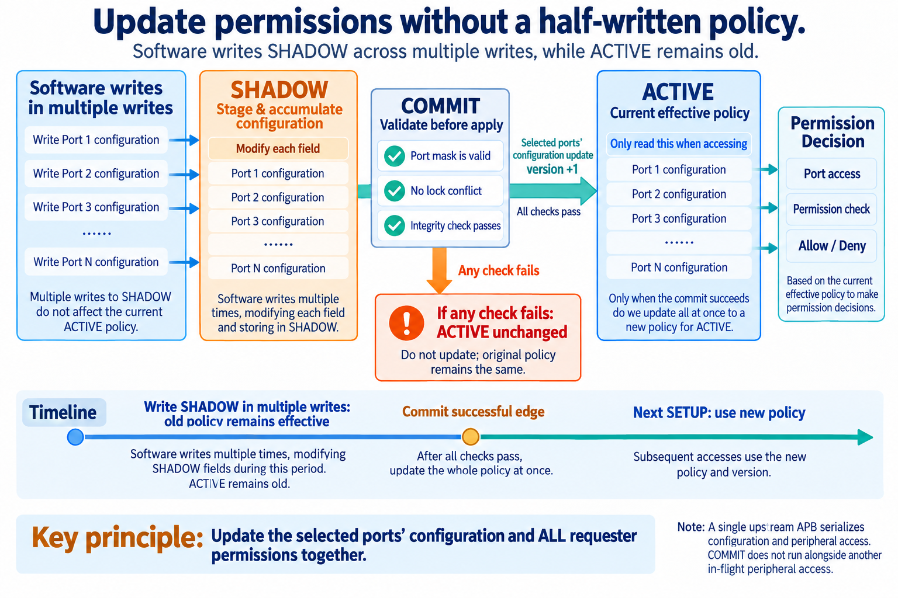
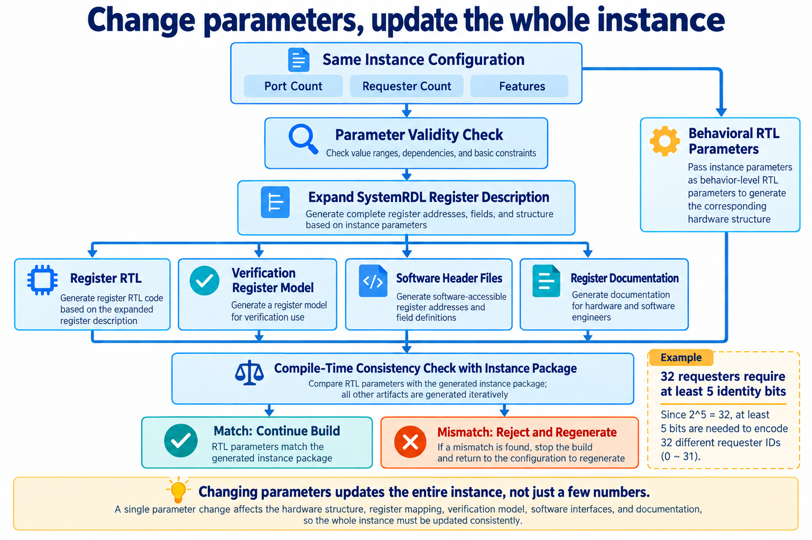

# AI-Assisted Peripheral Access Control: Request Filtering and Atomic Policy Updates

[简体中文](README.md) | English

Software is changing access permissions for a group of peripherals. Some requesters will become read-only, some will retain write access, and others will be blocked. The rules span multiple configuration registers. If every write takes effect immediately, the chip temporarily enforces a mixture of old and new permissions.

That raises several hardware questions. When should the new policy become visible? Who retains requester identity and target selection while an access waits for a peripheral? If the port count changes, will hardware, software, and tests still use matching register definitions?

This AI-assisted development exercise centers on a Secure APB Demux. It routes requests to peripherals and checks permissions before forwarding them. An IP-development Skill organized AI's work on requirements, architecture, RTL, register generation, and verification, with tool feedback guiding corrections.

Access control, policy updates, and parameterization are individually easy to describe. Their interaction within one block makes the design interesting.

## Check permissions before the peripheral sees a request

APB is an on-chip bus commonly used for peripheral registers. A demultiplexer routes one upstream interface to multiple downstream targets according to address. An IP is a reusable chip function.

The Secure APB Demux adds a permission check before routing. It receives the address, read/write direction, requester identity from trusted system connections, and protection attributes such as security and privilege. Each target-port/requester pair has its own permission configuration.

*Figure 1. Architecture concept. Allowed requests reach the selected port; denied requests receive a local error response.*

For example, a management processor may read and write a peripheral while another requester may only read it. A correct address identifies the target; identity and attributes determine access. System integration must preserve the association between a request and its identity, rather than allowing untrusted software to choose the identity freely.

Denial has a precise meaning: block downstream `PSEL` before establishing a transfer, then return an error upstream. An unauthorized write cannot change peripheral state. An unauthorized read cannot trigger read-to-clear behavior or pop a FIFO. Reads can have side effects too.

This is stronger than simply returning `PSLVERR`. APB permits a peripheral to change internal state even when returning an error, so an error alone does not prove the absence of side effects. This design blocks the request at admission. The [Arm APB specification](https://documentation-service.arm.com/static/64257f64314e245d086bc8b7?token=) describes that error-response boundary.

AI must make these outcomes explicit during requirements work so RTL and tests share the same behavioral basis. “Deny access” becomes a set of observable conditions.

## One access, one transaction context

APB separates SETUP, which prepares address and controls, from ACCESS, which waits for and completes the transfer. A peripheral extends ACCESS by keeping `PREADY` low.

During the wait, address, identity, permission decision, and selected port must continue to refer to the same access. This design stores them as one transaction context—a snapshot of the request.

Address decoding and permission evaluation happen during SETUP. At its ending clock edge, the block captures address, write data, byte enables, requester identity, protection attributes, target port, decision, and policy version together. Routing, responses, and event records then use that snapshot.

The request path has two modes. DIRECT can establish downstream selection through combinational permission checks during upstream SETUP. REGISTER first captures the request, then adds a downstream SETUP phase. Both must preserve transaction consistency. Adding a register does not by itself prove that timing improves along the entire path.

*Figure 2. Internal state organization. The context remains stable while waiting; the next access follows completion of the current one.*

This makes state ownership clear. Routing does not select the target again, and event logic does not reconstruct requester identity. Denials and downstream errors are recorded with address, identity, and policy version from the same source.

The upstream interface must still obey APB stability requirements. Internal snapshotting does not permit it to change a request during a wait. The [Arm APB specification](https://documentation-service.arm.com/static/64257f64314e245d086bc8b7?token=) defines which signals must remain stable.

AI can help list the information that survives across cycles, then identify which modules own it and which only consume it. Review can follow concrete state rather than just check whether the block diagram looks complete.

## Prepare the new policy separately, then commit it together

Multiple register writes cannot update the whole policy in one bus operation. This design therefore maintains two copies:

- **ACTIVE:** the currently enforced policy, read by access checks.
- **SHADOW:** the policy being prepared through successive software writes.

After preparing SHADOW, software issues COMMIT with a mask selecting the ports to update. Hardware checks the mask, lock conflicts, and integrity status. If all checks pass, it copies the selected ports' configuration and all their requester permissions into ACTIVE on the same clock edge, then increments the policy version.

*Figure 3. Policy-update concept. The selected ports update together on success. On failure, the previous ACTIVE policy remains unchanged.*

Atomic commit exposes only the before and after states. If one selected port fails validation, the others do not update early.

This block has a single upstream APB interface. Configuration commands and peripheral accesses are serialized, with no background transaction queue. COMMIT does not execute alongside another in-flight peripheral access. After a successful commit, the next SETUP uses the new ACTIVE policy and version. Capturing the version in each transaction context associates later events with the policy used at admission.

AI's detailed-design work must specify update scope, validation timing, retained state on failure, and version increment conditions. These must connect to RTL and tests.

RTL—register-transfer level—describes stored state, clock-edge updates, and data movement. Atomicity ultimately depends on those update conditions, not just a sentence in a requirements document.

When integrity protection is enabled, policy tables retain check bits and lock state uses redundant encoding. A parity mismatch or illegal lock encoding blocks new accesses and latches a fault. These mechanisms detect the covered storage faults; parity cannot detect arbitrary multi-bit errors and is not a complete security proof.

## A parameter change affects the whole instance

Port count, requester count, event-queue depth, and request-path mode are configurable. Parameterization selects a hardware instance from one design, but the parameters are not independent.

For example, 32 requesters need at least five identity bits; four bits represent only 16 identities. Port address windows must not overlap. The build entry point should reject these violations before system accesses expose them.

Some parameters determine whether a feature exists. `EVENT_FIFO_DEPTH=0` removes the event FIFO, a first-in, first-out queue of event records. It does not remove all event functions: first/last snapshots and counters retain their own logic. Depth one and non-power-of-two depths introduce different pointer and same-cycle-operation boundaries.

Changing port or requester count also changes permission tables and register arrays. Updating top-level RTL parameters while retaining old register hardware and software headers can produce incompatible definitions.

*Figure 4. Instance construction. A legal configuration determines register structure; compile-time checks prevent mixing artifacts from different instances.*

The generation path first validates configuration, then expands a SystemRDL template. SystemRDL describes register addresses, fields, access properties, and reset values. Tools generate register RTL, software headers, documentation, and the verification register model.

The build also generates an instance-parameter package. Top-level parameters must agree with it. Changing the port count without regenerating the associated artifacts therefore fails compilation and requests regeneration.

AI helps define constraints, write templates, and analyze build feedback. Deterministic tools expand the register structure so multiple artifacts derive from the same input. Parameter changes follow an explicit propagation path.

## When a test fails, which layer should change?

The Skill organizes requirements, architecture, detailed cycle behavior, registers, RTL, and verification. This project contains 169 requirements. Those layers matter when debugging: a failure may arise from code, requirement interpretation, or the checker. Neither side is automatically correct.

One example concerns responses in idle and SETUP. This IP specifies `PREADY=1`, `PSLVERR=0`, and `PRDATA=0` after reset is released when no valid ACCESS is in progress. A workflow rerun found disagreement between RTL and the checker. The investigation returned to requirements and detailed design, corrected RTL, expanded checks, and fixed data checking during wait cycles.

The protocol and the project contract differ here. APB permits any `PREADY` value when `PENABLE=0`; fixing it to one is this IP's choice. A checker must distinguish protocol requirements from additional product behavior. The [Arm APB specification](https://documentation-service.arm.com/static/64257f64314e245d086bc8b7?token=) defines the signal's valid phase.

The repair process is therefore specific: locate the failure, verify the behavioral basis, find the earliest layer where the interpretation diverges, then update implementation and checks together. Once tests pass again, verify that the checks were not inadvertently weakened.

## What this round established

The September 14, 2026 records show 10/10 module checks passing and 17/17 UVM regression cases passing for the typical DIRECT configuration with seed 42. UVM is a hardware-verification methodology and class library for stimulus, checkers, and tests. Regression reruns those tests against the current design.

These results apply to the configurations and cases actually executed. They do not establish verification across the full parameter space or product sign-off.

The same typical configuration underwent a single-point synthesis check. Synthesis maps RTL into process-library cells and estimates area and timing.

| Item | Typical DIRECT configuration |
| --- | --- |
| Configuration | 8 ports, 16 requesters, 32-bit addresses, event FIFO depth 8 |
| Synthesized cell area | 38184.94 µm² |
| Clock constraint | 10 ns, or 100 MHz |
| Critical-path slack | 0.01 ns |
| Mapping checks | Zero unmapped cells; zero latches |

The run used Synopsys DC V-2023.12-SP3 and a GF 28nm LP high-threshold-voltage library at typical conditions, 1.0 V and 25°C, with 0.2 ns clock uncertainty and 2.0 ns I/O delays. Area sums mapped cells. Slack measures remaining arrival-time margin: 0.01 ns meets this constraint with little headroom. This is a single-point synthesizability characterization, not power, performance, and area (PPA) sign-off across configurations and physical chip conditions.

The results guide the next round. Double-buffered policies, event records, and diagnostics have real cost and must be considered alongside the datapath. AI can organize configurations, run checks, and summarize differences; the engineer decides which features justify their costs for the application.

## Connect AI's work to the design rationale

The main choices have explicit reasons. Permission checks precede downstream selection to prevent unauthorized side effects. One context keeps transaction information aligned. SHADOW preparation and atomic commit avoid mixed policies. A single instance configuration keeps register artifacts consistent with parameter changes.

AI helped develop those decisions, implement them, verify them, and trace failures back to their source. The Skill connected the work; tool results made each step inspectable.

When requirements change, the next iteration can identify the state, rules, and generation entry points to modify—and the behaviors to recheck. It need not restart from an isolated prompt.
