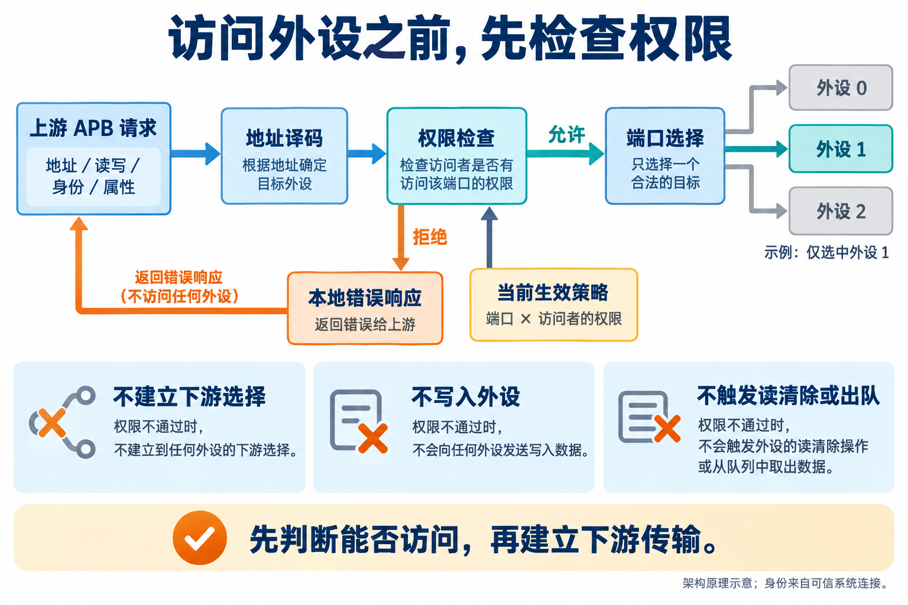
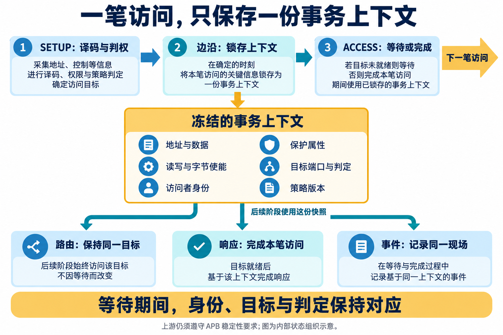
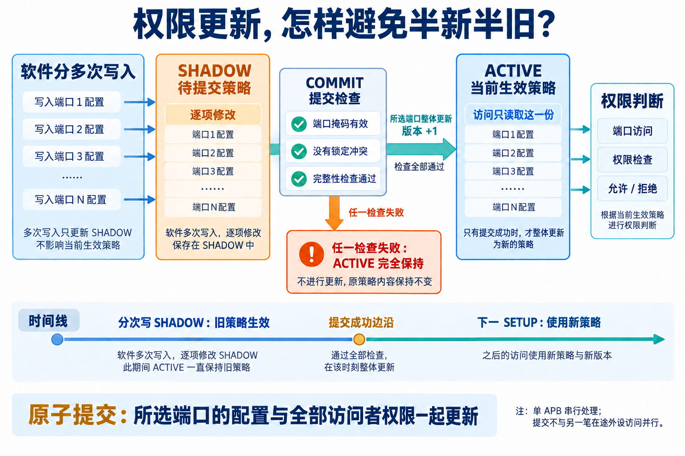
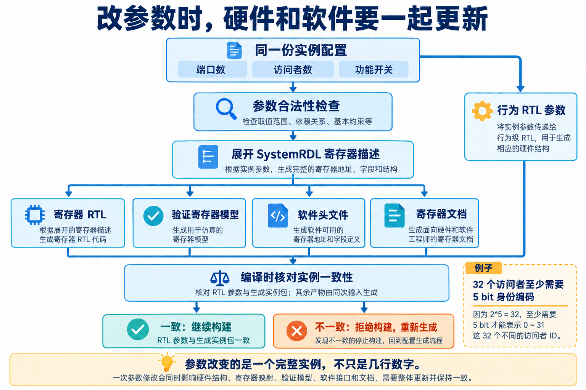

# AI 辅助设计外设访问控制 IP：从请求拦截到权限原子更新

简体中文 | [English](README.en.md)

软件准备调整一组外设的访问权限：有些模块以后只能读，有些还能写，还有些需要彻底禁止访问。这些规则通常放在多个配置寄存器里，要分多次写入。如果每写一项就立即生效，写到一半时，芯片执行的就是一套“半新半旧”的权限。

对硬件设计来说，这个问题会继续牵出一串选择：新规则什么时候生效？一笔访问等待外设响应时，身份和目标端口由谁保存？端口数量改变后，硬件、软件和测试使用的寄存器定义还能否保持一致？

这次 AI 辅助研发实践，就围绕一款 Secure APB Demux 展开。它负责把访问分发给不同外设，并在转发前检查权限。我使用面向 IP 研发的 Skill，组织 AI 参与需求拆解、架构与电路设计、寄存器生成和验证，再依据工具反馈修正设计。

这个案例有意思的地方，在于多个功能如何配合。访问控制、策略更新和参数化各自都不难描述，把它们放进同一个模块后，许多设计决定必须一起考虑。

## 外设收到请求之前，权限就要判断完

APB 是芯片内部常用于外设寄存器访问的总线。Demux 可以理解为“一路输入、多路输出”的分发器：根据地址，把上游请求送到对应外设。IP 则是可复用的芯片功能模块。

Secure APB Demux 在分发前增加权限检查。除了地址和读写方向，它还接收来自可信系统连接的访问者身份，以及请求携带的安全、特权等属性。每个“目标端口 × 访问者”组合都有自己的权限配置。

*图 1｜架构原理示意。允许的请求送到选中的端口，被拒绝的请求在本地完成错误响应。*

例如，同一个外设可以允许管理处理器读写，却只允许另一个访问者读取。地址正确，只说明找到了目标；是否能访问，还要看这笔请求的身份和属性。身份与请求的对应关系需要由集成系统保证，不能由不受信任的软件随意指定。

这里的“拒绝”也有明确含义：从下游传输建立之前就阻断选择信号 `PSEL`，随后向上游返回错误。不让非法写入改变外设状态，也不让非法读取触发“读后清除”或 FIFO 出队——有些寄存器被读一次就会清除状态，队列被读一次就会取走数据，读取同样可能有副作用。

这比单纯返回 `PSLVERR` 错误信号要求更强。APB 协议允许外设在返回错误时已经改变内部状态，因此“收到错误”本身并不能证明访问没有产生副作用。本设计选择在入口阻断请求。[Arm APB 协议规范](https://documentation-service.arm.com/static/64257f64314e245d086bc8b7?token=)对错误响应的这一边界有明确说明。

AI 在需求阶段要先把这些结果写清楚，后面的电路和测试才有共同依据。“拒绝访问”由此变成了可以逐项检查的行为。

## 一笔访问，只保存一份上下文

APB 访问分为两个阶段：SETUP 准备地址和控制信息，ACCESS 等待并完成传输。如果外设尚未准备好，`PREADY` 保持为低，ACCESS 就会延长。

在这段等待时间里，地址、身份、权限判断和目标端口必须始终对应同一笔访问。本设计把它们集中保存为一份“事务上下文”，也就是这笔请求的完整快照。

在 SETUP 阶段完成地址译码和权限判断，在该阶段结束的时钟边沿，一次性保存地址、写数据、字节使能、访问者身份、保护属性、目标端口、判定结果和策略版本。后续的路由、响应与事件记录都使用这份快照。

请求路径有两种模式。DIRECT 模式可以在上游 SETUP 期间，经组合判权后建立下游选择；REGISTER 模式则先保存请求，再增加一个下游 SETUP 阶段。两者都需要保持后续事务信息一致，不能仅凭“加了寄存器”就推断整条通路的时序一定改善。

*图 2｜内部状态组织示意。等待期间保持上下文，当前访问结束后再接收下一笔。*

这样安排的作用，是让状态的归属清楚。路由逻辑不需要重新决定目标端口，事件记录也不需要重新拼凑访问者身份。发生拒绝或下游错误时，记录中的地址、身份和策略版本有一致的来源。

上游仍然必须遵守 APB 的稳定性要求，不能在等待期间随意改变请求。这份快照是内部组织方式，并不放宽外部协议约束。[Arm APB 协议规范](https://documentation-service.arm.com/static/64257f64314e245d086bc8b7?token=)也规定了等待期间需要保持不变的信号。

这类架构讨论很适合让 AI 参与：先列出一笔请求有哪些跨周期信息，再检查哪些模块保存它们、哪些模块只读取它们。工程师审阅时，就可以沿着具体状态检查设计，而不只看模块框图是否完整。

## 新权限先写到旁边，再整体生效

回到开头的权限更新问题。软件要修改多个寄存器，一次总线写入无法覆盖全部内容，所以本设计维护两份策略：

- **ACTIVE**：当前生效的策略，访问检查从这里读取。
- **SHADOW**：准备中的策略，软件可以分多次修改。

写完 SHADOW 后，软件提交一次 COMMIT 命令，指定本次更新哪些端口。硬件先检查端口掩码是否合法、是否存在锁定冲突，以及完整性状态是否正常；全部通过后，在同一个时钟边沿，把所选端口的配置及全部访问者权限复制到 ACTIVE，并增加策略版本号。

*图 3｜策略更新原理示意。提交以所选端口为范围，成功则整体更新，失败则保持原来的 ACTIVE。*

这就是原子提交：对外可见的状态只有提交前和提交后，不暴露更新到一半的中间结果。如果所选端口中有一个不满足条件，其他端口也不会先更新。

需要区分的是，本设计只有一条上游 APB，配置命令与外设访问串行处理，没有后台事务队列。COMMIT 不会和另一笔在途外设访问同时执行；提交成功之后，下一笔 SETUP 使用新 ACTIVE 和新版本。事务上下文保存版本号，方便把后续事件对应到当时使用的策略。

AI 在这里需要协助细化的内容，已经超出一个“提交”按钮：更新范围是什么、什么时候检查、失败时保留哪些状态、版本何时增加，都要进入详细设计，并与 RTL 和测试对应。

RTL 是寄存器传输级描述，用来表达电路如何保存状态、在时钟边沿更新状态，以及数据怎样流动。原子性最终就落实在这些更新条件中，不能只停留在需求文档的一句话里。

启用完整性保护时，策略表还会保存校验位，锁状态采用冗余编码。检测到校验不一致或非法锁编码后，设计阻断新的访问，并锁存故障状态。这些机制用于检测所覆盖的存储异常；奇偶校验并不能检测任意多位错误，也不等同于完整的安全证明。

## 改参数时，要一起改变的是整个实例

这款 IP 的端口数、访问者数量、事件队列深度和请求路径模式都可以配置。参数化的含义，是从一份设计中选择不同规格的硬件实例，但参数之间并非互相独立。

例如，32 个访问者至少需要 5 bit 身份编码，4 bit 只能表达 16 种身份。端口地址窗口也不能互相重叠，否则同一个地址可能指向两个目标。这些约束需要在构建入口检查，而不是等到系统访问出错后再排查。

还有些参数会改变功能是否存在。`EVENT_FIFO_DEPTH=0` 表示不生成事件 FIFO；FIFO 是先进先出的队列，用来保存多条事件记录。关闭它不等于关闭全部事件功能，首末事件快照与计数仍有各自的逻辑。深度为 1 或非 2 的幂时，指针和同周期操作又有不同的边界条件。

端口与访问者数量变化，也会改变权限表和寄存器数组。只修改顶层 RTL 参数，却继续使用旧的软件头文件和寄存器电路，可能得到两套彼此不一致的定义。

*图 4｜实例构建方法示意。合法配置决定寄存器结构，编译检查阻止不同实例的产物混用。*

这次采用的生成路径，是先校验配置，再展开 SystemRDL 模板。SystemRDL 是描述寄存器地址、字段、访问属性和复位值的语言，工具据此生成寄存器 RTL、软件头文件、文档和验证使用的寄存器模型。

构建时还会生成一份实例参数包。顶层参数必须与它一致；如果修改了端口数却没有重新生成配套产物，编译会直接拒绝，要求重新生成。

AI 可以协助定义参数约束、编写模板和分析构建反馈。重复展开寄存器结构的工作则交给确定性工具，让多份产物来自同一次输入。这样，参数修改的影响能沿着明确的路径传递。

## 测试报错后，回到哪一层修改

把这些工作组织起来的 Skill，可以理解为供 AI 执行的一套工程说明：需求阶段定义外部行为，架构阶段确定职责与状态归属，详细设计规定周期级行为，再进入寄存器、电路和验证实现。

这次工程整理了 169 条需求。分层的价值在后续修改时尤其明显：失败可能来自代码，也可能来自需求理解或检查规则，不能一看到测试报错就默认某一边正确。

一个实际例子是空闲与 SETUP 阶段的响应值。本项目约定，在复位已释放且没有有效 ACCESS 时，`PREADY=1`、`PSLVERR=0`、`PRDATA=0`。一次流程重跑发现，RTL 与检查器对这组约定的处理不一致；随后回到需求和详细设计核对，修复 RTL、补充检查，并修正等待周期中的数据判断。

这里要把两层规则分开：APB 协议允许 `PENABLE=0` 时的 `PREADY` 取任意值，固定为 1 是本 IP 选择的接口行为。检查器既要检查协议要求，也要检查项目额外约定，不能把两者混为一谈。[Arm APB 协议规范](https://documentation-service.arm.com/static/64257f64314e245d086bc8b7?token=)给出了这一信号的有效阶段。

对 AI 辅助设计而言，这是一条具体的修改路径：定位失败，核对行为依据，找到最早出现分歧的设计层，再同步修改实现与检查。测试恢复通过之后，还要确认检查条件没有被无意放宽。

## 这一轮，已经获得哪些结果

2026 年 9 月 14 日的工程记录中，模块级检查为 10/10 通过；典型 DIRECT 配置、随机种子 42 的 UVM 回归为 17/17 通过。UVM 是组织硬件激励、检查器和测试用例的一套常用验证方法与类库；“回归”则是重新执行一组测试，确认当前实现符合预期。

这些结果对应实际执行的配置和用例，不能扩展为全参数空间均已验证。本文展示的是这轮设计实践，尚不把它表述为完成全范围验证或产品交付签核。

同一典型配置还完成了单点综合检查。综合工具把 RTL 映射成工艺库中的电路单元，检查它能否形成完整电路，并估计面积与时序。

| 项目 | 典型 DIRECT 配置结果 |
| --- | --- |
| 配置 | 8 个端口、16 个访问者、32 bit 地址、事件 FIFO 深度 8 |
| 综合单元面积 | 38184.94 µm² |
| 时钟约束 | 10 ns，即 100 MHz |
| 关键路径时序裕量 | 0.01 ns |
| 映射检查 | 零未映射单元、零锁存器 |

使用的工具为 Synopsys DC V-2023.12-SP3，GF 28nm LP 高阈值电压单元库，典型工艺条件、1.0 V、25°C；时钟不确定度为 0.2 ns，输入输出延迟为 2.0 ns。面积是综合单元面积之和，时序裕量表示数据到达距离截止时间还剩多少余量，0.01 ns 说明本轮满足约束但余量很小。这是单点可综合性表征，不能替代不同配置和实际芯片条件下的 PPA 签核；PPA 指功耗、性能与面积。

这些反馈也为下一轮设计提供了方向。权限双缓冲、事件记录和诊断逻辑都有实际成本，比较不同配置时，需要把它们与数据通路一起考虑。AI 可以继续协助组织配置、运行检查和整理差异，工程师据应用目标决定哪些功能与开销值得保留。

## 把 AI 的工作接到设计依据上

回看这个案例，几处关键选择都有清楚的因果：为避免非法访问产生副作用，权限检查放在下游选择之前；为保持一笔访问的信息对应，使用统一事务快照；为避免策略半新半旧，采用 SHADOW 准备与原子提交；为避免参数修改后软硬件失配，让寄存器产物从同一实例配置生成。

AI 参与了这些选择的展开，也参与了实现、验证和问题回溯。Skill 帮助它沿着设计关系持续工作，工具结果则让工程师能够检查每一步落到了哪里。

这种协作留下的价值很具体：下次需求变化时，可以找到该改的状态、规则和生成入口，并知道要重新检查哪些行为。设计不必每次都从一段孤立的提示词重新开始。
