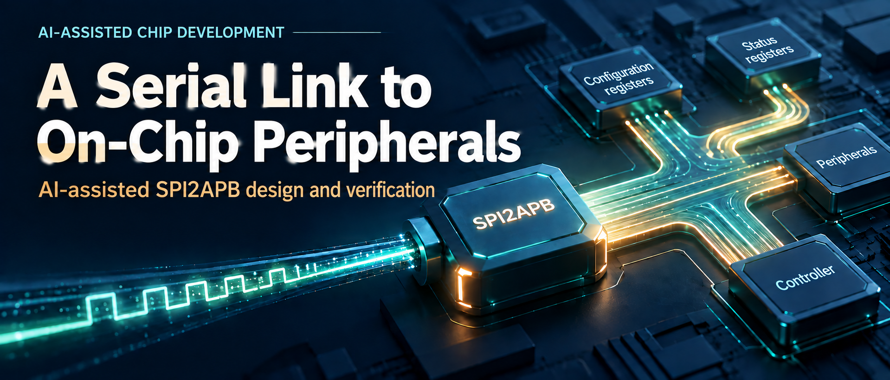
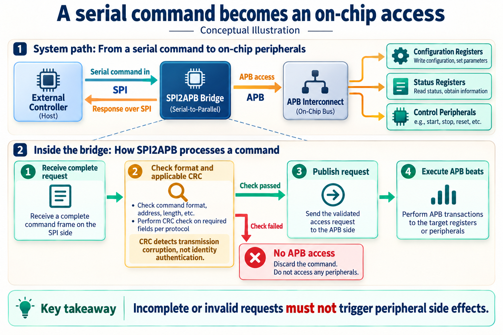
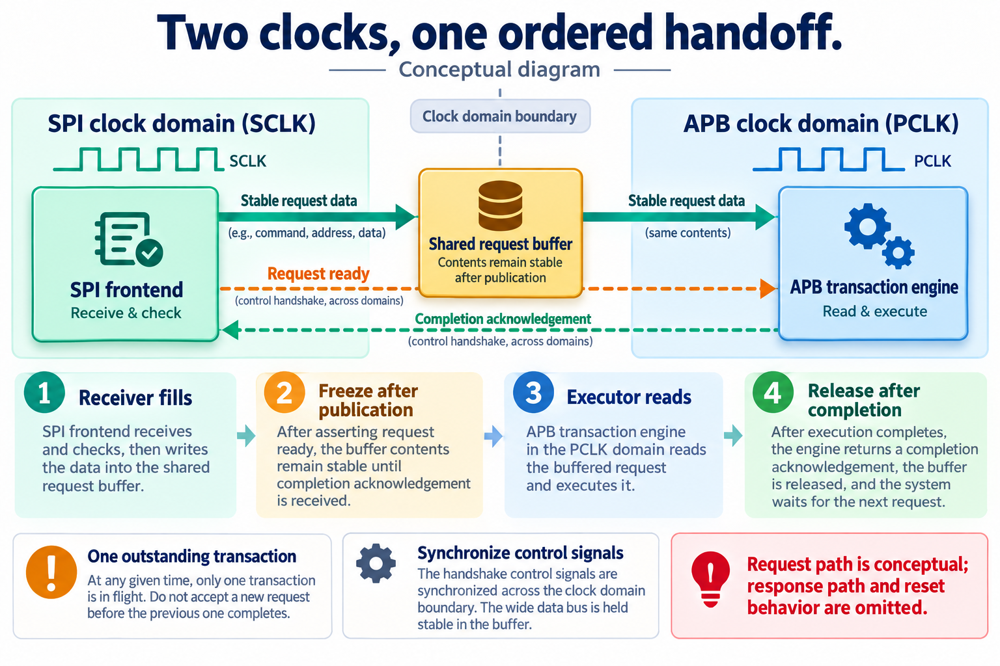
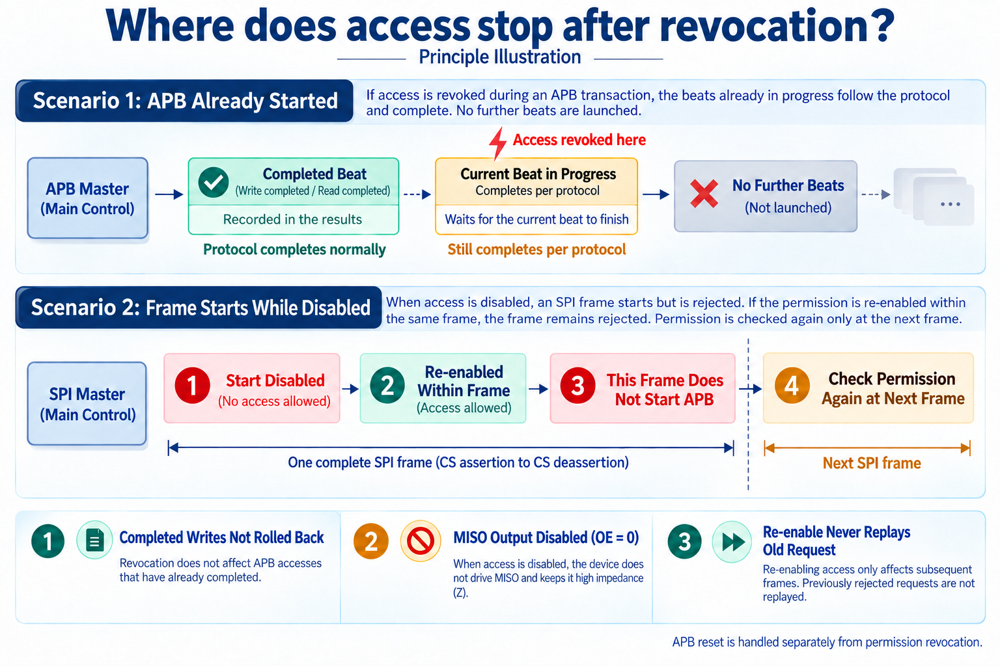
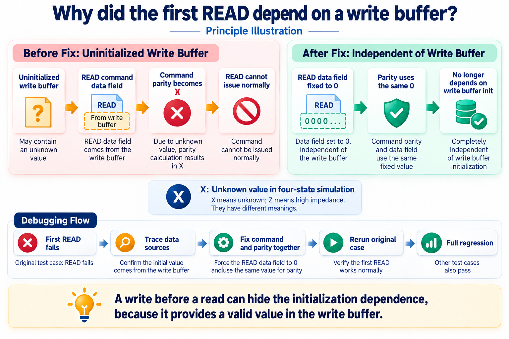

# Reaching On-Chip Peripherals over SPI: AI-Assisted SPI2APB Design and Verification

[简体中文](README.md) | English

A chip may not yet be running its full software stack, while an external controller already needs to read status, change configuration, or trigger a test. Exposing every internal signal through a pin is impractical. A small serial interface can instead carry commands to internal registers.

SPI2APB provides that bridge: it receives serial commands and converts them into on-chip bus accesses.

The basic function sounds straightforward. Implementation raises more specific questions. Can register writes begin before the whole command arrives? What happens to an internal access when the external clock stops? If permission is revoked halfway through a frame, can a write already in progress be canceled?

I used this IP for an AI-assisted development exercise spanning requirements, architecture, RTL, tests, and synthesis analysis. Following a request through the design shows how those questions become circuit behavior and how tool feedback guides AI's revisions.

## Receive a complete request before accessing the bus

SPI is a synchronous serial interface. The external master supplies SCLK, uses chip select CS to delimit a communication frame, sends data over MOSI, and receives data over MISO. Sending bits serially reduces the required pin count.

APB is an on-chip bus commonly used for peripheral registers. The bridge assembles the command's address, read/write direction, and data, then initiates APB transfers. An IP is a reusable function that can be integrated into different chips.

*Figure 1. Conceptual path. The peripherals and interconnect are application examples. This design receives and checks a request before allowing APB execution.*

SPI defines wire-level transfer behavior, not which register to read or how much data to write. Both ends therefore need a command format.

This design uses a nine-byte header carrying command, access attributes, transaction identifier, beat count, address, and CRC8. Write commands also carry a payload. CRC is an error-detection code: the header uses CRC8, write payloads can enable CRC16, and responses carry CRC16. It detects corruption; it does not authenticate requester identity.

**A request must arrive in full and pass the applicable format and integrity checks before APB access begins.** This determines buffering, publication timing, and where errors are stopped.

If chip select is released halfway through a write command, an already decoded address must not cause partial register writes. Peripheral accesses can have side effects: a write can start a task, and a read can clear interrupt status. Returning an error afterward does not undo the access.

After submitting a request, the master must continue sending filler bytes to provide SPI clocks for the response. Each chip-select frame carries only one command. Bytes during waiting and response phases are not interpreted as another command.

The design supports all four SPI modes through a static parameter, 32-bit APB data, 16- or 32-bit addresses, and maximum transfer lengths of 1, 16, or 64 beats. Here, a beat means one APB transfer, which may take multiple clock cycles if the peripheral inserts waits.

## Who owns the data across two clocks?

SCLK comes from the external controller; PCLK is the internal APB clock. They run independently and may stop independently. A clock-domain crossing cannot assume the destination samples a state at exactly the right moment.

Multi-bit data adds another concern: the destination must not observe a mixture of old and updated fields. This design expresses the solution through buffer ownership.

The SPI frontend receives and validates the request. After publication, the descriptor and request buffer remain stable and the frontend cannot overwrite them. The APB transaction engine reads that content and executes the beats. The buffer becomes reusable only after completion releases ownership. Only one transaction may be outstanding.

*Figure 2. Request-side concept. Control handshakes notify and acknowledge; wide data stays stable during handoff. Response and reset paths are omitted.*

A cross-domain mailbox carries ready and acknowledgment controls. Prepare the content, notify the consumer, then acknowledge that it has finished using it. The implementation must still meet the relevant clock-crossing timing constraints; the diagram alone is not proof of CDC safety.

On the APB side, the transaction engine chooses the next address and data. The APB executor handles SETUP, ACCESS, and signal stability during waits. Command interpretation and bus handshaking can then be checked separately.

A small example shows why detailed rules matter. An APB4 byte write of `0x5a` to byte address `0x102` must produce:

| Signal | Value | Meaning |
| --- | --- | --- |
| PADDR | `0x100` | Address of the aligned 32-bit word |
| PWDATA | `0x005a0000` | Data in the selected byte lane |
| PSTRB | `0100` | Update only that byte |

Address alignment, data shifting, and strobes must use the same rule. APB3 lacks byte strobes, so this implementation rejects 8- and 16-bit narrow writes instead of expanding them into word writes that could overwrite neighboring bytes.

AI must keep the protocol description, address logic, RTL, and expected results consistent. Generating their files independently does not guarantee those relationships.

## Where should access stop after revocation?

Trusted on-chip controls authorize external access. When disabled, the bridge deasserts MISO output enable and sends no SPI response. Trusted-side status or interrupts can still report relevant errors.

Transitions are more subtle. If a frame begins while disabled and the interface becomes enabled halfway through, can the rest of that frame execute?

This design says no. Mid-frame re-enabling does not make the old frame valid; permission is checked again for a new frame. Development exposed a counterexample, leading to corrected frame-level permission retention and tests before frame start, within a frame, and while clocks were stopped.

*Figure 3. Ordinary abort and revocation concepts. The two scenarios distinguish APB beat boundaries from SPI frame boundaries. APB reset is handled separately.*

If revocation arrives after an APB transfer starts, the transfer cannot be dropped arbitrarily. The current beat completes according to the protocol; no new beat starts. Completed writes are not rolled back.

Software retry policy must account for this. A multi-beat write may finish only its first few beats. Software should use completion counts and error information rather than blindly replay the entire command, which could repeat peripheral side effects.

Stopped clocks add another case. An event sampled only on a clock edge could be missed if it changes briefly while the clock is stopped. The project retains relevant events and tests behavior after both SPI and APB clocks resume.

The engineer chooses the no-replay policy. AI can expand it into checks at different points in time and update the design, implementation, and tests together. An abstract requirement becomes executable verification work.

## The first read after power-up exposes an initialization dependency

One debugging case was especially instructive.

The project added parity protection to pending internal commands, covering address, direction, data, and byte strobes. Parity stores extra check information to detect the specified single-bit changes.

Afterward, a reset-recovery test failed on the first READ after power-up, before any successful write. Several later checks failed because the transaction never completed.

A READ needs no write payload, but the old preparation logic still read the write buffer into the command data field and included it in parity. The wide buffer was not globally reset, so its initial value was unknown, `X`, in four-state simulation. An irrelevant data field now affected whether a read command could issue.

Tests that always write before reading can hide this dependency by filling the buffer with known values. A first-read test exposed it.

*Figure 4. Debugging concept, not a waveform screenshot. X denotes an unknown in four-state simulation.*

The fix sets READ command data to zero and uses that same zero for parity. Reads no longer depend on write-buffer initialization, while the wide buffer remains without a global reset.

AI helped connect failure order, state transitions, and parity inputs, then make the related changes. The original failing case was rerun before the full regression. Execution results supported the proposed explanation.

This suggests a useful review question: **If a field is unused by the operation, is it still consumed by control, integrity, or comparison logic?** Adding protection to an existing datapath can reveal such dependencies.

## Check AI's changes through independent observations

The IP-development Skill connects requirements, architecture, implementation, verification, and tool execution into repeatable work, keeping changes linked to checks.

AI clarified ambiguous requirements, updated RTL and descriptions together, expanded fault-injection scenarios, invoked tools, and investigated feedback. The engineer determined interface policy, fault scope, and tradeoffs.

For example, “buffer corruption must not become an incorrect APB access” requires a defined fault model. This round checks single-bit changes in data, masks, and descriptors, plus not-ready and out-of-range internal accesses. Multi-bit common-cause corruption and faults in the checking logic itself are outside that claim. A defined scope gives hardware protection and fault injection the same target.

Verification also needs independent observation points. The SPI side observes actual pin-level requests and responses. The APB side records accepted transfers. Checks compare data, status, and whether forbidden accesses occurred. An independent implementation computes expected CRCs rather than calling the DUT's CRC function.

For covered corruption, checking the error code is insufficient. The test also verifies that no extra APB transfer occurred and that a subsequent legal transaction can recover.

The final regression record through September 24, 2026 reports:

| Scope | Result | Interpretation |
| --- | --- | --- |
| Module tests | 11/11 passed | Parser, mailbox, transaction engine, and other units |
| End-to-end regression | 64 UVM tests and one C-driver test passed | Eight representative configurations spanning APB3/APB4 and all four SPI modes |
| Fault injection | 1,872 checks passed | Specified field corruption and internal-access faults |
| Parameter checks | 48 legal combinations elaborated; four illegal classes correctly rejected | Structural legality; full functional simulation used the eight configurations above |

UVM organizes the verification environment. Elaboration resolves parameters and module hierarchy into a concrete design. These answer different questions: successful elaboration is not full functional verification of every configuration.

The results refer to particular source versions, configurations, and regression batches. Full coverage targets and advanced CDC/reset-domain sign-off remain further work; this article describes an IP-level development exercise.

## Synthesis turns capacity into circuit cost

RTL describes behavior; synthesis maps it to gates and registers and estimates area and timing. PPA—power, performance, and area—helps assess suitability for a target system.

This synthesis uses a 28nm HVT standard-cell library at typical conditions, 1.00 V and 25°C, with PCLK constrained to 100 MHz and SCLK to 25 MHz. Two capacity points illustrate the cost:

| Configuration | Maximum beats | Synthesized area |
| --- | ---: | ---: |
| Default | 64 | 23326.87 µm² |
| Single-beat | 1 | 5265.70 µm² |

The single-beat version offers a smaller option for occasional register accesses. Systems needing consecutive transfers retain the larger capacity. The feature capacities differ, so the area difference is not an optimization gain at equal functionality.

Development also revised request-buffer ownership to reduce duplicate wide-payload copies, separated parsing, command preparation, and APB execution, and used phase counters for mask positions. AI helped implement changes and scan configurations; synthesis let the engineer inspect their costs.

These are standard-cell synthesis areas, without place-and-route results. The 100 MHz and 25 MHz values are input constraints, not measured maximum frequencies. Physical timing still needs closure; the results do not promise final chip frequency or workload power.

## Carry a change through to verified results

SPI2APB is small enough to explain yet connects a substantial development sequence: command definition, clock-domain handoff, exceptional behavior, state-dependency debugging, testing, and synthesis.

AI can follow one issue across files and stages. A permission policy becomes scenarios and implementation changes. A first-read failure leads to data-source tracing and reruns. Capacity choices become synthesis comparisons.

That continuity is useful for later development. Decisions have clear definitions, changes have corresponding checks, and results become the starting point for the next iteration.
