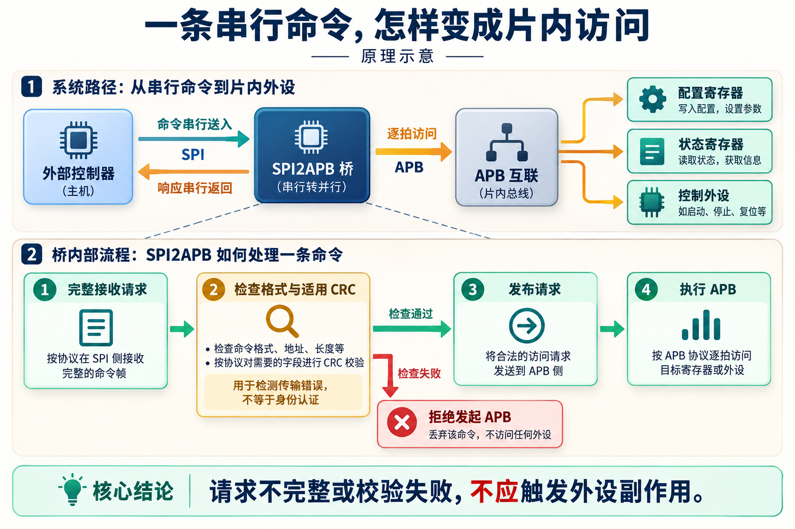
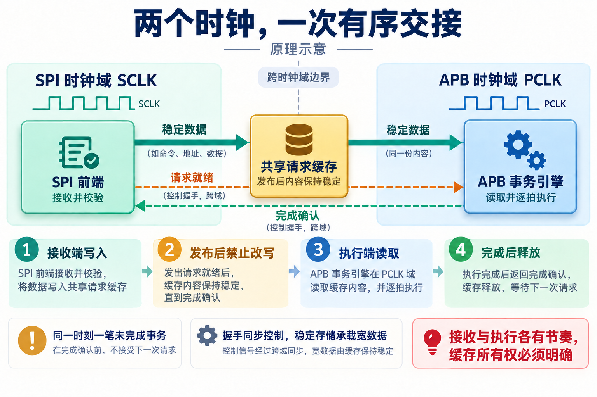
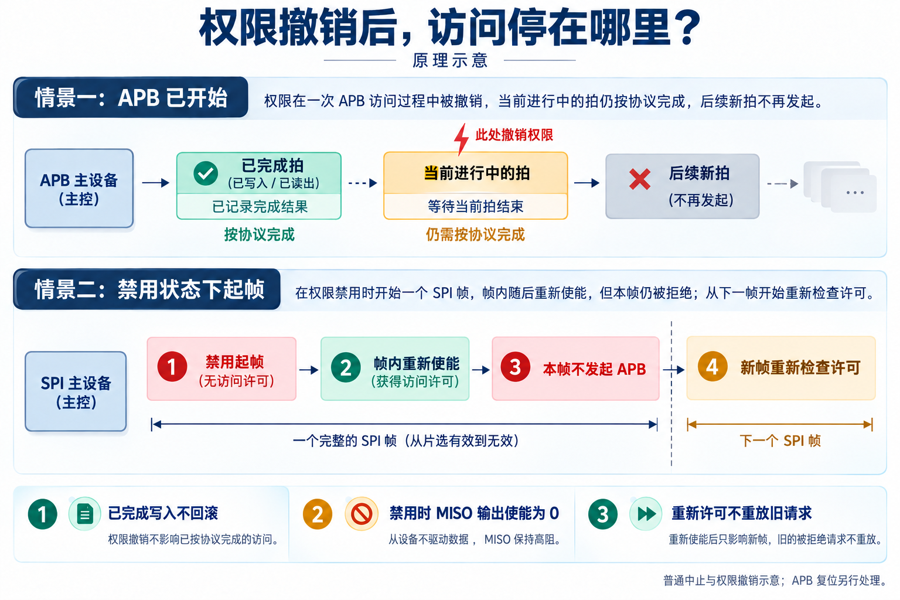
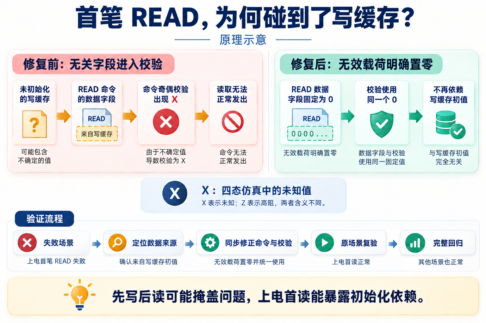

# 用一条 SPI 链路访问片内外设：AI 辅助 SPI2APB 设计与验证

简体中文 | [English](README.en.md)

一颗芯片还没有运行完整软件，外部控制器却已经需要读状态、改配置，或者触发一次测试。把每个内部信号都引到芯片外显然不现实。一个常见办法是保留少量串行接口引脚，让外部发来的命令能够访问片内寄存器。

SPI2APB 就是这条访问路径上的桥：一边接收串行命令，一边把命令转换成片内总线访问。

这个功能听起来很直接。真正动手时，很快就会遇到更具体的问题：命令只收到一半，能不能开始写寄存器？外部时钟停了，内部访问怎么办？权限在一帧中途被撤销，已经开始的写入还能取消吗？

我用这个 IP 做了一次 AI 辅助研发实践，让 AI 参与需求梳理、架构细化、RTL 编写、测试和综合分析。下面沿着一条请求的处理过程，讲讲这些问题怎样落到电路里，以及 AI 怎样通过工具反馈继续改进设计。

## 先把串行命令变成一笔完整请求

SPI 是一种常用的同步串行接口。外部主机提供时钟 SCLK，用片选 CS 标记一次通信，通过 MOSI 发送数据，再从 MISO 接收返回数据。串行意味着数据按位传送，可以用较少的引脚交换信息。

APB 则是芯片内部常用于访问外设寄存器的总线。桥接模块把收到的地址、读写方向和数据整理好，再通过 APB 发起访问。这里的 IP，指可以被集成到不同芯片中的可复用功能模块。

*图 1｜原理示意。外设和互联为应用示例；本项目先接收并检查请求，再允许它进入 APB 执行通路。*

SPI 本身规定了数据怎样在线上传输，并没有替这个项目定义“读哪个地址、写多少数据”。因此，桥两端还需要约定一套命令格式。

本设计用一个 9 字节请求头携带命令、访问属性、事务标识、拍数、地址和 CRC8；写命令后面还跟着数据载荷。CRC 是用于检测传输错误的校验码，请求头使用 CRC8，写载荷可以启用 CRC16，响应也带 CRC16。它帮助发现数据损坏，不承担访问者身份认证。

**请求必须完整接收，并通过适用的格式与校验检查，才能发起 APB 访问。** 这条要求直接决定了需要缓存多少内容、何时可以提交，以及错误应在哪里被拦下。

例如，写命令只收到了一半就释放片选，此时不能因为地址已经解析出来，就先写几个寄存器。外设访问可能有副作用：写一个控制位可能启动任务，读一个状态寄存器也可能清除中断。一旦访问发生，简单返回错误并不能把它撤销。

请求提交后，外部主机还需要继续发送填充字节，为桥返回结果提供 SPI 时钟。一个片选帧只承载一条命令；等待和响应阶段不会把后续字节再解释成第二条命令。

这个设计支持四种 SPI 模式，由静态参数选择；APB 数据宽度为 32 位，地址宽度可选 16 或 32 位，最大传输拍数可选 1、16 或 64。这里的“拍”指一次 APB 传输；如果外设需要等待，一拍可以持续多个时钟周期。

## 两个时钟之间，谁拥有这份数据？

SPI 时钟来自外部控制器，APB 使用片内 PCLK。它们各有自己的节奏，甚至可能独立停止。这就是跨时钟域问题：一个时钟域产生的状态，另一个时钟域不能假设自己恰好在合适的时刻看见它。

对于多位请求数据，还要避免读到“部分已更新、部分仍是旧值”的组合。本设计把这个问题落实为缓存所有权。

SPI 前端先接收并检查请求。发布以后，描述符和请求缓存保持稳定，接收端不能改写它们；APB 事务引擎读取这份内容并逐拍执行。事务结束、所有权释放后，缓存才可重新使用。同一时刻只允许一笔未完成事务。

*图 2｜请求侧原理示意。控制握手负责通知与确认，宽数据在交接期间保持稳定；图中省略响应通路及复位控制。*

跨域邮箱在两侧之间传递就绪和确认等控制信息。可以把它理解成一次交接：先把内容准备好，再通知对方读取，最后确认这份内容已经用完。工程上仍需满足相应的跨域时序与实现约束，不能仅凭流程图就认定跨域安全。

APB 一侧也做了职责划分：事务引擎决定下一拍访问哪个地址、用哪些数据，APB 执行器负责准备、访问以及等待期间的信号保持。这样，命令解释和总线握手可以分别检查。

一个很小的例子就能说明细化设计的必要性。通过 APB4 向字节地址 `0x102` 写入 `0x5a`，实际输出应是：

| 信号 | 值 | 含义 |
| --- | --- | --- |
| 地址 PADDR | `0x100` | 对齐到 32 位字所在位置 |
| 写数据 PWDATA | `0x005a0000` | 数据放入对应字节通道 |
| 字节选通 PSTRB | `0100` | 只更新这个字节 |

地址、数据移位和字节选通必须采用同一套规则。APB3 没有这个字节选通信号，因此本实现拒绝 8 位和 16 位窄写，避免把它们扩成会覆盖相邻字节的整字写入。

AI 在这里需要完成的是一组相互关联的设计：协议说明、地址处理、RTL 和预期结果必须一致。拆开生成各个文件，还不足以保证这些关系正确。

## 权限撤销之后，在哪里停下来？

外部访问由片内可信控制信号许可。禁用时，桥关闭 MISO 输出使能，不返回 SPI 响应；相关错误仍可由可信侧状态或中断观察。

更容易遗漏的问题发生在状态切换时。假设一帧在禁用状态下开始，发送到一半时接口重新使能，这帧剩下的内容能不能继续执行？

本项目明确选择：不能。旧帧不会因为中途恢复许可而重新变成有效请求，必须等到新帧，再重新检查条件。研发过程中曾发现违反这条规则的反例，随后修正了帧级权限保持逻辑，并补充起帧前、帧内和停钟期间的测试。

*图 3｜权限撤销与普通中止的原理示意。两条情景分别说明 APB 单拍边界和 SPI 帧边界；APB 复位另行处理。*

如果撤销发生时 APB 访问已经开始，就不能随意丢掉这笔传输。设计允许当前拍按协议完成，然后停止发起新拍。已经完成的写入也不会回滚。

这会影响软件重试策略。一次多拍写入可能只有前面几拍完成，软件需要结合完成拍数和错误信息处理，不能无条件把整笔命令再发一遍。否则，一些已经执行过的外设操作会被重复触发。

停钟让问题再多一层：撤销事件如果只在某个时钟沿被采样，时钟停住期间的短暂变化就可能漏掉。项目为相关事件设计了保持机制，并在 SPI 与 APB 时钟同时停止的场景中验证恢复后的行为。

这些工作体现了 AI 参与需求细化的价值。工程师先确定“旧请求不能重放”的策略，AI 再把它展开成不同时间位置的检查场景，并同步修改设计、实现和测试。一个抽象要求由此变成了可以执行的验证任务。

## 一笔上电首读，暴露了隐藏的初始化依赖

这次调试里，有一个问题很有代表性。

项目给内部待发命令增加了完整性检查，用奇偶校验保护地址、方向、数据和字节选通。奇偶校验为一组位保存额外的校验信息，可以检测约定范围内的单比特变化。

增加检查后，复位恢复测试失败了。问题起于上电后、尚无成功写入时发起的第一笔 READ，后续多项检查又因为事务没有完成而连续失败。

READ 不需要写载荷，但原来的命令准备逻辑仍从写缓存取出数据字段，送进命令校验。宽缓存没有整体复位，在四态仿真中其初始内容是未知值 `X`。这个原本与读取无关的字段进入校验后，影响了命令能否正常发出。

如果用例总是先写再读，缓存可能已被写入确定值，问题就会被掩盖。上电首读把这个依赖暴露了出来。

*图 4｜调试机制示意。X 表示四态仿真中的未知值；图中展示原因与修复关系，不是仿真波形截图。*

修复很具体：READ 命令的数据字段固定为零，奇偶校验也使用同一个零值。这样，读取就不再依赖写缓存的初始内容，同时保留了宽缓存不整体复位的实现方式。

AI 在这个过程中协助关联失败顺序、状态机和校验输入，完成关联修改。修复后先复验原场景，再运行完整回归。工具结果让“看起来找到了原因”变成了有执行依据的判断。

这也给设计审查提供了一个实用问题：**某个字段在业务上不用，是否仍在控制、校验或比较逻辑中被读取？** 给已有数据通路增加保护时，这类依赖很值得检查。

## 让 AI 的修改接受独立检查

为了让这些工作能够连续推进，我使用了面向 IP 研发的 Skill。它把需求、架构、实现、验证和工具执行组织成可重复的工程步骤，并要求修改与对应检查保持关联。

在这个项目里，AI 的工作包括梳理需求歧义、联动修改 RTL 和说明、扩展故障注入场景、调用工具，以及根据结果继续定位问题。工程师负责确定接口策略、故障范围和设计取舍。

例如，“缓存损坏不能变成错误的 APB 访问”需要先确定损坏范围。本次明确检查数据、掩码、描述符等的单比特翻转，以及未就绪、越界访问。多比特共因损坏和校验逻辑自身故障不属于这项验证承诺。范围明确后，硬件保护与故障注入才有一致的目标。

验证也需要独立的观察点。SPI 侧从实际引脚事务观察请求和响应，APB 侧记录真正接受的访问，再比较数据、状态和是否产生了不应出现的访问。CRC 预期由独立实现计算，不直接调用被测 RTL 的 CRC 函数。

这样检查的不只是“错误码对不对”。对于受保护范围内的损坏，还要确认没有新增 APB 传输，并检查后续合法事务能否恢复。

截至 2026 年 9 月 24 日的最终回归记录如下：

| 检查范围 | 执行结果 | 怎样理解 |
| --- | --- | --- |
| 模块级测试 | 11/11 通过 | 分别检查解析、邮箱、事务引擎等模块 |
| 端到端回归 | 64 项 UVM + 1 项 C 驱动测试通过 | 8 个代表配置，覆盖 APB3/APB4 与四种 SPI 模式 |
| 故障注入 | 1872 次通过 | 覆盖约定的字段损坏与内部访问异常场景 |
| 参数检查 | 48 个合法组合展开通过；4 类非法配置正确拒绝 | 检查参数能否形成合法电路结构，完整功能仿真使用上述 8 个代表配置 |

UVM 是组织芯片验证环境的一套方法；这里的“展开”则是把参数和模块层级落实成具体电路结构的检查。二者回答的问题不同，不能把参数展开通过直接当作全配置功能验证通过。

这些结果对应特定源码、配置和回归批次，说明已执行场景的表现。完整覆盖率目标与跨时钟、复位域的高级签核仍有后续工作，本文记录的是一次 IP 级研发实践。

## 综合结果，把容量选择变成电路成本

RTL 描述电路行为，综合工具把它映射成逻辑门和寄存器，并估算面积、时序等指标。PPA 是功耗、性能和面积的合称，可以帮助工程师判断一种实现是否适合目标系统。

本次综合采用 28nm HVT 标准单元库，典型工艺角、1.00V、25°C，PCLK 约束为 100MHz，SCLK 为 25MHz。两个容量配置的面积很能说明问题：

| 配置 | 最大传输拍数 | 综合面积 |
| --- | ---: | ---: |
| 默认配置 | 64 | 23326.87 µm² |
| 单拍配置 | 1 | 5265.70 µm² |

对于只需要零星读写寄存器的场景，单拍配置提供了一个更小的选择。需要连续多拍访问的系统，则要保留相应容量。两者功能容量不同，不能把面积差写成同等功能下的优化收益。

研发中还调整了请求缓存所有权，减少重复的宽载荷拷贝；将解析、命令准备和 APB 执行分开，并用相位计数处理掩码位置。AI 协助完成实现修改与配置扫描，综合结果则帮助工程师检查这些选择的实际成本。

表中是标准库综合面积，尚未包含布局布线结果。100MHz 和 25MHz 是输入约束，不是实测最高频率；物理时序仍需后续收敛，因此这里不作最终频率或芯片功耗承诺。

## 把一次修改，推进到有结果的验证

SPI2APB 的基本功能不大，却足以串起一段完整的芯片研发工作：定义外部命令、处理跨域交接、约束异常行为、定位状态依赖，再用测试和综合检查实现。

在这次实践中，AI 可以沿着同一个问题跨越多个文件和阶段继续工作。权限策略确定后，它能展开测试场景并维护相关实现；首读失败后，它能沿数据来源追查，并在修改后执行复验；容量参数变化后，它能组织综合比较，让工程师看到成本。

对后续研发而言，这种连续性很有用。设计决定有清楚的表达，修改有对应的检查，结果又能成为下一轮工作的起点。AI 辅助芯片研发的价值，就在这些具体工作被逐步连接起来的过程中显现。

