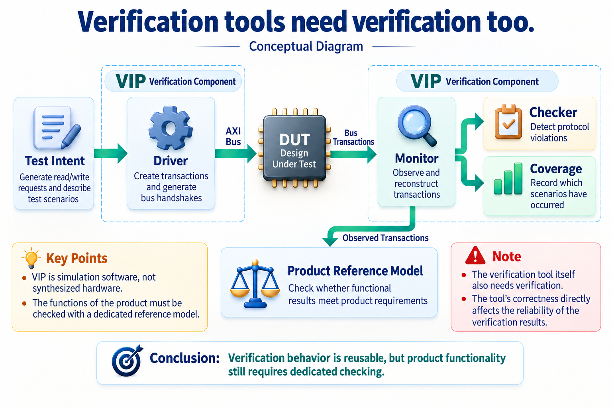
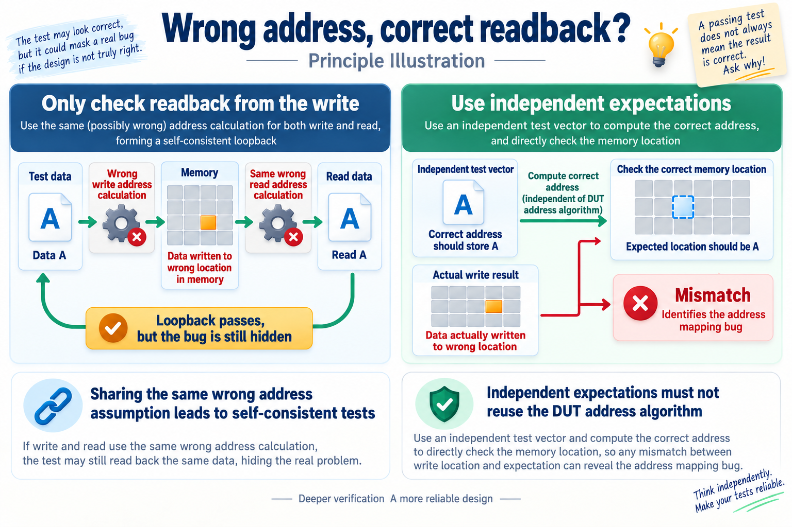
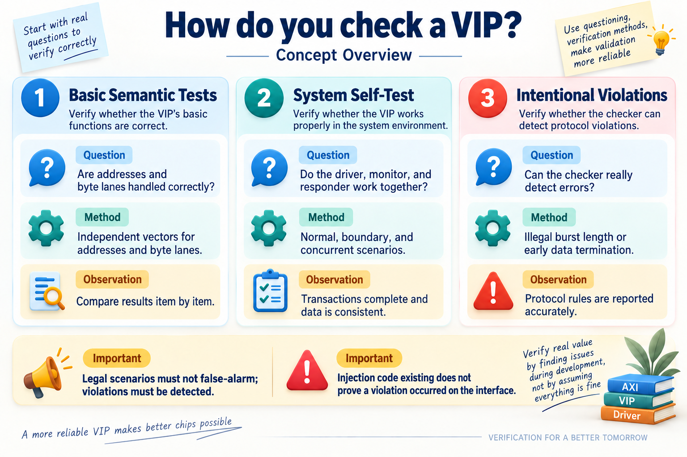
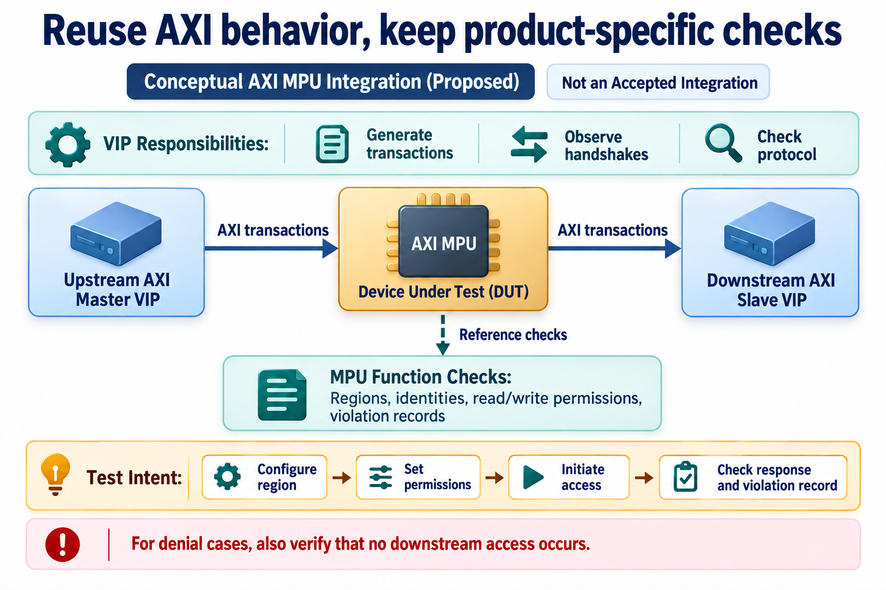

# AI-Assisted AXI4 VIP Development: Making Verification Code Reusable

[简体中文](README.md) | English


Writing data to memory and reading it back is a natural verification step. If the values match, we usually take that as evidence that the path has no obvious problem.

This AXI4 verification-component project produced a counterexample. Both write and read paths calculated byte locations incorrectly—and made the same mistake. Data went to the wrong location and came back from that same wrong location. The loopback test still passed.

Foundational tests with independent expectations later exposed the bug. It gave this AI-assisted development exercise a concrete question: after generating drivers and checkers, how do we establish that another project can depend on them?

The AXI4 VIP's development shows how AI can help clarify protocols, implement components, debug failures, and preserve lessons in reusable code and methods.

## What is a VIP, and why must it be verified?

To verify a chip design in simulation, we send requests, observe responses, and check the results. The design being checked is the DUT, or design under test.

For an AXI DUT, the environment must send addresses and data, wait for responses, and handle temporary backpressure. Reimplementing those behaviors for every IP adds work and creates opportunities for inconsistent bugs.

A VIP—verification IP—packages these capabilities for reuse. A test can request a read while the component handles the bus signals.



*Figure 1. Conceptual responsibilities. The VIP runs in the verification environment; the DUT is the design being checked. This is not a complete inventory of a particular environment.*

A driver turns test intent into bus actions. A monitor observes signals and reconstructs transactions. A checker detects protocol violations. Coverage records exercised scenarios. A project-specific reference model still determines whether address selection, permissions, or computation meet product requirements.

This AXI4 VIP uses UVM, a common methodology for organizing hardware-verification components. AXI4 has five channels: write address, write data, write response, read address, and read data. Each uses handshakes. Bursts carry multiple beats, and multiple outstanding transactions allow new requests before earlier responses return.

A VIP therefore needs more than a few read/write tasks. It must track which request owns each data transfer, associate response identifiers, and maintain consistent state through waits, concurrency, and reset.

## Establish the rules before implementing the components

I used a VIP-development Skill: engineering instructions that define stages, decisions, and checks for AI's work.

First, protocol requirements must be distinguished from implementation choices. A protocol may permit several requests to await responses simultaneously, but an environment still chooses its outstanding limit and responder policy. Mixing these categories invites divergent interpretations in code and tests.

Architecture must also go beyond boxes. For writes, address, data, and response travel on separate channels. The VIP retains context, tracks data ownership, and associates the response with its request. The monitor reconstructs observed behavior; the memory model simulates content changes. Their state-update responsibilities must remain clear.

AI can locate the places affected by a rule and update requirements, component code, checks, and test descriptions together. The engineer reviews the rule and implementation choice. Changes can follow established relationships rather than leave multiple versions of the same behavior.

Common helpers centralize address and byte-lane calculations. That improves maintainability, but checker decisions and independent test expectations still require separate review. Shared algorithms need trustworthy validation of their own.

## How can wrong writes and wrong reads pass loopback?

The bug occurred in the VIP's memory model.

A 32-bit datapath carries four byte lanes. When an access starts within a bus word, the model must determine valid lanes and the memory byte addresses they represent.

Both read and write paths had an offset error in absolute-address calculation. The writer stored data at the wrong location, and the reader used the same wrong mapping to retrieve it. Comparing written and returned values alone showed agreement.



*Figure 2. Shared-error concept, omitting detailed AXI addressing and channel behavior. Independent expectations break the false agreement between read and write paths.*

When several components share an incorrect assumption, they may cooperate well enough to hide it. If AI helps write both implementation and tests, we should check whether the same unverified interpretation has spread across files.

The project added semantic unit tests with predetermined inputs and expected values for address progression, byte lanes, memory accesses, and transactions. Bringing the first 79 tests to a passing state exposed the address bug and also corrected errors in some test expectations and cases.

The corrected mapping uses the bus-width-aligned base address plus the byte lane. Both paths were updated and affected scenarios rerun.

An independent expectation is not the same formula copied into another file. It should come from the protocol, manually checked vectors, or another reviewable derivation. When a test fails, both implementation and expectation deserve scrutiny.

AI helped split fundamental behavior into checkable questions, trace failing calculations, and revise affected code and tests. Executed results determined whether the work could proceed.

## Make the checker demonstrate that it catches errors

Unit tests cover basic calculations, but the complete VIP can still suffer handshake misalignment, transaction-association errors, or timeouts when drivers, monitors, responders, and checkers interact.

The project uses complementary verification layers.



*Figure 3. Verification method. The layers address different questions; the diagram does not claim complete qualification or coverage closure.*

Semantic tests examine basic rules. System self-tests combine master and slave components across normal, boundary, concurrent, and error cases. Violation injection deliberately challenges rules the checker should detect.

Examples include an illegal wrapping-burst length or data ending before the required beat count. Success has two sides: the violation must be detected, and legal controls must not produce false alarms.

**Having injection code does not prove that an error occurred on the interface.** A stability test must actually create a wait window and change data within it. Otherwise, it never challenges the intended rule.

| Stage or check | Recorded result | Scope |
| --- | --- | --- |
| Initial semantic unit tests | 79/79 passed | Addresses, byte lanes, memory, and transaction behavior |
| Unit tests after integration fixes | 84/84 passed | September 4, 2026 record; added configuration-default checks |
| Subsequent full self-test | 10 test groups passed | Same date; includes added write-response completion checks |
| Four recorded illegal-transaction classes | All four detected | Specified burst-length, starting-alignment, boundary, and related cases |

These counts belong to different stages and must not be added into one larger regression total. Detecting four classes does not cover every protocol violation. Coverage convergence and full qualification have separate requirements; this account stays within the executed evidence.

## A second project exposes a different assumption

Self-tests tend to use familiar configurations and connection patterns. A real consumer challenges those defaults.

During integration into an AXI-to-APB bridge, the consumer constructed a configuration object and assigned fields directly, without randomizing it. Some READY defaults therefore never took effect, and handshakes stalled.

Those defaults had existed only as random constraints, which apply when randomization runs. Constructing an object does not randomize it. The fix put required defaults in the constructor and added a construction-without-randomization test, expanding the unit suite to 84 cases.

A reusable component must support its documented usage, not just the calling sequence chosen by its self-test.

The same integration strengthened write-response completion checks. Tests now explicitly checked response arrival, count, and status rather than only request issuance. The focused case joined subsequent regressions so future users inherit the correction.

AI can trace an integration failure back through configuration, driving, and checking logic, then add the missing test. Reuse becomes part of development feedback: consumers expose assumptions, fixes return to the common component, and later projects use the updated version.

## What remains product-specific after protocol reuse?

An AXI MPU makes the division clear. A memory protection unit decides whether a request may pass based on requester identity, address region, and access attributes.

It must both obey AXI and enforce its permission policy. Generic VIP can generate transactions, monitor traffic, and check protocol behavior. The MPU's reference model must decide whether a given requester may access a given address.



*Figure 4. Proposed integration concept, illustrating the reuse boundary. It does not claim that the existing MPU environment has completed integration acceptance with this VIP.*

A permission test can then express product intent:

```text
Configure a protected address region
Set a requester's read/write permissions
Issue an access
Check the response, downstream behavior, and violation record
```

The VIP handles handshakes, while the test checks product-specific results. For a denied access, an upstream error is insufficient: the request must also be absent downstream.

The VIP provides parameterized interfaces, master and slave modes, and high-level reads and writes. Dependency management pins its name, version, and compilation files so a project knows which component revision it uses.

Configurability does not establish verification of every combination. Integration must check data and address widths, modes, and supported capabilities, then run the product's regression. Version records tie those checks to explicit code.

## Make experience part of the next starting point

The project also produced reusable development methods.

Changing requirement numbers had disturbed many references, so later work adopted category-local numbering. Complex transaction ownership could remain implicit in the implementer's understanding, so the method added runtime-model checks. Semantic unit tests became a prescribed step after exposing the shared mapping error.

These lessons went into Skill instructions and templates. Future AI work can inherit clarified decisions by reading explicit rules, code, tests, and documentation.

Engineers still decide which lessons generalize. A protocol misunderstanding belongs in a rule-review checklist; a configuration-default failure belongs in component tests. A project-specific tradeoff should not become a universal VIP requirement.

AI's contribution continues after initial code generation: explaining failures, extending checks, and updating the shared component and its usage guidance together. Those readable, executable results give the next project a stronger starting point and preserve protocol knowledge tested by real problems.
