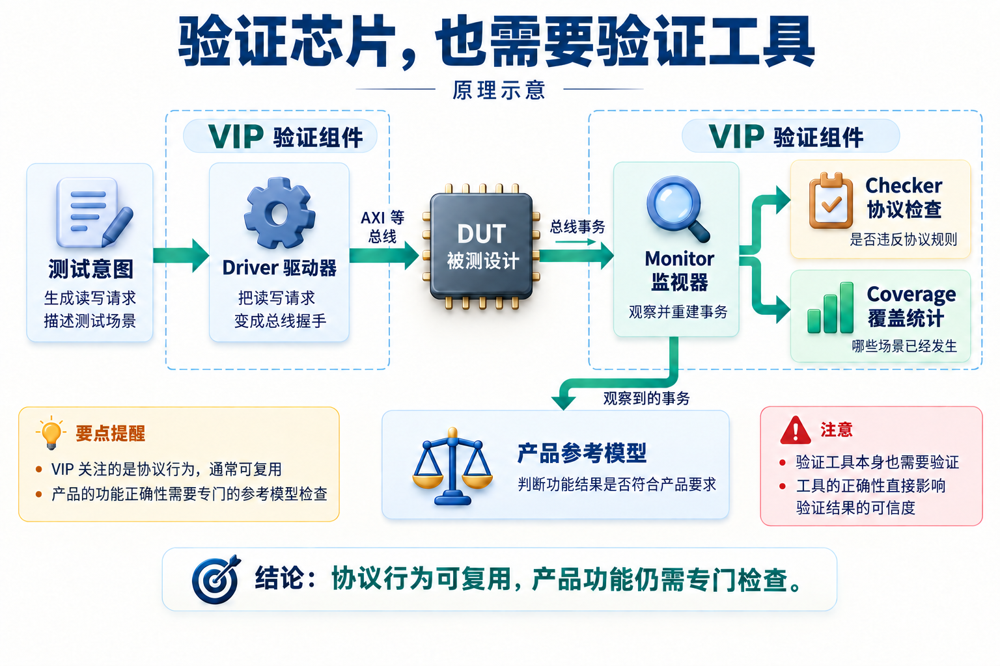
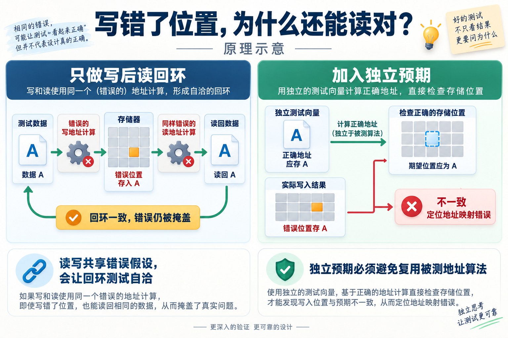
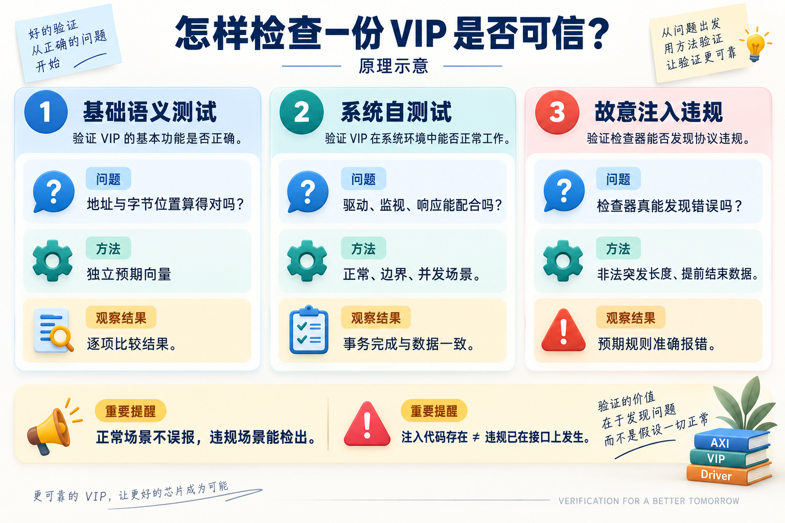
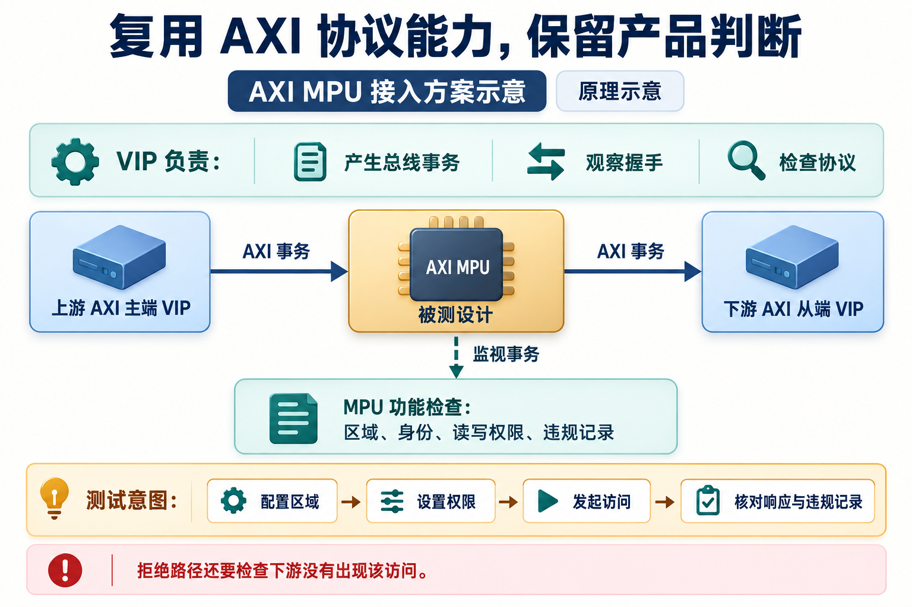

# AI 辅助开发 AXI4 VIP：让验证代码成为可复用的工程资产

简体中文 | [English](README.en.md)


给一段内存写入数据，再读出来比较，是验证里很自然的一步。如果读回值完全一致，我们通常会觉得这条通路至少没有明显问题。

这次开发 AXI4 验证组件时，却遇到了一个反例：写入和读取都把字节位置算错了，而且错法相同。数据被写到了错误的位置，又从那个错误的位置读回来，回环测试仍然通过。

后来，一组带独立预期的基础测试把这个问题找了出来。它也让这次 AI 辅助研发有了一个很具体的主题：生成驱动和检查代码之后，还要怎样证明它们值得被下一个项目依赖？

下面就从这个 AXI4 VIP 的开发过程说起，看看 AI 怎样参与协议梳理、实现、调试，以及经验如何进入后续项目可以继续使用的代码和方法。

## VIP 是什么，为什么它也需要被验证？

芯片设计完成后，需要在仿真环境里给它发送请求、观察响应，再判断结果是否正确。这里的被测设计常简称 DUT。

假设 DUT 使用 AXI 接口。测试环境就要会发送地址、传输数据、等待响应，还要处理对方暂时不接收数据的情况。每做一个 IP 都重新编写这些协议行为，工作量不小，也容易产生不同版本的错误。

VIP 是 Verification IP，即可复用的验证组件。它把这些常用能力组织起来，让测试人员能描述“发起一笔读取”，再由组件处理具体的总线信号。



*图 1｜原理示意。VIP 运行在验证环境中；DUT 是被检查的设计。图中展示概念分工，不代表具体工程的全部组件。*

几个常见名字可以这样理解：Driver 把测试意图变成总线上的动作；Monitor 观察信号并重建事务；Checker 检查是否违反协议；Coverage 记录哪些场景已经发生。项目还需要自己的参考模型，判断地址选择、权限或运算结果是否符合产品要求。

这次采用 UVM，也就是芯片验证中常用的一套组件组织方法，开发 AXI4 VIP。AXI4 有写地址、写数据、写响应、读地址和读数据五个通道，各自通过握手交换信息。一次突发访问还会连续传输多拍数据；“多笔未完成事务”则意味着前面的响应尚未返回，后面的请求已经发出。

这些能力让总线可以高效工作，也意味着 VIP 不能只是几个读写任务的集合。它需要知道数据属于哪笔请求、响应对应哪个标识，以及等待、并发和复位时怎样保持记录一致。

## 让 AI 先讲清规则，再把规则落实到组件

我使用面向 VIP 开发的 Skill 组织这次工作。Skill 可以理解为给 AI 使用的工程操作说明：有哪些步骤、各阶段应明确什么、修改后需要哪些检查。

首先要区分协议要求和实现选择。例如，协议允许多笔请求同时等待响应，但当前环境允许多少笔、从端模型采用什么响应策略，仍需要设计决定。把这些内容混写，后续代码和测试就可能各自理解成不同的行为。

架构细化也不能停在方框图上。以写事务为例，地址、数据和响应经过不同通道。VIP 需要维护请求上下文，记录数据归属，最后再把响应关联回对应事务。Monitor 负责观察和重建，存储模型负责模拟内容变化，两者的状态修改职责也要分清。

AI 可以围绕一条规则检索关联位置，修改需求描述、组件实现、检查逻辑和测试说明。工程师则审视规则本身是否准确、当前实现选择是否合适。这样，一次调整能沿着已有关系向后推进，减少各份文件对同一个行为作出不同解释的机会。

项目还把常用地址与字节位置计算放在公共辅助函数中，避免组件各写一份。与此同时，检查器的规则判定和测试的独立预期仍需要受到单独审查。共用算法便于维护，也意味着算法本身必须有可信的检查依据。

## 读写都错，为什么回环还能通过？

前面提到的缺陷，出现在 VIP 的存储模型里。

一条 32 位数据通路可以同时承载 4 个字节，每个字节占一个位置，常称为 byte lane。访问地址不从整个数据字的起点开始时，就要算清哪些位置有效，以及它们对应存储中的哪些字节地址。

当时，读写路径中的绝对地址计算都存在偏移错误。写路径把数据放错位置，读路径又按同一种错误映射取数。仅比较“写进去的值”和“读回来的值”，两者仍然一致。



*图 2｜同源错误的机制示意，省略 AXI 的具体地址与通道细节。独立预期用于打破读写两条路径之间的错误自洽。*

这类问题可以叫同源错误：多个组件共享同一种错误假设，彼此配合时反而不容易暴露。AI 同时参与实现和测试时，也需要留意它是否在不同文件中重复使用了同一套未经检查的理解。

项目随后建立了基础语义单元测试，用预先确定的输入和期望值检查地址推进、字节位置、存储访问和事务行为。首批 79 项测试完成并通过的过程中，定位到了这个地址计算问题，也修正了若干测试期望和用例自身的错误。

修复后的地址映射，以对齐到总线宽度的基地址加上字节位置来计算，读写实现同步调整，再复验相关场景。

独立预期并不是换一个文件再抄一次同样的公式。它需要来自协议定义、人工核对的向量，或另一种可以审查的推导方式。测试失败时，实现和期望都要检查，不能默认测试程序一定正确。

AI 在这里的作用很具体：把基础行为拆成可检查的小问题，定位失败涉及的计算路径，并同步修正受影响的实现与测试。工具执行给出的结果，决定了下一步是否可以继续。

## 检查器说自己会抓错，也要让它试一次

单元测试解决基础计算问题，还不足以覆盖整个 VIP。驱动器、监视器、响应模型和检查器一起运行时，也可能出现握手错位、事务关联错误或超时。

因此，项目把检查分成几个互补的层次。



*图 3｜验证方法示意。各层关注不同的问题，图中不表示完整资格验收或覆盖率已经达到目标。*

基础测试逐项检查语义；系统自测试让主端和从端组件配合，运行正常、边界、并发及错误场景；违规注入则故意制造检查器应当识别的问题。

例如，给回绕突发设置不允许的长度，或让数据在规定拍数之前结束，再观察是否触发预期规则。这里的通过条件包含两个方向：违规场景应当被发现，合法对照不应被误报。

还有一个容易忽略的前提：**写了注入代码，并不等于错误已经在接口上发生。** 想验证等待期间的数据稳定性，就必须先真的制造等待窗口，再在那个窗口中改变数据。否则，测试可能根本没有挑战到目标规则。

现有记录能支持的几个具体结果如下：

| 阶段或检查 | 记录中的结果 | 适用范围 |
| --- | --- | --- |
| 首批基础语义测试 | 79/79 通过 | 包含地址、字节位置、存储和事务等检查 |
| 后续集成修复后的单元测试 | 84/84 通过 | 2026 年 9 月 4 日记录，补充配置默认值检查 |
| 后续完整自测试 | 10 个测试组通过 | 同日记录，包含新增的写响应回填检查 |
| 已记录的四类非法事务注入 | 4 类均被检出 | 非法突发长度、起始对齐和边界等指定场景 |

这些数字对应不同阶段，不能相加当成一份更大的统一回归结果。四类注入全部检出，也不意味着所有协议违规都已覆盖。覆盖收敛和完整资格判定还有独立要求；这里讨论的是已有执行记录支持的研发过程。

## 接入第二个项目，才能看到另一类问题

VIP 自测试通常采用自己熟悉的配置和连接方式。进入真实 IP 环境后，新的使用方式会检验这些默认假设。

在一次 AXI 到 APB 桥接 IP 的集成中，接入方创建配置对象后直接赋值，没有调用随机化。结果，某些 READY 默认值没有生效，握手无法继续。

原因是这些默认值原先只写在随机约束中。随机化执行时它们才会起作用，而构造对象本身并不等于执行随机化。修复把必要的默认值放进构造函数，并增加“只创建对象、不随机化”的测试。单元测试随后扩展到 84 项。

这件事给复用增加了一条很实际的要求：组件要支持文档承诺的使用方式，不能只在自测试恰好采用的调用顺序下工作。

同一轮集成还促成了写响应回填的检查强化。测试不仅看请求是否发出，还明确检查响应是否到达、数量是否正确、状态是否符合预期。新增专项进入后续回归，使下一个使用者能够继承这次修复。

AI 可以协助把集成失败追踪回配置、驱动和检查逻辑，再补上对应测试。复用由此也成为开发反馈的一部分：新的使用场景揭示假设，修复回到公共组件，后续项目使用更新后的版本。

## 协议能力复用后，产品验证关注什么？

以 AXI MPU 为例，可以清楚地看到复用的分工。MPU 是内存保护单元，根据访问者身份、地址区域和读写属性，决定请求是否允许通过。

它既需要满足 AXI 协议，也需要正确执行权限策略。通用 VIP 可以承担总线事务产生、监视和协议检查；“这个身份能否访问这片地址”则需要 MPU 自己的参考模型来判断。



*图 4｜接入方案示意。用于说明复用边界，不表示现有 AXI MPU 环境已经完成这套 VIP 的集成验收。*

在这种分工下，一条权限测试可以围绕产品意图组织：

```text
配置受保护的地址区域
设置某个访问者的读写权限
发起一次访问
核对响应、下游访问行为和违规记录
```

协议握手由 VIP 处理，测试仍需检查产品特有的结果。例如，对应被拒绝的请求，不能只看上游返回了错误，还应确认下游没有出现这笔访问。

为了让这样的接入可维护，VIP 提供参数化接口、主端和从端模式，以及高层读写操作。依赖管理再把名称、版本和编译文件集合固定下来，让项目能够明确自己使用的是哪一版组件。

参数可配置也不代表任意组合都已经验证。接入时仍需核对数据宽度、地址宽度、模式和能力范围，并执行本项目的集成回归。版本记录的价值，是让这些检查可以对应到明确的代码，而不是依赖“应该和上次一样”的印象。

## 把项目经验写进下一次工作的起点

这次实践还留下了另一类可以复用的内容：开发方法本身。

AXI4 开发中，需求编号变动曾牵动大量引用，后续改为按类别局部编号；复杂事务的归属关系容易只存在于实现者的理解中，方法里便增加了运行时模型检查；基础语义测试发现同源错误后，它也进入了后续 VIP 开发的规定步骤。

这些调整被写回 Skill 的说明与模板，新的工作使用更新后的版本。这里的经验继承有具体载体：规则、代码、测试和文档。AI 在下一次任务中读取这些内容，才有机会沿用已经澄清的设计决定。

工程师仍需判断哪些经验值得推广。例如，一次协议误解应当进入规则核对清单，一次集成暴露的默认值问题应当进入组件测试；某个项目特有的取舍，则不应被包装成所有 VIP 都必须遵守的规则。

从这个角度看，AI 辅助开发 VIP 的价值不只出现在最初的代码生成。它还体现在修改之后：能否把原因讲清楚，把检查补齐，把公共组件和使用说明一起更新。

当这些工作留下可读、可执行的结果，下一次开发就有了更扎实的起点。团队积累的也不只是又一套验证代码，而是经过实际问题检验、可以继续维护和复用的协议知识。

