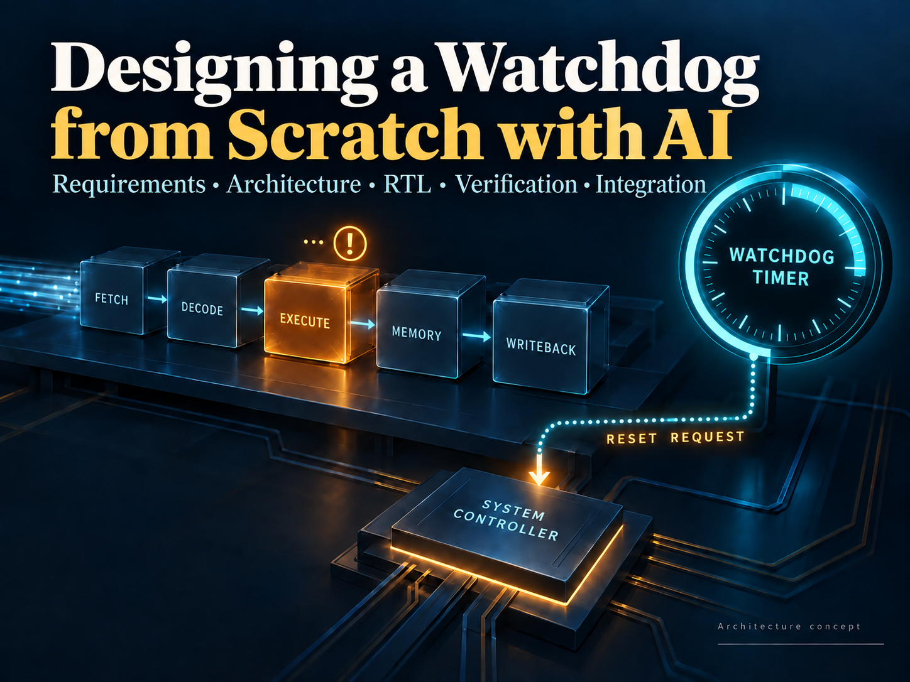
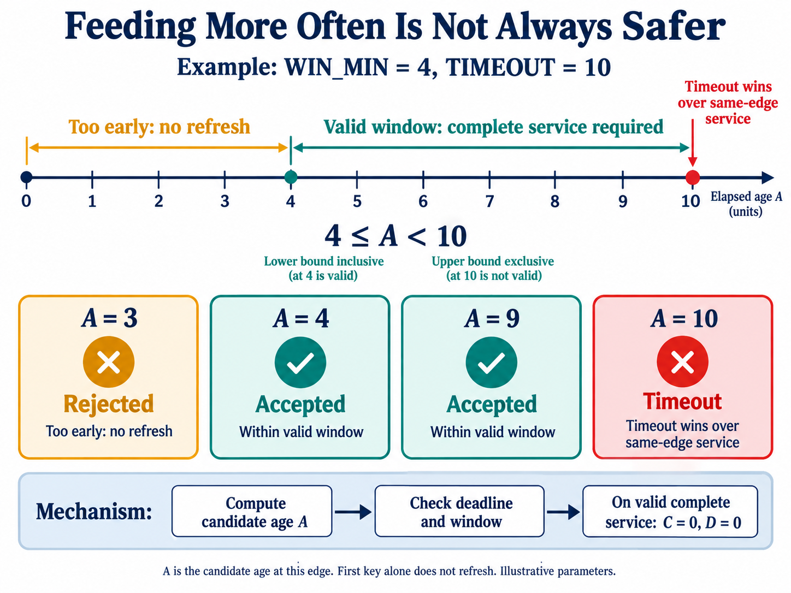
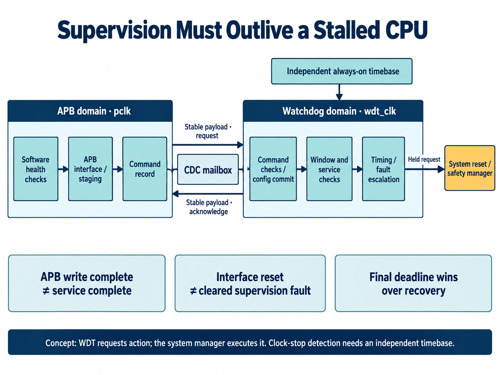

[简体中文](README.md) | English

# Designing a Watchdog from Scratch with AI

Imagine a device whose data-acquisition task has stalled. Its output has not changed for a long time, but a periodic interrupt still runs. Every so often, that interrupt writes the watchdog service register. The system neither recovers nor resets.

The watchdog is not broken. It keeps receiving an “I'm fine” message.

That scenario exposes an easily overlooked design question: **who is allowed to declare the system healthy, and what evidence supports that declaration?** If the answer is merely “some code is still executing,” a perfectly accurate counter may fail to protect the tasks that matter.

Designing this IP from scratch means delivering more than a counter. Software use, reset behavior, fault reporting, and tests that establish conformance all belong to the design problem.

This article follows the requirements, architecture, implementation, verification, and integration of a parameterized WDT with an APB interface, using existing engineering records to explain AI's role at each stage. Starting from scratch here means starting with the design questions. Suitable building blocks can be reused, while the engineering evidence develops step by step.

## Give AI a design brief, not just “write a watchdog”

A useful starting point defines what the IP supervises, whom it can trust, and who acts on a failure. The brief also needs constraints for software access, clocks and resets, startup, service protocols, recovery authority, and configurable scale. Without them, AI can quickly produce compilable code while leaving its most important system assumptions unstated.

The engineering flow connects requirements, architecture, microarchitecture, RTL, and verification. AI organizes requirements and acceptance criteria from the design contract, then maps them to modules, interfaces, registers, and tests. The recorded scope contains 139 requirements and 16 parameters. Those counts define traceable work; they do not establish design quality by themselves.

For example, “an interface reset must not stop supervision” raises further questions. Which state does that reset affect? Which state changes only on power-on reset? What happens to an accepted command? How does returning software find its result? AI's work begins by expanding these questions and carrying the answers into design and tests. Behavior and trade-offs need explicit review; incidental choices in generated code should not become the specification.

Four choices largely determine the structure of this watchdog.

## First choice: define health as well as time

WDT stands for Watchdog Timer. It enforces a deadline: a valid service operation, often called feeding or kicking the watchdog, restarts timing. If the deadline arrives without service, the watchdog records a fault and initiates a configured response.

Its distinction from an ordinary timer lies largely in purpose and control. An ordinary timer helps software schedule work. A watchdog must keep functioning when the supervised component is no longer trustworthy. Faulty software should not be able to rewrite the running counter arbitrarily, defer a deadline indefinitely, or cancel a reset request merely by clearing an interrupt.

The timer cannot tell whether a task computed the correct result. Health checks should represent meaningful progress: an acquisition round completed, a processing task produced a fresh result, or a critical communication sequence reached its expected milestone. An unconditional service call inside an interrupt establishes little beyond the interrupt's continued execution.

When several tasks jointly determine health, this project provides GROUP supervision. Each required client must complete a valid report in the current round. Hardware records the arrivals in a bitmap and refreshes the channel only when the last required client reports. Repeated reports cannot stand in for a missing participant. One active task cannot keep a stalled task alive simply by reporting more often.

Client identifiers alone do not establish identity isolation, however. If one trusted source reports on behalf of several tasks, those tasks are not thereby isolated in hardware. The evidence must trace back to real progress, rather than different identifiers attached to otherwise identical register writes.

## Second choice: put service inside a time window

Basic timeout supervision imposes an upper limit. A window watchdog adds a lower limit: service that arrives too early can also indicate abnormal execution. Software that skips work or enters a short feeding loop may reach its service point faster than a healthy task would.

This is a general supervision principle. ST's [window-watchdog training material](https://www.st.com/resource/en/product_training/STM32WB-WDG_TIMERS-System-Window-Watchdog-WWDG.pdf) likewise describes early and late refresh conditions. Implementations may count up or down, so threshold formulas cannot simply be copied between devices. The candidate design discussed here uses a saturating up-counter.

*Figure 1. AI-generated explanation using illustrative parameters, not a simulation screenshot. The lower boundary is inclusive and the upper boundary exclusive. Only complete, valid service refreshes the timer.*

For a small example, let `WIN_MIN=4` and `TIMEOUT=10`. The valid interval is `4 ≤ A < 10`. A is the candidate age for the current edge, not simply the count stored at the previous edge.

The register-transfer-level (RTL) implementation first determines whether this edge produces a timing tick. If so, it computes `A=sat(C+1)`; otherwise, `A=C`. Here, sat denotes saturation: the count stays at its maximum instead of wrapping to zero. Window and deadline decisions then use the same A. Complete, valid service clears both count C and divider phase D.

Why emphasize the current edge? Suppose the old count is nine, a tick advances it, and service arrives simultaneously. If service logic examines the old value while timeout logic examines the new one, the two can disagree. This design makes the rule explicit: **the edge that reaches ten times out, even if service arrives on that edge; the edge that reaches four permits valid service.**

Dual-key service follows the same principle. Writing KEY1 and then KEY2 checks the operation sequence. The first write alone does not refresh the count; the complete sequence must meet its own deadline and the service window. Sequence timing uses undivided watchdog-clock cycles, while the main supervision age uses ticks. Those time units must not be confused. Keys and optional question-and-answer sequences detect erroneous operations; they are not cryptographic authentication.

A window detects some abnormal execution rates. Faulty software that continues feeding at a valid rate may still escape detection, so window supervision must work alongside meaningful progress checks.

## Third choice: give supervision its own clock domain

With the counter rules established, the next question is what keeps them running.

The IP has two clock domains. Software accesses registers over APB, a common on-chip peripheral bus, using `pclk`. Supervision state, timing, and escalation use `wdt_clk`. An independent, always-on supervision timebase allows deadlines to advance even when the bus stalls or the processor-side clock stops.

*Figure 2. AI-generated responsibility and clock-domain diagram. WDT requests action; a system reset or safety manager executes it. An independent timebase still requires system-level power, clock, and failure-detection design.*

Configuration words cannot simply be synchronized bit by bit between the domains: the receiver could observe a mixture of old and new values. This implementation uses a clock-domain-crossing mailbox. The payload stays stable during the handshake, the request reaches the supervision domain, and the result returns. CDC, or Clock Domain Crossing, concerns the reliability and consistency of such transfers.

Software must therefore distinguish an APB write being accepted from the supervision domain completing the command. The driver matches completion sequence numbers and checks the hardware result code. If polling times out, it retains the pending sequence and continues querying rather than blindly resubmitting. The original command may still be executing in the other domain.

Configuration passes through staging, validation, and commit rather than allowing scattered software writes to alter active supervision parameters directly. A half-written window combined with an old timeout value cannot become the operating rule merely because software has not finished its update.

Reset boundaries matter just as much. Resetting the APB interface must not erase a persistent supervision fault. Mailbox and response records follow the transaction lifetime so that an interface reset does not execute an in-flight command twice. Final reset outputs are held requests routed to a manager capable of taking action, rather than relying solely on an interrupt-request (IRQ) handler that may already have stopped running.

An independent `wdt_clk` is not sufficient by itself. If that clock stops, logic driven by it cannot keep time. Detecting that failure needs another independent timebase. Two RTL clock ports do not establish independence of oscillators, supplies, or physical failure paths.

## Fourth choice: allow recovery, with a final deadline

A detected fault need not immediately reset the entire chip. Some systems can first wake a processor, report the fault, or request a local reset to recover the affected subsystem. If recovery does not complete by the final deadline, the response escalates to system-level action.

That opportunity needs a firm boundary.

This design starts a separate escalation age E at the fault edge, measured in undivided `wdt_clk` cycles. Local and final responses have separate deadlines. Further service attempts, IRQ clears, or configuration accesses cannot restart E. Nor can a latched fault gain unlimited grace by requesting a pause.

The entity that actually performs recovery supplies completion through a done/ack handshake. Both sides return low before another recovery is accepted. An old done signal held high must not count as multiple new recovery events.

If final expiration and recovery completion occur on the same edge, final escalation wins. A fatal internal integrity fault requests final action immediately, bypassing ordinary recovery delays. Clearing an interrupt, clearing a fault, resuming operation, and withdrawing a request are distinct operations; a generic “clear status” operation must not collapse them into one.

These choices determine whether a system can escape a fault loop. A watchdog should allow legitimate recovery while ensuring that failed recovery still leads to a next action.

## Have AI turn the choices into an IP design

Those four choices define behavior. Module organization and coding follow. At this stage, AI needs to produce a division of responsibility and state ownership that makes omissions visible.

The architecture assigns six kinds of responsibility: bus access, cross-domain transport, command dispatch, channel supervision, safety detection, and system integration. These are design boundaries, not a requirement for six separate RTL files. The bus side checks accesses and stages configuration; transport owns command and completion records; channels own timing and service state; integration aggregates outputs and connects the external manager. Whether an interface reset can affect supervision becomes a concrete question about ownership.

### Architecture choices need their costs attached

An AI-maintained decision record should contain more than the selected option. The single-outstanding mailbox is a useful example. Compared with a multi-entry queue, it makes source identity, configuration snapshots, completion sequences, and reset semantics easier to associate. The cost is command throughput limited by a full cross-domain round trip. That trade-off is reasonable to examine for a WDT; a high-throughput data-movement IP may need a different answer.

Another decision gives each channel parallel supervision rather than sharing timing resources through a multi-cycle scan. Deadline evaluation need not wait for a scan to reach the channel, and consistent snapshots are easier to obtain. Larger configurations incur more state storage and combinational logic. These are architectural trade-offs, not measured area results.

Reuse also requires semantic checking. An existing round-robin arbiter fits fair selection between mailbox commands and hardware events. An ordinary arithmetic building block does not directly own this design's saturating count, complementary state, and fault-priority updates. AI's reuse assessment must compare interfaces and behavior rather than match names. General-purpose blocks are referenced as dependencies; watchdog-specific supervision semantics remain in the IP.

### Registers, RTL, and software need the same interpretation

Microarchitecture refines responsibilities into state, fields, update conditions, and same-edge priorities. The recorded AI review covered 22 interfaces, 97 register fields, and 167 microdesign objects, including consistency between register descriptions and prose. These checks can reveal specification gaps; they do not replace RTL functional verification.

SystemRDL—a language describing register addresses, fields, and access properties—generates control and status register (CSR) views that are compiled with the RTL. Agreement must extend beyond addresses: when a SERVICE write becomes a command, whether clearing an interrupt has side effects, when a snapshot is valid, and when a completion sequence changes all belong to the behavioral contract.

One requirement illustrates the connection:

| Stage | How “service cannot override the timeout edge” becomes concrete |
| --- | --- |
| Requirements | Service fails on the TIMEOUT edge; the upper window bound is exclusive |
| Microarchitecture | All decisions use candidate age; faults have priority over refresh |
| RTL | State updates handle a new fault before refresh, without a later assignment clearing it |
| Verification | Compare TIMEOUT−1 with TIMEOUT and cover divider phases |
| Software guidance | Budget against execution time, including scheduling, bus, and CDC margin |

This traces a requirement across artifacts; the existence of a link is not proof of correctness. AI can maintain the relationships, but a changed rule still requires checking the corresponding RTL, tests, and driver documentation.

### AI needs tool feedback to revise the implementation

A revealing development note records a conflict between a generic development Skill and watchdog semantics. The template recommended returning an illegal state machine to its reset state. This design required immediate final escalation for such a fatal anomaly. An ordinary controller may recover by returning to its initial state; a supervisor could hide the fault by returning to a state that no longer supervises. The recorded feedback therefore requires the specific microarchitecture to define failure behavior rather than mechanically following a template.

A Skill here is a reusable set of engineering steps and checks: inputs to inspect, artifacts to produce, and checks to execute. It helps AI sustain a workflow, but does not replace domain judgment or turn failed tool results into passes.

Tool compatibility supplied another concrete lesson. A multiple-asynchronous-reset pattern accepted by the simulator was rejected by synthesis or static-check tools. The recorded correction was to form an explicit reset signal and use a single reset condition. AI must read the diagnostics, locate the implementation, revise it, and verify again instead of declaring completion after simulation compilation succeeds.

AI's responsibilities in this flow include organizing inputs, refining design, maintaining RTL and verification environments, running commands, analyzing logs, and recording results. Tools provide compilation, simulation, and static-check feedback. System objectives and major trade-offs still require explicit decisions. A delegated AI document review is not automatically an independent third-party review.

## Test whether the watchdog can say no

AI needs to organize channel unit tests, bus access tests, cross-domain interactions, and parameter variation separately before combining them into system scenarios. A reference model should derive expectations from requirements rather than simply duplicate RTL branches. Agreement between an implementation and tests produced by the same AI does not establish independent verification.

Proving that correct service avoids a reset is insufficient. Some of the most valuable tests ask whether the watchdog rejects an operation when it should.

| Situation | Required behavior in this design |
| --- | --- |
| Complete service arrives on the TIMEOUT edge | Time out; do not refresh |
| Only the first key is written | Keep timing; service remains incomplete |
| Software repeatedly clears IRQ after a fault | Preserve the active fault and escalation deadline |
| Final expiration coincides with recovery completion | Give the final request priority |
| Polling times out while the command is still in flight | Keep its sequence and continue polling rather than blindly resubmitting |

The archived report from September 14, 2026 records five module-test configurations and 3,800 passing checks, covering 32/48/64-bit channels and two APB/WDT clock configurations. The Universal Verification Methodology, or UVM, environment recorded 225 passing runs. Parameter checks executed 188 cases: 178 legal configurations compiled and passed capability/reset-default readback, while ten illegal configurations were rejected at the schema layer as expected.

These are stage-specific results, not evidence of complete verification closure. Parameter readback is not a full functional regression, and overall coverage and technical sign-off remain incomplete. This article describes a candidate implementation and its engineering methods, not a formal IP release or functional-safety certification. It makes no area, power, or frequency claims based on PPA measurements that have not been obtained.

Another lesson deserves attention: if RTL changes during a regression, earlier PASS results do not automatically apply to the new design. This project binds compilation and execution inputs to hashes and records a case where a passing old run was invalidated because the source changed. The faster AI edits a design, the more important it becomes to know exactly which version a test result describes.

## Connect the last part of the path

Once IP behavior is clear, AI must carry the usage contract into C drivers, capability readback, error handling, and integration documentation. The engineering record includes passing C11 driver tests, but the recipient still needs to connect and verify the target system. Complete documentation is not completed integration.

First decide what is supervised: which tasks jointly establish health, who collects the evidence, and who may configure, service, or diagnose the watchdog. Then choose startup and normal-operation deadlines. Without pauses, this design takes `TIMEOUT × (P+1)` watchdog-clock cycles from refresh or start to timeout, where P is the prescaler value. Startup uses BOOT_TIMEOUT instead. Software must account for actual clock frequency and tolerance, scheduling, APB, and CDC latency rather than waiting until the window nearly closes to send the first key.

As a budgeting example only, a 1MHz supervision clock with P=99 and TIMEOUT=1000 produces a 100ms timeout. Those are not product defaults. Nor does the result mean software can wait until 100ms to initiate service: legality is evaluated when the supervision domain actually processes it.

Hardware integration connects held requests to the reset or safety manager and assigns responsibility for local recovery, final reset, and low-power pause. Firmware reads instance capabilities, commits configuration, waits for matching completion sequences, and then lets application health checks drive service. Access to the shared mailbox and indirect register windows requires global mutual exclusion; different channels cannot simply be assumed safe for independent lock-free threads.

Finally, return to the imagined device. After acquisition stalls, who continues saying “I'm fine” on its behalf? If the answer remains an unconditional interrupt routine, a more elaborate counter has not fixed the problem.

Designing a WDT from scratch means turning those questions into explicit behavior. AI can participate in requirements, option comparison, implementation, verification, and delivery preparation. The contracts and evidence left at each stage determine whether the next can proceed reliably. The result should be an IP whose configuration, checking, and integration are understood, beyond RTL that merely resembles a watchdog.
