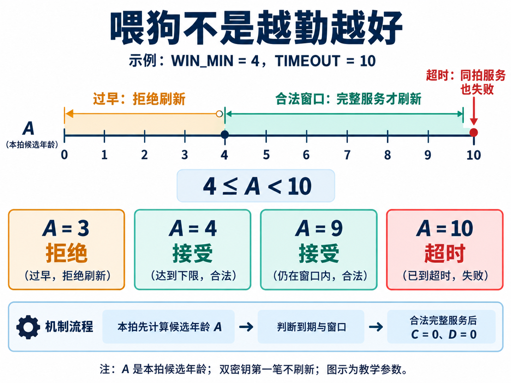
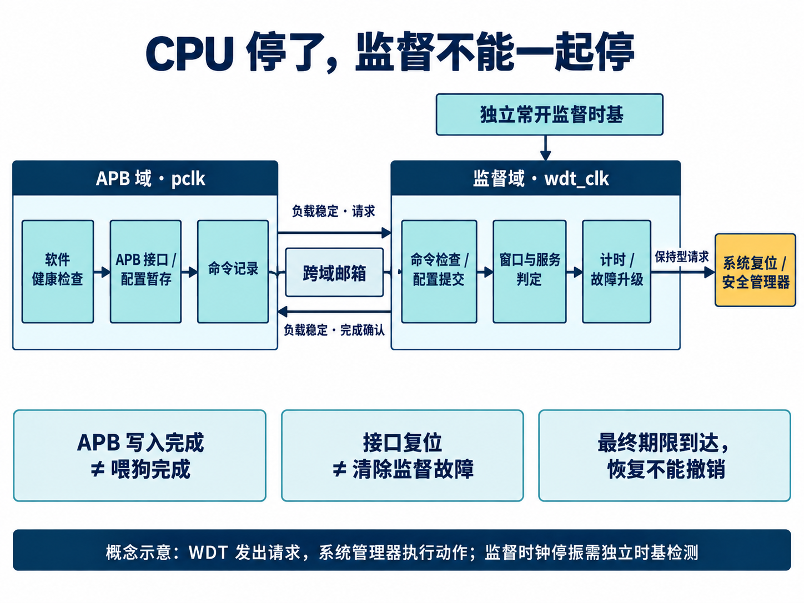

[English](README.en.md) | 简体中文

# 用 AI 从头开始设计一款 WDT

设想这样一台设备：负责采集数据的任务卡住了，输出已经很久没有更新，但定时中断还在运行。中断每隔一段时间写一次喂狗寄存器，于是系统既没有恢复，也没有复位。

看门狗没坏。它只是一直收到了“我还好”的消息。

这个场景揭示了 WDT 设计中最容易被忽略的问题：**谁有资格说系统还健康，这句话又凭什么可信？** 如果答案只是“有一段代码还在执行”，那么即使计数器工作得完全正确，也可能保护不了真正重要的任务。

如果从头设计这样一款 IP，我们要交付的就不只是计数器。软件怎样使用它，系统怎样复位它，异常怎样传出去，以及哪些测试能说明设计符合预期，都属于设计的一部分。

这篇按照需求、架构、实现、验证和集成的顺序，展开一款带 APB 接口的参数化 WDT 的设计思路，并结合已有工程记录，讲清 AI 在各阶段怎样参与。“从头开始”指从设计问题讲起：可以复用合适的基础模块，也需要逐步形成可检查的工程结果。

## 先给 AI 一份设计任务，而不只是一句“写个看门狗”

一个有效的起点，是先定义它要监督谁、能相信谁、失败以后交给谁处理。这份设计任务还需要约束软件接口、时钟与复位、启动期、服务方式、恢复权限和可配置规模。否则 AI 可以很快给出一段能编译的代码，却把最关键的系统假设留给使用者猜。

这轮工程采用了需求、架构、微架构、RTL 和验证逐级承接的流程。AI 根据设计契约整理需求及验收条件，再把它们映射到模块、接口、寄存器和测试。记录中的需求规模为 139 条、参数为 16 项；这些数量的意义在于形成一份可追踪的工作范围，而不是用条目多证明设计好。

例如，“接口复位不能停止监督”需要进一步回答：哪些状态受接口复位影响，哪些状态只受上电复位影响，已经接受的命令怎么办，软件回来以后怎样找到完成结果。AI 的工作从补全这些问题开始，随后把答案带进设计和用例。行为与取舍需要明确评审，不能让生成代码中的偶然写法反过来定义需求。

先看几个最能决定这款 WDT 结构的选择。

## 第一个选择：监督时间，也要定义健康

WDT 是 Watchdog Timer，即看门狗定时器。它维护一个期限：软件或硬件在期限内提交合法服务，俗称“喂狗”，计时重新开始；如果期限到了仍未得到服务，就记录故障并触发预定响应。

这与普通定时器的区别，主要体现在使用目的和控制约束上。普通定时器帮助程序安排时间；看门狗要在被监督对象不再可靠时继续工作。因此，不能让失效程序随意改写运行计数、无限延后期限，或者只清一次中断就撤销复位请求。

计时器本身不知道任务有没有算对。健康检查应落在有意义的进展上，例如一轮采集已经完成、处理任务交付了新结果、关键通信完成了预期步骤。无条件放在中断里的喂狗，最多说明中断还能运行。

多个任务共同决定系统健康时，这个工程提供了 GROUP 监督：每个必需客户端在当前一轮合法报到，硬件记录到达位图，最后一个必需客户端完成后才刷新整个通道。重复报到不能替代缺席者。这样，一个活跃任务就不能仅靠多报几次到，替另一个卡住的任务续命。

不过，客户端编号只是索引。若多个任务由同一个可信来源代理报到，它们之间并没有因此获得硬件身份隔离。判断依据必须一路追溯到真实进展，而不是给几次寄存器写入换上不同编号。

## 第二个选择：给喂狗加一个时间窗口

普通超时监督只设一个上限。窗口看门狗再加一个下限：过早服务也被视为异常。例如，程序跳过了某段计算，或者陷入了反复喂狗的短循环，可能比正常任务更快到达服务点。

这是一类通用的监督思想；ST 的[窗口看门狗培训材料](https://www.st.com/resource/en/product_training/STM32WB-WDG_TIMERS-System-Window-Watchdog-WWDG.pdf)同样说明了过早与过晚刷新。不同实现可以采用向上或向下计数，不能照搬另一颗芯片的阈值公式。这里讨论的候选设计使用饱和向上计数。

*图 1｜AI 生成的原理图，使用教学参数，不是仿真截图。窗口左端包含、右端不包含；只有完整且合法的服务才能刷新。*

用一个小例子说明：窗口下限 `WIN_MIN=4`，超时阈值 `TIMEOUT=10`，合法区间就是 `4 ≤ A < 10`。这里的 A 是本拍将要采用的年龄，而不是简单读取上一拍计数值。

RTL（寄存器传输级电路描述）先判断本拍是否产生计时 tick：若产生，则计算 `A=sat(C+1)`；否则 `A=C`。其中 sat 表示饱和处理：到最大值后保持，不回卷到零。随后所有窗口和到期判断使用同一个 A。合法完整服务会把计数 C 和分频相位 D 一起清零。

为什么要强调“本拍”？假设旧计数是 9，这拍刚好加一，服务也恰好到达。如果服务逻辑看旧值、超时逻辑看新值，就会出现两个模块各说各话。这个设计明确规定：**到达 10 的边沿判超时，不能被同拍喂狗救回来；到达 4 的边沿则允许成功服务。**

双密钥服务也遵守这条规则。先写 KEY1，再写 KEY2，是为了检查操作顺序；第一笔本身不刷新计数，完整序列仍须在规定时间和窗口内完成。序列期限按未分频的 WDT 时钟周期计算，主监督年龄按 tick 计算，两种时间单位不能混用。密钥或可选问答序列用于检测错误操作，不应被当作密码学身份认证。

窗口能发现一部分不正常的执行节奏，但如果错误程序仍以合法节奏喂狗，它依然可能漏检。所以窗口需要与任务进展检查共同使用。

## 第三个选择：把监督放到独立时钟域

计数器有了规则，接下来要考虑它靠什么运行。

这个 IP 分成两个时钟域：软件通过 APB 访问寄存器，使用 `pclk`；监督状态、计时和升级使用 `wdt_clk`。APB 是常见的片内外设总线。把监督放到独立常开的时基上，是为了让总线停顿或处理器侧停钟时，期限仍然能够推进。

*图 2｜AI 生成的职责与时钟域示意。WDT 发出请求，系统复位或安全管理器执行动作；图中的独立时基仍需要系统级供电、时钟和失效检测设计。*

两个时钟域之间不能直接把一组配置位逐位同步过去，否则接收方可能看到一半新值、一半旧值。这个实现使用跨时钟域邮箱：命令负载在握手期间保持稳定，请求传到监督域，处理结果再返回。CDC，即 Clock Domain Crossing，关注的就是这种跨域传输的可靠性与一致性。

因此，软件要分清两件事：APB 已经接收了写入，以及监督域已经完成了命令。驱动用完成序号匹配操作，并检查硬件结果码。一次轮询超时后，保留原命令的 pending 序号继续查询，不能不加判断地重发；原命令可能正在另一时钟域执行。

配置也经过暂存、校验与提交，不让软件零散修改活动监督参数。这样，半份新窗口配上半份旧超时值的中间状态，不会直接成为运行规则。

复位边界同样重要。APB 接口复位不应顺便抹掉持续监督故障；邮箱和返回记录需要按事务生命周期处理，避免一次在途命令因接口复位被重复执行。最终复位请求采用保持型输出，接到真正能执行动作的系统管理器，而不是只依靠可能已经停摆的软件处理中断请求 IRQ。

独立 `wdt_clk` 也不是万能的：如果它自己停振，依赖它运行的逻辑无法继续数时间。系统需要另外的独立时基检测这一故障。两个 RTL 时钟端口并不能自动证明振荡器、电源和物理故障路径互相独立。

## 第四个选择：允许恢复，但保留最终期限

看门狗发现问题后，并不一定立即把整颗芯片复位。有些场景可以先唤醒处理器、报告故障或请求局部复位，尝试恢复出问题的子系统；如果恢复没有在最后期限前完成，再升级到系统级动作。

关键在于，这个恢复机会必须有边界。

本设计从故障发生时启动独立的升级年龄 E，按未分频 `wdt_clk` 推进。局部响应与最终响应各有期限；故障后再喂狗、清 IRQ 或重复写配置，都不能把 E 重新归零。已经锁存的故障也不能通过请求暂停，获得无限长的宽限期。

恢复完成由真正执行恢复的实体发出，并通过 done/ack 握手确认，双方回零后才接受下一次。一个一直保持高电平的旧 done，不应被当成多次新恢复。

如果最终期限和恢复完成恰好同拍，最终升级优先。对于致命的自身完整性故障，则直接请求最终动作，不等待普通恢复延迟。清中断、清故障、恢复运行和撤销请求是不同的事，不能用一个“清状态”操作把它们一起做掉。

这类选择会影响系统是否能摆脱故障循环。看门狗的目的既包括给正常恢复留出空间，也包括保证恢复失败之后仍有下一步动作。

## 让 AI 把这些选择组织成一款 IP

前面的四个选择确定了行为，接下来才是模块怎样拆、代码怎样写。AI 在这一阶段需要交出架构分工和状态归属，便于检查是否有人漏接了一项责任。

这款 WDT 的架构分为六类职责：总线接口、跨域传输、命令分发、通道监督、安全检测和系统集成。它们是设计责任边界，不要求机械地拆成六个 RTL 文件。总线侧负责访问检查与配置暂存，跨域层负责命令及完成记录，通道拥有计时与服务状态，系统集成层汇总输出并连接外部管理器。这样，接口复位能不能影响监督，就可以落实到具体状态归谁所有。

### 架构方案要写出代价

AI 整理的架构决策不能只留下“采用某方案”。工程中的单在途邮箱就是一个例子：与多在途队列相比，它更容易对应来源、配置快照、完成序号和复位语义，但软件命令吞吐受一次完整跨域往返限制。对于 WDT，这个取舍可以讨论；到了高吞吐数据搬运 IP，就未必合适。

另一个选择是每通道并行监督，而不是共享计数资源、多拍轮询。并行方式使期限判断不必等待轮询走到本通道，也便于取得一致快照；代价是规模增大时的状态存储与组合逻辑开销。这些是架构取舍，不是已经量测得到的面积结论。

复用也需要语义核对。已有轮询仲裁器适合用于邮箱命令与硬件事件两类来源的公平选择；已有普通加减模块却不直接承担这里的饱和计数、互补状态和故障优先级更新。AI 的复用评估需要比较接口与行为，不能仅凭名字相似就接进来。通用模块通过依赖引用接入，监督器特有的状态语义仍由本 IP 实现。

### 寄存器、RTL 和软件，要使用同一套解释

微架构继续把职责细化为状态、字段、更新条件和同拍优先级。工程记录中的 AI 核验覆盖了 22 个接口、97 个寄存器字段和 167 个微设计对象，并核对寄存器描述与正文的一致性。这些检查能够发现规格之间的缺口，但不能替代 RTL 功能验证。

寄存器描述使用 SystemRDL——一种描述寄存器地址、字段和访问属性的语言——生成控制与状态寄存器（CSR）视图，再与实际 RTL 一起编译。需要统一的并不只是地址：SERVICE 写入何时成为命令，清中断是否有副作用，快照何时有效，完成序号何时改变，都必须进入行为约定。

可以用一条要求追踪这套工作：

| 阶段 | “超时边沿不能被喂狗覆盖”怎样落地 |
| --- | --- |
| 需求 | 明确 TIMEOUT 边沿服务失败，窗口上限不包含 |
| 微架构 | 所有判断使用本拍候选年龄，故障优先于刷新 |
| RTL | 状态更新先处理新故障，不能由后续赋值清掉 |
| 验证 | 对比 TIMEOUT−1 与 TIMEOUT，并覆盖分频相位 |
| 软件说明 | 按执行时刻预算，给调度、总线和跨域传输留裕量 |

这张表展示的是需求怎样贯穿产物，并不把“存在链接”当成“已经证明正确”。AI 可以帮助维护这种对应关系；修改一条规则时，也要检查相关 RTL、测试和驱动说明是否一起变化。

### AI 需要用工具反馈修正实现

一个有代表性的过程记录，是通用开发 Skill 与看门狗语义发生了冲突。模板建议“状态机进入非法状态后回到复位态”，而本设计要求这类致命异常立即进入最终升级。普通控制器回初态可能便于恢复，监督器回到不再监督的状态却可能掩盖故障。工程反馈因此要求具体微架构决定失效响应，不能机械套用模板。

Skill 在这里相当于可复用的工程步骤与检查规则：规定要看哪些输入、形成哪些产物、执行哪些检查。它可以帮助 AI 连续推进工作，但不能代替领域判断，也不能把尚未通过的工具结果改写成通过。

工具兼容性也提供了真实反馈：某种多异步复位写法被仿真器接受，却被综合或静态检查工具拒绝。记录给出的修正方向，是先形成明确的复位信号，再采用单一复位判断。AI 因而需要读取日志、定位对应实现、修正并重新验证，不能只看到仿真编译成功就继续宣布完成。

在这条流程中，AI 的职责覆盖资料整理、设计细化、RTL 与环境维护、命令执行、日志分析和结果归档。工具提供编译、仿真、静态检查等反馈；系统目标和关键取舍仍需明确决定。委托 AI 做的文档核验，也不自动成为独立第三方评审。

## 测试要检查看门狗能不能拒绝

AI 组织验证时，需要把通道单元测试、总线访问、跨域交互和参数变化分开检查，再组合成系统场景。参考模型依据需求计算期望值，不能只复制 RTL 的实现分支；同一套 AI 生成的实现与测试相互吻合，也不自动构成独立验证。

验证看门狗时，只证明“正确喂狗不会复位”远远不够。更有价值的用例，经常是它该拒绝的时候有没有拒绝。

| 场景 | 本设计应有的行为 |
| --- | --- |
| 完整服务恰好落在 TIMEOUT 边沿 | 判超时，不能刷新续命 |
| 只写第一笔密钥，随后停止 | 计时继续，不算完整服务 |
| 故障后不断清 IRQ | 活动故障与升级期限继续保持 |
| 最终到期与恢复完成同拍 | 最终请求优先 |
| 轮询超时，原命令仍在途 | 保留序号继续查询，避免盲目重发 |

2026 年 9 月 14 日的归档报告记录了五组模块测试配置、3800 次检查通过，覆盖 32/48/64-bit 通道和两组 APB/WDT 时钟配置；UVM，即通用验证方法学环境，共执行 225 项运行，记录全部通过。参数检查还执行了 188 项：178 项合法配置完成编译与能力/复位默认值读回，10 项非法配置在 Schema 层按预期拒绝。

这些是具体阶段的结果，不能扩写成“验证已经全部闭合”：参数读回不等于完整功能回归，整体覆盖与技术签核仍未完成。本文讨论的是已有候选实现及其工程方法，不是正式 IP 发布或功能安全认证，也不使用尚未取得的 PPA 测量结果宣传面积、功耗或频率。

还有一条经验值得保留：回归运行期间若 RTL 已被修改，之前的 PASS 不能自动覆盖新版本。这个工程把编译与运行输入的哈希绑定起来，记录过旧运行虽通过、但因源码变化而被判为无效的情况。AI 修改得越快，越需要知道一份测试结果到底属于哪份设计。

## 真正落到芯片里，要接上最后一段路

IP 内部行为清楚之后，AI 还要把使用约定落实到 C 驱动、能力读回、错误处理和集成文档。工程中已有 C11 驱动测试通过的记录，但接收方仍需按目标系统连接和验证，不能拿文档齐全代替集成完成。

先确定监督对象：哪些任务的进展共同构成健康，谁采集证据，谁有权配置、服务和诊断。再选择启动期与正常期的期限。此设计在不暂停时，从刷新或启动边沿到超时的周期数为 `TIMEOUT × (P+1)`，其中 P 是预分频值；启动期则使用 BOOT_TIMEOUT。软件需要按实际时钟频率与偏差换算，并给调度、APB 和跨域延迟留出裕量，不能等窗口快结束才开始写第一笔密钥。

例如，仅用于预算演示，若监督时钟为 1MHz、P=99、TIMEOUT=1000，则超时为 100ms。这不是产品默认值，更不表示软件可以等到第 100ms 才发起服务；合法性在监督域真正处理服务时判断。

硬件集成要把保持型请求接到系统复位或安全管理器，确认局部恢复、最终复位和低功耗暂停的责任。固件则读回实例能力，完成配置提交，等待匹配的完成序号，再让应用健康检查驱动服务。共享邮箱与间接寄存器窗口的访问需要全局互斥，不能假定每个通道都能被不同线程无锁操作。

最后，再问回开头那台设备：采集任务卡住以后，谁还会替它说“我还好”？如果答案仍是一个无条件运行的中断，那么再精巧的计数器也没有解决问题。

从头设计一款 WDT，需要把这些问题逐项变成明确的行为。AI 可以参与需求整理、方案比较、实现、验证和交付准备；每一步留下的约定与证据，又决定下一步能否可靠地继续。最后得到的应当是一款知道如何配置、如何检查、如何集成的 IP，而不只是一段看起来像看门狗的 RTL。
