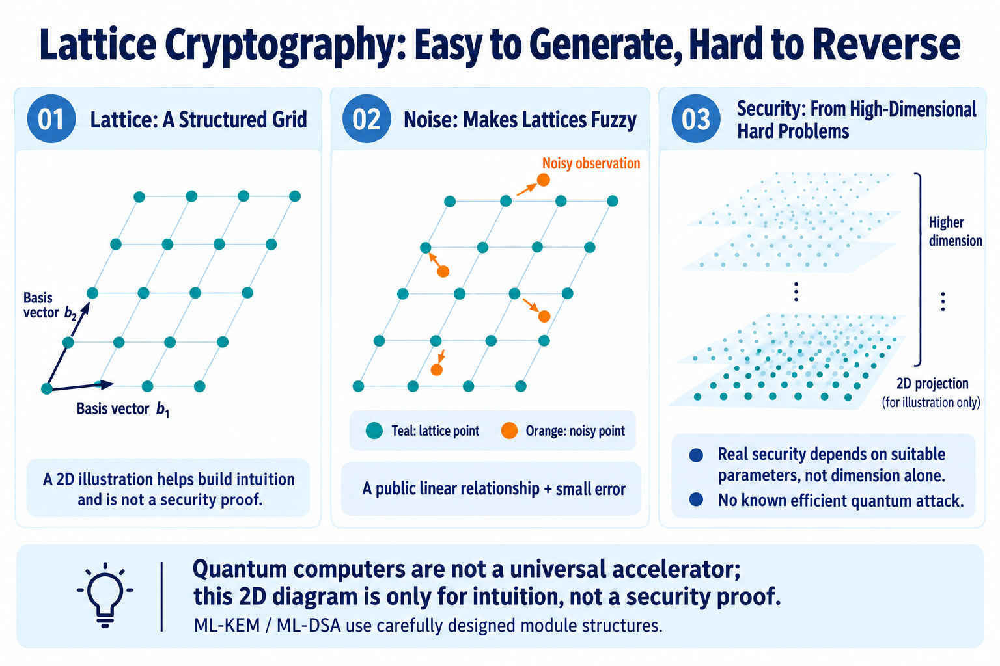
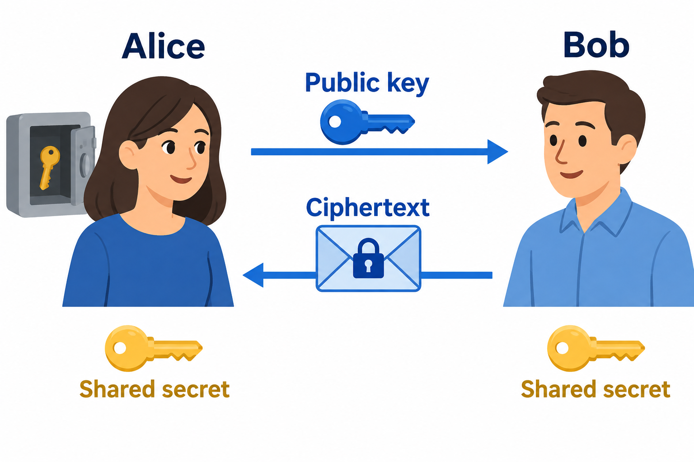
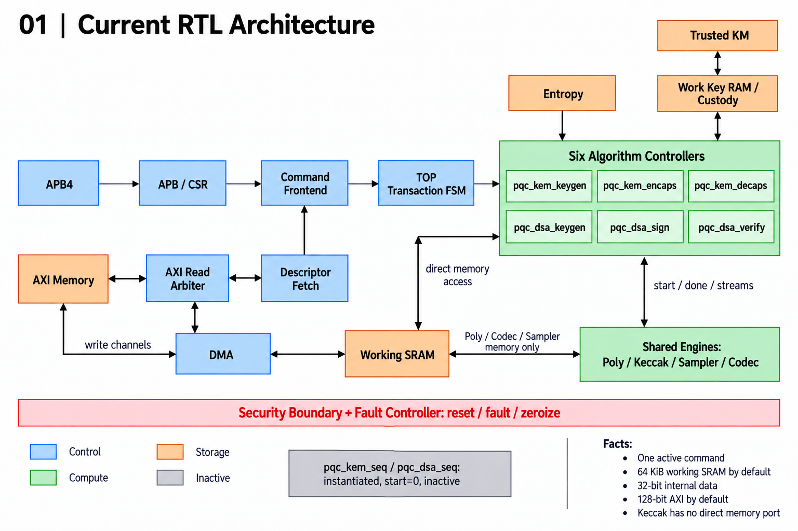
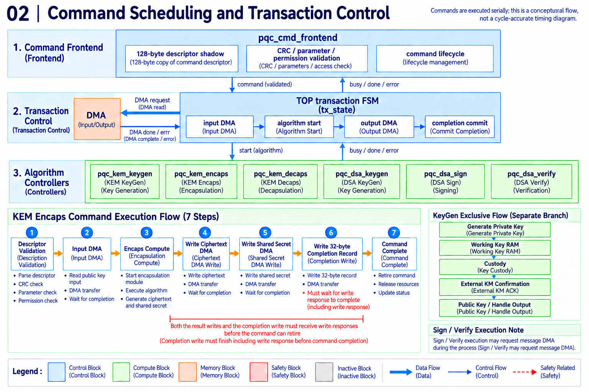
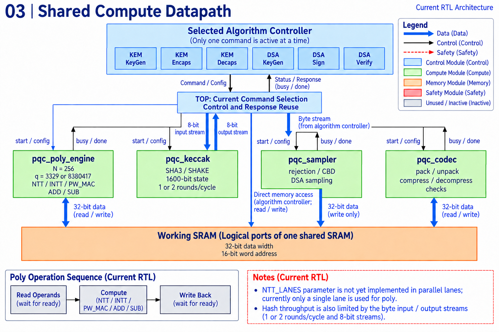
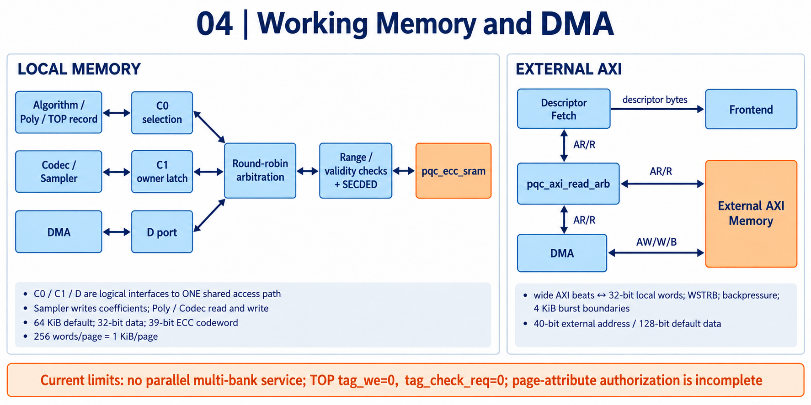
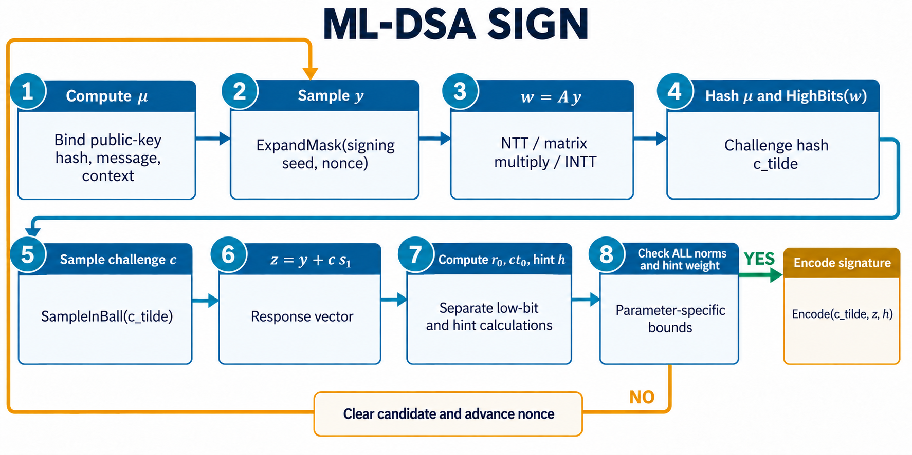
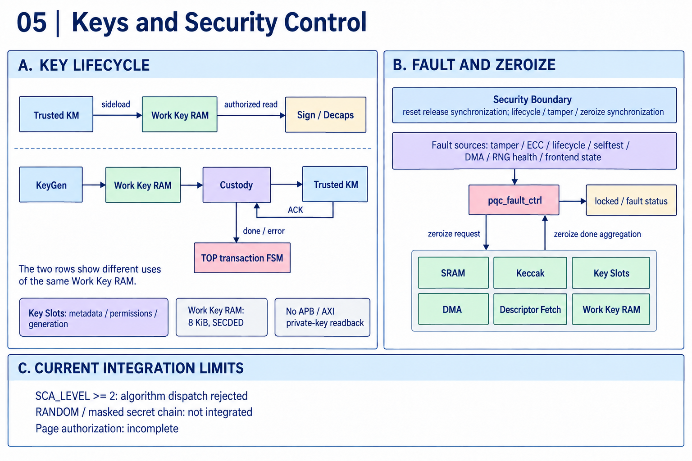

# Designing a Post-Quantum Cryptographic Accelerator with AI: From Commands to Verified RTL

[简体中文](README.md) | English


**How AI helped with the design, verification, and synthesis of hardware for key establishment and digital signatures.**

A device receives a firmware update. Before installing it, the device needs to answer two questions: did this file come from the expected publisher, and has anyone changed its contents?

These apparently software-level questions can ultimately depend on cryptographic logic inside a chip. As algorithms evolve to address future quantum-computing threats, that hardware must evolve too.

In this project, I used AI to help develop a post-quantum cryptographic accelerator. It supports two kinds of work: establishing shared secrets with ML-KEM, and generating and verifying digital signatures with ML-DSA. The design progressed from requirements and architecture to RTL, module tests, comparisons of complete algorithm outputs, and synthesis.

What interested me most was connecting these stages. How does an algorithm in a standard become descriptors, state machines, memory accesses, and bus handshakes? How do answers from independent software correspond to every byte the circuit actually writes?

We will first look at shared secrets and signatures, then follow an encapsulation command through the hardware as it is scheduled, computes, waits, and finally returns checked results to software.

The project produced concrete evidence: end-to-end RTL comparisons for six operation types, 49 module unit tests, 33 UVM runs, 324 checked algorithm commands, and synthesis evaluated at a 100 MHz target. Each result answers a different engineering question.

> Test and synthesis figures reflect project records through September 22, 2026. Passing results apply to the stated test and tool conditions; they are not a security certification or a production-release claim.

## 1. Why post-quantum cryptography runs on ordinary chips

“Post-quantum” can sound like something that needs a quantum computer. These algorithms run on ordinary CPUs and can be implemented in conventional digital logic.

The threat is an attacker with sufficiently powerful quantum computing, which would undermine some public-key foundations used today. Post-quantum cryptography asks how to continue establishing secrets, verifying messages, and protecting identities under that threat model. It is a security objective, not a hardware material or a promise of permanent invulnerability.

The project uses ML-KEM for shared-secret establishment and ML-DSA for signatures, specified in NIST's [FIPS 203](https://csrc.nist.gov/pubs/fips/203/final) and [FIPS 204](https://csrc.nist.gov/pubs/fips/204/final). The standards pages also maintain potential errata; a formal implementation needs to pin its specification version and check relevant updates.

### Lattices: how small errors make public clues harder to reverse

Imagine an endless sheet of graph paper. Starting at an origin and taking integer steps along two fixed directions produces a regular set of points: a simple way to picture a lattice. The directions can be slanted. Finding a nearby point on paper may look easy; cryptographic lattices occupy much higher-dimensional spaces that cannot be understood from a drawing alone.

Some lattice problems are easy to state and difficult to solve—for example, finding a sufficiently short nonzero vector, or a lattice vector sufficiently close to a target. The difficulty depends on the problem, its parameters, and the required approximation. Adding dimensions does not automatically create security.

More directly relevant here is **Learning With Errors, or LWE**. Think of public linear relationships involving a secret. With enough independent exact relationships, an attacker could solve for that secret. Carefully chosen small errors make the relationships inexact and recovery much harder. The arithmetic is modular, so these are not ordinary real-valued equations. LWE has formal connections to specific hard lattice problems; its foundation is more substantial than “scramble the data.” [Regev's LWE paper](https://arxiv.org/abs/2401.03703) established an important basis for this work.



*Figure 1. An intuition-building illustration. The displaced points are an analogy for inexact information, not a direct drawing of LWE samples. The high-dimensional structure is schematic, not a security proof.*

If errors obstruct attackers, how can legitimate users recover anything? They possess secret information, and the protocol carefully defines the error bounds and recovery rules. In the construction underlying KEM, the private-key holder can cancel key secret-dependent terms and recover the required information within the permitted error range. **Errors must be small enough for recovery, while working with the other parameters to make inversion difficult without the secret.** They are deliberately sampled algorithmic values, not circuit jitter or communication noise.

Quantum speedups depend on problem structure. Shor's algorithm efficiently addresses factoring and discrete logarithms, threatening RSA and elliptic-curve public-key systems. That capability does not transfer automatically to every mathematical problem. For the relevant lattice problems with suitable parameters, no efficient quantum attack is currently known. Quantum algorithms may still accelerate parts of an attack, so parameter selection considers both classical and quantum costs. This is a judgment grounded in current research, not proof that no future attack can exist. [NIST's introduction to post-quantum cryptography](https://www.nist.gov/cybersecurity-and-privacy/what-post-quantum-cryptography) provides the broader context.

ML-KEM is based on Module-LWE. ML-DSA also uses module lattices, but its signature construction is distinct; it is not encapsulation under a different name. Their structure supports polynomial arithmetic in hardware. Dimensions, moduli, error distributions, and other specified parameters must be used together. Arbitrarily adding noise does not produce a sound cryptosystem.

In the chip, these mathematical relationships become coefficients, modular arithmetic, sampling, and polynomial multiplication. That is what the NTT engine, sampler, and memory scheduling support.

### KEM: exchange public material, keep the secret at both ends

Suppose Alice wants Bob to establish a shared secret with her. Alice generates a key pair and sends Bob the public key. Bob encapsulates using that key, producing a ciphertext that can be sent publicly and a shared secret that he retains. Alice decapsulates the ciphertext with her private key to recover the same shared secret.



*Figure 2. KEM establishes a shared secret. Public keys and ciphertext cross the network; the two parties compute the secret separately. Private keys, public keys, and shared secrets are distinct objects.*

KEM does not directly encrypt a movie or a file. Subsequent protocol steps typically derive symmetric keys to protect application data. Nor does KEM establish who owns a public key: identity binding still requires signatures, certificates, or trusted configuration.

### Digital signatures: detecting changes to a message

For a firmware update, the question is whether the expected publisher signed the received contents.

The signer uses a private key and message to generate a signature. The verifier uses the public key, message, and signature to check validity. Signing does not conceal the message and should not be described as private-key encryption followed by public-key decryption.

This implementation also handles `context`, an identifier for the intended use. Firmware updates and login messages can use different contexts to separate their purposes. Signing and verification must use the same context.

The “six algorithms” are more precisely **six operation types in two algorithm families**:

| Family | Operations | Purpose |
|---|---|---|
| ML-KEM | KeyGen, Encaps, Decaps | Generate keys, encapsulate, decapsulate |
| ML-DSA | KeyGen, Sign, Verify | Generate keys, sign, verify |

ML-KEM has parameter sets 512, 768, and 1024; ML-DSA has 44, 65, and 87. These names are neither interface widths nor arbitrary per-operation tuning values. Each set needs implementation and verification.

## 2. Turning “build an accelerator” into testable requirements

A request to AI for a PQC accelerator can produce plenty of plausible code. Implementation still requires decisions: a polynomial multiplier or complete operations? Where do private keys live? How does a CPU submit work? What happens when external memory stops responding? Is a rejected signing candidate an error or normal algorithm behavior?

The scope here is a reusable SoC IP supporting complete operations. It is larger than an isolated NTT operator, but does not implement an entire network protocol or certificate system.

A requirements contract was expanded into a low-level requirements specification, or LRS: requirements, applicability, acceptance criteria, and verification methods. Its 84 traceable items connect design choices to implementation and tests.

One central decision defines the key boundary: **an external trusted Key Manager owns long-term keys; the accelerator holds working copies needed for a command; private keys enter through a dedicated interface and are not read back through ordinary AXI DMA.** This determines storage, permissions, KeyGen output handling, and verification.

Performance also needs a concrete definition. Analysis of shared Keccak throughput led to one-round-per-cycle and two-rounds-per-cycle structures and achievable cycle budgets. An attractive bandwidth target alone would say little about resources or feasibility. Input widths, control overhead, and actual waits must then be measured against the budget.

Signing has a fixed normal scheduling boundary for each attempt, while the number of attempts may vary. Performance can therefore be described with percentiles. A rejection-based algorithm cannot also carry an unconditional fixed-total-latency promise.

The engineer sets product boundaries and tradeoffs. AI helps expand requirements, analyze dependencies, and prepare design inputs. Recorded decisions give architecture, implementation, and verification a common starting point.

## 3. Six controllers sharing four kinds of compute engine

Resources could be replicated for every operation. This design instead shares polynomial arithmetic, hashing, sampling, and encoding hardware across the two algorithm families.

The arrangement resembles a workshop with different procedures using the same equipment. Sharing saves equipment, but requires explicit ownership: who goes first, where data lives, and whether the preceding operation has actually finished.



*Figure 3. An overview organized from the current RTL. Connections indicate functional relationships rather than a complete wiring diagram. The top transaction FSM schedules the six specific algorithm modules; the gray blocks are outside the normal command execution path.*

High-level design, or HLD, defines responsibilities, interfaces, storage, security boundaries, and budgets. Low-level design, or LLD, specifies state machines, cycle-level handshakes, widths, addresses, and error handling.

The six controllers are:

```text
pqc_kem_keygen     pqc_kem_encaps     pqc_kem_decaps
pqc_dsa_keygen     pqc_dsa_sign       pqc_dsa_verify
```

| Shared engine | Responsibility |
|---|---|
| Poly | Transforms, multiply-accumulate, addition, and subtraction for polynomial arithmetic |
| Keccak | SHA3/SHAKE hashing and variable-length byte expansion |
| Sampler | Converts bytes into coefficients using the required distributions and rejection rules |
| Codec | Converts between internal coefficients and compact external byte strings, with encoding checks |

The sampler cannot substitute an arbitrary random function. The codec cannot simply copy an array: 12-bit coefficients, cross-byte packing, compression rounding, and canonical encoding checks affect the result.

### Why the NTT matters

A polynomial can be represented as an ordered sequence of numbers. Direct multiplication requires many cross-products. The number-theoretic transform, or NTT, changes representation so that parts of the multiplication become simpler; an inverse transform returns to the original representation.

The idea resembles the FFT's transform–compute–inverse approach, but here the operations are exact integers modulo a specified modulus. ML-KEM and ML-DSA differ in their moduli, transform stages, and multiplication semantics. Sharing hardware does not mean that changing constants automatically makes every operation correct.

## 4. RTL turns an algorithm into handshakes

Register-transfer-level code describes registers, combinational logic, and clocked state transitions. Unlike the sequential reading of a software function, multiple hardware modules exist and advance—or wait—at the same time.

One algorithmic function call can become a request, a held address, an acceptance handshake, a returned value, a compute launch, a completion wait, and a writeback. Translating Python syntax into SystemVerilog is only a small part of that work.

Control is organized into three layers:

1. The **command frontend** fetches descriptors, validates inputs, and manages command lifetime.
2. The **top transaction FSM** coordinates input/output DMA, algorithm launch, key custody, and completion records.
3. The **algorithm controllers** execute internal steps using the shared engines.



*Figure 4. Algorithm completion, DMA completion, and software-visible command completion are separate events.*

Software configures control registers over APB, prepares a 128-byte descriptor, and writes a doorbell. The descriptor identifies the operation, input and output addresses, parameter set, and key handle.

The frontend fetches it into an internal shadow before validation, preventing later external edits from directly changing an in-flight command. CRC detects certain data changes; it provides no cryptographic identity authentication. Address and permission checks remain necessary.

DMA moves bulk data over AXI, while APB serves configuration and status.

### Why finishing the calculation is not enough

Ciphertext may be ready in SRAM while the external bus has not yet acknowledged its writes. An early interrupt could let software observe a mixture of old and new data.

A successful command therefore waits for result writes and their responses, commits a completion record, and only then retires. The completion record is software's receipt, carrying command identity, status, and output lengths.

Verification must observe AXI write responses as well as algorithm `done`. Arithmetic correctness and transaction correctness are both required. Even when the engines are idle, pending external acknowledgments keep the transaction alive.

## 5. Following a 1,184-byte public key through ML-KEM-768 encapsulation

ML-KEM-768 Encaps takes a 1,184-byte public key and 32 bytes of random material from the entropy interface. It produces a 1,088-byte ciphertext and a 32-byte shared secret. No application file or recipient private key is an input.

Hardware transfers and decodes the public key, checks coefficient validity, and reads its public seed. It binds the public-key hash to the random material and derives the shared secret and material for sampling.

The main calculation samples a secret vector, performs NTT operations, expands the public matrix as needed, accumulates products, applies inverse transforms, adds the appropriate noise, and compresses and packs the ciphertext. The shared secret comes from the earlier derivation branch; it is not recovered from the finished ciphertext.



*Figure 5. Keccak exchanges byte streams with algorithm controllers and has no direct SRAM port. Direct controller memory access includes both requests and returns; the drawing simplifies those functional relationships.*

A practical storage choice is to generate public-matrix elements one at a time. After one multiply-accumulate, the same scratch space can hold the next element, avoiding storage for the entire matrix.

This saves memory but requires serial ownership. The next producer cannot overwrite a region before its last reader finishes.

Along the path, a packed public key becomes coefficients, coefficients enter the transform domain, and results become compressed ciphertext. The 1,088-byte ciphertext and 32-byte secret go to separate output buffers before the completion record is delivered.

Software sees one submission and one completion. Hardware coordinates transfers, sampling, hashing, transforms, arithmetic, and packing. Following the command into RTL and memory pages suggests useful review questions: **what does this page contain now, who reads it last, and when may it be reused?**

One timing detail illustrates why operation counts are insufficient. The current encapsulation path requests up to 4,096 SHAKE bytes for a matrix element. The sampler may obtain enough coefficients earlier, but the controller still waits for the hash request to finish and handles remaining output. Polynomial multiplication counts alone cannot predict command latency.

## 6. Data representation and memory are frequent sources of errors

A paper can represent an object with one symbol. Hardware needs its width, layout, ordering, and whether an address refers to bytes or words.

An ML-KEM coefficient fits in 12 bits, but this implementation generally uses a 32-bit working-memory slot. A set of 256 coefficients occupies 1 KiB internally and 384 bytes when packed into 12-bit fields. The mathematical object can be the same while the memory layout is completely different.

For a small example, packing the 12-bit integers 1 and 2 consecutively, least-significant bits first, gives the bytes `01 20 00`. That is not the same as storing two 16-bit integers.

Python integers can grow; RTL signal widths cannot. If a product of two 23-bit values is truncated before modular reduction, the lost information cannot be recovered. Endianness, sign extension, compression rounding, and invalid encodings can each cause a one-byte mismatch.



*Figure 6. Local memory and external AXI are shown separately. Bidirectional links combine request/response relationships; they do not imply every data channel is bidirectional. C0, C1, and D are logical interfaces, not three independent physical SRAM ports.*

Working SRAM defaults to 64 KiB. Direct algorithm accesses and Poly use C0; Codec and Sampler share C1; DMA uses D. Arbitration ultimately selects accesses to a shared path.

A 128-bit external AXI interface does not imply consumption of 128 bits per internal cycle. Separate module interfaces do not imply simultaneous bank accesses either.

The current Poly schedule is serial. A lane-count parameter exists, but additional lanes require an actual parallel datapath and memory schedule. Performance improvements must consider compute units, SRAM banks, ports, and dependencies together. Faster arithmetic does little for a command whose engine spends most of its time waiting for data.

## 7. Why signatures retry and decapsulation does not simply report a bad ciphertext

Some apparently exceptional behavior is part of the algorithm.

ML-DSA signing generates a candidate and checks whether it satisfies the conditions required for publication. A rejected candidate must be discarded and recomputed with new sampling. This is normal behavior, not an arithmetic failure.



*Figure 7. Follow the blue computation path and orange retry loop first; the intermediate symbols do not require a derivation to understand the control flow. The challenge hash uses the prescribed encoding of the high-bit information.*

Implementation must handle candidate clearing, the next nonce, maximum attempts, and output commit. An unaccepted partial signature must never become software-visible.

Tests cover deterministic and hedged signing. Deterministic signing reproduces results for the same key, message, and context. Hedged signing incorporates additional random material; supplying identical randomness to RTL and the reference also permits byte-for-byte comparison.

Tests check fixed cycle boundaries for each candidate attempt. Variable attempt counts still mean variable total latency, and these checks do not prove absence of side-channel leakage.

ML-KEM decapsulation has a different requirement. A ciphertext mismatch should not simply expose an internal comparison-failed result. The implementation derives an implicit-rejection secret and follows the specified selection path.

Testing malformed ciphertext therefore means more than checking that the hardware does not crash. It must produce the correct rejection secret and exhibit the expected cycle relationship between valid and mismatching paths under the defined external-response conditions.

## 8. Key protection goes beyond the right numerical answer

Who can read a private key? Can late data arrive after cancellation? What happens after tamper detection or an uncorrectable memory error?

Working private keys live in a separate Work Key RAM. Key Slots hold handles, permissions, and related metadata; eight slots do not mean eight complete private-key storage arrays.

KeyGen sends a new private key to the external Key Manager through a dedicated custody interface. It waits for an acknowledgment carrying identity information before advancing public-key and handle publication. Ordinary system-memory DMA is not the private-key output route.



*Figure 8. The same Work Key RAM appears in import and KeyGen flows to show two uses, not two physical memories. Zeroization requests and completion feedback form a system-level handshake.*

SECDED ECC corrects single-bit errors and detects double-bit errors within its coding capability. It protects storage integrity; it is neither encryption nor side-channel protection.

The Fault Controller aggregates faults and tamper events, launches clearing, and waits for acknowledgments from SRAM, Keccak, Key Slots, DMA, descriptor fetch, and Work Key RAM. Issuing a clear request is insufficient without confirming invalidation and handling in-flight transactions.

Key interfaces, ECC, and clearing each serve different purposes. Side-channel resistance requires its own design and evaluation; correct signatures and ciphertext alone cannot establish it.

## 9. Unit tests: exercising a component at its boundaries

Unit tests isolate a module with controlled inputs and observable outputs. Arithmetic tests check boundaries and reference values. Control tests exercise handshakes, backpressure, invalid inputs, cancellation, and clearing.

Backpressure means the receiver cannot accept data yet. The sender must retain pending data rather than advance after a few cycles, and must not count one request twice.

The project records **49/49 module UTs passing**, covering Poly, Keccak, Codec, Sampler, DMA, keys, clearing, and control modules.

A small DMA test can prepare a word, hold receiver `ready` low, and require unchanged data until exactly one transfer occurs when readiness returns. Adding a clear during the wait tests the treatment of pending requests and late responses. Such cases are less conspicuous than a complete signature but essential to reliable integration.

The meaning of a UT depends on its environment. Some algorithm-controller tests use controlled primitive responses to check scheduling, error priorities, and clearing. They do not rerun the complete cryptographic calculation; that requires system-level oracle comparisons.

A test that sees `start` followed by `done` may prove only one handshake scenario if the computation is stubbed. Reviewing tests requires identifying the DUT, replaced dependencies, and source of expected values.

## 10. UVM and golden results: compare every byte

UVM provides a framework for organizing stimulus, bus interactions, monitors, checkers, and reporting. Using UVM does not itself prove correctness. What matters is what it observes and compares.

The end-to-end path is:

```text
Independent software oracle produces inputs and expected outputs
    → Freeze vector files with versions and hashes
    → Drive actual RTL through APB, AXI, KM, and entropy interfaces
    → Compare every output byte, status, and commit ordering
```

Frozen references use `kyber-py 1.2.0` for ML-KEM and `dilithium-py 1.4.0` for ML-DSA. These are independent software answers, not values inferred from DUT internals, and are not equivalent to official certification.

Encaps also has a direct algebraic cross-check. Decaps rejection secrets are checked separately, and the software reference first confirms that tampered DSA vectors should be rejected. Simulation reads frozen files; Python, C, and DPI do not replace the RTL computation.

### What the six operation tests compare

| Operation | Parameter sets | Commands per campaign | Main checks |
|---|---|---:|---|
| KEM KeyGen | 512 / 768 / 1024 | 9 | Every public-key and custody private-key byte; identity and ACK |
| KEM Encaps | 512 / 768 / 1024 | 6 | Complete ciphertext and 32-byte secret |
| KEM Decaps | 512 / 768 / 1024 | 45 | 9 valid, 27 tampered-rejection, 9 backpressure repeats |
| DSA KeyGen | 44 / 65 / 87 | 9 | Every public-key and custody private-key byte |
| DSA Sign | 44 / 65 / 87 | 27 | Deterministic, hedged, repeat signatures; candidate counts |
| DSA Verify | 44 / 65 / 87 | 63 | Valid cases and six kinds of tampering |
| Total | 18 operation/parameter combinations | 159 | Cryptographic outputs and transaction behavior |

The 159 commands include repeats and negative variants. Decapsulation tests modify bytes near the beginning, middle, or end of a ciphertext and compare against the precomputed rejection secret, rather than merely expecting a failure status. Signature comparison identifies even one differing byte among thousands.

“Golden” means the independent expected answer used for comparison. Signature tests observe each valid byte at AXI write-data handshakes; KeyGen tests observe private keys at the custody interface. Checks also cover duplicate writes, out-of-range writes, write responses, and interrupts, requiring completion to follow result acknowledgment.

Register checks cover the control-interface contract. Algorithm-test monitors cover cryptographic results, output ranges, and completion order. Tracing input generation, observation points, and expected-value generation is more revealing than searching for a file named `scoreboard`.

### Reproducible random material beyond fixed vectors

Known-answer vectors help debugging and regression, but repeating the same material explores few numerical combinations.

A `campaign-seed` generates new key seeds, messages, contexts, and hedged randomness, followed by offline golden computation. The seed, file hashes, and oracle version make failures reproducible. Changing only the simulator seed while retaining the same frozen vectors does not add independent cryptographic inputs.

Current DSA message/context length pairs are `(0,0)`, `(137,1)`, and `(65537,255)` bytes. A 65,537-byte message crosses the 64 KiB boundary and exercises length and segmentation handling. These are selected boundaries, not all lengths or all cross-combinations.

**The execution record contains 33 passing UVM runs and 324 algorithm commands, including a 159-command rerun with material seed `0x20260922`.** All six operation types therefore have recorded comparisons against actual RTL outputs.

The main harness fixes 64 KiB SRAM, 128-bit DMA, two Keccak rounds per cycle, eight key slots, and `SCA_LEVEL=1`. HashML-DSA, complete Level 2 support, all hardware configurations, a full AXI4 VIP, and coverage closure are not established by these results. Exercising every operation type and completing verification of an entire IP are different claims.

## 11. Synthesis: what circuit does the code become?

Does this code only run in a simulator, or can it map to hardware?

**The recorded design completed logic synthesis against a 28 nm standard-cell library, meeting the reported timing and electrical checks at a 100 MHz target.** RTL had reached a mapped implementation whose resources could be measured.

Simulation checks behavior. Synthesis maps arithmetic, selection, state updates, and registers into library-defined gates and flip-flops, then optimizes using their area and delay models. Polynomial computation must ultimately become connected arithmetic, muxes, and registers.

This constrains AI-generated code in useful ways. An excessive combinational path, an inefficient array implementation, or a supposedly implemented block removed as unused can undermine a source-level impression of completeness.

### From RTL to mapped cells

Design Compiler V-2023.12-SP3 performed RTL reading, elaboration, library linking, clock/interface constraint loading, logic optimization, and mapping. Incremental electrical-rule repair and area, timing, power, and constraint reports followed.

The mapped Verilog netlist `pqc_netlist.v` contains cell instances and connectivity. `pqc_mapped.sdc` holds exported timing constraints, and `pqc_mapped.ddc` stores the mapped design database. Result checks require nonempty netlist, constraints, and principal reports, as well as completion markers and no tool errors. These outputs provide a circuit description for subsequent implementation tools.

Working SRAM and Work Key RAM use two storage-only black-box views pending real memory macros. ECC, validity, and clearing control are synthesized. The script checks these boundaries to avoid hiding control logic along with storage. The following figures measure mapped logic; omitted memory macros are not free.

### Reading the PPA results

Power, performance, and area—PPA—answer three questions: how many resources does the design require, can signals arrive within the clock constraints, and what power is estimated under the assumed activity?

| Metric | Reported value | Meaning |
|---|---:|---|
| Target frequency | 100 MHz | 10 ns clock period |
| Standard-cell area | 219002.587503 µm², approximately 0.219 mm² | Sum of mapped cell areas; excludes memory macros |
| Worst setup slack | +0.000083 ns | Meets the reported setup constraint with very little margin |
| Synthesis electrical checks | Passed | Reported synthesis electrical constraints satisfied |
| Dynamic power at default activity | Approximately 17.202 mW | Switching-power estimate |
| Leakage | Approximately 24.736 µW | Cell-leakage estimate at the selected conditions |

Conditions are **TT 28 nm HVT, 1.0 V, 25 °C**, using **Design Compiler V-2023.12-SP3**. TT denotes the typical process corner; HVT denotes high-threshold-voltage cells.

The approximately 0.219 mm² cell sum gives a concrete logic-resource scale. Actual layout also needs routing space, clock distribution, other physical resources, and memory macros. It is not the complete IP footprint.

A 100 MHz clock advances every 10 ns. Slack is the time remaining before the required arrival deadline. Positive worst setup slack passes the reported check, but the margin is tiny and excludes placed-and-routed parasitics. It supports the target under these synthesis conditions, not a higher frequency or post-layout margin. A cryptographic operation takes many cycles; 100 MHz does not mean 100 million signatures per second.

Dynamic power uses default tool activity rather than SAIF switching activity from actual algorithm execution. It supports an early estimate of scale, not measured signing energy. No power acceptance ceiling was set in this report.

### What this evidence establishes

UT and UVM check RTL behavior. Golden comparisons check cryptographic outputs. Standard-cell synthesis checks mapping feasibility and quantifies logic area while checking timing and electrical constraints.

Together, the results demonstrate verified algorithm outputs, mapped RTL, and quantitative synthesis metrics. “Usable” here means synthesizable, able to produce a mapped netlist, and ready to proceed into later implementation work. Memory-macro integration, physical implementation, and silicon measurement require additional evidence.

## 12. Each design stage needs a specific acceptance question

Quality checks belong throughout the project. Unclear requirements destabilize architecture; undefined data lifetimes let RTL and tests assume different things. Correct algorithm output still needs implementation and security evaluation.

The overall sequence is:

```text
Requirements and acceptance criteria
    → Architecture and resource allocation
    → Detailed design and RTL
    → Unit and primitive verification
    → Complete UVM commands and golden comparisons
    → Synthesis and implementation evaluation
    → Security, coverage, and delivery closure
```

This is not a one-way pipeline. A mismatch can require a width correction, throughput analysis can change an architecture budget, and security review can redefine an interface. Acceptance gates keep such changes tied to evidence.

| Milestone | Design scope | Acceptance question |
|---|---|---|
| G0 | Standards, models, constant generation | Is the specification pinned, and do software known-answer tests cover all parameter sets? |
| G1 | Keccak, dual-mode NTT, Codec/Sampler | Are primitives correct, and how are equivalence or formal obligations addressed? |
| G2 | Complete ML-KEM | Do KeyGen, Encaps, and Decaps match references, including invalid ciphertext? |
| G3 | ML-DSA Verify/KeyGen | Do keys and verification results match across all three sets? |
| G4 | ML-DSA Sign and rejection loop | Are complete signatures, random differential cases, long messages, and retries correct? |
| G5 | DMA, key slots, security control | Are permissions, bus behavior, clearing, faults, and key use checked together? |
| G6 | SCA, DFT, PPA closure | Is final side-channel, testability, and implementation signoff supported? |

*G0–G6 are the original functional milestones, not a statement that every gate passed. Requirements and architecture freezes have separate engineering reviews.*

Requirements review checks scope and acceptance conditions. Architecture review checks resources, interfaces, boundaries, and budgets. Detailed design makes state, width, address, handshake, and error priority explicit. Traceability prevents a complete-looking requirement from having no owner or an elaborate module from lacking tests for its most important behavior.

Registers illustrate this: a single SystemRDL source generates RTL, software headers, and related views, reducing manual inconsistencies. Generated outputs still need checks for reset values, access attributes, write-one-to-clear behavior, and write protection during operation.

RTL readiness includes syntax, elaboration, lint, synthesis, and relevant clock/reset checks. These catch structural problems but do not replace cryptographic validation. Verification readiness connects cases, references, coverage, and actual execution: UT for local boundaries, UVM for commands, independent golden answers for outputs, and fault scenarios for safe exit.

Each run retains its own directory, input fingerprints, tool information, compile/simulation logs, summary, and JUnit output. A PASS can then be associated with specific code and vectors.

Final delivery also requires real memory macros, physical implementation, coverage, security testing, and integration documentation. SCA concerns side-channel evaluation; DFT concerns manufacturing testability. We distinguish what a stage produced from whether that evidence is sufficient for delivery. This article presents completed design, algorithm-validation, and synthesis work; final security and implementation acceptance have separate criteria.

## 13. What AI contributed to design, debugging, and verification

The engineering artifacts span requirements, design documents, Python models, SystemVerilog, generated register views, UTs, UVM cases, vector scripts, synthesis scripts, and explanatory material.

AI helps turn a complex topic into objects that can be read, executed, and reviewed. An engineer can follow one command from an explanation to its algorithm, RTL, tests, and reports without first building every supporting framework alone.

The useful measures are design clarity, executable tests, and traceable results. Several collaboration practices stand out.

First, give AI explicit inputs. “Make it more secure” is less actionable than defining private-key entry, readable regions, revocation priority, and verification methods.

Second, divide large objectives into observable behaviors: completion must wait for a delayed AXI B response; a simultaneous clear must take precedence over a late read response.

Third, keep expected answers as independent as practical. AI-written implementation and tests can share the same misunderstanding. Versioned external oracles, additional algebraic checks, and observation at external interfaces reduce that risk.

Fourth, bind conclusions to source versions, vectors, conditions, and execution results. A changed design needs renewed evidence.

Finally, use concrete questions in reviews: who accepts a request, who consumes a response, when does data become invalid, and what wins when clearing coincides with a late response?

The engineer decides tradeoffs and acceptance criteria. AI proposes implementations, runs tools, and helps locate failures. Tests and review determine whether a change is sound.

## 14. One command, one inspectable engineering result

Return to the device installing firmware. It does not care who wrote the RTL or how many pages the design document contains. It needs the correct result for valid input, must wait when required, and must refuse operations that should not proceed.

A post-quantum accelerator can be broken into answerable questions: how is the secret established, how is a signature checked, how is data represented, how do modules cooperate, and who checks the result?

AI makes it easier to develop concrete designs and executable code around those questions, tightening the iteration among requirements, references, RTL, tests, and synthesis. The engineer's work includes continually asking useful questions, choosing appropriate checks, and interpreting tool results.

The most meaningful moment is a complete command passing through actual RTL and matching an independent reference byte for byte. The algorithm in the standard, the blocks in the diagram, and the state machines in the code then agree on one observable result.

That journey—from an idea to a circuit, and from a circuit to evidence—is what this project set out to document.

