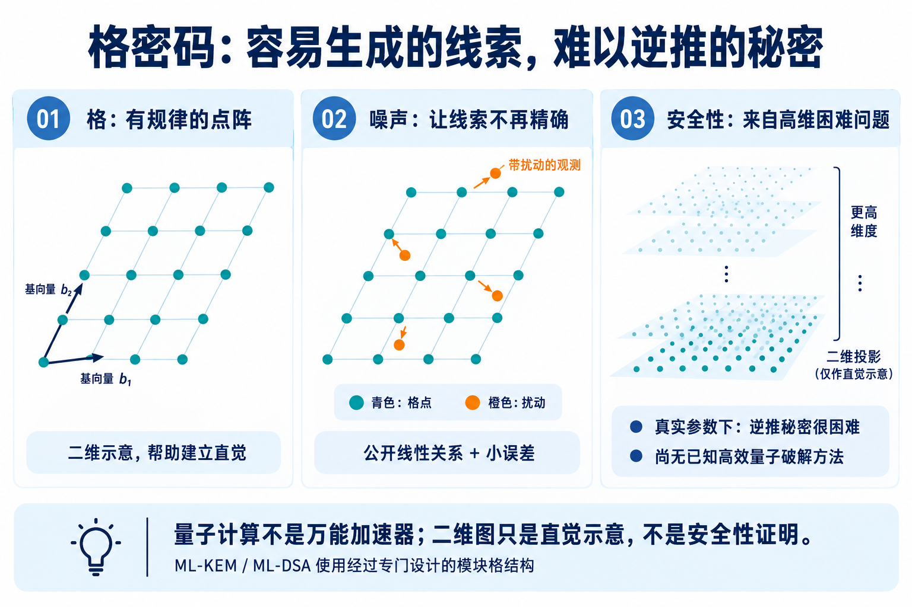
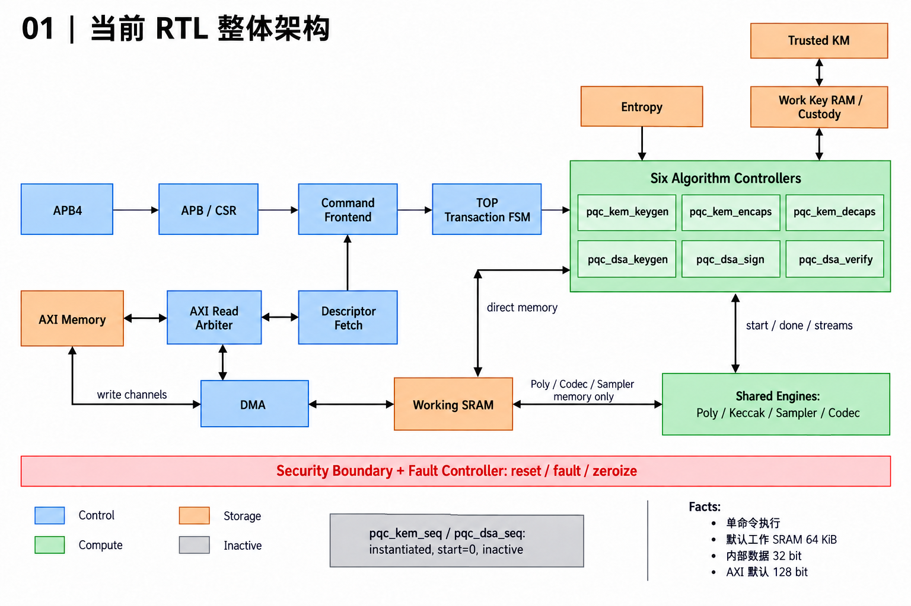
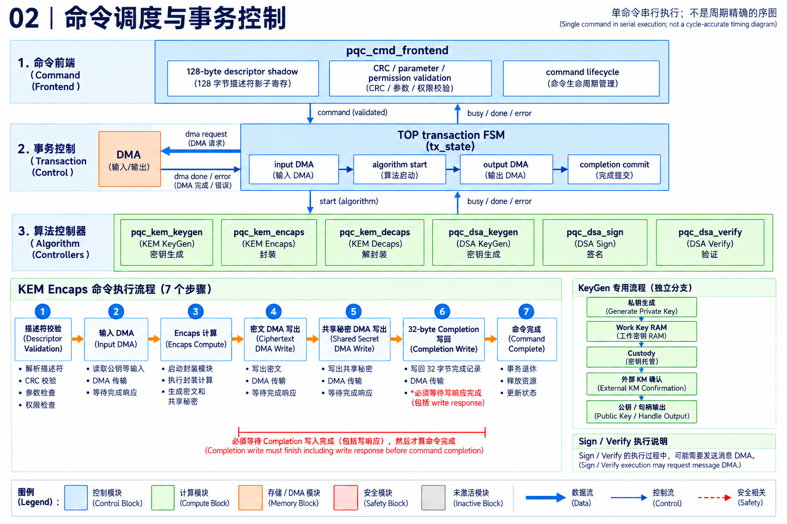
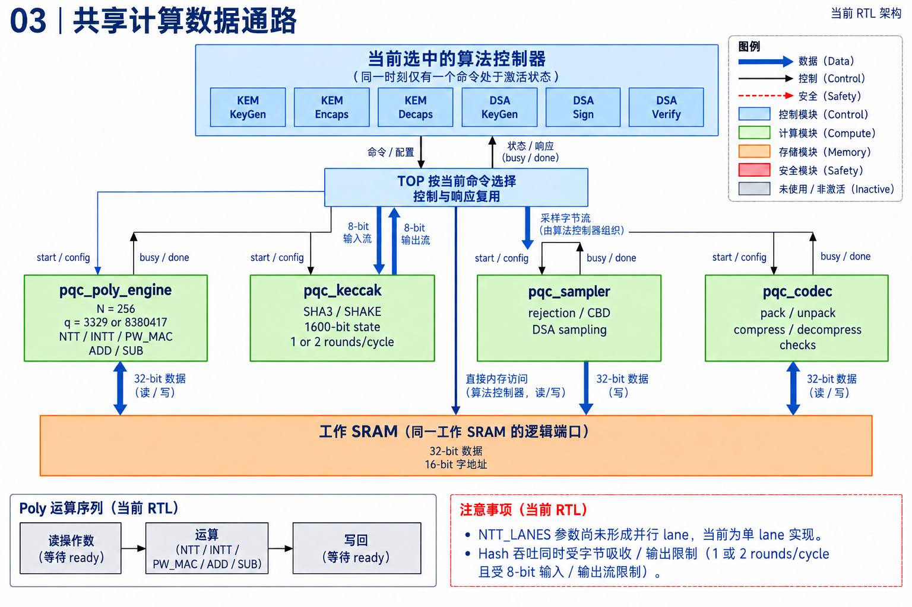
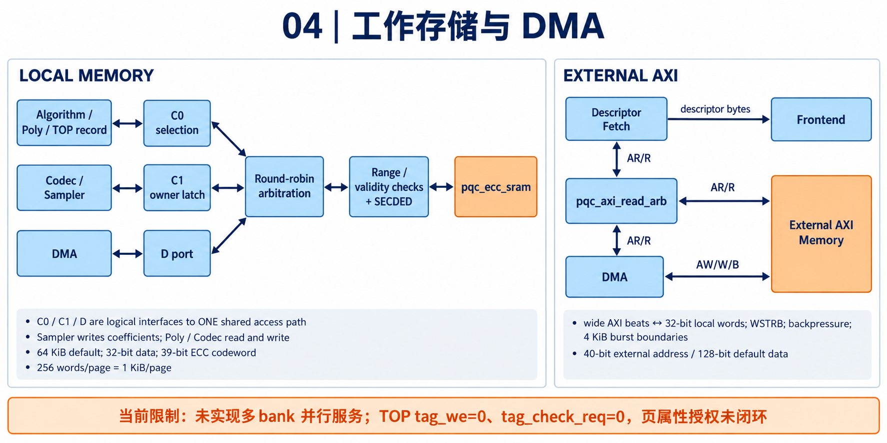
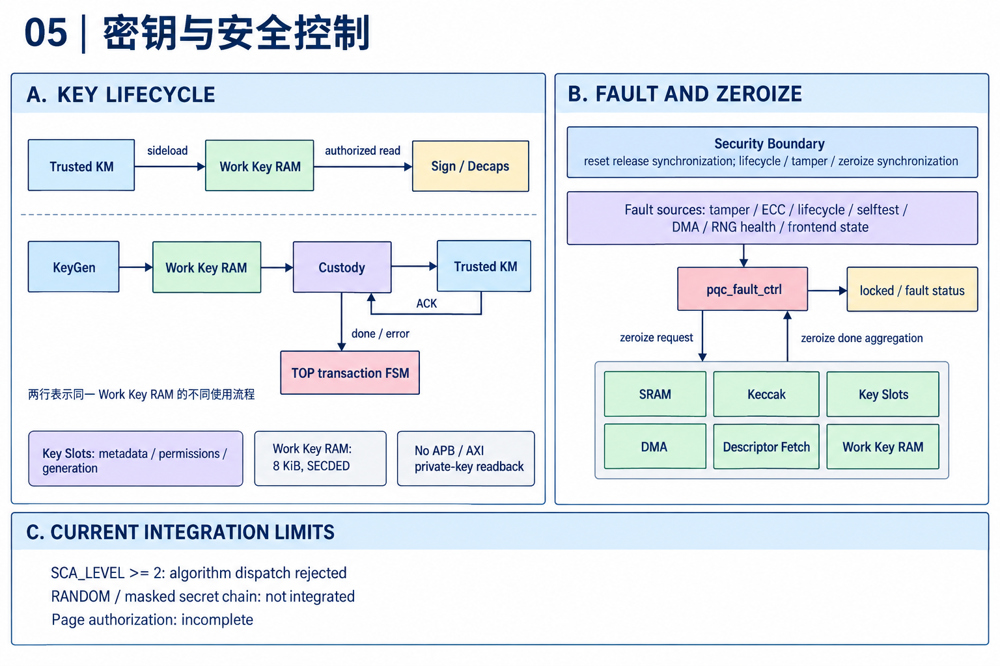

# 我让 AI 设计后量子密码加速器：从一条命令，到可验证的电路

简体中文 | [English](README.en.md)


**从密钥建立和数字签名出发，看 AI 怎样参与一颗密码加速器的设计、验证与综合。**

一台设备收到新的固件，准备安装。它需要先回答两个问题：这个文件真的是可信发布者发来的吗？下载和传输过程中，有没有人替换其中的内容？

这些看起来像软件的问题，最终可以落到芯片里的一段密码逻辑上。而当密码算法面向未来的量子计算威胁升级时，硬件也需要跟着变化。

这次，我让 AI 参与一个后量子密码加速器的研发。它要完成两类工作：用 ML-KEM 建立共享秘密，用 ML-DSA 生成和验证数字签名。设计从需求和架构开始，逐步落实到电路代码、模块测试、完整算法结果对比和综合评估。

最吸引我的，是把这些环节串起来：一份标准里的算法，如何变成描述符、状态机、存储访问和总线握手；独立软件得到的答案，如何与电路实际写出的每一个字节对应。

下面先解释共享秘密和数字签名，再跟随一条封装命令进入芯片：看它怎样排队、计算、等待，最后将经过核对的结果交给软件。

这次实践已经留下了一组具体结果：六类操作的端到端 RTL 对比、49 项模块单元测试、33 次 UVM 运行、324 条通过检查的算法命令，以及 100 MHz 条件下的综合评估。后文会结合具体设计，解释这些结果各自说明了什么。

> 本文记录一次 AI 辅助硬件设计实践，测试与综合数字采用截至 2026-09-22 的项目记录。文中的通过结果均有具体测试或工具条件，不作安全认证与量产交付声明。

## 1. 后量子密码，为什么运行在普通芯片上？

“后量子”听起来很像一种需要量子计算机才能运行的技术。实际上，这个项目里的算法可以在普通 CPU 上运行，也可以用普通数字逻辑实现。

它们面对的问题是：如果攻击者拥有足够强的量子计算能力，我们今天依赖的一部分公钥密码基础将受到挑战。后量子密码研究的是，在这种威胁模型下，怎样继续建立秘密、验证消息和保护身份。

这里的“后量子”是安全目标，不是硬件材料，也不是“永远不可破解”的保证。

本项目选择了两个算法家族。ML-KEM 用于建立共享秘密，ML-DSA 用于数字签名。它们分别对应 NIST 的 [FIPS 203](https://csrc.nist.gov/pubs/fips/203/final) 和 [FIPS 204](https://csrc.nist.gov/pubs/fips/204/final)。标准页面还维护潜在勘误，做正式实现时，需要固定规范版本并核对这些更新。

### 格密码：为什么给线索加一点“误差”，就能保护秘密？

先想象一张无限延伸的方格纸。沿着两个固定方向，每次走整数步，能到达的位置组成一片有规律的点阵，这就是理解“格”的一个起点。它也可以是斜的，并不一定横平竖直。在纸上找到离某个位置最近的格点，通常一眼就能看出来；真正用于密码的格，却生活在很高维的数学空间里，无法靠画一张图看清全貌。

高维格中，有些问题很容易提出，却很难求解。例如，在一组给定的基向量所描述的格里，寻找足够短的非零向量，或找到足够接近目标的格向量。这里的困难取决于具体问题、参数和所要求的精度，不能简单理解成“维度越多，就自动安全”。

与本项目更直接相关的，是 **LWE，Learning With Errors，也就是“带误差学习”**。可以把它想成一组关于秘密的线索：如果公开的都是精确线性关系，在有足够独立关系时，攻击者可以通过解方程恢复秘密；但如果每条关系都加入经过设计的小误差，情况就变了。攻击者看到许多相互关联、又不完全精确的结果，要从中还原秘密，困难得多。这些运算还在规定的模数下进行，不能直接当作普通实数方程求解。LWE 与特定高维格困难问题之间有严肃的理论联系，并非单纯依赖“把数据弄乱”的直觉。[Regev 的 LWE 论文](https://arxiv.org/abs/2401.03703)奠定了这条研究路线的重要基础。



*图 1：用点阵与扰动建立格密码的直觉。中间的偏移点只是“小误差让线索不再精确”的比喻，并非真实 LWE 样本的直接画法；右侧是高维结构的示意，也不是安全性证明。*

这时可能会有一个疑问：误差把攻击者难住了，合法使用者怎么办？关键是，合法使用者掌握秘密信息，协议又精心安排了误差范围和恢复规则。以 KEM 的底层构造为例，持有私钥的一方能够消去关键的秘密相关项，再在允许的误差范围内恢复所需信息。**误差必须小到协议能正常工作，又要配合其他参数，让没有秘密的人难以逆推。** 它是算法主动采样出来的数值，不是电路抖动或通信噪声。

那么，量子计算机为什么不能把这道题也轻松解开？量子算法的加速能力与问题结构有关。著名的 Shor 算法能高效处理整数分解和离散对数，因而威胁 RSA 和椭圆曲线公钥密码；这份能力并不能直接套用到所有数学问题。对于经过合适参数选择的相关格问题，目前尚无已知的高效量子破解方法。这正是格密码成为后量子密码重要路线的原因。量子攻击仍可能加速某些求解步骤，因此安全参数需要同时考虑经典与量子攻击成本。“抗量子”表达的是基于现有研究的安全判断，并不意味着已经证明未来永远不会出现新攻击。[NIST 的后量子密码介绍](https://www.nist.gov/cybersecurity-and-privacy/what-post-quantum-cryptography)也采用这种审慎的表述。

落实到本文的两类算法，ML-KEM 的安全基础与 **Module-LWE（模块格上的带误差学习）** 有关；ML-DSA 同样采用模块格路线，但签名与验签有自己的构造，不能把它看成封装流程换了个名字。它们使用的结构既服务于安全设计，也让大量计算可以组织成多项式运算。标准规定的维度、模数、误差分布和其他参数需要作为整体使用，随意加一点噪声并不能造出一个可靠的密码系统。

落到芯片中，这些高维数学关系需要通过系数、模运算、随机采样和多项式乘法来计算。后文的 NTT、采样器和存储调度，正是在为这些计算服务。

### KEM：公开传递材料，秘密留在两端

假设 Alice 希望 Bob 与她建立一个共享秘密。

Alice 先生成一对公私钥，把公钥交给 Bob。Bob 使用公钥执行一次封装，得到两件东西：一份可以公开发送的密文，以及一份自己保留的共享秘密。Alice 收到密文后，使用自己的私钥执行解封装，得到相同的共享秘密。


*图 2：KEM 用途示意。网络上传输的是公钥和密文；两端分别计算共享秘密。图中的私钥、公钥和共享秘密是不同对象。*

这里有两个容易混淆的地方。第一，KEM 不是拿来直接加密一部电影或一份文件的，它负责建立秘密，后续协议通常再派生出对称密钥保护业务数据。第二，KEM 本身不证明公钥属于谁，身份绑定仍需要证书、签名或可信配置。

### DSA：证明消息没有被替换

数字签名处理另一件事。设备收到一份固件，怎样判断它是不是由预期的发布者签发，内容有没有被改过？

签名方使用私钥和消息生成签名；验证方使用公钥、消息和签名，判断签名是否有效。签名不会隐藏消息，也不应被解释为“用私钥加密，再用公钥解密”。

本项目还处理 `context`，也就是使用场景的标识。同一段消息用于固件升级和用户登录时，可以通过不同 context 区分，避免不同用途之间的混用。签名和验证必须采用一致的 context。

因此，所谓“六个算法”，在这里更准确地说是**两个算法家族的六类操作**：

| 家族 | 三类操作 | 用途 |
|---|---|---|
| ML-KEM | KeyGen、Encaps、Decaps | 生成密钥、封装秘密、解封装秘密 |
| ML-DSA | KeyGen、Sign、Verify | 生成密钥、签名、验签 |

ML-KEM 对应 512、768、1024 三个参数集；ML-DSA 对应 44、65、87 三个参数集。这些名称不是接口位宽，也不是每次可以随意修改的运算参数。工程需要分别实现并验证它们。

## 2. 第一件工作：把“做一个加速器”变成可验收的需求

如果只向 AI 提出“帮我写一个 PQC 加速器”，它能生成很多看起来正确的代码。但进一步落地时，还需要回答真正影响实现的问题。

是只做一个多项式乘法模块，还是把 KeyGen、封装、解封装和签名全部做完？私钥放在哪里？CPU 怎样提交任务？外部存储器突然不响应时怎么办？签名第一次尝试失败，是错误还是算法正常行为？

这个项目的范围，是完整操作级别的 SoC IP。IP 可以理解成将来集成到芯片中的可复用硬件模块。它不是单独一个 NTT 算子，也不承担整个网络协议或证书系统。

项目先形成需求合同，再展开成 LRS。LRS 是低层需求规格，作用是把愿望拆成可以检查的条目：要求、适用条件、验收标准以及验证方法。项目将需求整理为 84 条可追踪条目，便于把设计、实现和测试对应起来。

其中，一个重要决定是密钥边界：**长期密钥由外部可信 Key Manager 管理；加速器内部保存本次运算所需的工作副本；私钥通过专用接口导入，不经普通 AXI DMA 读回。** 这决定了后续的存储模块、权限检查、KeyGen 输出路径和测试方法。

另一个决定是性能口径。直觉上，我们都希望“尽量快”，但快多少、靠什么快，需要算得出来。分析共享 Keccak 的吞吐后，项目选择保留每周期一轮或两轮的结构，按照可达的周期预算制定指标，而不是只给出一个脱离资源的带宽数字。

预算在这里扮演的是设计约束。它还需要由 RTL 的输入宽度、控制开销和真实等待周期来兑现。先有预算，再用测量回填，才能知道时间究竟花在哪里。

签名时序同样经历了明确的选择：每次尝试使用固定正常调度边界，但总尝试次数可以变化；性能用分位数等方式评估。不能一边保留拒绝重试算法，一边没有条件地许诺每次签名都在同一个周期结束。

在这一阶段，人的主要职责是确定产品边界和取舍，AI 则帮助展开条目、分析依赖并形成设计输入。把决定写清楚后，架构、实现和测试才有共同的起点。

## 3. 架构设计：六位“指挥员”，共享四类计算设备

把需求变成电路，需要先决定资源怎样组织。

可以为每类算法建一套独立硬件，也可以共享底层运算单元。本项目选择共享：两类密码算法都会大量使用多项式运算、哈希、采样和编解码，没有必要在功能初步落地时复制六套设备。

可以把它想成一间工作室。不同任务有不同的操作步骤，但共用切割机、测量仪和工作台。节省设备的代价，是必须决定谁先使用、数据存在哪里，以及上一个步骤是否真正完成。



*图 3：本次按实际 RTL 整理的总览。连线表示功能关系，不是完整信号接线图。当前执行主线由顶层事务 FSM 调度六个具体算法模块；灰色区域不属于正常命令执行主线。*

HLD，也就是高层设计，要回答模块分工、接口、存储、安全边界和性能预算。LLD，也就是详细设计，则进一步回答状态机、逐拍握手、位宽、地址分配以及错误处理。

在当前 RTL 中，六个算法控制模块是：

```text
pqc_kem_keygen     pqc_kem_encaps     pqc_kem_decaps
pqc_dsa_keygen     pqc_dsa_sign       pqc_dsa_verify
```

它们共享四类主要引擎：

| 引擎 | 不看公式也能理解的职责 |
|---|---|
| Poly | 对长数组做变换、乘累加和加减，承担多项式计算 |
| Keccak | 完成 SHA3/SHAKE，产生摘要或按需扩展字节流 |
| Sampler | 按规定的分布和规则，把字节转换为算法需要的系数 |
| Codec | 在内部系数与外部紧凑字节串之间转换，执行相应编码和检查 |

这里的 Sampler 不是随便调用一个随机函数。密码算法要求具体的分布，某些候选还必须丢弃。Codec 也不是简单地把数组复制出去：12 位的系数、跨字节打包、压缩舍入和规范编码检查，都会影响最终结果。

### 不推导公式，也能理解 NTT 为什么重要

一个多项式在硬件里，可以先理解成一串有次序的数字。直接把两串数字相乘，需要很多交叉组合。NTT 是一种适合模运算的变换，先把数据换一种组织方式，使一部分乘法更容易做，再通过逆变换回到原来的表示。

它与 FFT 在“先变换、再简化计算”这个思路上相似，但这里处理的是模数下的精确整数运算。

细节不能一概而论。ML-KEM 与 ML-DSA 的模数、变换层次和乘法语义并不完全相同。共享引擎意味着可以复用资源，不意味着把常数换一下，所有步骤就自动正确。

## 4. RTL：从一段算法，变成一连串必须握手的动作

RTL 是寄存器传输级描述。软件代码通常让人想到“执行完这一行，再执行下一行”；RTL 则描述寄存器、组合逻辑和时钟边沿之间的关系。多个模块会同时存在、同时推进，也可能同时等待。

算法模型里的一次函数调用，落到 RTL 上，往往变成一串动作：发请求、保持地址、等待接收、拿到数据、启动运算、等待完成、写回，再进入下一状态。

这解释了为什么“把 Python 翻译成 SystemVerilog”远远不够。

当前项目的控制逻辑可以分为三层：

1. **命令前端**：获取描述符、验证输入，管理命令生命周期。
2. **顶层事务状态机**：协调输入输出 DMA、算法启动、密钥托管和完成记录提交。
3. **算法控制器**：执行算法内部步骤，调用共享计算引擎。



*图 4：三层控制与一次封装命令的流程。算法计算结束、DMA 传输结束、软件可见的命令完成，是三个不同事件。*

软件通过 APB 配置控制寄存器，准备一个 128 字节描述符，再写门铃寄存器。描述符像一张任务单，告诉硬件做什么、读哪里、写哪里、使用哪个参数集和密钥句柄。

前端先把任务单抓取到内部 shadow 中，再做校验。这样，软件之后修改外部描述符，不会直接改变正在执行的任务。CRC 可以检测约定范围内的数据变化，但它不提供密码学身份认证，权限和地址检查仍然必不可少。

随后，DMA 负责搬运大块数据。APB 适合配置和状态，AXI 适合数据传输；它们分工不同。

### “我已经算完了”，为什么还不能通知软件？

假设密文已经在内部 SRAM 中算好，但外部总线还没有确认写入完成。这时如果提前发出完成中断，软件可能读到一半新数据、一半旧数据。

因此，一次成功命令需要等结果写出、写响应返回，再提交 completion 记录，最后退休命令。completion 可以理解成硬件给软件的回执，包含命令身份、状态、输出长度等信息。

这也是验证必须观察 AXI 写响应，而不能只盯算法 `done` 的原因。计算正确与事务正确，是两个都需要满足的条件。

即使运算引擎已经空闲，只要结果仍在等待外部总线确认，控制器就要保留事务状态。软件看到的“完成”，必须包含这段等待。

## 5. 跟随 1184 字节公钥，走完一次 ML-KEM-768 封装

为了让架构不只停留在方框里，我们选一个具体任务：ML-KEM-768 Encaps。

它的外部输入包括 1184 字节公钥，以及从熵接口得到的 32 字节随机材料；输出是 1088 字节密文和 32 字节共享秘密。这里没有输入业务文件，也不需要接收方私钥。

硬件先把公钥搬入工作区、解码并检查系数是否合法，同时读取公钥里的公开种子。随后，它把公钥摘要与本次随机材料绑定，派生共享秘密和后续采样所需的材料。

接下来是主要计算：采样秘密向量、进行 NTT、按需要展开公开矩阵、执行乘累加和逆变换、加入相应噪声，最后压缩并打包密文。共享秘密来自前面的派生分支，并不是算出密文后再从密文“反推”得到。



*图 5：四类共享引擎。Keccak 与算法控制器交换字节流，没有直接 SRAM 访存端口；算法控制器的直接访存包含请求和返回，图中作功能简化。*

这个实现有一个很实在的存储取舍：公开矩阵可以逐个元素生成，完成一次乘累加后，再用同一块暂存空间装下一个元素。没有必要始终把整个矩阵放在 SRAM 中。

好处是省存储，代价是计算更依赖串行调度。上一位使用者还没有读完，下一步就不能覆盖那块空间。

沿着这条命令走到出口，数据已经几次改变模样：紧凑公钥变成便于计算的系数，系数进入变换域，计算结果又压缩成密文。最后，1088 字节密文和 32 字节共享秘密被写入各自的输出缓冲区，硬件再交出 completion 回执。

软件只看见一次提交和一次完成，电路中间却完成了存储搬运、采样、哈希、变换、乘累加和打包的一连串协作。

把这条路径一直追到 RTL 状态和内存页，会发现一个比状态名字更有用的问题：**这一页现在装的是什么？它最后一次会被谁读取？什么时候才可以复用？**

还有一个容易造成性能误解的细节：当前封装路径对一个矩阵元素申请的 SHAKE 输出上限是 4096 字节。Sampler 可能较早就取够系数，但控制器仍要等待这次 Hash 请求结束，并处理剩余输出。因此，仅计算多项式乘法次数，不能预测整次封装延迟。

## 6. 真正容易出错的，往往是数据表示和存储

密码学论文会把一个对象写成简洁的符号。硬件必须知道，这个对象到底占多少位，以什么顺序存放，用的是字节地址还是字地址。

例如，ML-KEM 的一个合法系数可以用 12 位表示，但计算时，本项目通常给它一个 32 位存储槽。256 个系数展开后占 1 KiB；打包成 12 位表示时，只需 384 字节。

这两个数组描述的可以是同一组数学对象，却绝不能当成同一种内存布局直接复制。

举个几乎不需要密码学知识的例子：两个 12 位整数 1 和 2，按低位优先连续打包后，是三个字节 `01 20 00`，而不是两个各占 16 位的整数。只要软件和硬件在这里理解不同，后面再精密的运算也会从错误的输入开始。

Python 的整数可以自动变大，RTL 中的信号宽度不会。两个 23 位数相乘，若先放进一个太窄的结果，再执行约减，丢掉的信息已经回不来了。大小端、符号扩展、压缩舍入和非法编码，也都可能使最终输出只差一个字节。



*图 6：工作存储和外部 AXI 分别展开。双向连接表示请求/响应组合，不表示所有数据通道都双向传输。C0、C1、D 是逻辑接口，不是三个可同时访问的独立物理 SRAM 端口。*

当前工作 SRAM 默认 64 KiB。算法直接访存和 Poly 使用 C0；Codec 与 Sampler 共享 C1；DMA 使用 D。三路请求最终经过仲裁，共享选中的访问通路。

所以，外部 AXI 有 128 位，并不代表内部每拍也能消费 128 位；多路模块都有自己的端口，也不代表它们可以同时访问多个 bank。

并行度同样需要计算和存储一起设计。当前 Poly 采用串行调度；配置接口中虽然保留了 lane 数量参数，多 lane 并行能力仍需要通过实际的数据通路和存储调度来实现。

后续提升性能时，要同时考虑计算单元数量、SRAM bank、读写端口和数据依赖。算得更快的运算单元，如果大部分时间都在等待数据，整条命令的速度仍可能变化不大。

这是从算法走向硬件时很有价值的认识：性能取决于一条完整的数据流，而不是单个模块的峰值。

## 7. 签名为什么会重试，解封装为什么不直接报“密文不对”？

PQC 的完整控制流程里，有一些行为看上去像异常，实际上属于算法本身。

ML-DSA 签名先生成候选，再检查候选是否满足允许公开的条件。有些候选必须丢弃，重新采样并计算。这个拒绝机制是算法的一部分，并不是电路算错了。


*图 7：签名的候选生成与检查流程。第一遍阅读只需关注蓝色主线与橙色重试回路；图内符号表示中间对象，无需先推导公式。挑战哈希使用规定编码后的高位信息。*

实现必须认真处理候选清理、下一次 nonce、最大尝试次数和输出提交。不能在候选尚未被接受时，就把半个签名写到软件可见的位置。

本项目验证确定性和 hedged 两种签名策略。确定性模式在同样的密钥、消息和 context 下可复现；hedged 模式混入额外随机材料。给 RTL 和参考实现同样的随机材料，hedged 签名也可以逐字节比较。

当前测试还检查每次候选尝试的固定周期边界。但这不等于整个签名总延迟固定，因为尝试次数可能不同；更不等于已经证明不存在侧信道泄漏。

ML-KEM 解封装则有另一个重要处理：密文失配时，不能简单公开一个“内部比较失败”的结果。实现需要按照算法规则生成隐式拒绝秘密，并走相应选择路径。

因此，验证错误密文时，不能只看“没有崩溃”。还要检查输出的拒绝秘密是不是正确，以及在约定外部响应条件下，正常和失配路径是否保持预期的周期关系。

## 8. 密钥保护：算对答案，只完成了一部分工作

密码硬件还必须回答：私钥谁能读？任务被取消时，迟到的数据还能不能返回？发生篡改或不可纠正的存储错误后，系统是否继续工作？

本项目把工作态私钥放进独立的 Work Key RAM，和普通工作 SRAM 分开。Key Slots 保存的是句柄和权限等元数据，不能把八个 slot 理解成八份完整私钥存储阵列。

KeyGen 产生新私钥后，也不是随手 DMA 到普通系统内存。它通过专用 custody 接口交给外部 Key Manager，等待带身份信息的确认，再推进公钥和句柄的发布流程。



*图 8：同一个 Work Key RAM 在导入和 KeyGen 两种流程中重复出现，表示两种用法，而非两份物理存储。右侧清零请求与完成反馈形成系统级握手。*

存储里使用 SECDED ECC：在其编码能力范围内纠正单比特错误、检测双比特错误。ECC 保护的是数据完整性，不是加密，也不是侧信道防护。

Fault Controller 汇总错误和篡改事件，驱动独立清除流程，并等待 SRAM、Keccak、Key Slots、DMA、描述符获取和 Work Key RAM 等路径的完成反馈。只有发出清零请求，没有确认数据真正失效和在途事务被处理，还不能算完成。

这些机制各有职责：密钥接口控制材料怎样进入和被使用，ECC 检查存储完整性，清除握手处理失效与在途事务。侧信道防护又是独立的一层，需要专门的设计与评估，不能仅从签名或密文算对了来推导。

## 9. UT：先证明一个零件在边界条件下能工作

AI 生成 RTL 后，最直接的问题是“怎么测”。这里需要分清 UT 和系统级验证。

UT 是单元测试。它把一个模块单独拿出来，提供受控输入，再观察结果。对于运算模块，可以检查数值边界和参考结果；对于控制模块，则需要检查握手、背压、非法输入、取消和清除。

所谓背压，就是接收方暂时说“现在不能接”。这在真实系统里很常见。模块必须保持未被接收的数据，不能因为等了几个周期就换成下一项，也不能把同一个请求重复算成两次。

这次项目记录了 49/49 项模块 UT 通过。它们包含 Poly、Keccak、Codec、Sampler、DMA、密钥、清零和多个控制模块的检查。

一个小型测试可以这样设计：先让 DMA 准备好一个数据字，再把接收方的 ready 拉低几拍。数据必须原样保持；ready 恢复后，只能传输一次。如果又在等待期间发出清除，请求和迟到响应还必须服从清除规则。这类测试没有完整签名那么显眼，却直接决定多个模块接在一起时是否可靠。

但不同 UT 的含义不同。一些算法调度器 UT 使用受控原语响应，验证的是调度、错误优先级和清除行为，并没有在单元环境里把完整密码计算全部重跑一遍。完整计算需要系统级 oracle 对比。

这个区别对 AI 开发尤其重要。很容易写出一个测试：发出 start，过几拍收到 done，然后宣布成功。如果运算内容被桩模块替代，它最多证明握手在这一场景成立，不能证明完整算法正确。

因此，读 UT 不能只数文件，要看它的 DUT 是谁、哪些依赖被替代、期望值来自哪里。

## 10. UVM 与 golden：不仅要跑通，还要逐字节对上

UVM 可以理解成一套组织硬件验证环境的方法和组件框架。它帮助搭建激励、总线交互、监视器、检查器和报告。但“使用 UVM”本身并不是正确性的证明，真正重要的是它观察和比较了什么。

本项目端到端算法验证的链路是：

```text
独立软件 oracle 生成输入和期望输出
              ↓
冻结为向量文件，记录版本与文件哈希
              ↓
通过 APB、AXI、KM 和熵接口驱动真实 RTL
              ↓
逐字节检查输出，并检查状态和提交顺序
```

ML-KEM 的冻结参考来自 `kyber-py 1.2.0`，ML-DSA 来自 `dilithium-py 1.4.0`。这里的 oracle 是独立软件参考，不是从 DUT 内部信号倒推出的答案。它也不是“官方认证”的同义词。

Encaps 还有直接代数路径的交叉检查；Decaps 的隐式拒绝秘密另行核对；DSA 的篡改向量在生成阶段先由参考实现确认应该拒绝。

仿真只读取冻结文件，没有用 Python、C 或 DPI 替代硬件完成密码运算。

### 六类操作，到底比了什么？

| 操作 | 参数集 | 每轮命令数 | 主要检查 |
|---|---|---:|---|
| KEM KeyGen | 512 / 768 / 1024 | 9 | 公钥、托管私钥全部字节；身份与 ACK |
| KEM Encaps | 512 / 768 / 1024 | 6 | 完整密文、32 字节共享秘密 |
| KEM Decaps | 512 / 768 / 1024 | 45 | 9 正常、27 篡改拒绝、9 背压重复 |
| DSA KeyGen | 44 / 65 / 87 | 9 | 公钥、托管私钥全部字节 |
| DSA Sign | 44 / 65 / 87 | 27 | 确定性、hedged、重复签名；候选次数 |
| DSA Verify | 44 / 65 / 87 | 63 | 正常及六类篡改的接受/拒绝结果 |
| 合计 | 18 种操作/参数组合 | 159 | 密码结果与事务行为 |

159 是一轮执行的命令数，其中包含重复和负向变体。

拿解封装来说，测试会在同一份密文上分别改动开头、中间或末尾的字节。它没有只期待一个“失败”状态，而是提前计算好这个输入对应的拒绝秘密，再核对硬件究竟写出了什么。对于签名，哪怕数千字节里只有一个字节不同，比较也会指出对应位置。

这里的 golden，就是每次结果比较所依据的独立参考答案。

签名测试在 AXI 写数据握手时检查每个有效字节，KeyGen 测试从专用托管接口检查私钥。测试还观察重复写、越界写、写响应和中断，要求 completion 不早于结果确认。

检查器的职责也有分工：寄存器层检查控制接口合同，算法 testcase 中的监视器负责密码结果、输出范围和完成顺序。这样，寄存器读写正确与算法结果正确都有各自的检查入口。

读验证环境时，沿着“输入从哪里来、结果从哪里观察、期望值从哪里生成”三条线追踪，比仅仅寻找一个名为 scoreboard 的文件更有效。

### 固定向量之外，还有可复现的随机材料

固定已知答案测试适合定位和回归，但只反复跑同一组材料，会遗漏很多数值组合。

项目的生成脚本支持 `campaign-seed`，据此生成新的密钥种子、消息、context 和 hedged 随机材料，再离线计算新的 golden。运行时记录种子、文件哈希和 oracle 版本，使失败样本可以被重现。

只改仿真 seed，而不改变冻结向量，不能算增加了独立密码输入。

DSA 当前覆盖的消息/context 长度是三组配对：`(0,0)`、`(137,1)`、`(65537,255)` 字节。其中 65537 字节让测试跨过 64 KiB 边界，很适合暴露长度和分段处理问题。但它仍然只是选定边界，不是全长度覆盖，也不是三个长度之间的全部组合。

本次执行记录中，**33 次 UVM、324 条算法命令通过，包含随机材料种子 `0x20260922` 的 159 条命令重跑。** 这说明六类操作已有真实 RTL 结果比较的执行记录。

与此同时，主 harness 固定在一组配置：64 KiB SRAM、128 位 DMA、每周期两轮 Keccak、8 个 key slot、`SCA_LEVEL=1`。HashML-DSA、完整 Level 2、全部硬件配置组合，以及完整 AXI4 VIP 和覆盖率闭合，仍不能算已完成。

六类操作都有用例，和整个 IP 已经验证充分，是不同层次的结论。

## 11. 综合：代码能够变成怎样的电路？

写到这里，还有一个很实际的问题：AI 生成的这些代码，究竟只能在仿真器里运行，还是已经能够变成电路？

**项目记录给出的答案是：设计已完成面向 28 nm 标准单元库的逻辑综合，在 100 MHz 目标下，综合时序与电气约束检查通过。** 这使“硬件实现”有了可量化的依据：RTL 已经进入由工艺库单元构成的电路实现阶段。

仿真关心行为。综合则要把 RTL 中的加法、选择、状态更新和寄存器，映射为工艺库中实际定义的逻辑门、触发器等标准单元，再按照这些单元的面积和延迟模型进行优化。一段描述多项式计算的代码，最终需要变成加法器、乘法相关逻辑、选择器和寄存器之间的连接。

这一步对 AI 代码有很强的约束力。一个很长的组合运算、一大片不能有效映射的数组、未使用而被裁掉的模块，都可能让“代码看起来完成了”的判断失去依据。

### 从 RTL 到工艺库里的单元

本项目使用 Design Compiler V-2023.12-SP3，完成 RTL 读取、层次展开、工艺库链接、时钟与接口约束加载，以及逻辑优化和单元映射。流程还安排了增量电气设计规则修复，并输出面积、时序、功耗和约束检查报告。

这条流程的交付物也很具体：映射后的 Verilog 网表 `pqc_netlist.v` 描述单元实例及其连接，`pqc_mapped.sdc` 保存导出的时序约束，`pqc_mapped.ddc` 保存工具中的映射设计数据库。结果检查脚本要求网表、约束和主要报告非空，同时检查综合完成标记及工具错误。换句话说，流程的落点是一份可以交给后续实现工具继续处理的电路描述。

存储部分采用 ASIC 设计中常见的处理方式：工作 SRAM 和 Work Key RAM 使用两处纯存储黑盒视图，存储阵列留待真实宏接入；ECC、有效性和清除控制仍真实综合。脚本检查这两处边界，避免把不该隐藏的控制逻辑一并当成存储宏处理。因此，下面的数字衡量的是已映射逻辑，不能把缺席的存储宏当成零成本。

### PPA：电路有多大，跑多快，耗多少电？

PPA 分别是 Power、Performance、Area，即功耗、性能和面积。对于这次设计，它们把“能否实现”进一步变成三个工程问题：需要多少逻辑资源？逻辑能否在规定的时钟周期内完成传播？在给定活动假设下，预计消耗多少功率？

| 指标 | 报告数值 | 怎样理解 |
|---|---:|---|
| 综合目标频率 | 100 MHz | 时钟周期为 10 ns |
| 标准单元面积 | 219002.587503 µm²，约 0.219 mm² | 已映射标准单元的面积总和，不含存储宏 |
| 最差 setup slack | +0.000083 ns | 报告中的最差建立时间路径满足约束，余量很小 |
| 综合电气约束检查 | 通过 | 报告记录的综合电气约束检查通过 |
| 默认活动率动态功耗 | 约 17.202 mW | 逻辑切换产生的功耗估算 |
| 泄漏功耗 | 约 24.736 µW | 该工艺条件下的单元泄漏功耗估算 |

条件是 **TT 28 nm HVT、1.0 V、25 ℃**，工具为 **Design Compiler V-2023.12-SP3**。TT 表示典型工艺角，HVT 表示高阈值电压单元库；这些条件是读懂数字的一部分。

先看面积。约 0.219 mm² 说明映射后的逻辑已有明确的资源规模，可以用来评估架构选择的代价。不过，标准单元面积是各单元面积的加总，真实布局还需要布线空间、时钟树和其他物理资源，也要加上存储宏，不能直接把这个数当成整个 IP 的版图面积。

再看性能。100 MHz 意味着每 10 ns 推进一个时钟周期；时序分析检查数据能否在约束规定的时间内到达。Slack 可以理解成“距离截止时间还剩多少余量”，本次最差值为正，因此报告中的建立时间检查通过。这里的余量非常小，且尚未包含布局布线寄生，所以这个结果支持当前综合条件下的 100 MHz 目标，不能据此推断更高频率或物理实现后的时序余量。一次 KEM 或签名需要许多个周期，100 MHz 也不等于每秒完成一亿次密码操作。

最后看功耗。动态功耗来自信号切换，泄漏功耗则与单元及工艺条件有关。本次动态功耗采用工具默认活动率，没有使用实际算法运行产生的 SAIF 切换活动文件，因此适合做早期规模判断，还不能据此计算一次签名的真实能耗。报告也未设置功耗验收上限，这里展示的是估算结果。

### 这些结果证明了什么？

把前面的验证和这里的综合放在一起，证据链就清楚了：**UT 和 UVM 检查 RTL 行为，golden 比较核对密码运算输出，标准单元综合检验它能否映射成电路，并量化面积、检查时序与电气约束。** 每一步回答不同的问题，共同支撑这次 AI 辅助设计的工程价值。

因此，这次实践已经走到了“算法结果经过验证、RTL 完成工艺映射、综合指标可以量化”的阶段。这是设计能够形成实际硬件实现的重要证据。这里的“可用”具体指可综合、可生成映射网表并接续后端实现；真实存储宏接入、布局布线和芯片实测属于另外的验证层次。

## 12. 逐步验收：每一步设计都要回答具体问题

质量把关不应只发生在项目最后。需求没有明确，架构会反复变化；微架构没有讲清数据生命周期，RTL 和测试可能各自作出不同假设；算法能输出结果，也还需要综合和安全证据。

这次项目的主脉络可以概括为：

```text
需求与验收标准
    → 架构与资源划分
    → 详细设计与 RTL
    → UT 和原语验证
    → UVM 完整算法与 golden 比较
    → 综合与实现评估
    → 安全、覆盖和交付收敛
```

实际执行不是单向流水线。一次仿真失配可能要求修正位宽；一次吞吐分析可能要求调整架构预算；一次安全审查也可能要求重新界定接口。门禁的意义，是让这些变化回到有依据的设计过程。

原始合同用 G0～G6 描述了逐步推进的功能里程碑。沿着这张路线图，可以清楚地看到质量检查怎样逐层加深：

| 里程碑 | 设计内容 | 需要回答的验收问题 |
|---|---|---|
| G0 | 标准、模型、常量生成 | 规范版本是否明确？全参数集的软件已知答案测试能否成立？ |
| G1 | Keccak、双模 NTT、Codec/Sampler | 基础原语是否正确？等价或形式验证义务如何满足？ |
| G2 | ML-KEM 全流程 | KeyGen、Encaps、Decaps 是否对上参考？非法密文如何处理？ |
| G3 | ML-DSA Verify/KeyGen | 三个参数集的密钥和验签结果是否一致？ |
| G4 | ML-DSA Sign 与拒绝循环 | 完整签名、随机差分、长消息和重试路径是否正确？ |
| G5 | DMA、key slot、安全控制 | 权限、总线、清零、故障与密钥使用能否形成闭环？ |
| G6 | SCA、DFT、PPA 收敛 | 是否具备侧信道、可测试性与功耗/性能/面积的最终签核证据？ |

*这里沿用项目原始合同的 G0～G6 功能里程碑，说明逐级验收的内容，不表示各级已经全部通过；需求与架构冻结另有工程评审记录。*

### 从需求冻结到详细设计

需求检查关注的是范围和验收条件；架构检查关注资源、接口、安全边界和预算；详细设计则要明确状态机、位宽、地址、握手和错误优先级。

每一层都应保留从上游要求到下游实现的对应关系。否则，一个需求可能写得很完整，却没有实际模块负责；一个模块也可能实现了很多逻辑，却没有测试检查它最重要的行为。

寄存器是一个典型例子。项目通过 SystemRDL 等单一来源生成 RTL、软件头文件和相关视图，减少不同文件手工维护造成的不一致。生成之后，还要检查复位值、访问属性、写一清除和运行中的写保护行为。

### 从 RTL Ready 到 Verification Ready

RTL 检查包括语法和展开、lint、综合及相关时钟复位检查。它们能发现结构问题，却不能替代完整密码算法验证。

验证检查进一步要求用例、参考、覆盖和实际执行证据对应起来。UT 负责局部边界，UVM 负责完整命令，独立 golden 负责结果比较，异常场景负责检验系统如何安全退出。

项目的 runner 为每次运行保存独立目录、输入指纹、工具信息、编译与仿真日志、summary 和 JUnit。这样，一次 PASS 可以追溯到具体代码和向量，而不是只剩下一句无法复现的结论。

### 最后一道门，要看完整交付能力

最终收敛还包括真实存储宏、物理实现、覆盖率、安全测试和集成文档。这里的 SCA 是侧信道相关评估，DFT 是面向制造测试的设计，PPA 是功耗、性能和面积。

在实际操作中，我们把两类问题分开：一类问“这个阶段已经产出了什么”，另一类问“这些证据是否足够支持交付”。本文展示的是已经形成的设计、算法验证和综合结果；最终安全与实现验收使用独立的标准。

这使 G0～G6 不只是文档上的编号。每往前走一步，都要把一个更具体的问题交给测试、工具或评审回答。

## 13. AI 在设计、调试和验证中做了什么？

从现有工程可以看到，AI 辅助的产物已经覆盖多种层次：需求与设计分册、Python 模型、SystemVerilog 模块、寄存器生成视图、UT、UVM 用例、向量脚本、综合脚本，以及学习材料。

这种能力的价值，是让一个复杂主题更快形成可以阅读、执行和审查的工程对象。一个人可以沿着同一条命令，从科普材料追到算法，再追到 RTL、测试和报告，而不必先独自搭好所有框架。

评价这些工作的效果，可以看设计是否清楚、测试能否执行、结果能否追溯。这次实践中，有几种与 AI 协作的方式值得继续使用。

第一，要求 AI 先形成明确的设计输入。与其说“把这个模块做得安全一些”，不如写清楚私钥入口、可读范围、撤销优先级和验证方法。

第二，把大目标切成能检查的动作。一个加速器很难一次验收，但“外部 B 响应迟到时不能提前 completion”“清除同拍必须压过迟到读响应”，都能变成具体测试。

第三，参考答案要尽量独立。让 AI 同时写算法和测试，存在两边共享错误理解的风险。固定版本的外部 oracle、额外代数检查和从外部接口观察结果，可以降低这种风险。

第四，让结论绑定证据。源码版本、向量版本、运行条件和实际结果应一起记录；修改设计后，相关结论也需要重新确认。

第五，用具体问题推动设计审查。请求如何被接收，响应由谁消费，数据什么时候失效，清除与迟到响应同时出现时谁优先——这些问题能够直接对应到代码和测试。

工程师确定设计取舍和验收依据，AI 提出实现、运行工具并协助定位失败，再由测试和评审确认修改。这种分工让每次推进都有可以检查的结果。

## 14. 从一条命令，到一套可以检查的工程

回到文章开头那台准备安装固件的设备。它并不关心 RTL 是谁写的，也不关心设计文档有多少页。它需要的是：收到正确输入后得到正确结果，在该等待的时候等待，在不该放行的时候拒绝。

这也是这次 AI 辅助设计最有意思的地方。一个看似宏大的“后量子密码加速器”，可以被拆成一组能够逐步回答的问题：秘密如何建立，签名如何验证，数据如何组织，模块怎样协作，结果由谁检查。

AI 让这些问题更快拥有了可讨论的设计和可执行的代码。需求、参考模型、RTL、测试与综合之间的往返，也因此变得更加紧密。对参与者而言，工作的重心随之发生变化：除了写出实现，还要持续提出好问题，选择合适的检查方法，并解释工具给出的结果。

最值得记住的时刻，是一条完整命令穿过真实 RTL 后，输出的数据与独立参考逐字节一致。那时，标准里的算法、图中的模块和代码里的状态机，终于落在了同一份结果上。

我想记录的，正是这段从想法到电路、再到证据的过程。
