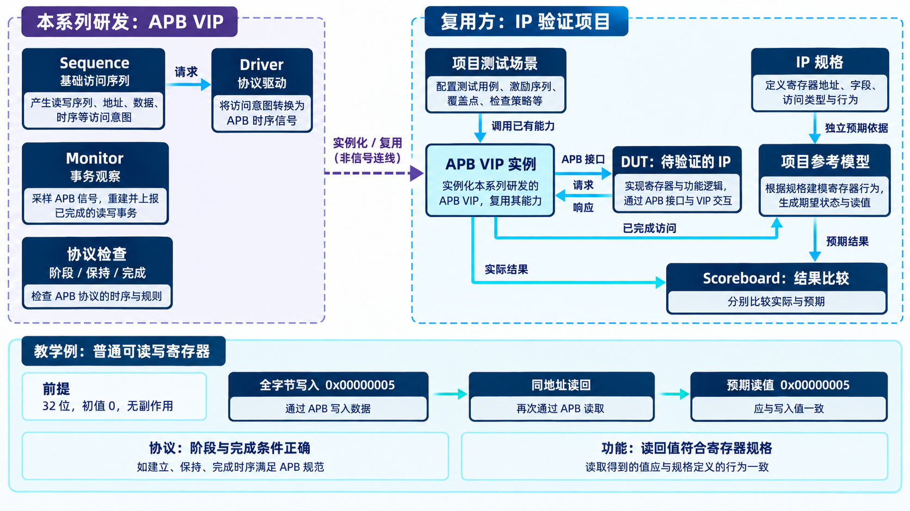
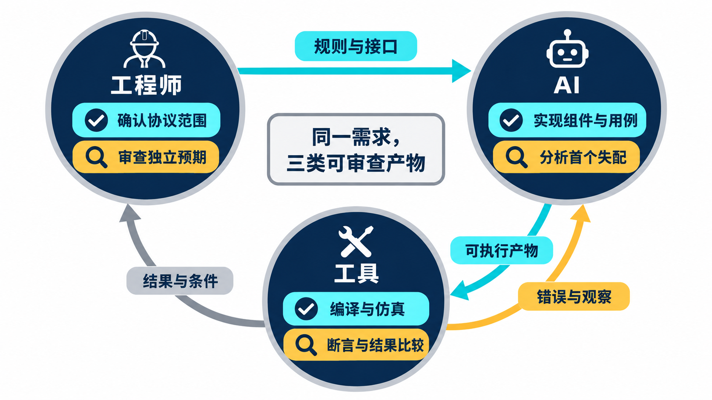
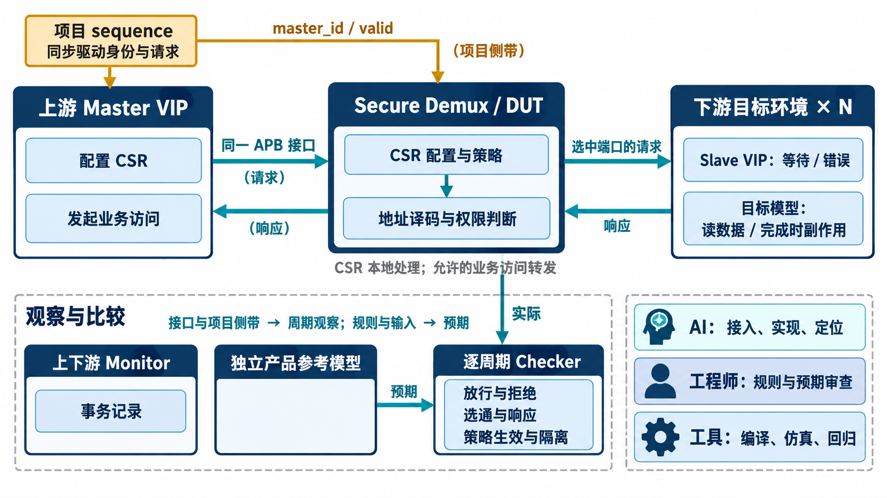
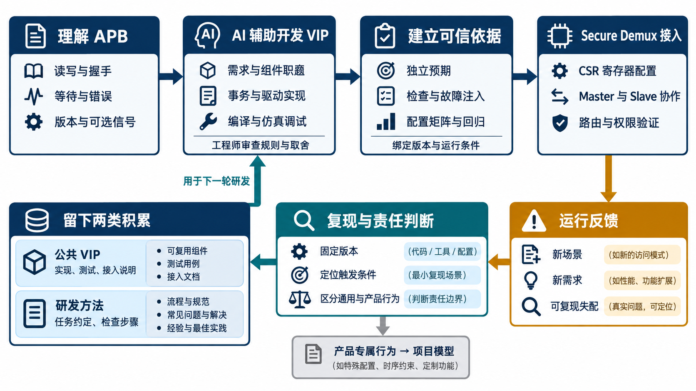

# AI 辅助芯片验证，如何打造可复用的 VIP？

简体中文｜英文版待补｜中文内容稿，待波形补充与发布审阅

[返回专题目录](../README.md)

用 AI 开发一个芯片 IP，除了实现电路，还需要一套验证环境：发起读写、制造等待与错误、观察接口行为，再判断结果是否符合预期。这些工作中，有些取决于 IP 的具体功能，有些则会在不同项目里反复出现。例如，只要使用同一种总线，访问时序、握手规则和协议检查就有许多共通之处。

APB 是常用于外设寄存器访问的总线协议；VIP（Verification IP）则是可复用的验证组件，用来生成、观察和检查这类访问。把公共的协议能力做成 VIP，后续项目就可以在已有基础上搭建验证环境，再为自己的寄存器、数据通路和控制逻辑补充功能检查。

如果每次都从头生成，前一个项目已经弄清的协议规则、已经检查过的边界行为，就可能需要重新确认。更值得积累的，是一套能够被后续项目直接采用的公共验证能力，以及让 AI 正确使用和改进它的方法。

本系列以 APB VIP 为具体案例，讲清这条研发路线：**理解协议，用 AI 辅助开发并验证 VIP，把它接入其他 IP 的研发流程，再用真实运行中的反馈改进组件和方法。** 后一个项目既使用已有成果，也为下一轮研发补充经验。

后文会使用“回归”这个词，指按一组已有用例重新运行检查，确认实现或修改后仍满足预期。UVM 是组织这些验证组件的方法，SVA 则是描述并自动检查时序规则的断言。

本系列讨论的 APB VIP 已有实现和运行记录。例如，2026 年 9 月 28 日的冻结回归记录包含 568/568 项单元检查和 24 份无 UVM/SVA 错误的正向仿真日志。这些结果说明公共组件在指定配置下接受过哪些检查；[第 4 章](chapter-04.md)会展开测试范围与可信依据。

后文还会结合实际 IP 的接入与运行记录，回答比一个 PASS 更具体的问题：哪些能力已经能用，凭什么判断，以及下一次项目怎样接着用。

这条路线包含四个相互连接的问题。APB 提供技术对象，VIP 承接可复用能力，AI 参与具体研发工作，项目运行则持续检验前面的判断。

*复用关系示意：左侧展开本系列研发的 APB VIP，右侧是使用它的 IP 验证项目。项目在验证环境中实例化 VIP，与 DUT（被测 IP）连接，并按自己的规格建立参考模型和 Scoreboard。虚线表示实例化复用，不是硬件信号；实例输出的已完成访问与实际结果来自 Monitor。参考模型根据访问和独立规格生成预期，不以 DUT 的实际读值作为预期。下方寄存器例子假定读写均正常完成，仅用于教学。*

## 先讲清 APB，才能知道 VIP 在验证什么

APB 是 Advanced Peripheral Bus，常用于芯片内部的外设控制和寄存器访问。软件配置一个计时器、启动一项运算或读取状态，背后都可能对应一笔 APB 访问。

它的基本交互容易理解：请求端给出地址和读写方向，响应端返回数据或接受写入；如果暂时不能完成，就让访问等待。但落实到时钟边沿，仍然有明确规则：什么时候开始，什么时候完成，等待期间什么必须保持，连续两笔访问怎样衔接，错误又在哪个时点有效。

这些知识会影响验证代码的行为。例如，“没有额外等待”仍然要经过准备和访问两个阶段；写操作正常完成，也不意味着写入后的外设状态一定正确。协议时序与产品功能，需要分别建立判断依据。

因此，本系列会从一笔读写出发解释 APB，再逐步引入字节写入、错误响应、版本与可选信号。每个知识点都连接到实际用途：它怎样影响驱动、观察、检查和测试预期。读者不需要先熟悉完整的 UVM 类体系，也能沿着访问过程理解后续架构。

VIP 可以扮演请求端主动访问 DUT（被测设计），也可以扮演响应端提供数据、等待和错误，或者只观察真实模块之间的通信。把这些能力组织起来，后续项目就有了共同的协议基础。[第 2 章《AI 开发 APB VIP，先讲清协议与架构》](chapter-02.md)会沿一笔访问，把协议时序与组件职责连接起来。

## 让 AI 参与研发，也让结果接受检验

有了协议基础，第二个问题是：怎样让 AI 把规则实现成一个能用的 VIP？

这里会涉及需求整理、组件职责、事务状态、接口配置、代码实现、测试和调试。AI 可以帮助把需求转成实现，分析编译与仿真反馈，补充定向测试；工程师则要审查协议解释、架构取舍和预期结果。每轮工作都应留下可以检查的产物。

例如，要求响应端“支持零等待”还不够。还要说明返回数据何时准备，请求端在哪个边沿采样，连续两笔访问怎样区分。要求“支持复位”也要覆盖事务交接：总线恢复以后，当前访问如何中止，下一笔访问能否继续。

可信依据由这些具体检查逐步建立。编译通过说明语言与连接满足了工具要求，仿真运行提供动态行为，断言与结果比较检查相应规则；独立预期、故障注入和配置矩阵则帮助检验测试是否足够有效。

尤其需要注意，AI 同时生成实现和测试，两者可能共享同一个理解错误。写后读一致是一项证据，还需要来自协议规则、独立推导和明确用例的检查。[第 3 章](chapter-03.md)展开需求、实现与工具反馈如何配合；[第 4 章](chapter-04.md)进一步讨论独立预期、故障注入和覆盖证据，让“为什么相信它”有可以讨论的工程依据。

*方法示意：工程师审查规则与预期，AI 辅助实现和分析，工具执行检查；运行结果仍需回到原始需求判断。*

## 把 VIP 放进其他 AI 辅助 IP 研发流程

VIP 开发出来之后，要进入真实项目才能发挥复用价值。后续 AI 研发任务可以从已有接口和能力出发，把更多工作放到产品新增的行为上。

到了接入环节，我们选择 APB Secure Demux 作为具体案例。Demux 是 demultiplexer 的简称，这里可以理解为“一路请求，按地址选择一个出口”；Secure 表示它还会在转发前检查访问权限。这样，一笔访问既要被送到正确的下游模块，也要符合当前的权限策略。

它通过 APB 配置内部寄存器与访问策略，再把允许的业务请求分发到下游目标。配置和业务访问共用同一个上游 APB 接口，由地址译码区分。一个案例就能同时用到寄存器访问、master 请求、slave 响应和产品权限检查。

验证环境在上游使用 master VIP 发起访问，在下游使用 slave VIP 提供等待与错误响应；独立目标模型负责读数据和完成时的副作用，产品参考模型与逐周期 checker 判断路由、权限及隔离是否正确。AI 接入时需要理解这些分工，也要让项目身份侧带与 APB 事务保持一致。

*概念示意：CSR 配置与业务访问走同一上游接口；master_id 是项目侧带。VIP 提供协议行为，产品模型与逐周期 checker 判断权限、路由和副作用。*

[第 5 章](chapter-05.md)先讲这套 UVM 环境的实际接入。UVM 是通用验证方法学，用来组织事务、组件与连接关系。[第 6 章](chapter-06.md)接着沿配置、放行、拒绝、等待与复位展开场景，让每个检查都能回到同一个产品问题。

这种复用也有明确条件：接口参数、角色、配置作用域和使用版本要匹配，产品模型需要独立的规格依据。已有 VIP 能成为新项目的基础，新产品的正确性仍需在自己的场景中验证。

Secure Demux 的一轮历史报告记录了典型直接模式、随机种子 seed 为 42 时，17/17 个 UVM 用例通过，说明 APB VIP 已进入实际 IP 的验证环境。这份结果早于前面提到的 VIP 冻结回归，两者属于不同批次，不能拼成“最新 VIP 已在该 IP 上重新回归”的结论。[第 6 章](chapter-06.md)会结合具体场景解释这份运行证据。

## 让使用反馈回到 VIP，也回到研发方法

一个 VIP 在自己的测试环境里工作正常，进入独立项目后，会获得新的检验。消费方可能使用不同的参数、多个接口实例或新的响应组合，也可能通过正式依赖入口构建，而不具备原工程的环境设置。

这些经历可以形成持续改进的过程：项目提出运行现象或需求，固定版本并建立最小复现，判断问题属于公共组件还是产品模型，再完成修改、专项测试和相关回归，最后回到消费项目验证。

这就是本系列所说的“闭环”。它有明确的起点和返回路径。一次公共改动在 VIP 自测中通过之后，还要回到提出需求的项目检查；一次产品专属调整，则留在产品模型中，避免让其他使用者承担无关假设。

更进一步，反馈可以同时沉淀为两类成果。**一类是 VIP 的实现、测试和接入说明；另一类是 AI 下一次研发任务的工作方法。**

例如，独立项目的构建经验可以转成固定的消费者构建检查；读写回环可能掩盖共同错误的经验，可以转成“基础语义先给独立预期”的要求。方法写进任务说明或 Skill，也就是供 AI 使用的工程操作说明，便能进入下一次工作。后续运行再检验这些方法是否有效，必要时继续调整。

这里人的判断始终有具体位置：确认规则、决定修改归属、审查测试预期和改动范围。AI 根据真实工具反馈辅助定位和实现。[第 7 章](chapter-07.md)讲一次项目反馈怎样变成修正与回归，[第 8 章](chapter-08.md)再把其中可迁移的方法交给后续项目。持续改进依靠的是这些动作与证据之间的联系。

*方法示意：从左到右建立协议、实现和验证依据，再在 APB Secure Demux 中使用；运行反馈经过复现与责任判断，形成公共 VIP 和研发方法两类积累，返回下一轮研发。*

## 沿着这条主线读下去

初次接触 APB 或 UVM，可以从第 2 章顺序阅读；已有相关经验，也可以按关心的问题进入：

- **理解协议与架构**：[第 2 章｜AI 开发 APB VIP，先讲清协议与架构](chapter-02.md)
- **开发并验证 VIP**：[第 3 章｜用 AI 开发 APB VIP，怎样一步步验证实现？](chapter-03.md)，接着看[第 4 章｜AI 设计的 VIP，凭什么相信它？](chapter-04.md)
- **接入自己的 IP 项目**：[第 5 章｜AI 设计的 VIP 实战：验证 APB Secure Demux](chapter-05.md)，再看[第 6 章｜AI 辅助 IP 验证：用 Secure Demux 检验 VIP](chapter-06.md)
- **把运行经验留下来**：[第 7 章｜AI 辅助验证调试：报错后究竟该改哪里？](chapter-07.md)，最后看[第 8 章｜AI 辅助芯片验证，怎样复用 VIP 与研发经验？](chapter-08.md)

读完这个系列，希望读者既能理解这套 APB VIP 如何工作，也能把同样的问题带到自己的 AI 辅助研发项目中：哪些能力值得做成公共组件，怎样检查 AI 的实现，如何让后续项目正确使用，以及使用经验怎样返回组件和研发流程。

下一章从一笔 APB 访问开始，把这些理念落实到信号、时序与组件职责上。

[专题目录](../README.md)｜[下一章](chapter-02.md)
