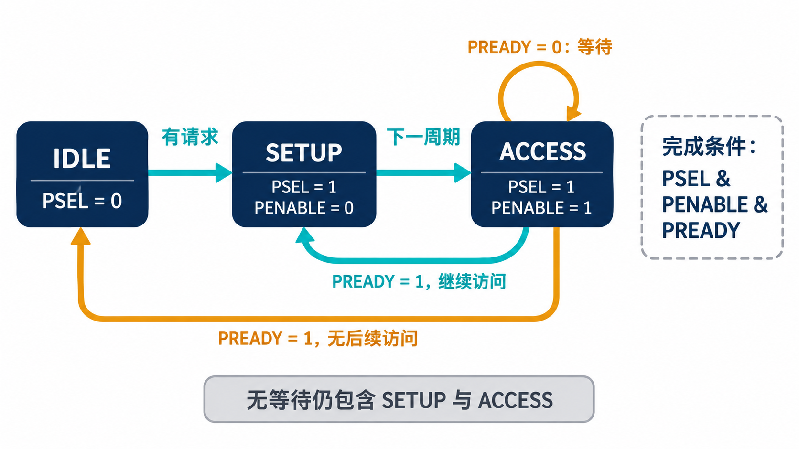
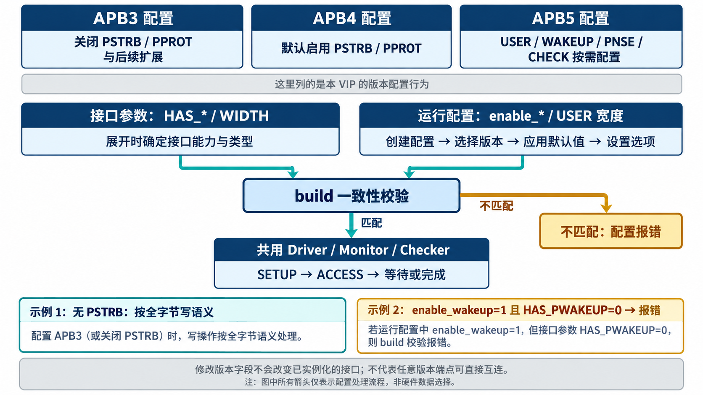
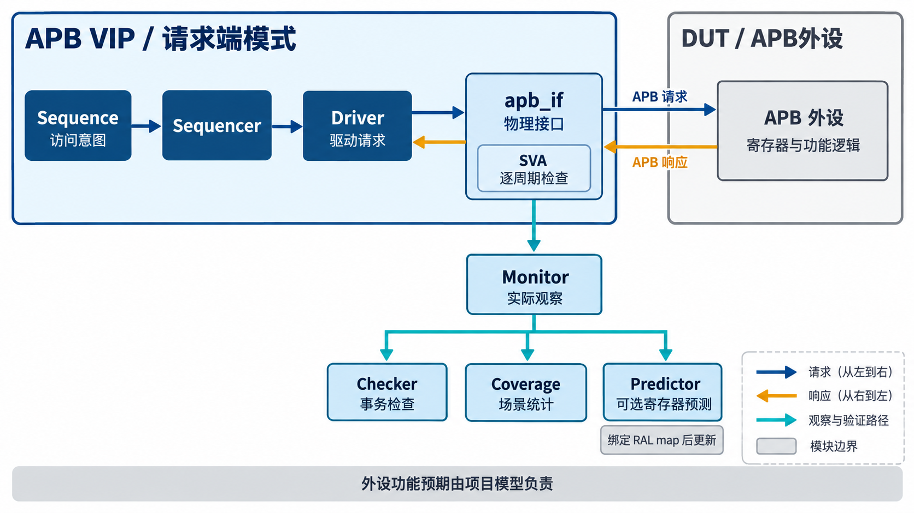
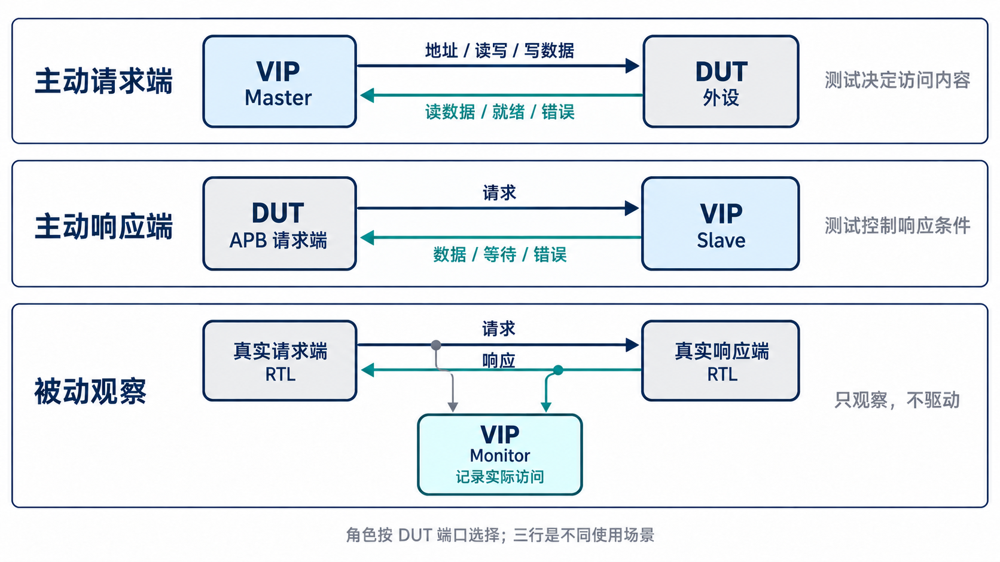
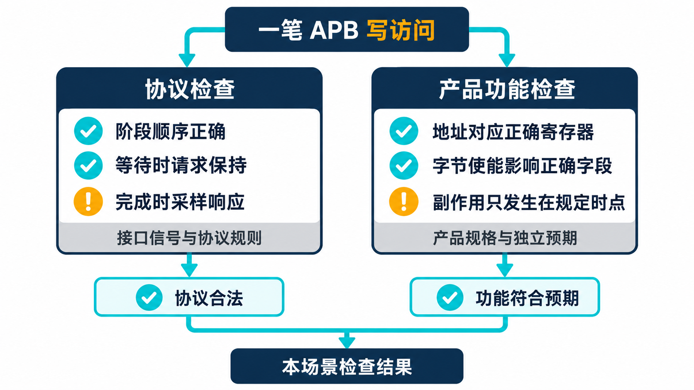

# AI 开发 APB VIP，先讲清协议与架构

简体中文｜英文版待补｜中文内容稿，待波形补充与发布审阅

[返回专题目录](../README.md)

APB 是常用于外设控制和寄存器访问的总线协议，VIP 是用来模拟与检查协议行为的验证组件。以“向一个控制寄存器写入数值”为例，测试必须同时说明写到哪里、写什么，以及怎样判断外设接受了这次写入。本章先看读写、等待、错误和可选字段，再沿同一笔访问进入 VIP，理解这些规则怎样落实到事务对象、驱动、观察与检查组件中。

## 先读懂总线上的一笔访问

### 一笔访问为什么至少需要两拍

APB 是同步、非流水的接口：信号在时钟边沿被采样，一笔传输完成后才开始下一笔。这里的“一拍”指一个时钟周期；“采样”指在规定时钟边沿读取信号并据此判断状态。一次访问分为 SETUP（准备）和 ACCESS（访问）两个阶段。SETUP 把访问对象和操作内容摆上总线，ACCESS 等待响应端接受这次访问。

以一笔写操作为例，请求端在 SETUP 拉高选通信号 PSEL，保持 PENABLE 为低，同时给出地址 PADDR、写方向 PWRITE 和写数据 PWDATA。下一周期进入 ACCESS，PENABLE 变高；响应端通过 PREADY 表示能否完成。

| 阶段 | PSEL | PENABLE | PREADY 的作用 |
| --- | --- | --- | --- |
| SETUP | 1 | 0 | 此阶段不完成传输 |
| ACCESS，继续等待 | 1 | 1 | 为 0，访问继续 |
| ACCESS，完成 | 1 | 1 | 为 1，在采样边沿完成 |

所以，**完成条件是采样到 PSEL、PENABLE、PREADY 同时为高**。单独看到 PREADY 为高不够：响应端可以一直把它保持为高，包括 SETUP 和空闲阶段。

“零等待”省去的是 ACCESS 中额外的等待周期，SETUP 仍然存在。这也是最短访问需要两个周期的原因。读操作采用相同的握手过程，只是方向改为读，并在完成时采样 PRDATA。

APB 的阶段与完成条件可对照 [Arm AMBA APB 协议规范 IHI 0024E](https://documentation-service.arm.com/static/63fe2c1356ea36189d4e79f3) 中的传输说明。后面的工程讨论也以这个时序基础为起点。



*协议状态示意，不是仿真波形。ACCESS 中只有 PREADY 为高才完成；连续访问也要重新经过 SETUP。*

### 等待时不能把下一笔请求提前塞进来

如果响应端还没有准备好，PREADY 保持低，ACCESS 就会延长。这期间当前访问的地址、方向和适用的控制信息需要保持稳定；写操作的数据也不能悄悄换成下一笔。

这件事对测试程序很具体。测试序列（sequence）可能已经准备好了第二笔写，但驱动组件（driver）仍然要守住第一笔的请求，直到它完成。否则，测试看到的可能是第一笔地址配上第二笔数据，错误发生在验证环境自己身上。

连续访问也容易被误解。同一个响应端连续接收两笔访问时，PSEL 可以一直保持高，中间无需插入 IDLE；但 PENABLE 必须回到低，给第二笔访问留下新的 SETUP。省掉空闲周期与省掉 SETUP 是两回事。

因此，检查总线时需要同时看阶段和边沿。只统计 PSEL 拉高了多久，或者只在 PREADY 上升时打印数据，都不足以重建完整访问。后面介绍的 monitor，就是专门把这些逐拍信号还原成事务的组件。“事务”就是将一次完整访问合成一条记录，包含请求内容、响应和完成状态，而不只记录某一拍的信号。

### 写一个字，和写其中一个字节

APB4 引入的 PSTRB 用来指示写数据中哪些字节有效。对于 32 位数据，PSTRB 有 4 位：第 0 位对应 PWDATA[7:0]，第 3 位对应 PWDATA[31:24]。

假设某个支持普通字节写入的存储位置原来是 `0x11223344`，本次写入 `0xAABBCCDD`，PSTRB 为 `4'b0101`。最低字节和第 2 个字节被更新，其余字节保留，结果应为 `0x11BB33DD`。strobe 在这里就是“字节有效位”。这是理解它最直接的例子，也很适合用作独立测试向量。

这里要分清两层含义。协议规定哪些字节有效；具体寄存器如何处理这些有效位，由外设规格决定。普通存储、写入 1 才清除对应状态位的寄存器、写入后触发动作的命令寄存器，不能使用同一套功能预期。读操作则不使用写 strobe，PSTRB 应为零。

另一个常见控制字段是 PPROT，它携带访问属性，包括特权、安全属性以及指令或数据访问属性。它给接收端提供判断所需的信息，实际权限策略仍由系统或外设决定。总线上带了属性，并不自动证明权限控制已经正确实现。

### 错误响应，也是一笔完成的访问

PSLVERR 用于在完成时报告访问失败。它的有效观察点仍然是 PSEL、PENABLE、PREADY 同时为高的采样边沿。把等待过程中的一个电平当作最终错误结果，会误判事务状态。

错误响应也不能直接解释为“什么都没有发生”。外设是否已经产生状态变化，例如触发一次操作或清除某个标志，以及软件能否重试，需要看该外设的定义。协议检查器可以判断响应时机，无法替代产品对错误处理的规格。

同样，工程中常设置最大等待门限，以尽早发现挂起。这个门限是验证环境或项目的约定，不能泛化成所有 APB 外设都必须遵守的固定拍数。对一次最终完成但等待过长的访问做检查，与防止仿真无限等待，是两个需要分别安排的动作。

### 协议版本怎样变成 VIP 配置

APB3 增加了等待状态与错误响应；APB4 在此基础上增加写字节 strobe 和保护属性。APB5 进一步包含用户属性、唤醒与校验等可选能力，后续规范还定义了与安全空间相关的扩展。

在本系列的实现中，版本默认值与可选能力分开配置：除了读写、等待和错误，还能表达 PSTRB、PPROT、USER 信息、PWAKEUP、PNSE 和 CHECK 相关行为。USER 又区分请求、数据和响应几个方向的宽度，不能笼统用一个“USER 宽度”代替所有参数。

这些选项有实际用途。USER 可以随事务携带项目定义的附加信息；PWAKEUP 用于唤醒协作；PNSE 与保护属性共同参与安全空间表达；CHECK 信号用于相应的校验机制。是否启用、怎样解释、接口上是否存在，都要与被验证设计一致。

VIP 因而需要两类设置：一类决定物理接口长什么样，例如地址与数据宽度；另一类决定本次仿真怎样工作，例如扮演请求端还是响应端、插入多少等待、开启哪些检查。把两者混在一起，容易得到“配置对象写对了，实际接口却没变”的环境。

### 一套组件怎样兼容三种版本

这里的“兼容”，指同一套 VIP 可以按目标接口的版本与能力组合使用。三种版本共用 SETUP、ACCESS、等待和完成这条基本时序路径，扩展字段则按配置驱动、采样和检查。因此，不需要为每个版本重新实现一套完整的 driver 和 monitor，也不能仅换一个版本名就认为接入完成。

实现上，第一层是版本默认值。`apb_config` 的 `apply_version_defaults()` 将版本选择展开为具体能力：

| 版本选择 | 本 VIP 应用默认值后的行为 |
| --- | --- |
| APB3 | 关闭 PSTRB、PPROT、唤醒、PNSE 相关支持和 CHECK；三个 USER 宽度设为零 |
| APB4 | 默认启用 PSTRB、PPROT，关闭上述后续扩展 |
| APB5 | 不自动打开全部扩展，由使用者明确设置所需能力与宽度 |

这张表描述的是本实现的配置行为。APB5 的 USER、唤醒、校验和安全空间相关能力还要按目标采用的规范修订与接口声明选择；“使用 APB5”不能代替逐项确认。当前实现启用 PNSE 相关的 `rme_support` 时，还会要求保护属性能力一起启用。

第二层是接口参数。`apb_if` 用 `HAS_PSTRB`、`HAS_PPROT`、`HAS_PWAKEUP` 等参数描述接口能力，用地址、数据和三个 USER 宽度参数确定类型。这些参数在仿真展开时确定，运行中修改配置对象不会让已经实例化的接口改变类型。

在 SystemVerilog 实现中，部分可选信号仍保留占位成员，零宽度 USER 也使用最小占位宽度。能力关闭时，它们保持确定的默认值，driver 和 monitor 按能力开关处理。**能在接口对象中看到一个成员，不等于目标协议启用了这个信号。**

第三层是行为选择。Driver 只驱动已启用的可选字段，Monitor 只采样相应能力，检查规则也受适用条件约束。比如没有 PSTRB 的 APB3 普通写访问，在存储响应模型中按全字节写处理；不能因为接口的 PSTRB 占位值为零，就把它解释成“没有字节需要写入”。RAL 适配器同样根据版本与 `enable_strb` 决定是否声明支持字节使能。

第四层是接入校验。`apb_env` 在 build 阶段调用 `validate_interface_vs_config()`，核对地址和数据宽度、启用的能力及 USER 宽度。例如配置要求 `enable_wakeup=1`，接口却声明 `HAS_PWAKEUP=0`，就会报配置错误；启用的 USER 宽度与接口不一致也会报错。这样能在业务访问开始前发现连接约定不成立。



*兼容机制示意：版本选择、接口能力和运行配置共同决定可用行为。图中的全字节写指本 VIP 存储响应模型的语义；这些配置机制不构成不同版本端点之间的协议转换器。*

### 配置 APB3 时，不能只改一个版本字段

以 32 位 APB3 请求端为例，顶层接口应关闭 APB4 的两项扩展；其余扩展沿用关闭的默认参数。下面是接口声明片段，省略时钟、复位产生和 DUT 接线：

```systemverilog
apb_if #(
  .ADDR_WIDTH(32), .DATA_WIDTH(32),
  .HAS_PSTRB(0), .HAS_PPROT(0)
) bus3 (.pclk(pclk), .presetn(presetn), .check_enable(1'b0));
```

配置对象也要表达相同的能力。它创建时默认按 APB4 初始化，因此切换到 APB3 后，应显式重新应用版本默认值，再设置本轮工作模式：

```systemverilog
apb_config cfg = apb_config::type_id::create("cfg");
cfg.protocol_version = APB3;
cfg.apply_version_defaults();
cfg.addr_width = 32;
cfg.data_width = 32;
cfg.agent_mode = APB_ACTIVE_MASTER;
```

这里的顺序是“创建对象、选择版本、应用默认值、设置所需选项”。`apb_env` 的 build 阶段负责能力校验，并不会替代使用者重新派生版本默认值。对于 APB5，应在选择版本后逐项设置 USER、唤醒等能力；若按本实现使用 `rme_support`，还应让 `enable_prot` 与其要求一致。

类型绑定也必须一起改变。上述接口对应的 virtual interface 类型可以写成：

```systemverilog
typedef virtual apb_if #(
  .ADDR_WIDTH(32), .DATA_WIDTH(32),
  .HAS_PSTRB(0), .HAS_PPROT(0)
) apb3_vif_t;
```

环境使用 `apb_env#(apb3_vif_t)`，设置和获取接口时使用 `uvm_config_db#(apb3_vif_t)`，并绑定实际环境实例的路径。默认的 `virtual apb_if` 对应默认 APB4 参数，不能直接替代这个类型。代码片段用于说明接入约定，不是一份独立可运行的完整 testbench。

APB5 的设置遵循相同原则。例如请求、数据、响应 USER 宽度为 5、13、3 时，接口的 `USER_REQ_WIDTH`、`USER_DATA_WIDTH`、`USER_RESP_WIDTH` 与配置的 `user_req_width`、`user_data_width`、`user_resp_width` 应逐项对应，而不是统一填成一个宽度。

这些机制让公共组件适应不同接口配置；目标 IP 仍需明确自己支持什么。若请求依赖某个旧版本接口无法表达的字节使能或附加属性，需要项目显式处理适配，不能默默丢弃字段。[第 4 章](chapter-04.md)会结合已有配置矩阵说明这套兼容能力接受过哪些检查。

## 再看 VIP 怎样组织这些行为

测试表达“向某个地址写一个值”，VIP 把访问描述成一个对象，交给 driver 执行时序，同时由 monitor 独立记录总线上实际发生的行为。发起者表达意图，驱动组件执行协议，观察结果再送给检查与覆盖组件。

### 从“我要写什么”到“这一拍驱动什么”

UVM 是 Universal Verification Methodology，即通用验证方法学。它用组件、事务和连接关系组织验证环境。本实现中的一次访问用 `apb_item` 表达：请求部分包含地址、方向、写数据、strobe 和保护属性，也能携带 USER、唤醒和安全空间相关字段；完成后还会记录读数据、响应属性、错误与事务状态。

Sequence 负责生成这些访问，sequencer 负责向 driver 交付事务。Driver 取得一笔请求后，驱动 SETUP，再进入 ACCESS，等待完成条件成立并采样响应。测试因此可以关注“访问哪个寄存器”，不必在每个用例里重复编写 PENABLE 的逐拍控制。



*图为架构概念示意。上方是请求与响应路径，下方是从物理接口出发的观察路径；寄存器预测需要绑定对应的 RAL map。*

这里有一个值得保留的实现细节：当前请求 driver 将响应填写回原请求对象，然后调用 `item_done()` 通知 sequencer。这与额外发送一个独立 response 对象的方式不同。上层接入应遵循实际接口约定，否则很容易在总线已经完成后，仍等待一个不会出现的响应队列条目。

连续访问也在 driver 内处理。当前实现完成本笔事务后尝试取得下一笔；如果已有请求，就直接进入下一笔 SETUP，避免插入不必要的空闲周期。测试要形成连续访问，也需要及时提供后续事务，单靠 driver 的能力不能凭空产生请求。

### 同一套组件，怎样换一个角色



*角色示意：前两行由 VIP 替代通信的一端，第三行两端都是真实 RTL，Monitor 只从总线旁路采样。三行是不同场景，不是同时连接在一个接口上的三个驱动者。*

验证外设时，VIP 通常扮演主动请求端，把 APB 请求送给 DUT（Design Under Test，被测设计）。验证一个输出 APB 请求的桥时，则需要主动响应端，替代下游外设给出 PREADY、PRDATA 和 PSLVERR。两端都是真实 RTL 时，还可以使用被动模式，只观察而不驱动。

Agent 将一个端口所需的驱动、序列交接等组件组织在一起，env 则负责更上一层的组件创建与连接。本实现的 `apb_env` 根据配置创建相应的主动 agent；请求端与响应端是角色选择，不会在默认环境里同时争用同一组驱动信号。Monitor 则承担共同的观察工作。项目也可以直接组合 agent、monitor、checker 等组件，后面介绍的 Secure Demux 环境就采用了这种方式。

响应端不只是“永远立即返回零”。它有通用稀疏存储模型，只为用到的地址保存数据，适合在测试中充当简单目标端。它可以提供零等待、固定等待、随机等待或由 sequence 指定的等待；错误也可以由固定策略、概率、地址范围或 sequence 控制。对于需要精确构造返回值的用例，响应 sequence 还能提供读数据与返回 USER 信息。

这让桥接测试可以主动施加下游压力：同一个地址正常完成，下一次延迟完成，再下一次返回错误。通用存储模型适合承接协议交互；写一清零、中断触发和命令副作用，仍然应由产品模型表达。

### 先把功能入口和使用者对上

理解组件名字之后，还需要知道测试应从哪里提出要求。当前实现可以按下面几组入口使用：

| 想构造或观察什么 | 使用的能力 | 项目负责补充什么 |
| --- | --- | --- |
| 寄存器读写、连续访问 | 请求 sequence 与 master driver | 地址、合法操作及预期结果 |
| 下游等待、错误、指定返回值 | slave 配置与响应 sequence | 各端口的响应策略 |
| 实际完成或复位中止 | monitor 的事务与状态 | 中止对产品模型的影响 |
| 时序违规、未知值、校验问题 | 接口断言与采样侧检查 | 对应开关和报告汇总 |
| 场景统计、寄存器镜像 | coverage、adapter、predictor | 覆盖目标及 RAL map |

例如测试想让下游等两拍，应设置响应端的等待行为；请求端的任务仍然是保持当前访问。测试想知道实际等了多久，则应读取观察结果。将“提出刺激”“执行刺激”“确认发生”分开，能避免 AI 在多个组件里重复实现同一个计数器，却没有明确哪个值代表真实总线行为。

### 从测试目标选择能力，而不只是选择角色

选好 master、slave 或 passive 只是第一步。接下来要决定希望验证环境主动制造什么条件，以及从哪里观察结果。下面这张能力地图可以作为交给 AI 的任务起点。

| 想验证什么 | 已有入口 | 需要同时给出的条件 |
| --- | --- | --- |
| 下游慢响应、偶发错误 | 等待策略与错误策略 | 等待范围、错误概率或地址范围 |
| 两笔返回值是否串用 | 响应 sequence | 每笔数据、错误与 USER 的固定预期 |
| 协议检查能否发现违规 | 总开关与事务 `inject_*` 字段 | 目标规则、触发阶段与预期诊断 |
| APB5 地址校验与未知值检查 | 地址校验位翻转、PPROT 注入 X | 对应接口能力和检查窗口已启用 |
| 请求与实际响应是否一致 | Monitor 的事务记录 | 地址、状态、实际等待数与时间口径 |
| 唤醒行为是否符合所选模式 | `wakeup_mode` 与事务 `wakeup` | 启用 PWAKEUP，选择跟随或显式控制 |

普通测试中的等待和 PSLVERR 可以完全符合 APB 协议。它们让 DUT 面对慢设备或失败访问，属于响应场景。故意延长 SETUP、跳过 SETUP 或破坏保持关系，则属于负向协议测试，需要另外打开违规总开关。两者不要混成一个“出错模式”。

唤醒控制也有具体入口：`APB_WAKEUP_FOLLOW_TRANSFER` 在传输期间产生唤醒电平；当前 driver 的 `APB_WAKEUP_MANUAL` 和 `APB_WAKEUP_SEQUENCE_CONTROLLED` 分支都使用事务中的 `wakeup` 值。使用时还要配置 `enable_wakeup`，并使接口的 `HAS_PWAKEUP` 与之匹配。这是唤醒信号的生成能力，完整的时钟门控或电源管理功能仍由项目验证。

[第三章](chapter-03.md)会把等待、错误与定向返回组合成一个任务；[第四章](chapter-04.md)展开注入入口及判定方法；[第七章](chapter-07.md)说明怎样读取观察信息。先确定问题，再选择这些能力，AI 才不容易把“增加测试”变成无目标的随机流量。

### 为什么 driver 发过了，还需要 monitor 再看一遍

Driver 知道自己想发什么，但验证关心的是总线上发生了什么。一次访问可能被复位中止，实际等待长度可能取决于 DUT，返回数据也来自被测设计。直接把 driver 的原始请求当作完成结果，会丢掉这些差别。

Monitor 在时钟采样点识别 SETUP、ACCESS 和完成条件，重建事务，并通过 `transaction_ap` 发布。这是一个 UVM analysis port，可以把观察到的事务分发给多个订阅者；它传递观察结果，不参与总线握手。记录中包含请求与响应、时间信息，以及 OK、ERROR 或 ABORTED 等状态。请求的等待设置与观察到的等待字段分别保存，方便后续分析意图与结果。

复位使这个区分尤其重要。请求已经发起，不代表访问已经完成。当前实现用 ABORTED 表达被中断的事务；消费它的模型应按中止处理，而不能照常提交一次成功的寄存器更新。Driver 同时需要完成与 sequencer 的交接，避免测试卡在尚未归还的请求上。

未知值检查也应发生在信号仍保留四态信息时。SystemVerilog 的 `logic` 除了 0、1，还能表示未知值 X 和高阻态 Z；普通二态字段只能保留 0、1。当前 monitor 的 X 检查在接口采样侧进行，避免事务转换以后才去寻找已经丢失的未知状态。

### 两层检查，回答不同的问题

断言是让仿真器自动检查某条规则的表达式，例如“等待时地址必须保持”。逐拍协议关系由 SVA，即 SystemVerilog Assertions，检查。当前主要协议断言位于 `apb_if` 中，围绕阶段关系和相应信号的稳定性等条件工作；CHECK 相关校验也在接口侧处理。

事务级 checker 则接收 monitor 发布的访问。例如，读事务不能携带写 strobe；对最终完成的访问，可以按配置检查等待是否达到门限。这类检查适合在事务已收集完整后判断。若要在总线一直不完成时终止仿真，环境还应设置运行超时看守，不能只依赖完成事务后的判断。

这两层检查有各自的开关和报告渠道。`enable_checker` 控制事务 checker，接口的 `sva_enable` 控制相应断言，`check_enable` 用于校验相关检查。事务 checker 的 `violation_ap` 也不等于仿真器全部错误的总出口。回归汇总需要同时查看 UVM 报告和断言结果。

这样组织有利于定位：是驱动时序不合法，还是一笔合法完成的事务不符合环境约定；是 X 值污染，还是正常错误响应。不同现象保留不同证据，AI 才能据此缩小修改范围。



*概念示意：一次写访问符合 APB 时序，并不能单独证明寄存器或外设状态更新正确。*

### 覆盖率和寄存器预测怎样接入

Coverage 是覆盖统计组件，也接收 monitor 的事务。例如，它可以统计正常读、错误读和带等待写是否出现过，帮助发现漏测的类别。当前实现围绕读写方向、地址区域、响应状态、等待类别、保护属性、字节 strobe、安全空间和阶段分类等维度设置覆盖点及交叉项。

覆盖率回答的是“观察到了哪些场景”。它不能单独证明场景里的数据正确，也不能替代波形对采样口径的核对。一个交叉项即使命中，仍然需要相应的检查或 scoreboard 判断结果。Scoreboard 是比较实际结果与预期结果的组件；参考模型负责生成产品预期，两者可以分开实现。

另一位订阅者是寄存器 predictor。RAL，即 Register Abstraction Layer，把寄存器组织成有地址、字段和访问属性的对象。Adapter 负责把寄存器读写转换为 APB 事务，再把总线结果翻译回寄存器操作状态；predictor 根据观察到的访问更新寄存器镜像。镜像是验证软件保存的寄存器预期状态；例如观察到一次成功写入后，模型据此记录它认为寄存器应有的值，后续再与实际读取比较。

这里的 map 描述寄存器地址与访问映射，使总线地址能够对应到具体寄存器。本实现为 predictor 提供 `set_map()` 绑定入口，在绑定 map 后更新相应寄存器。Adapter 的 `provides_responses=0` 与前面“响应写回请求对象”的交接方式一致；字节使能则依据 APB 版本及 strobe 配置启用。中止或错误访问转换为失败状态，不能作为正常成功返回处理。

### 架构中的哪些部分已经被 IP 项目用起来

Secure Demux 的实际环境选择 APB4：上游配置为主动 master，下游各端口分别配置为主动 slave，并启用 PSTRB 和 PPROT。它直接创建这些 agent 和 monitor，再接入产品模型。[第 5 章](chapter-05.md)会展示对应声明和调用关系。

这也解释了为什么 VIP 要允许按组件组合。一个外设测试可以使用封装好的 `apb_env`，一个多端口产品则可以把多个 agent 放进自己的 env。复用的是事务、协议驱动和观察能力，产品环境仍掌握多端口协调与功能检查。

### 参数一致，是架构的一部分

接口宽度由 SystemVerilog 参数决定，组件通过参数化的 `VIF_T` 使用对应的 virtual interface。Virtual interface 可以理解为类组件访问实际接口实例的句柄：它必须指向正确类型、正确实例，不能只在配置里写一个宽度就改变实体信号。

运行时的 `apb_config` 则选择角色、版本和行为。环境会检查接口参数与配置是否相符，包括数据与地址宽度、启用的可选能力以及相关 USER 宽度。这里的参数要在构建接口时确定，运行中的配置对象只能选择已有接口支持的行为。版本切换后，应按使用流程重新应用版本默认值，再设置项目需要的选项，避免保留上一版本的默认组合。

配置的作用域同样重要。顶层取得的配置和接口句柄，需要明确传递给所属子组件；多接口环境也应让每个实例获得自己的设置。用全局通配配置勉强跑通，往往会把下一次集成的问题埋进组件层次里。

至此，一笔访问从产生到执行、观察、检查和预测的路线已经完整。AI 要生成的并非几个孤立的类，而是一套在时间、状态和配置上互相一致的协作关系。下一章讨论怎样把这些关系变成 AI 可以执行、工程师可以检查的研发任务。

[上一章](chapter-01.md)｜[专题目录](../README.md)｜[下一章](chapter-03.md)
