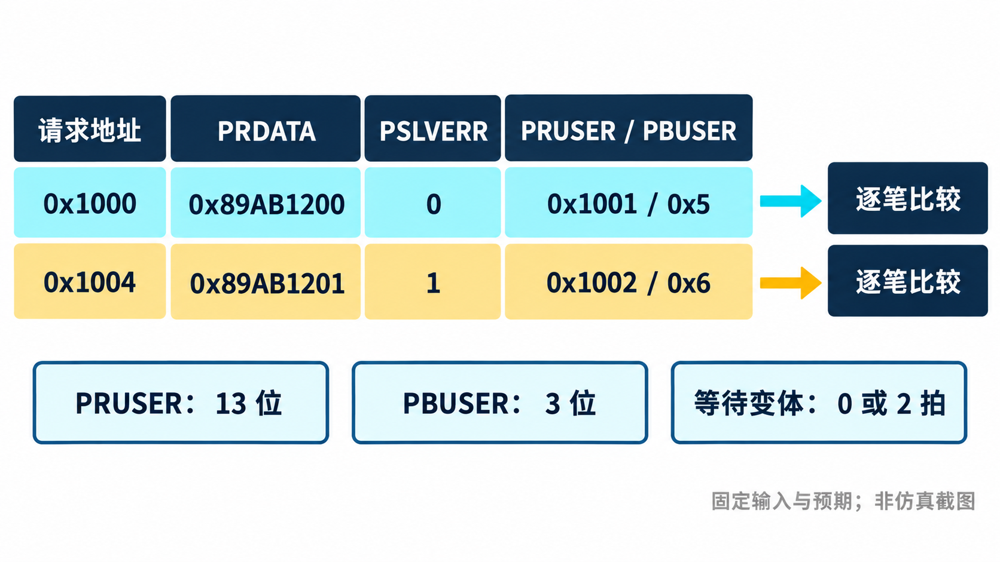
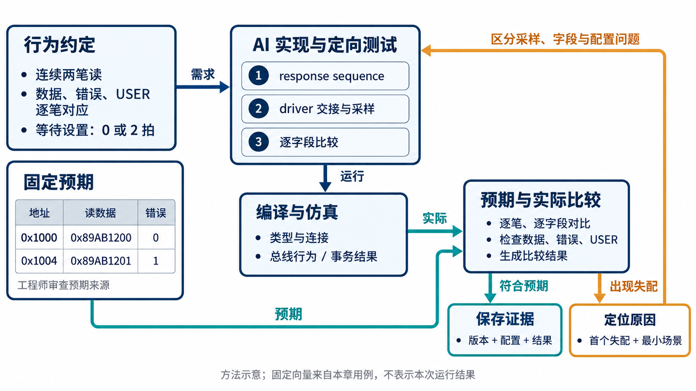
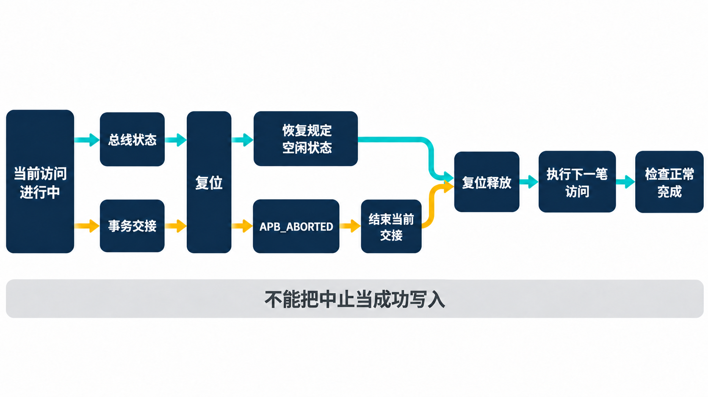

# 用 AI 开发 APB VIP，怎样一步步验证实现？

简体中文｜英文版待补｜中文内容稿，待波形补充与发布审阅

[返回专题目录](../README.md)

假设测试需要连续读取两个地址：第一笔正常返回，第二笔带错误返回，两笔数据还要不同。APB VIP 的响应端要按要求准备返回值，请求端要在正确时刻取得它，测试还要逐笔比较。仅要求 AI“实现响应功能”，没有说明这些配合关系，生成的代码就难以判断是否做对。

开发过程因此要先产生可判断的约定，再逐步交给 AI 实现。结合这套 VIP 的接口、用例和工程记录，我们可以把任务拆到具体的信号、对象与仿真反馈上。下面结合现有实现说明一种可执行的协作方法，示例任务用于展示怎样组织工作。

本章沿这项定向响应能力展开。“定向”表示输入与预期由测试明确指定，便于定位某一个行为。Sequence 是生成事务的测试程序，driver 负责把事务变成逐拍信号，monitor 再从信号重建实际发生的访问。这三项职责的完整架构见[第 2 章](chapter-02.md)。

## 把工作依据交给 AI

开始实现之前，AI 至少需要知道三类信息：协议基线与目标能力，已有工程的组件和使用接口，以及本轮任务的完成条件。协议说明回答行为是否正确，工程上下文决定代码应当接到哪里，完成条件则让工具反馈有明确的判断对象。

可以先要求 AI 提交一份简短的“行为—组件—检查”对应关系。例如等待访问涉及响应 driver 的 PREADY、请求 driver 的稳定保持、monitor 的事务重建，以及相应的时序检查。工程师据此确认责任有没有遗漏，再允许实现沿这些接口展开。

对于下面的响应 sequence 场景，一项示例任务可以这样写：

> 在现有 APB 组件和配置接口上实现定向响应。明确数据、等待和错误分别由谁控制；先列出两笔访问的独立预期，再给出最小实现与测试。交付时说明修改范围、运行配置、实际结果，以及未执行的检查。

这个任务约定让 AI 有足够信息推进，也让评审能追踪每项改动的理由。完成一轮后，更新行为说明和测试结果，再作为下一轮上下文；单独保存聊天里的“已经修好”，不足以把工程状态传下去。

## 先把一句需求展开成几个可判定的结果

以“响应端支持 sequence 控制返回值”为例，仅有这个句子，AI 可能把所有响应行为都塞进一个对象，也可能只替换读数据。两种实现都像是在完成任务，却会给使用者不同的预期。

当前实现把响应数据、等待策略和错误策略分别组织。对应测试里有很具体的组合：连续读 `0x1000` 和 `0x1004`，返回 `0x89AB1200` 和 `0x89AB1201`；第二笔返回错误；请求、数据与响应 USER 宽度分别为 5、13、3 位，并设置可区分的 USER 值。USER 是项目可定义的附加信息，本例把它当作需要原样传递的标记来检查。测试还覆盖零等待与带等待的响应方式。

表中的 PSLVERR 为 1 表示错误响应；RUSER 和 BUSER 分别是测试对象保存的数据与响应附加字段，对应接口上的 PRUSER、PBUSER。把测试中的常量排成表，交接约定就更明确了：

| 请求地址 | 读数据 | PSLVERR | RUSER（13 位） | BUSER（3 位） |
| --- | --- | --- | --- | --- |
| `0x1000` | `0x89AB1200` | 0 | `0x1001` | `0x5` |
| `0x1004` | `0x89AB1201` | 1 | `0x1002` | `0x6` |

两笔读请求的 PSTRB，也就是写字节有效位，都为零。响应 sequence 将请求等待设置为零或两拍，对应零等待与带等待的测试变体；测试在请求交接结束后逐项比较上表字段。这里列的是源码中的输入和检查预期，运行是否通过仍要看对应批次的结果。

这份表还能直接约束 AI 的修改：如果第一笔数据错误，先核对完成边沿与响应归属；如果只有 RUSER 错误，优先检查字段传递与宽度；如果第二笔错误状态出现在第一笔上，则检查对象复用和采样顺序。先把失配分开，定位就有了方向。

USER 使用不同宽度还有一个作用：避免几类字段因为恰好等宽而掩盖连接错误。这些常量的选择都服务于可观察的检查。

交给 AI 的任务应保留这些信息：输入是什么，谁决定等待，谁决定错误，完成后哪些字段应当是什么值。工程师先审查这份约定，AI 再生成实现和测试。预期怎样保持独立，会在[第 4 章](chapter-04.md)展开。这样，评审对象从“代码看起来合理吗”变成“这些可观察结果有没有被实现”。

这项能力也有对应的运行记录。2026 年 9 月 28 日的回归报告将 sequence responder 和 ZERO_WAIT+sequence error 列为通过项，分别关联带等待与零等待的专项记录。因此，这里的表格描述已有测试会检查什么，报告说明相应专项曾在冻结批次中运行通过；图中的 AI 工作流程则是据此整理出的协作方法。

把这三者分开，后续 AI 才能从正确的位置接手：已有接口可以调用，已有测试可以复用，新改动则需要产生自己的运行结果。



*用例预期示意：两笔响应的数据、错误与 USER 字段都应属于各自请求。图列出源码中的固定预期，不代表新增运行结果。*

## 用一笔最小访问打通组件，再增加变化



*方法示意：固定预期与实际观察分别进入比较，失配先用于定位，再指导修改。图中常量来自本章用例；USER 的逐项预期见上表，图不代表一次新的仿真结果。*

第一轮实现适合选一个小而完整的路径：明确的接口参数、一个请求端、一笔普通读写、一个可预测的响应，以及能够观察完成的 monitor。这里的小，指的是场景范围；请求交接、驱动、采样与结束不能只完成其中一半。

这一轮可以让 AI 先列出事务经过的组件和状态，再实现代码。工程师关注的是连接和所有权：谁驱动请求信号，谁驱动响应信号，谁记录实际结果，谁释放当前事务。编译器和仿真器提供的反馈则用来检查这些约定是否真的落地。

基本路径建立以后，再增加等待、连续访问、复位、错误与可选字段。每增加一种变化，要求 AI 说明它影响哪些状态和检查点。例如加入等待，不仅要在响应端延迟 PREADY，还要确认请求端保持当前事务、monitor 持续观察、覆盖采样仍落在正确的事务上。

这种推进方式保留了清晰的定位范围。某项变化之前通过、之后失败，就可以围绕受影响路径分析，而不是同时面对整个 VIP 的所有功能。

## 把等待、错误和返回值组合起来

响应端有两个独立的策略选择。`slave_response_mode` 决定等待方式，可选零等待、固定等待、随机等待和 sequence 控制；`slave_error_mode` 决定错误来源，可选不报错、随机错误、地址范围和 sequence 控制。返回数据则可以来自通用稀疏存储，或由响应 sequence 提供。

这意味着“等三拍后返回错误”不必重新写一个 driver。下面是响应端配置片段；它假定配置已正确绑定到目标 slave agent，接口和测试环境已经建立：

```systemverilog
slave_cfg.slave_response_mode = APB_FIXED_WAIT;
slave_cfg.default_wait_cycles = 3;
slave_cfg.slave_error_mode = APB_ERR_RANDOM;
slave_cfg.slave_err_prob = 1.0;
```

这里用概率 1.0 使随机错误策略确定地产生错误，适合固定场景。若设为中间概率，就需要保留种子与实际观察，不能要求每笔结果相同。随机等待模式在 0 到 `max_wait_cycles` 之间选择等待长度；这个上限控制激励范围，不是协议规定的最大等待时间。

如果测试要求第一个地址正常返回、第二个地址报错，可以使用地址范围策略，也可以用 sequence 给每笔指定 `slverr`。地址范围策略按配置区域的起止地址匹配，适合表示一段访问会失败的空间；sequence 适合按访问顺序安排不同结果。

需要逐笔控制全部返回条件时，选择 `APB_SEQUENCE_CONTROLLED` 与 `APB_ERR_SEQUENCE_CONTROLLED`，在响应事务中提供 `requested_wait_cycles`、`rdata`、`ruser`、`buser` 和 `slverr`。响应 sequence 要运行在响应端 sequencer 上；请求端访问仍由另一条 sequence 发起。将请求端 item 的等待字段改成三拍，并不会自动命令独立的 DUT 等待三拍。

零等待与 sequence 错误还可以组合，现有专项正是检查这种路径。AI 修改响应交接时，既要保留第一拍 ACCESS 即可完成的时序，也要保证该笔数据与错误已经准备好，不能用额外等待掩盖归属问题。

通用存储响应器只为访问过的地址保存数据，未命中读返回零，并按启用的字节使能合并写入。这可以用于协议联调；项目的只读字段、读清、写一清零或命令触发仍需要自己的模型。选择已有 sequence 入口控制返回值，与建立产品功能预期是两项不同工作。

## 零等待，最能暴露采样时机是否想清楚

“PREADY 置高时顺便给 PRDATA 赋值”，在自然语言里很顺，但同步仿真必须进一步问：请求端在哪个边沿读到它们？

SystemVerilog 仿真会把同一时刻的计算、采样和信号更新分到不同调度阶段。非阻塞赋值先安排更新，目标信号稍后才得到新值；另一个过程在更新前采样，仍可能看到旧值。如果响应数据准备得太晚，请求端可能在完成边沿拿到上一笔数据，测试结果还会受进程调度影响。增加一个等待周期有时能让现象消失，却改变了原本要验证的零等待行为。

当前响应 driver 在 SETUP 为相关读路径准备数据，让最早的 ACCESS 完成边沿有稳定响应可采样。请求 driver 使用明确的逐拍驱动与响应采样顺序。分析这段实现时，AI 应画清或列清“何时更新、何时观察、何时完成”，再据此定位问题。

这里仿真波形比长篇代码解释更有力。需要并排观察 SETUP、第一拍 ACCESS、PREADY 和 PRDATA，确认准备数据与完成采样之间的关系。再与实际事务日志对照，就能检查总线完成时采到了哪一笔数据。

## 复位不是把总线清零就结束了

复位会同时影响物理信号和 UVM 事务。测试程序交出一笔请求后，会等待 driver 通知“这笔请求已经处理完”，再继续执行。如果 driver 清空了总线，却没有结束与 sequencer 的交接，sequence 可能永久等待。相反，如果复位中的访问被当作正常成功完成，寄存器模型又可能更新一个硬件从未接受的操作。

所以，复位需求应覆盖两条路径：总线恢复到规定状态；当前事务以可辨认的中止状态退出。当前 VIP 用 APB_ABORTED 表达这种结果，并对 SETUP、等待及写访问中的复位安排测试。

适合交给 AI 的检查任务是沿对象生命周期追踪：请求在哪里取得、哪些分支会调用完成通知、复位时还持有哪些对象、恢复后能否处理下一笔访问。仅搜索信号是否赋零，回答不了这些问题。

测试也应至少观察中止前后两笔访问。第一笔证明中断被正确处理，复位释放后的第二笔证明环境可以继续工作。单独看到仿真没有报错，无法区分“恢复正常”和“没有再发生任何访问”。



*生命周期示意：复位要让当前事务以 APB_ABORTED 退出，并通过下一笔访问验证恢复，不能只把接口信号清零。*

## 编译与运行反馈，应当改变判断

AI 很适合根据编译错误找类型、声明和依赖问题，但不能只围绕报错位置机械修改。一个接口信号同时被初始化和由 RTL 驱动，就可能触发多过程驱动相关错误。当前接口的基本信号声明不附带这类初始化，由明确的驱动方承担初始化与运行职责。

类似地，参数化 virtual interface 的类型不匹配，应回到接口实例和组件参数检查；配置取不到，应核对设置与获取的作用域。把所有配置改成全局通配、把报错检查关掉，都会让当前测试看似前进，却破坏后续复用的条件。

更有效的反馈格式是：保留第一处有解释力的错误、对应配置和最小场景，请 AI 提出原因与验证办法，再运行能够区分这些原因的测试。工程师据此决定修改协议实现、环境连接还是测试预期。

工具的作用在这里很清楚：编译器判断语言与连接是否成立，仿真器暴露动态行为，断言和 scoreboard 判断相应规则。AI 整理反馈、提出修改并执行重复工作，工程师审查规则与预期是否成立。

## 每一轮结束，都留下下一轮能使用的结果

一轮研发的产物应当同时包括可用实现、能检查该能力的测试，以及准确的使用约定。例如响应 sequence 增加了 USER 返回，就需要说明字段宽度和适用模式，并保留对应的事务比较；复位处理完成，就需要保留中止与恢复测试。

版本和运行条件也应与结果一起记录。否则，后续 AI 看到一个 PASS，无法知道它对应修改之前还是之后，也无法知道测试是否启用了相关能力。

这使 AI 辅助研发成为一系列可审查的工程步骤：需求先落到可观察行为，实现接受工具反馈，结果再回到最初的预期。下一章进一步追问：即使这些测试都通过了，我们凭什么相信测试本身？

[上一章](chapter-02.md)｜[专题目录](../README.md)｜[下一章](chapter-04.md)
