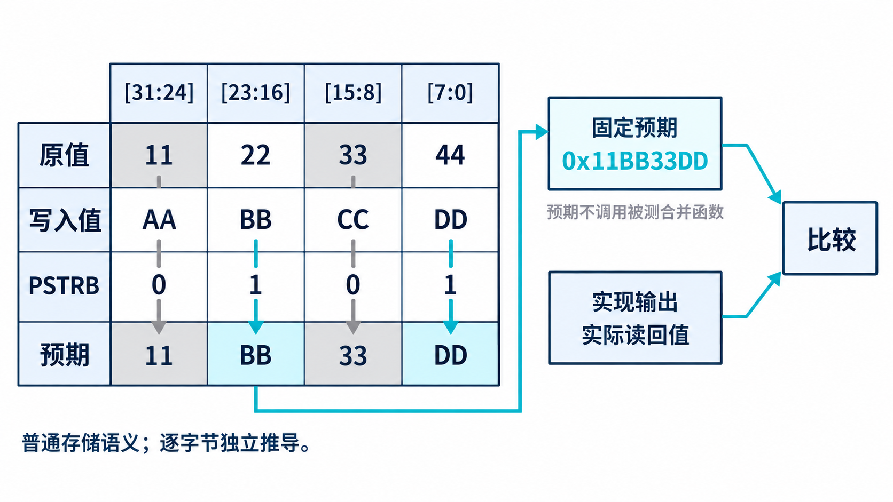
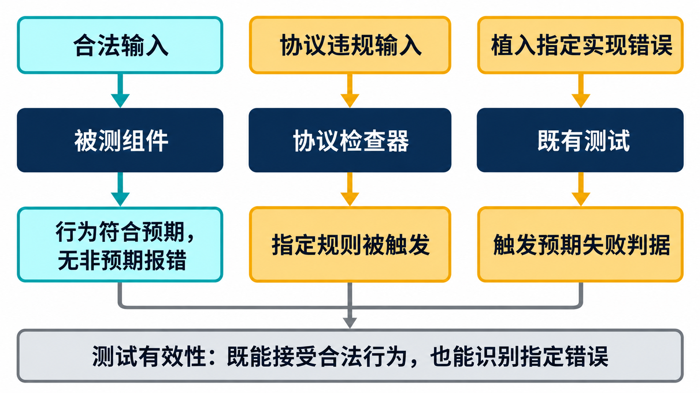
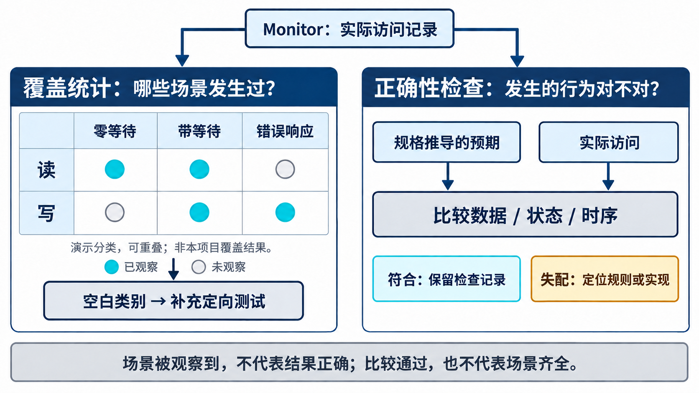
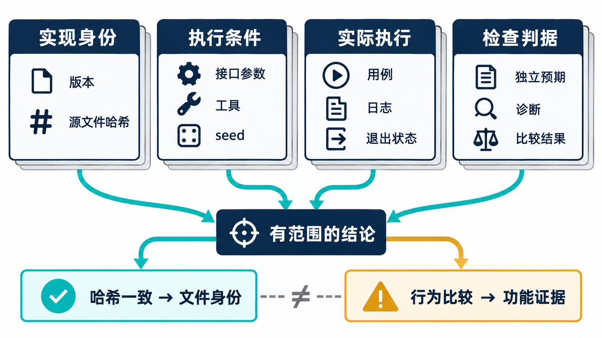

# AI 设计的 VIP，凭什么相信它？

简体中文｜英文版待补｜中文内容稿，待波形补充与发布审阅

[返回专题目录](../README.md)

一个 APB VIP 完成了写入、读回和比较，结果全部一致。这是一个好的开始，却还不能回答最关键的问题：如果写入模型和读回模型对同一条规则理解错了，两者的一致性还能说明访问正确吗？例如它们都把字节位置排反，写后读回可能仍与原输入一致。

这个问题在 AI 辅助研发中尤其值得提前处理。AI 可以快速生成实现，也可以快速生成与实现风格一致的测试。两者的一致性有助于联调，但可信依据还需要来自实现之外的规则和预期。

## 用一个字节例子检查预期从哪里来

回到[第 2 章的部分写](chapter-02.md)。旧值是 `0x11223344`，写入值是 `0xAABBCCDD`，字节有效位 strobe 为 `0101`：四位从高到低分别对应四个字节，1 表示本次更新，0 表示保留原值。如果测试调用与被测存储模型相同的字节合并函数来计算期望值，函数内部的错误就可能同时出现在两边。

更好的起点，是按字节位置独立推导：

| 字节位置 | 原值 | 写入值 | strobe | 预期结果 |
| --- | --- | --- | --- | --- |
| [31:24] | 11 | AA | 0 | 11 |
| [23:16] | 22 | BB | 1 | BB |
| [15:8] | 33 | CC | 0 | 33 |
| [7:0] | 44 | DD | 1 | DD |

因此期望结果固定为 `0x11BB33DD`。这个值不需要调用被测实现中用于合并字节的辅助函数。测试再比较实际结果，才有机会发现实现与规则之间的差异。



*图为方法示意。先按字节有效位得到固定预期，再与实现结果比较；该例假定目标支持普通存储语义的字节写入。*

独立预期也可以是时间关系。例如 SETUP 后必须进入 ACCESS，等待期间请求应保持，连续传输仍需新的 SETUP。预期来自规则，观察来自接口，两者通过断言或明确的逐拍检查连接起来。

“独立”不意味着完全不能使用 AI。AI 可以帮助整理规范和推导向量，但工程师要审查预期的来源，尤其要防止它为了与实现一致而修改答案。

## 合法场景要通过，错误场景要确实被发现

检查器是把实际行为与规则比较、发现不符就报错的代码，VIP 中的检查器本身也需要测试。只运行合法访问，最多说明它在这些场景下没有报错；还需要主动制造违反规则的行为，确认相应检查能够触发。

这种主动制造违规的做法称为故障注入（Fault Injection，简称 FI）。当前测试为延长本应只有一拍的 SETUP、跳过 SETUP、改变应保持稳定的地址、读操作携带非法 strobe 等情况提供了注入入口。注入默认关闭，并由允许协议违规的开关约束，避免普通随机流量无意使用这些控制。

这里有两个判断必须一起做。第一，注入是否真的作用到总线；第二，是否由预期的规则报告。仿真报了任意一个错误，不代表目标检查被验证了。例如本想测试等待期间地址变化，却先因接口类型错误退出，不能把这个失败算作断言命中。

相邻的合法场景也要检查。连续访问可以保持 PSEL，但要重新经过 SETUP；零等待允许第一拍 ACCESS 就完成。这些都不应被误报。检查器的价值同时来自检出违规和接受合法边界。

等待门限的测试则体现了工程约定与协议规则的区分。现有专项用例构造了等待 20 拍、门限为 16 的有限等待场景，检查事务完成后的门限判断。它验证的是这条检查路径，不能据此声称已经验证了无限等待时的终止机制。



*方法示意：合法用例检查正确行为；违规输入与故障注入检查测试能否发现指定错误。*

## 七个注入入口，各自怎样用

故障注入入口分成两层：配置中的 `allow_protocol_violation` 是总开关，事务中的 `inject_*` 决定这一笔做什么。当前七个控制位都不是随机字段，默认值为零；普通随机化不会自行把它们打开。测试如果复用同一个事务对象，也应显式清理旧的注入设置。

| 事务字段 | 当前驱动行为 | 必要条件与观察重点 |
| --- | --- | --- |
| `inject_extended_setup` | 将 SETUP 额外延长一拍 | 检查 SETUP 长度规则 |
| `inject_illegal_penable` | 产生跳过正常 SETUP 的 ACCESS | 检查进入 ACCESS 的阶段关系 |
| `inject_unstable_addr` | 在 ACCESS 等待循环中翻转地址 | 必须实际遇到等待；观察地址保持规则 |
| `inject_illegal_strb` | 在读请求 SETUP 中驱动非零 PSTRB | 已启用 PSTRB；检查读 strobe 规则 |
| `inject_unaligned_addr` | 在地址上加一以构造未对齐输入 | 从对齐地址和适用位宽出发，不能统一要求 ERROR |
| `inject_bad_addrchk` | 翻转地址校验的第一个分组校验位 | APB5 CHECK 已启用，观察对应校验诊断 |
| `inject_x_prot` | 在启用的 PPROT 上驱动 X | PPROT 与有效窗口未知值检查已启用 |

未对齐输入需要单独理解：它进入的是协议所述的不可预测行为范畴，不能把某个目标的返回值或是否报错写成所有 APB 设备都必须满足的预期。特别是 8 位数据配置，加一不构成同样的字对齐问题。注入的输入和判据都要随目标配置确定。

X 表示仿真中的未知逻辑值。虽然这一路检查关注 X/Z 等不确定状态，当前 `inject_x_prot` 实际施加的是 X；地址校验注入也明确针对 PADDRCHK 的一个分组。它们不应被写成“任意信号、任意校验位都能注入”的泛化能力。

### 以等待期间改变地址为例

先给响应端安排固定三拍等待，再允许请求端进行负向激励：

```systemverilog
// 测试环境中的配置片段
master_cfg.allow_protocol_violation = 1;
slave_cfg.slave_response_mode = APB_FIXED_WAIT;
slave_cfg.default_wait_cycles = 3;
```

请求 sequence 的 body 中构造一笔带指定注入的访问。以下片段使用新的事务对象，避免携带上一笔注入状态：

```systemverilog
apb_item it = apb_item::type_id::create("unstable_addr");
start_item(it);
it.direction = APB_WRITE;
it.addr = 'h1008;
it.wdata = 'h12345678;
it.strb = '1;
it.inject_unstable_addr = 1;
finish_item(it);
```

代码展示控制入口，不是完整可运行的 testbench。例子采用已启用 PSTRB 的配置，并假定接口断言开启。真正的判定还要检查：总线是否进入 PREADY 为低的 ACCESS，地址是否在这个窗口变化，以及预期的地址稳定性规则是否报告。如果响应端立即完成，等待循环没有执行，即使注入位为 1，也没有证明目标行为被触发。

与它配对的正向用例应保留相同等待条件，只关闭该注入位，确认合法访问不会被误报。一次测试先针对一种主要注入，能减少先触发其他错误而掩盖目标检查的情况。

### 合法错误响应、协议违规和实现变异各测什么

返回 PSLVERR 可以是一笔完全合法的 APB 响应，用于验证 DUT 如何处理失败访问。协议违规注入则改变总线行为，用于检查断言、诊断或目标对异常输入的处理。若测试要求 DUT 对违规输入表现出某种恢复行为，也需要产品规格依据，不能直接从违规发生推导出来。

源码变异是另一种方法：人为修改实现，再看测试能否识别错误。它不是 `apb_item` 的运行时注入选项，也不能和注入字段数量混为同一个通过指标。本章已有的 FI-001 至 FI-005 是特定测试场景编号，其中第五项针对等待门限；它们并非上述七个字段的一一编号。[第七章](chapter-07.md)进一步区分门限诊断与防止仿真永久挂起。

负向验收应保存注入配置、实际发生的异常、预期规则和对应报告。接口 SVA、Monitor 的未知值检查及事务 checker 可能走不同报告渠道，因此只看一处 UVM 错误计数，不能覆盖所有注入判定。

## 一个退出码为零、却没有通过的例子

Secure Demux 是后文使用的带权限控制的 APB 分发模块。它的一份策略模块单元测试记录保留了下面两个字段；“单元测试”指先把一个较小模块单独拿出来检查：

```json
{
  "exit_code": 0,
  "passed": false
}
```

`exit_code: 0` 表示运行进程正常退出，`passed: false` 则表示测试结果没有通过。这是实际保存的记录。记录说明，仿真零时刻的未知输入触发了依赖组件的立即断言；进程退出码和单元测试的结束标记不足以判断通过。这个例子适合用来检查回归脚本：如果 AI 只收集命令是否执行成功，就会漏掉仿真内部的失败。

因此，运行结果至少需要区分进程结束、场景检查结果和预期违规判定。VIP 的故障注入记录也体现了这一点：报告记载 FI-001 至 FI-005 均被检出，并记录 `FI_ALL_DETECTED` 标记。负向测试本来就要触发错误，汇总脚本应确认对应规则命中；正向测试则要求没有意外错误。把两类日志一律按“错误条数为零”判定，会丢掉负向测试的意义。

这些记录各自回答不同问题：前者检查运行汇总能否识别内部失败，后者检查协议检查器能否发现特定违规。它们都需要与输入和预期关联，单独一个 PASS 字样承载不了这些含义。

## 固定向量、随机测试与配置矩阵各有用途

固定向量适合给基础语义定标：读写方向、字节位置、错误状态、USER 字段对应关系，最好都先有一眼能解释的例子。随机测试在此基础上探索更多顺序和组合，尤其适合寻找交互问题。

随机数种子（seed）决定伪随机数生成的起点；固定种子、配置和相关运行条件，才能尽可能重现同一组刺激。随机测试一旦失败，需要保存这些信息。否则 AI 修改后换一个随机流，就无法判断旧问题是否消失。复现原场景之后，再扩展随机范围，才能同时得到定位效率与探索能力。

配置矩阵处理的是另一类变化。APB3、APB4、APB5 的字段组合不同，8、16、32 位数据宽度也会改变字节处理路径。一个 32 位 APB4 用例通过，不能替代其他组合的检查。USER 请求、数据、响应宽度分别设置，还能帮助暴露那些被“恰好一样宽”掩盖的问题。

这里不必把所有参数排列成无法执行的全组合。更实用的做法是先按实现分支选代表配置，再针对能力交互补测试。AI 可以辅助梳理分支与矩阵，工程师判断哪些组合有意义、哪些属于目标使用范围。

## 覆盖率告诉我们去过哪里



*方法示意：左侧圆点是教学样例，不是工程覆盖结果。一次带等待的错误写可以同时命中“带等待”和“错误响应”；这些类别被观察到后，仍要用右侧的比较判断行为是否正确。图中事务记录用于概括观察来源，逐拍时序规则还需接口侧检查。*

功能覆盖率先把想测试的情况定义为若干类别，称为 bin，再统计实际观察到了哪些。例如“读且发生等待”可以是一类；将读写方向与等待类别组合起来统计，就叫交叉覆盖。断言覆盖（SVA cover）则记录指定时序条件是否实际发生，帮助确认测试确实走到了关注的时序。

它们有助于发现“测试很多，但某个分支从未发生”的情况。不过，覆盖率的分母来自当前覆盖模型。一个模型没有定义的场景，不会因为显示 100% 就自动被验证。

采样定义也会影响数字。事务 monitor 如何计算等待，如何区分阶段类别，都会决定某个样本落入哪个 bin。因此，关键分类要抽取波形与事务记录对照，再解释覆盖结果；覆盖计数不能替代这种核对。

对 AI 来说，覆盖缺口是一种有用反馈：可以据此提出定向 sequence，解释它应当命中哪项条件。补测结束后，还要检查场景确实发生、结果被判断，而非仅让计数器增加。

## 把需求与检查一一对应

固定向量、断言、注入和覆盖最终需要回到具体需求。以[第 3 章的两笔定向响应](chapter-03.md)为例，测试不能只检查“收到了两个返回”，还要逐笔比较数据、错误状态和 USER 字段；零等待变体则要额外核对完成边沿。

对这一项能力，可以保留一条简短记录：需求是每笔请求取得对应响应，实现入口是响应 sequence 与 driver，检查是独立常量比较和时序观察，运行结果绑定本次版本与配置。它把“实现了什么”和“怎样知道它成立”连接起来。

同一份报告里，有的数字是场景数量，有的是比较结果，还有的是检查器触发情况。按需求关联它们，读者才能看出证据各自回答了什么，而不会把所有 PASS 当作等价结论。

## 怎样读这套 VIP 的已有测试记录

“冻结回归”指固定本轮源码、配置与用例后运行，便于把结果对应到一份确定实现。已有一轮记录以 `apb-v100-qualified-20260928` 标识，使用 VCS W-2024.09-SP1、UVM 1.2 和 seed 42。VCS 是执行这些 SystemVerilog 仿真的工具，UVM 是组织验证环境的方法。表中的 UVM_ERROR/FATAL 分别是 UVM 的错误和致命错误报告。记录中的矩阵覆盖 APB3/4/5 与 8/16/32 位数据的九种组合，地址宽度为 32 位。

| 记录项 | 该轮结果 | 应怎样理解 |
| --- | --- | --- |
| 单元检查 | 568/568 | 该轮所列检查通过 |
| 正向日志 | 24 份，UVM_ERROR/FATAL 与 VCS SVA 错误均为 0 | 指定正向测试同时核对 UVM 与原生断言错误 |
| 功能 bin | 157/157 | 按该轮采样汇总口径计数 |
| SVA cover 项 | 54/54 | 按该轮断言覆盖记录汇总 |

这些数字说明已有测试具备一定广度，但需要保留口径：覆盖数据来自该轮采样记录汇总，不能当作工具合并数据库的覆盖率；本次文章整理也没有重新运行这批仿真。表格的作用是展示明确版本和条件下的证据，不把某一轮结果推广成任意配置都已验证。

此外，零 UVM 错误不能代替检查器启用状态与原生断言日志检查。一次可信的运行记录应能说明：运行了哪些测试，启用了什么检查，预期错误怎样判定，结果属于哪份源码。

### 从专项结果，读出组件已经具备的能力

总数可以说明检查规模，具体专项更能回答“我能用它做什么”。同一冻结回归报告还给出了下面几组结果：

| 能力 | 已有专项结果 | 对使用者的意义 |
| --- | --- | --- |
| 协议与物理位宽 | APB3/4/5 × 8/16/32 位数据的参数化接口读写、等待和错误测试通过 | 位宽变化经过实体接口检查 |
| 定向响应 | sequence 指定返回字段，零等待与错误组合通过 | 能构造不同返回值和响应条件 |
| 复位交接 | SETUP 后、等待期及写访问的中止恢复专项通过 | 能检查事务中断与后续访问 |
| 工程依赖 | FuseSoC 独立消费者构建与运行检查通过 | 组件能经依赖入口被另一个工程载入 |

最后一项值得单独说明。FuseSoC 是组织硬件工程文件和依赖的工具；这里的独立消费者声明依赖 APB VIP，导入类型与组件包，实例化接口并创建配置对象。它检查打包、依赖和类型能否被使用，并未发起产品业务流量。真正的 IP 功能接入，还要看[第 5 章的 Secure Demux 接入](chapter-05.md)。

可信依据因而有三个落点：专项测试检查公共组件的行为，独立消费者检查交付入口，IP 用例检查组件在产品环境中的配合。三者各回答一部分问题，既不能只靠代码存在，也不能只看一个汇总通过数。



*证据组织示意：通过结论必须能够对应同一份实现与执行条件；文件完整性和功能正确性承担不同检查职责。*

## 让 AI 提交依据，而不只是结论

在这种流程里，AI 的输出可以直接要求包含三件事：本次修改影响什么行为，用什么独立预期检查，实际运行结果是什么。未运行与已通过要分开，局部测试与完整回归也要分开。

工程师据此评审的重点会变得清楚：预期是否来自正确规则，测试能否暴露旧问题，合法边界是否仍然成立，证据是否对应本次实现。代码审查与运行反馈各补充一部分判断。

可信度就是这样逐步积累的。协议规则约束实现，独立预期约束测试，故障注入检查检错能力，配置矩阵探索变化，版本记录把这些结果绑在一起。接下来把 VIP 放进真实 IP 环境，还会获得另一种重要证据：它能否在自己的自测工程之外被正确使用。

[上一章](chapter-03.md)｜[专题目录](../README.md)｜[下一章](chapter-05.md)
