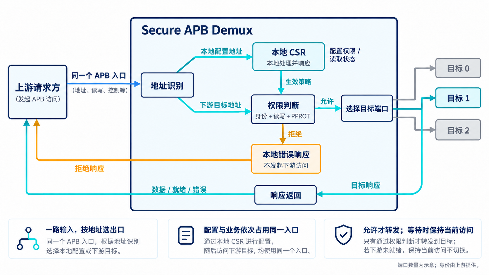
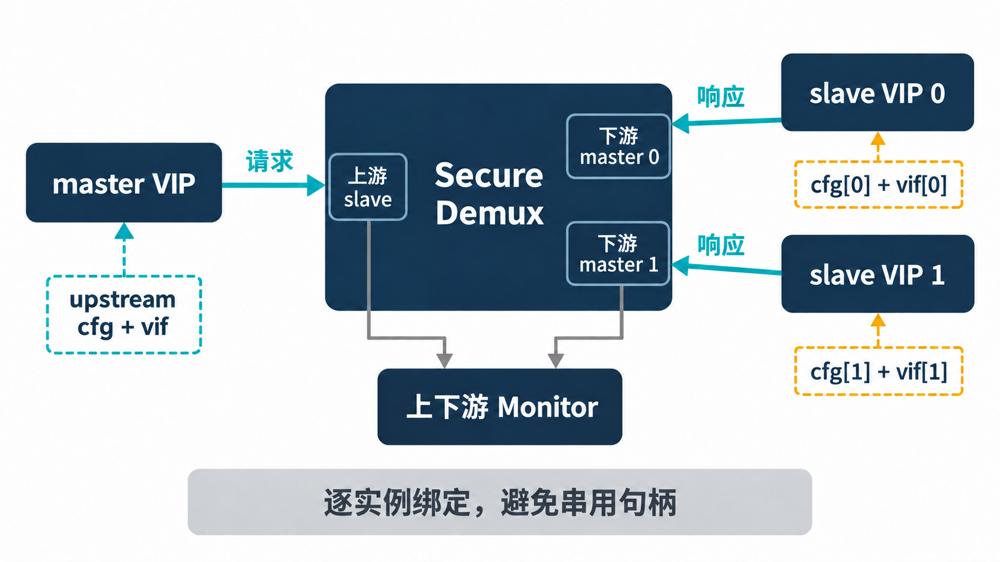
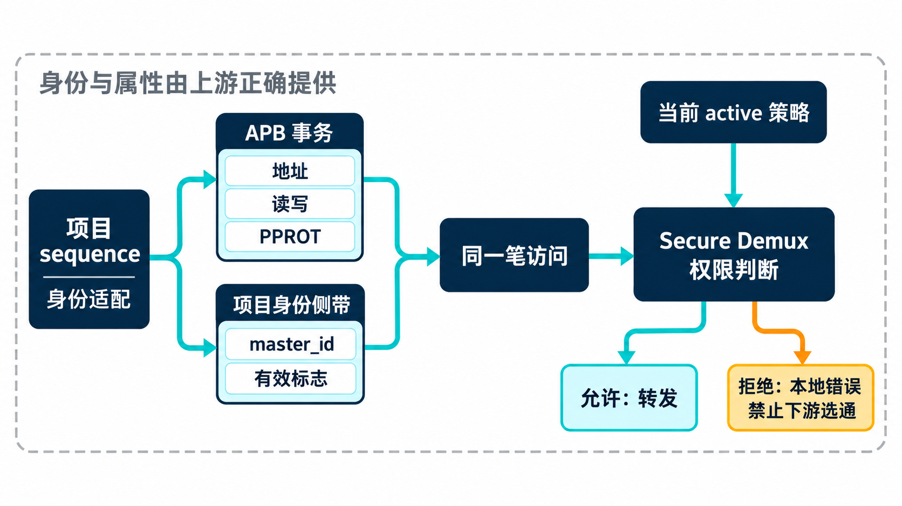
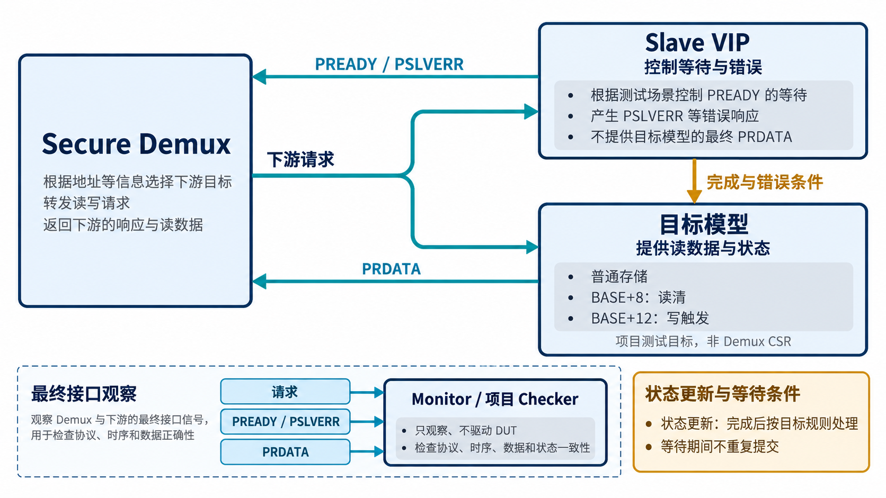

# AI 设计的 VIP 实战：验证 APB Secure Demux

简体中文｜英文版待补｜中文内容稿，待波形补充与发布审阅

[返回专题目录](../README.md)

一个芯片里通常不只有一种外设。不同的控制寄存器占据不同地址，发起读写的一方需要通过总线找到对应模块。如果某些寄存器还能改变关键配置，就又多了一个问题：地址找对了，这个请求者是否有权读写？

本章的 APB Secure Demux 把地址分发和访问控制放在同一个模块里。先看清它在系统里做什么，再讨论 VIP 怎样接入，后面的 master、slave、权限和寄存器配置就都有了具体对象。

## 一笔访问为什么需要经过 Secure Demux

Demux 是 demultiplexer 的简称。在这里，它接收一路 APB 请求，根据地址选择多个输出端口中的一个。每个端口可以连接一个外设或下游模块，各自负责一段地址范围；这段范围就是后文所说的“地址窗口”。选择端口的过程也叫路由。

“上游”指请求进入的一侧，“下游”指请求转发出去、连接目标模块的一侧。这两个词描述相对位置。当前设计只有一个上游 APB 接口，一次处理一笔访问；即使系统中有多个请求来源，它们也需要先由上游系统汇集，再依次到达这里。

Secure 表示它在转发前增加了权限判断。除了地址，模块还会查看请求者身份、读写方向和 PPROT 访问属性。身份由系统附带的编号及有效标志提供，相当于告诉模块“这笔访问代表谁”；PPROT 则描述特权、安全属性和指令/数据等访问类别。两者提供判断输入，当前生效的权限配置决定能否放行。这里的安全控制是访问授权，身份与属性需要由上游正确提供。

可以用一个简化例子理解。假定某个目标端口已启用，其他准入条件都满足，当前策略允许身份 A 读取它，却不允许身份 A 写入：同一个地址的读请求会被转发，写请求则在 Demux 内被拒绝。这是按权限规则构造的解释例子，不是在引入另一套真实外设。

| 访问结果 | Demux 做什么 | 验证时要看到什么 |
| --- | --- | --- |
| 允许读取 | 选中目标端口，转发请求，返回目标响应 | 目标选对，数据和完成时机对应正确 |
| 拒绝写入 | 本地返回错误，不向下游发起该访问 | 上游收到错误，下游没有被选通 |
| 目标暂未就绪 | 保持已放行的访问，等待目标完成 | 请求保持，目标状态不因等待重复更新 |

拒绝时只看上游报错还不够。假如请求已经到达外设并触发了动作，之后再报错，并不能说明访问被挡住。因此，这个设计在下游访问开始前作出准入判断，验证也必须检查下游有没有出现不该发生的选通。

## 权限怎么配，外设又怎么访问

Secure Demux 自己也有控制与状态寄存器，简称 CSR（Control and Status Registers）。有权限的管理访问通过这些寄存器设置端口策略、提交更新，并读取状态或事件。它们属于 Demux；下游外设则有自己的寄存器和行为。

两类访问共用同一个上游 APB 入口。地址落入 Demux 的本地 CSR 窗口，就由它自己处理；地址落入下游目标窗口，则经过权限判断后决定是否转发。后文将前者称为“配置访问”，将面向下游目标的读写称为“业务访问”。配置入口不需要另一根总线，两类请求按顺序执行。



*功能路径示意：本笔允许访问选中目标 1，灰色目标未被选中；被拒绝的访问在模块内响应，不先送到外设。请求与响应线表示不同方向的信息流，并非逐根物理连线。端口数量仅为示意，本地 CSR 访问也须遵守管理权限。*

策略更新还分两步：先把新配置写入 shadow，也就是待提交的副本；再提交指定端口，让它成为当前用于判权的 active 配置。这样，测试可以分别检查配置写得对不对，以及新策略是否在规定时点生效。具体调用稍后展开。

这个案例适合检验 VIP 的复用，因为它同时需要发起请求和接收请求。上游 VIP 要完成配置与业务访问，下游 VIP 要提供等待和错误；项目模型则负责判断权限、路由、统计与外设副作用。协议组件与产品规则在一笔访问中协作，分工也很容易观察。

## 先把接口角色放对位置

这里用 UVM（通用验证方法学）组织测试环境：env 是容纳与连接组件的环境，agent 是负责一个接口角色的组件组合，monitor 负责观察实际信号。DUT 则指被测设计，本章就是 Secure Demux。

从 DUT 的角度看，上游是接收请求的 APB slave 接口，下游是发出请求的 master 接口。因此，验证环境在上游使用 master agent 发起访问，在每个下游端口使用 slave agent 提供响应。Master 表示发起请求的一方，slave 表示接收请求并返回响应的一方。VIP 的角色取决于它连接的 DUT 端口，不能把两边的 master、slave 名称混在一起。

当前环境创建了上游 master agent、每端口的 slave agent，以及上下游 monitor。项目还创建独立参考模型、逐周期 checker、功能覆盖组件和 virtual sequencer。Virtual sequencer 用来协调多个序列入口，使配置、身份与下游响应设置能够按同一个测试场景组织。

接口参数、地址窗口和端口数量来自项目配置。AI 接入时应先列清这张连接表，再填写各实例的配置与 virtual interface，保证一个端口的句柄不会传到另一个端口。



*接入示意：每个端口绑定自己的配置和 virtual interface；VIP 的角色应与相连 DUT 端口互补。*

## 再看项目怎样调用已有 VIP

复用可以沿源码追到具体组件。Secure Demux 的工程依赖声明选择 APB VIP 1.0.0，产品 env 中有下面这组实际类型声明：

```systemverilog
apb_master_agent upstream;
apb_slave_agent downstream[ASD_NP];
apb_monitor upstream_monitor, downstream_monitor[ASD_NP];
```

`ASD_NP` 表示当前配置的下游端口数。构建阶段创建上游 master 和逐端口 slave，连接阶段把它们的 sequencer 交给产品 virtual sequencer。`apb_item` 是保存一次 APB 请求及返回结果的事务对象。项目传输类继承 `uvm_sequence#(apb_item)`，填入地址、方向、数据与属性，再通过 `finish_item()` 把请求交给已有 driver。产品测试由此真正进入 VIP 的驱动路径。

构建接入也有配套处理：该批项目脚本在工作目录生成依赖元数据适配，将 VIP 的顶层编译单元与 include 文件区分开，并对外部源文件记录和复核哈希。这个案例复用了 VIP 源码，同时保留了项目需要的构建适配；不能把它描述成只加一行依赖就能在任意环境运行。

源码给出了“接了什么、怎样调用”的证据，[第 6 章的典型配置运行报告](chapter-06.md)则给出“实际跑过什么”的结果。

## 同一条 APB 总线先配置，再访问

项目 sequence 可以通过同一套传输入口访问 CSR 和下游目标。现有 `csr_write()` 根据寄存器种类与实例参数取得地址，再通过上游 APB 发出写事务；`allow_port()` 则依次写入 shadow 配置、shadow 权限和提交掩码。

现有辅助任务 `allow_port` 的核心顺序可以直接读成三步，下面保留原有调用形式：

```systemverilog
csr_write(K_CFG_SHADOW, 32'(config_value), port);
csr_write(K_PERM_SHADOW, 32'(permission), port, master);
csr_write(K_COMMIT_MASK, 32'b1 << port);
```

`csr_write` 根据寄存器种类、端口和身份查找地址，再通过上游 master 发起写事务。第三步的掩码只选择需要提交的端口。AI 接入新测试时可以复用这个入口，把工作集中在要设置什么策略、提交后应当允许什么访问，而不必重新散写一组寄存器地址。

前两次调用写入待提交的 shadow，第三次调用才使选定端口的新策略生效。测试因而可以在提交前后分别发起业务访问，检查 active 策略是否按预期改变。

例如，测试准备允许某个身份访问端口 P，就先完成对应配置，再提交，并用业务访问检查生效结果。业务读写与寄存器读写走的是同一个 master driver，但其功能预期不同：前者检查目标端口的传递，后者检查寄存器与策略状态。

RAL（Register Abstraction Layer，寄存器抽象层）可以让测试用寄存器对象表达读写，由适配器转成总线事务；这个案例的上述配置路径直接使用项目 sequence 和地址映射表。讲清实际入口，才能让 AI 使用已有代码，而不是仅因为工程中存在寄存器模型文件，就假设所有访问已经通过 RAL predictor 连接起来。

## 请求者身份怎样与事务保持一致

权限判断除了 APB 地址、方向和 PPROT 属性，还需要知道请求来自哪个身份。当前项目通过独立的 `master_id` 与有效标志传递这些信息；它们是产品侧带信号，不是 APB 标准自带的身份字段。

项目 sequence 同时管理 APB 请求和身份侧带：在交出事务前设置身份，在访问期间保持一致。连续访问也需要让下一笔身份在上一笔采样结束后更新。

这项工作适合留在项目适配层。通用 APB VIP 继续执行协议时序，项目 sequence 负责把产品身份和协议事务协调起来。AI 修改这里时，需要同时检查请求交接和侧带更新时点，不能只看 `apb_item` 中的地址数据。



*概念示意：master_id 属于项目侧带，不能当成 APB 标准字段。身份适配应保证它与当前请求对应。*

## 下游响应分成时序和产品行为



*概念示意：同一请求进入响应时序组件和目标模型，最终的就绪、错误与读数据共同返回 DUT；观察路径检查实际接口。图中的读清和写触发属于项目测试目标。*

下游 slave VIP 提供等待与错误响应，目标模型提供实际读数据和完成时的状态更新。当前 harness，也就是连接 DUT、接口和测试模型的顶层封装，分别组织 responder 与 observed 接口：驱动响应的接口连接 VIP，观察接口反映最终送回 DUT 的数据、就绪和错误信号。

这样分工有一个直接理由。通用 VIP 的存储行为适合支持协议测试，访问引起的产品状态变化，也就是这里所说的“副作用”，必须遵守项目定义。例如读取清除标志、写入启动操作，都需要自己的行为规则。一次写操作什么时候改变目标状态，应由目标模型按完成条件处理，不能只因为请求已经进入 SETUP，就把它计为一次产品写入。

因此，下游“多等几拍”“返回错误”和“实际修改了什么状态”可以分别观察。测试能够检查等待期间请求是否保持、完成后结果是否返回正确，以及被拦截的请求是否根本没有到达目标。

目标模型还安排了两个容易观察副作用的地址：目标窗口的 `BASE+8` 是读清位置，初始值为 `0xCAFE1234`；`BASE+12` 用来统计写触发。它们是验证环境中下游目标的行为，不能当作 Secure Demux 自身的 CSR 地址。

读清位置让检查具体起来：一次成功读取返回清除前的值，完成后状态清零，下一次读取才得到零。写触发则适合观察长等待：无论等待多少拍，一次符合条件的成功写只增加一次计数。当前目标模型在 `PSEL && PENABLE && PREADY` 成立后处理状态，并用错误状态约束副作用；这是该目标模型的行为约定，不是 APB 对所有错误响应都承诺回滚。

响应数据的正确性也要分层判断。产品 checker 可以比较下游返回值与上游实际值，验证传递关系；目标数据本身是否正确，还需要上述固定初值、状态规则或独立数据预期。仅证明两端相等，无法发现两端共同依赖的目标模型错误。

## 独立参考模型与逐周期检查怎样协作

当前产品参考模型根据输入契约维护配置、权限、事件和统计状态，并判断访问应当落入 CSR、某个目标端口，还是被拒绝。模型使用寄存器结构常量确定地址与字段，行为预期由规则计算，不通过读取 DUT 内部状态来复制答案。

项目 checker 从 control interface 逐周期观察上下游信号与身份，在 SETUP 建立预期，并继续检查选通、阶段、请求保持、响应及隔离行为。这个连接方式与“monitor 发布完成事务，再交给 scoreboard 比较”的形式不同：它需要覆盖尚未完成、甚至不应进入下游的访问。

上下游 monitor 仍然负责协议事务记录；逐周期 checker 提供产品层判断。两条观察路径各自有用途，不能因为 monitor 没有发布一次完成事务，就断言下游从未出现过错误选通。

这套环境还主动约束了检查不能被绕过。构建时如果关闭参考模型或产品 checker，会直接报错；测试结束时，checker 要求不存在未完成访问，并确认至少检查过一次完成事务。对应的两项检查是：

```systemverilog
verify(!pending, "no missing completion at end of test");
verify(completed > 0, "nonempty checked transaction set");
```

它们防止测试在没有完成任何访问时安静结束，也让卡住的事务留下明确失败。非空检查本身不代表充分覆盖，但它把“环境启动了”和“确实发生并检查了访问”区分开来。

## 交给 AI 的第一轮接入任务

第一轮可以围绕一条小而完整的路径展开：

> 按实际接口实例化上游 master 和下游 slave，接入项目身份侧带、参考模型与逐周期 checker。通过上游配置一个端口的权限，完成一次允许访问，再执行一次拒绝访问。分别检查上游响应、下游选通与目标状态，保留版本、配置和实际比较结果。

这是一份教学任务约定，不代表新增测试已经运行。工程师先确认配置权限、身份与目标地址的预期，AI 再完成连接、sequence 和定向场景。运行后既要确认访问确实发生，也要确认 checker 进行了有效比较。

当失配出现时，可以沿同一条路径定位：配置是否完成并生效，身份是否正确，目标是否选中，下游是否响应，实际结果是否符合独立模型。AI 据此分析 RTL、项目连接或测试预期，修改后再运行原始场景和相关回归。

下一章继续留在这个环境，把配置、放行、拒绝、等待和复位串成更完整的验证场景。

[上一章](chapter-04.md)｜[专题目录](../README.md)｜[下一章](chapter-06.md)
