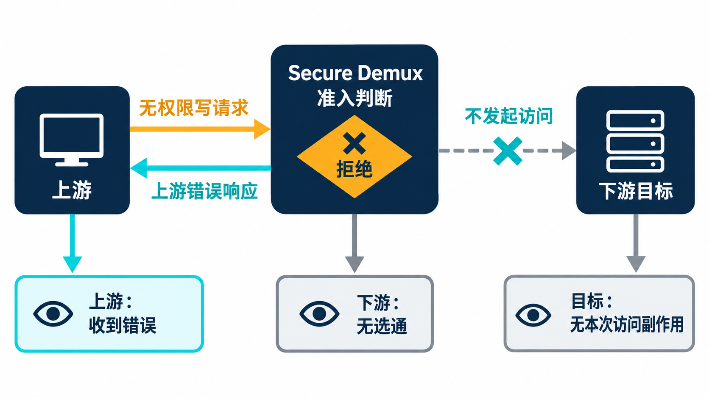
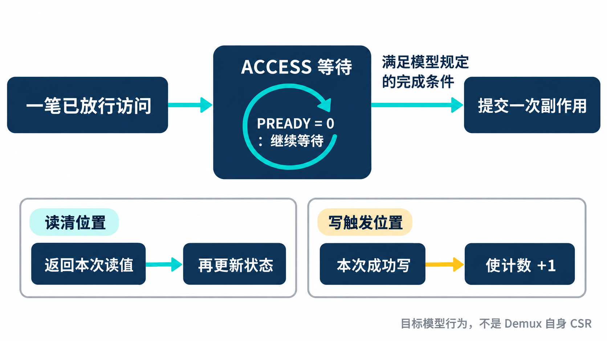
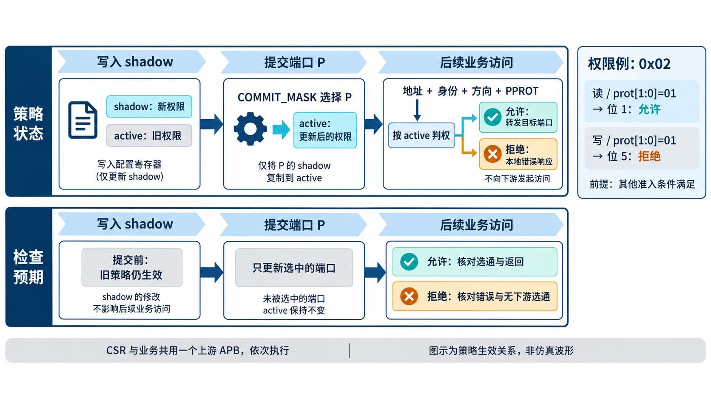

# AI 辅助 IP 验证：用 Secure Demux 检验 VIP

简体中文｜英文版待补｜中文内容稿，待波形补充与发布审阅

[返回专题目录](../README.md)

Secure Demux 是一个带权限检查的 APB 分发模块：请求从一个上游入口进入，按地址和当前策略决定是否转发到某个下游目标；模块自身的配置寄存器也通过同一入口访问。[第 5 章](chapter-05.md)介绍了它的用途和验证环境。

上游能够发请求，下游能够返回响应，说明环境具备了运行基础。接下来还要检查配置是否生效、请求者是否具有相应权限，以及一笔访问有没有被送到正确端口。

现有用例分别覆盖 APB 传输、权限、配置更新和复位。这一章按一笔访问的理解顺序，把这些测试的意图串起来：先让策略生效，再判断请求能否进入下游，最后检查返回与副作用。文中的源码设置和历史运行结果分别说明，不把多个用例拼成一条实际运行过的连续脚本。

## 从一个实际冒烟用例开始

冒烟测试用于先确认关键路径能否工作。现有 `tc_apb_secure_demux_apb_smoke` 通过几次项目传输调用开始测试：

```systemverilog
allow_port(0, 0);
transfer(C_PORT_BASE[0], 1, 32'h12345678);
transfer(C_PORT_BASE[0]);
p_sequencer.cfg.downstream[0].slave_response_mode = APB_FIXED_WAIT;
p_sequencer.cfg.downstream[0].default_wait_cycles = 3;
transfer(C_PORT_BASE[0]+4, 1, 32'hbeef, 0, 1, 3'b001, 4'b0011);
transfer(C_PORT_BASE[0]+4);
```

阅读这段代码时，先看每次调用要表达的访问。

`C_PORT_BASE[0]` 是端口 0 的地址窗口起点，`+4` 指下一个相隔 4 字节的位置。`transfer` 的参数依次为地址、是否写、数据、身份、身份是否有效、访问属性和字节有效位；只传地址时采用默认读操作。`cfg.downstream[0]` 则是端口 0 的 slave VIP 配置。

代码按原有调用顺序节选。第一步配置并提交端口 0 对身份 0 的权限，随后写入、读回；接着将下游 slave VIP 改为固定三拍等待，在另一个地址执行低两个字节有效的写，再读取。其中写操作的 strobe 为 `0011`，与写入值 `0x0000BEEF` 的低两字节对应。

这几行把复用落到了实际动作上：产品 sequence 决定地址、数据和权限，已有 master 执行 APB 请求，已有 slave 制造响应条件。测试后续还读取成功次数、累计等待和最大等待寄存器，并插入必定返回错误的下游响应。由此，VIP 提供的等待与错误能力进入了产品统计和事件检查。

沿这条路径展开，首先要检查配置是否真正生效。下文将选定端口记为 P、获准身份记为 A，便于说明相同方法怎样用于其他端口与身份。

配置写成功与业务访问被允许，是两个不同的检查点。前者需要检查 CSR 操作的响应及模型状态更新，后者需要根据 active 策略重新判断。只读回一个 shadow 寄存器，不能代替策略生效的检查。

随后以身份 A 发起业务写，再读回。普通目标模型下可以使用一组明确的地址和数据建立独立预期；如果测试字节写入，还应按[第 4 章的固定向量方法](chapter-04.md)逐字节推导结果。

| 检查位置 | 关注的事实 |
| --- | --- |
| 上游 APB | 请求与身份一致，完成时取得正确响应 |
| 目标端口 | 只有预期端口收到访问，地址、数据和属性正确 |
| 其他端口 | 不出现不应发生的选通；启用隔离时符合隔离规则 |
| 目标模型 | 按完成条件更新状态，读回符合独立预期 |

这里每一项都回答不同问题。一次完全合法的 APB 访问也可能被路由到错误端口，因而仍需要产品模型给出目标选择的预期。

## 再改变身份，看拒绝是否发生在正确位置

保持地址和操作不变，换成没有相应权限的身份 B。此时测试既要检查上游收到规定的错误响应，也要检查下游没有发出这次访问。

“没有完成”与“没有发生过”不能互相替代。假如下游曾错误出现 SETUP，随后又取消请求，完成事务计数可能仍为零。逐周期 checker 因此直接检查选通和阶段，覆盖拒绝发生的位置。

现有 checker 在 SETUP 时调用参考模型形成准入判断，再比较各下游端口的选择与身份有效信号。它检查的不只是读写数据，也包括不该出现的下游活动。

这一对允许与拒绝场景适合放在一起：同一地址、同一操作，只改变明确的权限条件，让失败原因容易解释。错误响应本身仍是协议允许的结果，产品规则决定何时必须返回它。

权限用例把这个思路进一步展开成八类访问。这里用八个二进制位分别表示八类访问是否允许。要查哪一位，由 `{write, prot[1:0]}` 决定：大括号表示拼接，读写位放在高位，两个属性位放在低位，合起来得到 0～7 的位编号。前四位对应四类读，后四位对应四类写。用例每次只置一位、提交，然后发出对应访问，再检查其他方向或属性的访问。

例如权限为 `0x02` 时，索引 1 被允许；同样的 `prot[1:0]=01` 如果换成写，索引就变成 5，不能沿用读权限。这是按现有位定义推导的解释例子，仍以端口启用、身份有效和其他准入条件满足为前提。PPROT[2] 的指令属性还有自己的判断，不能把完整权限策略缩成这一个八位查表。



*场景示意：收到错误响应只是检查的一部分，还要确认请求未到达下游，目标没有因此产生副作用。*

## 用下游等待和错误检验返回路径

接下来保持身份 A 的访问合法，让选中的 slave VIP 延迟响应。上游访问应按产品定义继续等待，当前地址、数据与身份保持，其他端口不应替代选中端口作出响应。

实际 APB 用例给响应端安排了四个等待设置：

```systemverilog
int waits_set[4] = '{0, 1, 17, 257};
```

零等待检查最早完成边沿；一拍等待检查刚进入延长阶段的交接；17 和 257 则把同一条访问保持得更久。它们是源码中的配置值，实际总线等待仍由 monitor 或波形确认。长等待尤其容易暴露请求被提前覆盖、计数宽度不足，以及把“正在访问”错误当作“已经完成”的问题；这些是选择该类测试的理由，不能据此推断历史上都发生过相应缺陷。

用例还把目标写、本地 IP 标识寄存器读取、目标读以及身份无效的访问安排在同一批流量里，让本地处理与转发路径交替出现。随后使用固定等待和必定返回错误的响应策略检查错误传递。这样的组合比连续重复一个地址更有解释力：每次切换都在检查前一笔事务的路由、身份与响应状态有没有残留。

这个场景同时使用了 master 和 slave 能力：master 维持请求，slave 控制等待，项目 checker 比较两侧关系。只检查其中一个端口的 APB 时序，无法判断响应是否返回了正确的上游访问。

再让合法访问的下游返回错误。这里要区分两个错误来源：权限拒绝在请求转发前发生；下游错误发生在已允许、已转发的访问上。二者都可能表现为上游 PSLVERR，但下游活动和项目事件含义不同。

现有参考模型区分准入与目标响应，并维护相应事件、计数及等待相关状态。测试可以据此检查错误来源和记录规则，不能仅凭上游出现 PSLVERR 就把两种场景视为同一结果。



*行为示意：等待延长一次访问，不能把读清或写触发重复执行。副作用按目标模型规定的完成条件提交。*

## 检查配置提交前后的策略变化



*概念示意：shadow 写入后、提交之前仍使用旧 active 策略；成功提交所选端口后，后续访问才使用更新的策略。右侧权限例假定其他准入条件满足。*

Shadow 与 active 的区分，使策略更新成为一个有时间顺序的问题。测试可以选择一项会改变访问结果的权限：修改 shadow 后、提交前检查旧 active 策略；成功提交后，再检查新策略。

这样可以发现“写入值正确，但生效时机错误”的行为。参考模型需要独立维护两份状态和提交规则，不能从 DUT 当前权限寄存器直接读取预期。

该接口在一次 APB 访问完成后才能发起下一笔；同一上游上的 CSR 写入不会与另一笔业务访问同时占用总线。因此，这里的边界是相邻访问之间的配置生效顺序，不能编造同一接口上两笔传输并行提交的场景。

按端口提交时，还应检查没有被提交的端口是否维持原有 active 策略。具体锁定、授权和非法配置的处理，继续依据产品规格选择场景，不把所有控制行为都展开成一份寄存器目录。

## 复位需要恢复总线与验证状态

在带等待的访问中施加复位，可以同时检验总线中止与环境恢复。Driver 需要结束当前事务；项目参考模型恢复规定状态；checker 清理未完成访问；之后还应能重新配置并执行新的业务访问。

当前环境在驱动处理复位后，协调停止相关 sequencer 上的序列，清理等待中的交接状态。这个安排说明复位属于多个组件共同参与的过程，只将 DUT 输出清零还不够。

复位前未完成的访问不能被计为成功操作。恢复后的访问则应重新依据复位配置判断权限，必要时先完成配置再测试放行。两段结果共同说明环境中止与恢复是否正确。

复位用例还区分了两种作用范围。仅复位下游外设时，Demux 的策略与锁应保留；Demux 自身复位时，才按其复位定义恢复。把所有模型统一清空虽然方便，却会让验证环境掩盖这类保留要求。当前用例分别安排本地与转发访问的 SETUP、ACCESS 和带等待条件，检查中止位置以及恢复状态。

## 运行记录怎样支持这些场景

2026 年 9 月 14 日的 Secure Demux 报告，在 `CFG_TYPICAL_DIRECT` 配置、VCS W-2024.09-SP1 和 seed 42 条件下，记录了 **17/17 个 UVM 用例通过、10/10 个模块单元测试通过**。这给前面的接入与场景提供了实际运行依据；它代表该批次的典型直接模式，不能扩展成全参数或全部验证计划已经覆盖。

从当前回归清单可以看清 17 个 UVM 场景的组织：4 个冒烟/复位场景、12 个常规场景和 1 个随机压力场景。常规场景包括权限、APB 传输、CSR、译码、错误、日志和配置更新等，和本章讨论的调用路径可以逐项对照。这里按 UVM 场景计数，不把交付或系统证据等静态检查混入 17 个用例。

为了让读者看清运行怎样被判定，现有执行脚本采用的核心逻辑是：

```python
ok = code == 0 and parsed['result'] == 'PASSED' and not raw_failures
```

这段来自脚本而非某次控制台输出。它同时检查进程退出、解析后的 UVM 结果，以及 UVM 严重性计数之外的仿真器原生错误。脚本还记录输入清单、仿真二进制和日志的哈希，并在运行前后核对源码与依赖是否改变。这样保存下来的结果，才能与实际输入版本建立对应关系。

事件模块负责记录拒绝、下游错误等情况，供后续读取和诊断；它的队列用来暂存事件，深度就是最多可暂存的条数。这个模块另有 9 月 11 日运行时保存的标准输出，可以看到四个队列深度的结果：

```text
UT_APB_SECURE_DEMUX_EVENTS: PASS (errors=0 depth=0 checks=13)
UT_APB_SECURE_DEMUX_EVENTS: PASS (errors=0 depth=1 checks=20)
UT_APB_SECURE_DEMUX_EVENTS: PASS (errors=0 depth=3 checks=22)
UT_APB_SECURE_DEMUX_EVENTS: PASS (errors=0 depth=32 checks=51)
```

这里的 `checks` 是该次单元测试执行的检查次数，既不是覆盖率，也不是 UVM 用例数。深度 0、1、3、32 分别把关闭队列、最小队列、非二次幂深度和较深队列放进检查范围。没有队列并不等于没有事件状态：该模块仍有首条、末条等记录机制，需要按对应配置判断。

为什么要在总线测试之外保留这组单元证据？上游看到一次权限拒绝，只证明接口返回了相应结果；事件模块还要正确处理多个候选事件、队列满、丢失统计和读取副作用。单元测试让这些边界更容易被直接构造，UVM 环境再检查它们怎样与实际访问连接起来。两层结果相互补充。

本章使用的是保存下来的历史报告和输出；本次写作没有重跑仿真。[第 4 章的 VIP 冻结回归](chapter-04.md)日期更晚，也不能据此推断 Secure Demux 已用那份新快照重新回归。

## 把场景变成 AI 能处理的反馈

用例失败时，反馈应指出哪一层事实首先与预期不同。例如“配置已完成，但目标端口未选中”，与“端口已选中，但返回数据不符”，会把定位引向不同路径。

可以让 AI 先整理上游事务、身份、active 策略、下游活动和 checker 的首个有效失配，再提出解释与区分原因的测试。工程师审查预期来源，避免为消除报错而改变原本正确的权限规则。

对已经确认的 RTL 修改，先重跑原始失败场景，再检查相邻合法和非法条件。对通用 VIP 的新需求或修正，则需要把依赖缩到最小，并返回公共组件的专项回归。这正是[第 7 章要讨论的反馈流程](chapter-07.md)。

[上一章](chapter-05.md)｜[专题目录](../README.md)｜[下一章](chapter-07.md)
