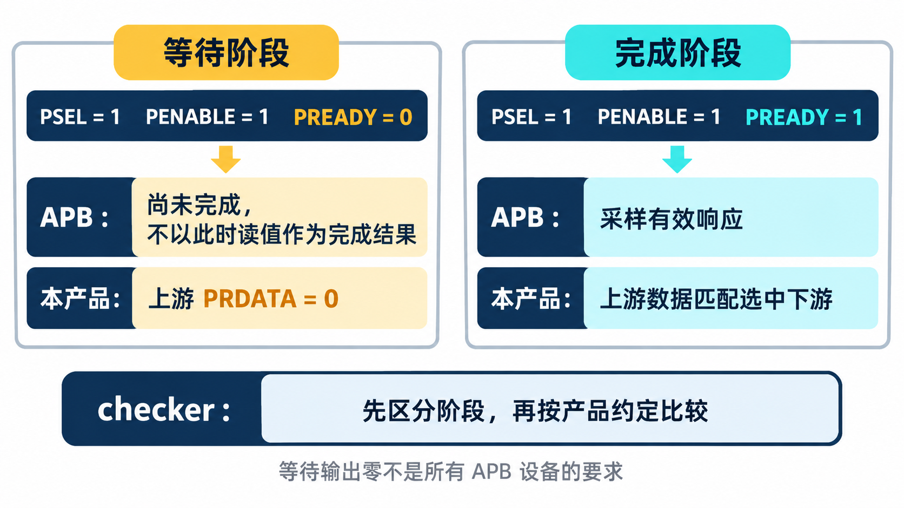
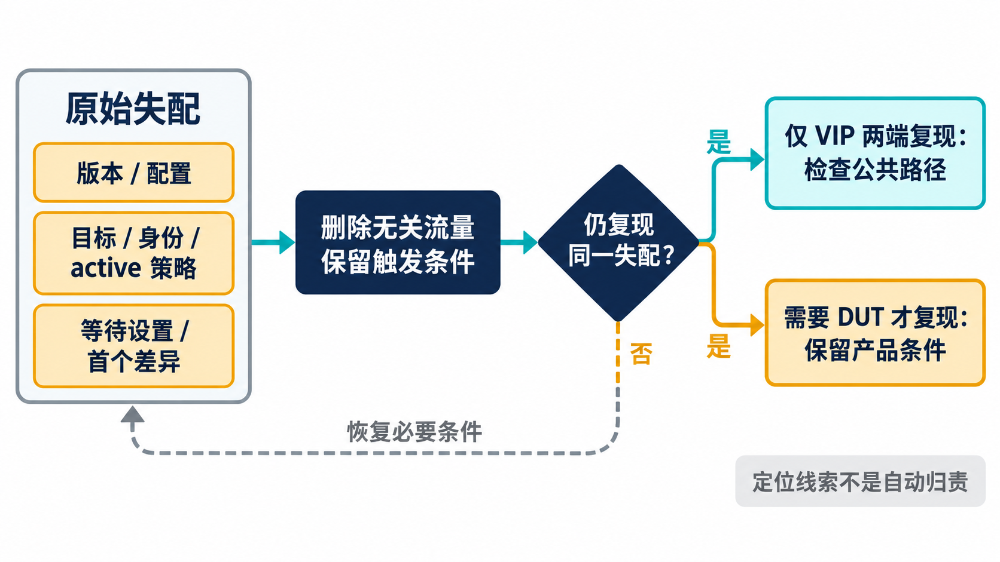
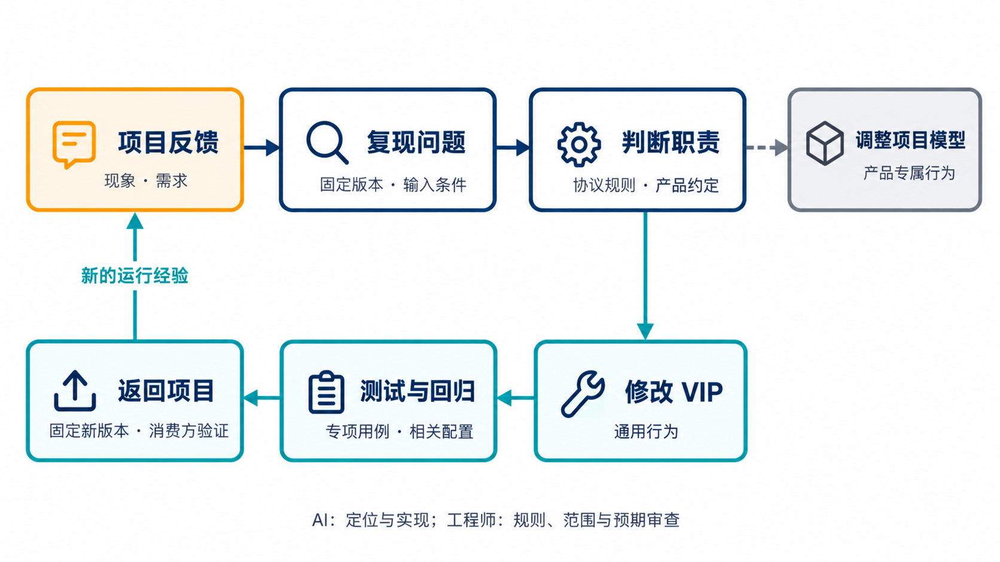

# AI 辅助验证调试：报错后究竟该改哪里？

简体中文｜英文版待补｜中文内容稿，待波形补充与发布审阅

[返回专题目录](../README.md)

Secure Demux 会把允许的 APB 请求转发给下游目标，再把目标的响应返回上游。下游若尚未就绪，这笔访问就处于等待阶段。验证环境中的 checker 是检查器，负责将实际信号与预期比较；两者不同，便产生“失配”报告。

它的 2026 年 9 月 14 日报告留下了一条记录：“修正 checker 的等待周期数据判断。”它提醒我们，仿真中的失配既可能来自设计，也可能来自检查预期；报错的位置并不直接决定修改应落在哪里。

这条记录没有保存完整的 AI 对话或原始失败波形，不能据此还原谁先提出了哪个判断。不过，结合现有 RTL 和 checker，可以讲清等待阶段应怎样检查，以及后续怎样把类似问题交给 AI 分析。

## 先分清协议要求与产品输出约定

APB 读数据 PRDATA 的有效采样点是传输完成时，也就是时钟边沿上选通 PSEL、访问使能 PENABLE 和就绪 PREADY 同时为高。仅因为下游在等待阶段已经给出某个 PRDATA 值，就要求上游逐拍显示同一个值，并不是通用协议规则。

当前 Secure Demux 的返回逻辑先将上游数据置零，选中下游就绪时才送出对应数据。产品 checker 也明确区分等待与完成：

```systemverilog
data = ready ? vif.cb.m_rdata[selected] : 32'b0;
```

代码中的 `ready` 表示此时是否就绪，`selected` 是选中端口的编号，`m_rdata[selected]` 是从接口采样到的该端口读数据。`条件 ? 值一 : 值二` 表示条件成立选值一，否则选值二。

这行代码摘自转发响应检查分支：等待时的预期为零，完成时才比较选中下游的数据。它能同时检查两件事——产品在等待阶段是否保持预定输出，以及完成时是否返回了正确端口的数据。

由此可以给 AI 一个有边界的任务：分别列出 APB 的采样要求、该产品的输出约定和 checker 当前采用的预期，再找三者哪里不一致。不能为了消除失配就要求所有 APB 设备等待时输出零，也不能用“协议此时不采样数据”跳过产品已经定义的输出检查。

这次记录的意义在于校准检查位置与预期。它可以进入后续研发方法，但并不能证明公共 VIP 本身需要修改。



*判断示意：APB 规定完成时采样读数据；本案例另有等待时上游输出零的产品约定，checker 应同时尊重两者。*

## 从事务记录中分清“要求了什么”和“发生了什么”

APB 事务同时包含激励意图与观察结果，调试时不能把它们当成同一份证据。`requested_wait_cycles` 表达响应 sequence 希望插入的等待数，`observed_wait_cycles` 则由 Monitor 根据接口行为重建。前者不能替代后者，尤其是在 DUT、桥接逻辑或其他策略参与响应时。

| 观察信息 | 适合回答的问题 |
| --- | --- |
| 地址、方向、读写数据与 USER | 返回是否属于这一笔访问，字段是否传错 |
| `observed_wait_cycles` | 实际经历了多少等待，而非配置里希望等待多少 |
| `status` 与 `slverr` | 是正常完成、错误完成，还是复位中止 |
| `start_time`、`end_time` | 对齐日志与波形，定位访问所处区间 |
| `phase_pattern` | 辅助观察访问衔接和带等待场景 |

当前事务状态区分 `APB_OK`、`APB_ERROR` 与 `APB_ABORTED`。错误完成与复位中止不应合并处理；后者还需要检查 sequence 是否退出，以及后续访问是否恢复。

时间字段也要确认来源。Driver 侧对象与 Monitor 重建对象的时间设置位置不必完全相同，不能混用两者直接计算性能数字。分析等待长短时优先使用同一 Monitor 的等待计数；分析端到端延迟时，先定义起点、终点与采样口径，再关联对应波形。

### 等待门限诊断不能代替仿真看守

事务 checker 用 `timeout_cycles` 比较观察到的等待数，达到门限就按 `timeout_severity` 报告；门限为零时关闭这项检查。它针对已经收到的事务记录进行判断。如果总线永远不完成，不能仅靠这个检查保证结束仿真，仍需测试环境设置独立的运行时间看守。

因此，三个数应分别记录：响应策略允许制造多长的等待，事务 checker 在多少等待后诊断，测试整体最多运行多久。前两个计数与最后的仿真时间不是同一概念，也不是 APB 协议定义的统一超时。

当 AI 收到“超时”报错时，先让它确认报告来源。是一次访问完成后被判等待过长，还是整体看守终止了没有完成的测试？前者可以检查完整事务，后者还要保留未完成阶段的接口信号，不能伪造一个已经完成的响应结果。

## 先把报错改写成可以复现的问题

“修到通过”没有给 AI 足够清楚的目标。更有用的输入是所用版本、接口参数、目标端口、请求身份、已生效的策略、等待设置，以及第一处实际结果与预期不符的位置。

在这个场景里，先确认访问应当被允许，再核对上下游地址、数据、身份和响应。比较正常响应与带等待响应的差别，能够帮助确定失配是否确实由等待条件触发。

“复现”是用确定的输入再次得到同样的失败；“最小复现”则尽量删去无关操作，只保留触发失败的必要条件。如果脱离产品 RTL，仅用 VIP 的请求端与响应端也能复现相同的协议行为异常，就有了检查公共组件的入口；如果只在 Secure Demux 的策略或路由逻辑参与时发生，则应继续保留相应产品条件。

AI 可以辅助缩小场景、整理日志和提出假设。工程师需要确认缩减后的现象仍然代表原问题，而不是删掉触发条件后换成另一个失败。



*调试方法示意：缩减后要确认仍是原问题；是否属于公共 VIP，应由规则和复现证据判断。*

## 决定修改归哪里，比决定改哪一行更早

响应数据准备过晚、通用接口配置传播错误，属于需要检查的公共 VIP 路径。选错下游端口、策略没有按规定生效，则属于产品 RTL 或产品预期。身份侧带与请求不一致，还可能落在项目 sequence 的适配层。

这些是定位方向，最终归属要由规则和复现结果决定。不能看到 PSLVERR 就修改权限模型，也不能看到等待相关失配就先关闭协议检查。



*图为方法示意。通用改动回到 VIP，项目专属行为留在产品或项目模型；每次结论绑定实际版本与运行结果。*

如果问题属于公共 VIP，应说明影响哪个角色、哪个配置和哪段交接。若只是项目配置不正确，就修正接入说明与实例设置。明确修改范围以后，AI 才能围绕必要路径展开工作。

## 测试应证明修正了什么

专项测试应保留原始输入和独立预期，让旧行为能够被检查出来。修改实现以后，不应同时随意更换种子、地址和等待方式，否则“通过”可能只是没有再触发原问题。

相邻场景也要按改动范围选择。例如响应交接发生变化，就应检查零等待与带等待、正常与错误响应，以及相邻两笔不同数据是否对应正确。复位处理发生变化，则要检查中止以后能否再次执行访问。

这些是选择相关回归的依据。实际执行了哪些配置、检查得到什么结果，仍要记录在当轮证据中。新增一个没有达到目标分支的测试，无法保存这次经验。

## 新需求也可以沿同一条路径进入 VIP

项目反馈不一定来自失配。Secure Demux 的测试可能需要对不同下游端口设置不同等待和错误策略，或构造连续访问检查端口切换。

先检查现有 slave 配置、响应 sequence 与上游 sequence 能否表达场景。已有入口足够时，可以补接入示例与定向测试；确实需要公共扩展时，再定义字段、默认行为和适用角色。

产品权限、身份侧带与寄存器提交规则仍应保留在项目层。公共组件提供可组合的协议刺激，产品模型判断这些刺激对应的功能结果。这样，新需求能够扩展 VIP 的用途，又不会把 Secure Demux 的所有语义带给其他使用者。

对这个案例，已有能力就能表达很多反馈场景。[第 6 章的冒烟用例](chapter-06.md)把某个 slave 的等待设置为三拍，扩展用例又使用 0、1、17、257；错误策略也能设为必定触发。AI 收到“检查长等待后的错误返回”时，可以先组合这些现有入口，再补预期和比较，不必先修改公共 driver。

这种处理同样会产生成果：一个项目需求被表达为可重复的 sequence，必要配置写进接入说明，失败时保留首个失配。是否需要改 VIP，由复现结果决定。

## 回到原项目，检查改进是否成立

公共专项测试通过以后，需要固定修改后的版本，回到 Secure Demux 环境运行原始场景及相关产品回归。最小环境检查的是缩小后的路径，真实环境还包括多个端口、项目控制和更完整的连接关系。

结果应关联到同一个问题：原始现象是什么，最小复现保留了什么，修改了哪项行为，公共测试与消费方分别得到什么结果。AI 在后续定位时才能据此区分旧问题、新条件与接入差异。

最后，把有普遍意义的检查写回任务说明。例如响应数据应在完成采样前准备、多个接口的配置应逐实例核对、修改后先复现原场景。这些规则与代码和测试一起，成为下一次研发可以使用的经验。

[上一章](chapter-06.md)｜[专题目录](../README.md)｜[下一章](chapter-08.md)
