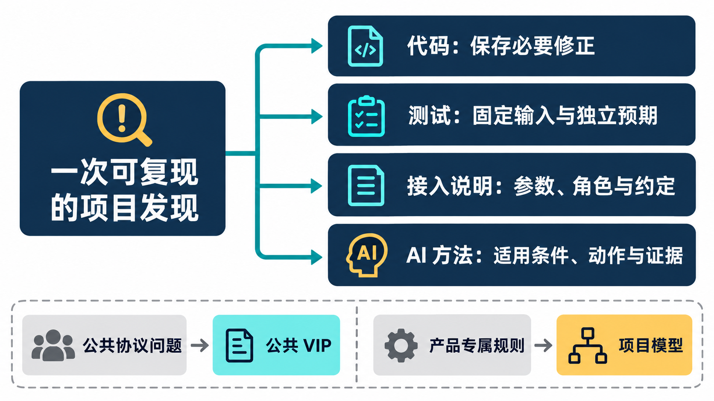
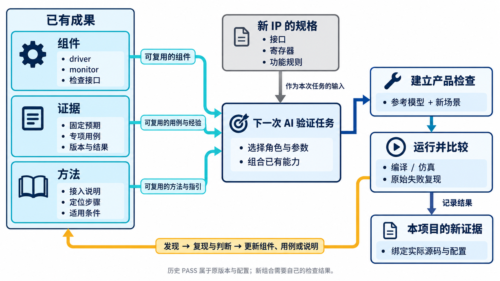
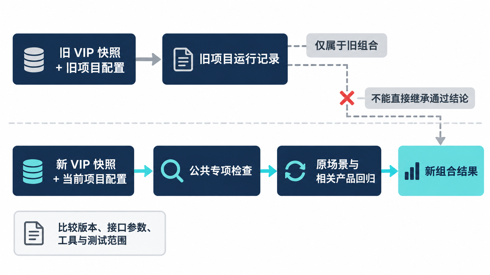

# AI 辅助芯片验证，怎样复用 VIP 与研发经验？

简体中文｜英文版待补｜中文内容稿，待波形补充与发布审阅

[返回专题目录](../README.md)

Secure Demux 是带权限控制的 APB 分发模块：访问从上游进入，经过地址与权限判断，再决定是否送到下游目标。它的冒烟用例用少量场景先检查关键路径。

产品测试只需表达“开放这个端口、写入一个值、让下游等待三拍、再返回错误”，已有 VIP 就承担了相应的 APB 驱动和观察。项目新增的工作集中在权限、路由、统计及访问引起的状态变化。这是本系列已经落到源码和典型配置运行报告中的复用方式。

下一次 IP 研发值得继承的，既包括这些组件，也包括已经澄清的使用约定和检查方法。固定预期怎样来，身份侧带由谁管理，响应错误怎样判定，失败后先重跑哪个场景——把这些问题的答案留在工程里，AI 才能沿着已有成果继续工作。

## 从一次发现提炼一条能执行的方法

“增加测试”太宽泛，无法指导下一次 AI 任务。“基础字节处理必须有不调用被测辅助函数的固定输入和预期结果”，则能够落实到输入、预期和检查代码。

沿用 Secure Demux 的接入，多个下游端口对应的配置与接口句柄需要逐实例核对，项目身份要与 APB 请求协调，复位则涉及 driver、sequencer 与产品模型。它们可以分别提炼成实例归属检查、侧带时序检查和事务生命周期检查。

这些方法都有一个共同点：它们解释了为什么要做，并规定怎样观察结果。下一次工程师和 AI 可以据此判断任务是否完成，而不是仅在报告里写一句已经考虑。

| 来自实践的问题 | 可复用的方法 | 新项目仍要决定什么 |
| --- | --- | --- |
| 读写共享错误可能互相掩盖 | 基础语义使用独立预期 | 合法输入和具体协议规则 |
| 自测环境可能掩盖依赖入口问题 | 保留独立消费者检查 | 交付文件、工具与依赖入口 |
| 多实例配置容易串用 | 显式检查实例与配置归属 | 拓扑、角色和接口参数 |
| 复位只处理信号，事务还在等待 | 检查完整事务生命周期 | 中止、恢复与产品复位语义 |

表里的方法可以迁移，右侧的答案必须重新建立。APB 项目的等待门限，不能变成所有 VIP 的统一常数；某个外设的错误副作用，也不能变成所有响应模型的默认行为。

其他 VIP 的经验也可以借鉴到这一步。已有 AXI4 研发记录中，独立黄金参考向量，也就是预先确定正确结果的一组输入样本，检查出了非对齐读写和绝对字节地址相关的问题，而共享同一计算方式的读写回环容易掩盖错误。APB 不照搬 AXI4 的突发或地址规则，但可以采用同一检查原则：字节处理先按目标协议独立推导，再与实现比较。[第 4 章的固定字节向量](chapter-04.md)就是这个原则在 APB 上的具体用法。

*积累方法示意：实现修正、反例、使用约定和通用判断步骤分别保存；产品专属规则保留在项目层。*

## 把经验写进 AI 下一次收到的任务

Skill 可以理解为供 AI 使用的工程操作说明，保存任务步骤、输入要求和检查要点。它适合沉淀方法，但不能替代协议规则或运行结果。

已有跨 VIP 的研发记录包含需求分类、标识整理以及经验回写方法的工作。对后续 APB 或其他接口项目，可以继续把这些原则变成具体任务要求：先说明协议基线与能力范围，再定义组件职责；实现之前审查关键预期；运行之后绑定版本、配置和日志结果。

需求标识也有实际作用。文章写作可以追求流畅叙述，工程内部则需要知道某个测试对应哪一项行为。稳定的需求身份能把规则、实现和测试关联起来，避免文档段落调整以后，引用关系跟着漂移。

方法说明应保持适量。每次发现一个项目特殊条件就增加一条全局规则，会让后续 AI 执行大量无关步骤。适合提升为公共方法的，是能够解释共同原因、具有明确适用范围，并能通过实际任务检验的要求。

以“基础语义使用独立预期”为例，写入后续任务说明的内容可以是：

> 涉及字节选通、地址换算或状态更新时，先按规格列出少量固定输入和预期结果。预期不能调用被测实现的同一个计算函数。实现后运行这些向量，保存逐项比较，再扩展随机场景；若结果不符，先检查规则与预期的推导依据。

这是一条方法示例，不依赖 APB 的特定信号。它说明适用场景、要执行的动作和需要留下的证据，既可用于其他 VIP，也可用于具有类似计算语义的参考模型或 IP 测试。迁移时仍须按目标协议重新确定合法输入。

## 下一次 IP 验证，可以从哪些已有资产开始

*方法示意：可继承的是组件、用例和使用经验。新 IP 仍需按自己的规格建立产品检查，并保存对应源码与配置下的运行结果；遇到失败时复现和判断，再将适合复用的改进返回已有成果。*

对带 APB 接口的外设，已有请求驱动、monitor、协议检查、覆盖与 RAL 适配可以成为起点。AI 的主要新增工作是理解寄存器描述、建立功能预期、设计控制和异常场景，并将产品结果接入 scoreboard。

对输出 APB 请求的桥接模块，已有响应端可以提供数据、等待和错误。新增工作集中在请求转换、两侧事务匹配、错误传播和复位处理。

对两端都是真实 RTL 的子系统，被动观察能力可以继续复用。AI 需要依据系统拓扑安排监控点，建立地址路由或端到端功能的预期，而不是再创建一个与真实端点争用的主动 driver。

这三种情形使用同一批公共能力，却有不同的产品判断。复用前把角色说清楚，AI 才能减少重复生成，并把注意力放到新项目真正新增的部分。

## 版本让经验能够安全地传递

这里的“消费方”指实际使用 VIP 的 IP 项目，例如 Secure Demux。它需要知道自己使用的是哪份 VIP，以及哪些配置与测试结果属于这份实现。仅有一个相同的版本字符串还不够；不同时间的源码快照、参数和工具条件，也可能产生不同结果。

一次改进交付时，应把代码变化、专项测试和使用说明放在一起。消费方升级时先复现原场景，再运行相关产品回归，保留升级前后的可比较记录。这样出现新问题时，可以分辨变化来自产品、配置还是公共组件。

AI 可以辅助整理依赖差异、选择受影响测试和汇总运行结果。对未执行的测试，应明确记录未执行；对部分通过的结果，应保留范围。结构化记录减少信息整理的重复劳动，技术结论仍来自实际检查。

公共组件本身与使用方法因此能够一起演进。一个修正保存在代码里，反例保存在测试里，正确用法保存在接入说明里，背后的共同原因则进入后续任务的检查步骤。

### 交给下一次 AI 任务的材料应当能互相核对

这套 VIP 的冻结记录还保存了包含 68 个文件的候选交付清单，并进行了哈希核对。文件哈希可以识别内容是否变化，帮助把“用的是哪份代码”说清楚；它本身不证明功能正确，也不等同于已经公开发布。

沿用 Secure Demux，可以把一次可交接的结果组织成四组材料：

| 交接材料 | 下一次 AI 用它做什么 |
| --- | --- |
| VIP 快照、接口参数与工具版本 | 确认已有能力及构建边界 |
| 上下游角色、逐实例配置、身份适配说明 | 按已知连接方式接入新环境 |
| 固定预期、失败复现及相关回归 | 检查旧行为是否保持、新行为是否成立 |
| 实际运行清单、结果与输出摘要 | 判断证据对应哪份实现和哪些场景 |

[第 7 章的等待期检查](chapter-07.md)就能同时留下三种成果：产品 checker 保存正确比较，定向场景保存等待与完成的区别，AI 任务说明要求先区分协议要求与产品约定。下一次遇到类似失配时，新的 AI 上下文中已经有可执行的判断步骤。

消费方也应保留自己的验证结果。VIP 自测通过，说明公共组件在自测条件下的表现；Secure Demux 回归通过，说明某份组件与该产品环境的组合表现。升级以后，两个层面的证据都需要重新对应，不能沿用旧消费方报告为新组合背书。

*版本交接示意：旧项目结果属于旧组合；升级后的组合需要自己的相关回归记录，不能沿用旧报告背书。*

## 怎样判断这种研发方式有没有进步

最直观的变化不一定是生成了多少代码。更值得持续观察的是：同类问题是否再次出现，消费方是否能按说明独立接入，失败是否容易复现，基础预期是否真正独立，修改后的影响是否能被相关回归检查。

这些指标如果要写成收益数字，需要真实记录作为依据。当前系列展示的是具体机制和已有工程证据，不从一次成功接入推算普遍的效率倍数。

更现实的做法是为后续项目保留同一口径的记录：从问题提出到最小复现经历了什么，哪些规则帮助定位，哪些测试阻止旧问题返回。经过多个项目，才有条件比较方法是否持续有效。

## 下一次任务，可以这样开始

如果明天要用 AI 验证一个新的 APB 外设，任务不必重新从“生成一套 UVM 环境”开始。可以先提供 DUT 接口与寄存器规格，选择已有 VIP 的角色和参数，要求打通一笔有独立预期的访问，再增加一个能够体现产品功能的场景。

第一轮检查组件连接与观察路径，第二轮扩展等待、错误和复位，随后围绕产品规格完善参考模型与回归。遇到公共问题，就按前一章的方法保留复现、修正和消费方结果；遇到产品特性，就留在项目模型中。

APB VIP 在这个过程中既是可用组件，也是工程经验的载体。下一次项目能够继承已经讲清的协议行为和检查方法，把新增工作放在新的设计问题上。随着更多真实接入发生，组件和研发方法还会继续获得新的检验。

[上一章](chapter-07.md)｜[专题目录](../README.md)
