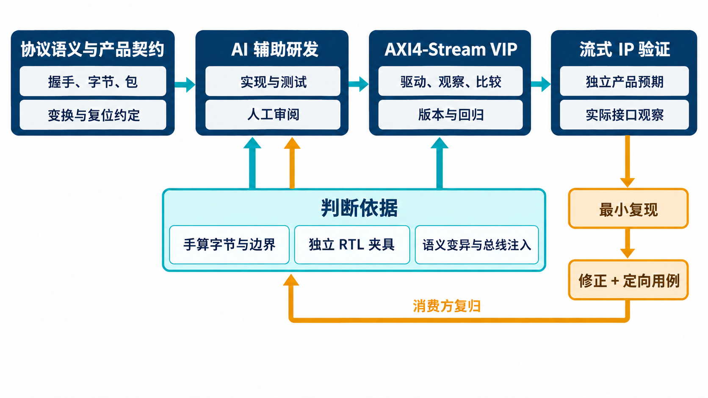

# AI 辅助流接口验证，怎样积累一套可复用的 VIP？

[系列目录](../README.md)｜简体中文，英文版待补

假设一段数据经过处理流水线，输入用了两拍，输出只用一拍。测试如果要求每拍完全对应，会报错；测试如果只检查最终字节数相等，又可能放过数据重排。验证环境必须先知道这段电路允许改变什么，以及必须保留什么。

这也是 AI 辅助开发 AXI4-Stream VIP 的核心问题。代码生成可以很快，判断依据却需要明确：总线什么时候真的传了一拍，哪些字节承载有效信息，包在哪里结束，电路怎样改变流的组织方式。

本系列围绕一套已有实现和运行记录的 AXI4-Stream VIP 展开。VIP 是 Verification IP，即可复用验证组件。我们关心它怎样成为后续 IP 项目的公共能力，以及项目中出现的新情况怎样返回组件研发。

## 从协议含义进入组件架构

AXI4-Stream 用于连续传递数据，不要求每次传输带上存储地址。一个 Source 提供数据，Sink 接收数据；Sink 暂时接收不了时，通过 TREADY 施加背压。TVALID 与 TREADY 在采样沿同时有效，才有一拍被接受。

握手只是第一层。一个已接受的 beat 可以含有数据字节、位置字节和空字节；TLAST 表示包的结束。同样的 TDATA，结合不同限定符，含义可能完全不同。[第 2 章](chapter-02.md)先讲清这些基础，避免后面的架构变成类名清单。

[第 3 章](chapter-03.md)再进入实际组件。当前 VIP 有 Source 主动发送、Sink 背压接收和 Passive 被动观察三种角色，提供 beat/packet API、序列库、monitor、checker、断言、覆盖、scoreboard 和统计。UVM 是通用验证方法学，用来组织这些组件；它规定连接方式，具体数据语义仍由组件和项目约定承担。

这里有一处分工尤其重要：Source driver 表达发送意图，monitor 从真实接口确认发生了什么。把“交给 driver 的对象”直接当成“DUT 已经接受的输入”，会漏掉等待、复位或发送路径上的差异。

*概念示意：协议语义和产品契约共同约束实现；运行反馈需要落成向量、用例和接入约定，才能被下一项目继续使用。*

## AI 可以共享实现，判断依据要能反驳实现

这套 VIP 将字节分类、限定符缺省值和逻辑流归一化集中在一个公共语义层。这样 driver、monitor、checker 和 scoreboard 不会各自解释一遍 TKEEP/TSTRB。

共享代码减少重复，也带来共同犯错的可能。假如公共函数把位置字节当作空字节删除，两端 monitor 调用相同函数后，输出仍可能一致。两个组件同意，并不足以证明它们都正确。

[第 4 章](chapter-04.md)会用现有单元向量解释怎样打破这种循环：先把预期写成可手工核对的 token 序列，再执行实现；同时故意改变共享函数，确认测试能发现语义偏离。AI 可以帮助展开实现和测试，但关键预期需要另有依据。

人的判断集中在语义和边界，AI 将任务落实为代码与用例，工具执行后提供可以推翻判断的反馈。文中没有历史会话依据的协作步骤，会以方法建议表述，不虚构一段已经发生的 AI 调试经历。

## 把“已有成果”拆成能理解的证据

当前冻结批次记录了 226 项单元检查通过、12 项语义变异检出、60 次种子矩阵运行通过，以及 20,000 个已接受 beat 的压力运行。这些数字对应不同问题，不能相加成为一个笼统的“验证规模”。

其中，语义变异针对共享函数的指定错误；时序违规则由另一组总线注入与检查覆盖。某个配置的压力测试，也不等于所有位宽和端口组合都已跑过。[第 5 章](chapter-05.md)会逐项解释证据的含义与适用条件。

此外，自验证环境让 Source VIP 通过独立 RTL 夹具连接 Sink VIP，两侧 monitor 进入 scoreboard。夹具没有导入 VIP 的语义包，能减少行为模型和被测组件共享实现的程度。不过，两个 monitor 仍使用同一套公共语义，所以固定向量与变异检查不能省略。

## 用一个简单电路讲清复用

本系列选择寄存器切片作为贯穿案例。它在流接口中加入一级数据保存，通常用于划分流水阶段；当前夹具同时保存数据和相应控制字段，面对背压时维持当前输出。

这个例子不靠复杂产品背景吸引注意，却可以把验证问题讲得很完整：两端谁驱动什么，输入何时成为预期，输出何时算一次实际传输，连续吞吐如何保持，复位后未完成内容如何处理。[第 6 章](chapter-06.md)沿实际环境与测试展开，再说明怎样迁移到其他流式 IP。

这里的实证是“VIP 已用于独立 RTL 夹具的双侧验证”，不扩大为独立产品的验收。对于会修改数据、重写路由或解释 TUSER 的新 IP，项目仍需要自己的参考模型。公共 VIP 帮助建立总线事实，产品模型解释这些事实应该意味着什么。

## 使用经验最终要变成什么

一个超时不能自动证明协议违规；一次取消请求不能随意撤掉已拉高的 TVALID；包数相等也不能说明包边界正确。[第 7 章](chapter-07.md)从这些具体问题展开调试，讲清等待、复位、比较和统计的关系。

最后，[第 8 章](chapter-08.md)讨论怎样把结果交给下一次 AI 辅助研发：保存版本和运行条件，明确比较与复位约定，让新增需求带着独立预期进入实现，把发现的问题变成能反复执行的检查。

这样积累的成果不只是一份验证代码。它还包括一套被逐步说明、执行和修正的判断方法，让下一项目知道什么可以直接复用，什么必须重新定义和验证。

[下一章：分清拍、字节和包](chapter-02.md)
