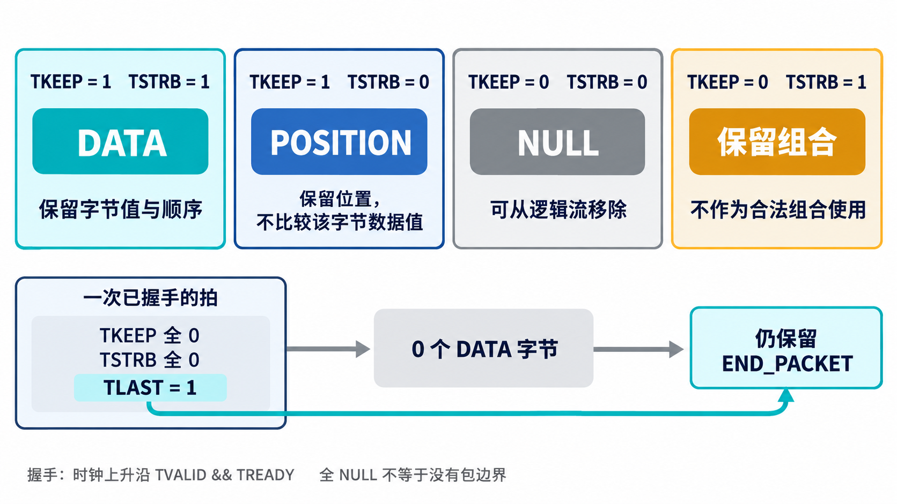

# AI 开发 AXI4-Stream VIP，先分清拍、字节和包

[系列目录](../README.md)｜简体中文，英文版待补

看到 TDATA 上有数值，并不表示数据已经传出；看到 TKEEP 为零，也不能立即删除整拍，因为它仍可能携带包结束信息。Stream VIP 首先要把这些关系解释正确，才能驱动和检查更复杂的电路。

本章围绕当前实现采用的 AXI4-Stream 基线展开。握手、字节限定符和包边界已对照 [Arm IHI 0051A](https://documentation-service.arm.com/static/642583d7314e245d086bc8c9)的第 2～4 章核对；具体单元例子来自本系列 VIP 的语义测试。

## 一拍传输，首先是一个握手事件

Source 通过 TVALID 声明本拍有效，Sink 通过 TREADY 声明可以接收。在时钟上升沿，两者同时为 1，才接受一个 beat。这里的 beat 是一次握手承载的总线内容，不是任意一个时钟周期。

若 TVALID=1、TREADY=0，这一拍处于等待。Source 需要维持 TVALID 及该拍应保持的载荷与侧带，直到握手；TLAST、TKEEP 等控制信息不能因为数据本身没变就被忽略。正常连续传输时，上一拍已被接受，下一周期可以换成新内容，不能把这种更新误判为等待期间变化。

Source 也不能先等 TREADY 拉高才发 TVALID。Sink 可以等看到有效请求再准备接收；若双方互等，链路就停住。因此 VIP 要同时提供发送和背压策略，检查等待前后是否仍符合约定。

AXI4-Stream 没有 AXI 读写接口的 AW/W/B/AR/R 五通道，也没有返回“写完成”的 B 响应。某拍被 Sink 接受，不代表一个算法加速器已经处理完它；处理完成属于产品约定。

## 总线上的每个字节位置，可能有三种含义

byte lane 是总线中的一个字节位置。64 位 TDATA 有八个 lane，lane 0 对应最低八位。TKEEP 与 TSTRB 各用一位描述对应 lane；当这两个信号都存在时，可以按下表理解。

| TKEEP | TSTRB | 类别 | 需要保留的含义 |
| --- | --- | --- | --- |
| 1 | 1 | DATA 数据字节 | 字节值及顺序 |
| 1 | 0 | POSITION 位置字节 | 相对位置，TDATA 值不承载有效数据 |
| 0 | 0 | NULL 空字节 | 不承载信息，可从逻辑流中移除 |
| 0 | 1 | 保留组合 | 不应作为合法字节组合使用 |

POSITION 可以理解成“这个位置存在，但这里没有要传送的新数据值”。NULL 则连这个逻辑位置都不需要保留。把两者都当成零字节，或者都直接删除，都会改变流的含义。

*原理示意：图中的“位置”不是一个数值为零的数据字节；删除 NULL 也不能删除已经传递的包边界。*

当前单元测试有一个直观例子：八个 lane 中 `keep=0x11`、`strb=0x11`，只有 lane 0 和 lane 4 为 DATA，其余六个为 NULL。因此是两个数据字节、六个空字节，而不是“整拍八个有效字节”。

若改成 `keep=0x33`、`strb=0xFF`，keep 为零的四个 lane 却有 strb=1，它们属于保留组合，不能算作合法 NULL。这个反例让分类函数既检查数量，也检查输入是否合法。

## 包边界独立于数据字节数量

packet 是一组有结束边界的传输。使用 TLAST 的接口，在一次已接受拍上 TLAST=1，表示相应流的包结束。它可以跟正常数据同拍出现，也可以出现在 TKEEP 全零的拍上。

后一种情况特别容易被忽略：该拍没有 DATA，却带着结束事件。若归一化时因为没有有效字节就丢弃整拍，两个包可能被错误拼成一个。现有单元测试明确要求全 NULL 加 TLAST 产生一个 `END_PACKET` 标记。

没有 TLAST 时，包的分组需要由明确的应用或采集约定提供，例如连续流或固定长度窗口。不能看到总线暂时空闲，就擅自认定包已经结束。VIP 可以为分析生成合成分组，但必须与真实 TLAST 边界区分。

## 流标识不是地址，也不是完成响应 ID

TID、TDEST 用于区分流及其目的标识，同一接口可以交织不同标识的传输。VIP 需要按标识维护各自的组包状态，不能只有一个“当前包”。当前 monitor 还把接口身份和 epoch 纳入上下文，避免不同接口或复位前后的内容混在一起。

TUSER 承载应用定义的侧带信息。某个视频接口可能用它表达帧开始，另一个张量接口可能赋予不同含义。仅有字段名称，无法推导其产品语义；比较与重写规则必须由应用给出。

源与目的标识参与流的区分，但不是存储地址；这里也不存在“按 ID 等待读响应”的通道关系。沿用 AXI memory-mapped 的对象模型，会把并不属于流接口的状态引入验证环境。

## 缺省值和应用限制要显式说明

可选信号不存在，不等于它存在且值为零。当前语义层在没有 TREADY 时按可接收处理，没有 TKEEP 时按全部 lane 保留处理，没有 TSTRB 时根据有效 keep 生成数据字节含义。这些缺省规则经过固定向量检查。

可选信号的存在性也决定检查范围：一个没有 TUSER 的接口，不应该因为占位变量含 X 而报告有效 TUSER 未知。物理参数、配置镜像和比较模式需要一起验证。

有些项目只接受连续 TKEEP，或只允许末拍不足一个总线字，或禁止多流交织。这些可以成为产品约束，但不能不加说明地当作所有 AXI4-Stream 接口的通用要求。等待超时也属于环境或应用的进展约定，协议本身没有统一的 N 拍期限。

理解这些区别后，AI 的实现任务就清楚了：先建立握手事实，再解释字节和包，最后叠加应用规则。下一章会看到这些职责在当前 VIP 中怎样分开。

[上一章](chapter-01.md)｜[下一章：驱动、观察与比较](chapter-03.md)
