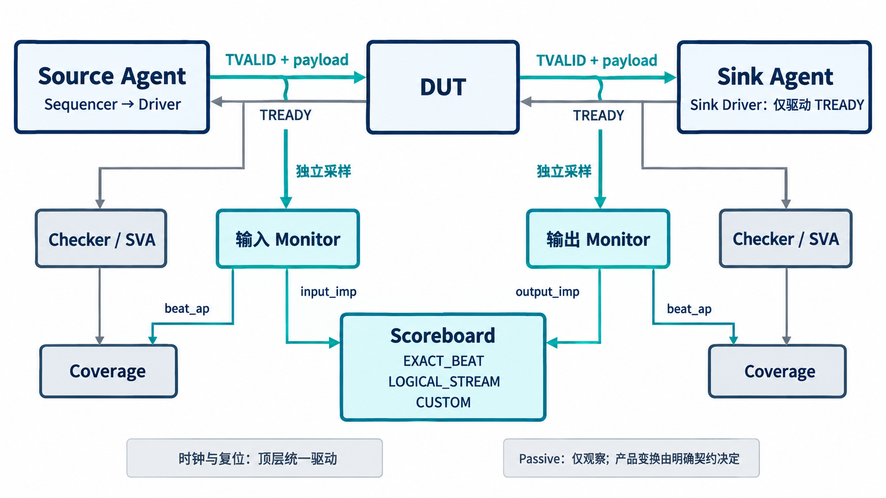

# AI 设计的 Stream VIP，怎样驱动、观察和比较？

[系列目录](../README.md)｜简体中文，英文版待补

一个流接口验证环境既要能制造连续输入，也要能故意暂停接收；既要记录哪些拍被接受，也要看见未完成拍在等待时有没有变化。这些工作不能全部塞进一个“收发线程”，否则出错时难以知道观察结果来自真实接口还是发送者自己的判断。

当前 AXI4-Stream VIP 将角色、观察、语义和判定分开。下面先解释公共组件，再看已经实际装配的双侧环境，不把类的声明等同于自动完成所有连接。

## Source、Sink、Passive 各自有明确的驱动权

每个 agent 对应一个单向接口和一个时钟域。Source 创建 sequencer、driver 和 monitor，发送 TVALID 及载荷；Sink 创建 sink driver 和 monitor，只驱动 TREADY；Passive 只保留 monitor。checker、coverage 等由外层环境配置。

Source 序列可以按字节、beat 或 packet 构造输入，也有随机长度、边界长度、数据模式、限定符组合、多 key 交织和连续流等序列。sequencer 组织发送请求，driver 将请求落实到实际握手，并区分接受、取消和复位中止等状态。

Sink 不负责替 DUT 生成数据。它只决定何时接收，接收事实由 monitor 采样。当前有九种 READY 策略：持续接收、固定延迟、随机、周期性、高低批次切换、等待 VALID、针对指定拍、缓冲区模型和脚本式策略。不同策略帮助制造可重复的压力位置。

时钟和复位由顶层统一驱动，流 agent 响应复位。这样不会出现一个组件为了结束等待自行重置总线，另一个组件却继续按照旧状态比较的情况。

*职责示意：上方是通过 DUT 的数据路径，下方是两侧观察和比较。它对应双侧环境的组织方式，不表示一个单接口 env 会自动创建完整链路。*

## monitor 同时保留“周期事实”和“接受事实”

monitor 提供五类 analysis port。analysis port 是 UVM 发布观察数据的接口，接收组件可以订阅而不改变发送者。

| 端口 | 输出内容 | 用途 |
| --- | --- | --- |
| `cycle_ap` | 每周期原始采样 | 观察等待和未完成行为 |
| `beat_ap` | 已握手的 beat | 统计真实接受量与功能覆盖 |
| `packet_ap` | 组包结果或增量输出 | 两端比较与包级分析 |
| `reset_ap` | 复位中止的未完成包 | 复位结算与相关覆盖 |
| `error_ap` | 观察侧异常事件 | 保留诊断上下文 |

只订阅 `beat_ap` 无法看见所有等待周期。反过来，直接把每个 `cycle_ap` 样本算成一次数据传输，会在背压时重复计数。两个入口并存，是因为它们分别回答不同问题。

组包以接口身份、epoch、TID 和 TDEST 为上下文。epoch 是用于分隔运行阶段的代际标记，尤其帮助区分复位前后的观察。中途开启被动采集时，组件会标记不完整捕获，不能拿缺少开头的包直接进行完整验收比较。

## checker 检查规则，scoreboard 检查两端关系

checker 与独立 SVA 断言检查复位、等待稳定性、限定符合法性、未知值等条件。当前规则目录有 15 个入口，分为协议、应用、watchdog、配置和 VIP 内部五类。固定包长、TUSER 含义和等待阈值不应混写成通用协议要求。

checker 从接口时序采样，不靠 Source 宣告自己发送正确。错误事件带有规则编号、时间、接口、epoch、前后样本和流标识，便于定位第一处偏离。错误注入可主动撤销 VALID、改动等待中的字段，或制造非法限定符组合，用于检查这些路径。

scoreboard 处理的是另一类关系：DUT 输入与输出是否符合其功能契约。EXACT_BEAT 用于保留拍组织的透明路径，LOGICAL_STREAM 比较归一化的字节与边界，CUSTOM 为产品预测提供扩展入口。用户需要选择适合 DUT 的模式，不能用更宽松模式掩盖真实失配。

## 公共语义层保证一致，再由外部预期检查它

`axi4_stream_types_pkg` 集中实现字节分类、缺省归一化、token 化和比较原语。beat 和 packet 对象保留四态数据；观察对象另外带有采样时间、等待和状态等信息。生产组件可以复用这层语义，但其正确性由独立固定向量另行验证。

例如，POSITION 在逻辑流中保留位置，却不比较对应 TDATA 数值；NULL 可以被移除，END_PACKET 必须保留。仅仅把整包转成一段普通 byte 数组，会失去这些区别。[第 4 章](chapter-04.md)用具体向量解释如何检查共享实现。

coverage 从真实接受的 beat 采样，错误和复位事件经适当订阅者进入对应覆盖。它不是根据序列“计划发送什么”直接打勾。当前有十个 covergroup 及重点交叉，冻结版本另有明确的必测覆盖清单；这两种组织层次不能混为同一个分母。

## 实际双侧环境怎样接起来

当前 `axi4_stream_smoke_env` 实际创建 Source/Sink agent、两侧 checker、两侧 coverage 和一个 scoreboard。输入侧 monitor 的 `packet_ap` 连接 `input_imp`，输出侧连接 `output_imp`；两端 `beat_ap` 分别连接各自 coverage，checker 错误通过订阅者转入错误覆盖。

接口配置还会检查角色是否显式设置、位宽与可选信号是否一致。不同物理参数需要匹配的 SystemVerilog 接口类型与构建装配，不能只改变配置对象中的数字就宣称任意参数可直接连接。

不需要完整 UVM 环境时，当前另有独立 CHECKER_ONLY 构建入口，使用纯 SystemVerilog 检查路径而不导入 UVM 包。它与 Passive 的区别是依赖和运行组织不同；Passive 仍是 UVM 组件角色。

这套架构让 AI 可以围绕职责逐步工作：先实现语义，再实现发送与观察，然后用明确的连接和独立预期检查它们。结构清楚之后，调试才有机会指向具体机制。

[上一章](chapter-02.md)｜[下一章：避免双方一起算错](chapter-04.md)
