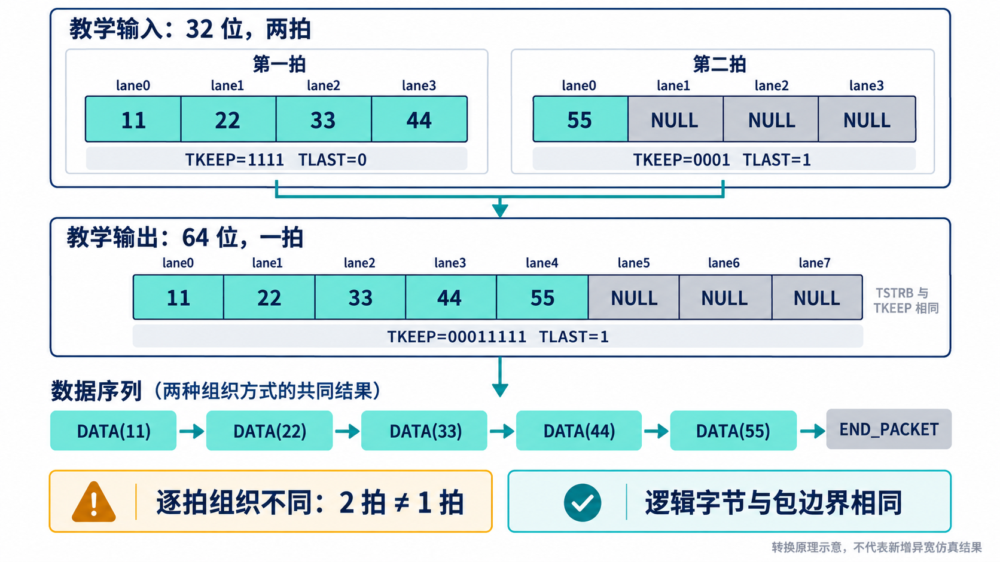

# 用 AI 开发 Stream VIP，怎样避免双方一起算错？

[系列目录](../README.md)｜简体中文，英文版待补

输入和输出经过同一个错误的归一化函数，再拿来比较，可能完全一致。这是可复用 VIP 的一个典型风险：越是努力统一组件行为，越需要独立检查统一实现中的假设。

本章用现有语义单元测试展开一种 AI 协作方法。重点不在提示词写得多长，而在预期是否能独立解释、执行结果能否否定实现。以下任务组织是方法建议，不是历史会话复述。

## 先写出一个不依赖函数的答案

取当前单元测试中的 64 位例子。TDATA 的 lane 0 为 `AA`，lane 1 为 `00`，lane 2 为 `BB`；其余先置零。`TKEEP=0x0F`，`TSTRB=0x07`，`TLAST=1`。

先不调用任何 VIP 函数，直接解释：lane 0～2 为 DATA，lane 3 为 POSITION，lane 4～7 为 NULL。得到的逻辑序列应是：

```text
DATA(AA), DATA(00), DATA(BB), POSITION, END_PACKET
```

这里 `DATA(00)` 不能删除。零值仍然是数据；是否有意义由限定符决定。POSITION 不能删除，因为它保留位置；四个 NULL 则不进入逻辑序列。TLAST 追加 END_PACKET，得到五个 token。

token 在这里是表达逻辑语义的小记录，包含类别，DATA 还包含字节值。现有测试检查了 token 数量、DATA 分类、AA/BB 的值、POSITION 以及结束标记，预期常量没有通过被测 token 化函数生成。

另一个极小向量只有 NULL 和 TLAST。正确结果仍有一个 END_PACKET。它能直接反驳“有效数据长度为零就没有任何输出”的错误实现。

## 让 AI 实现语义，而不是决定答案

人先审阅上面的分类和序列，然后让 AI 实现分类、计数和 token 化。任务应同时给出反例：把 `keep=0,strb=1` 归为非法；改变 POSITION 对应数据值不应改变逻辑含义；改变 DATA 值必须被比较发现。

当前测试也检查了缺省限定符、五字节包在四 lane 接口上需要两拍、末拍 keep 为 `0001`，以及没有 TKEEP 时不能精确表达这个五字节包。这样，AI 不会只把默认整拍发送做对，却通过悄悄补零改变高层 API 的含义。

这些向量足够小，可以手算；失败后也容易找到第一项差异。等基础语义稳定，再加长包、多 key、背压和随机长度。随机运行扩大组合，固定向量保留清楚的判断起点。

## 逐拍相等和逻辑相等，解决不同问题

寄存器切片只推迟数据，不改变拍内容与边界，适合 EXACT_BEAT。这个模式比较拍组织和相应字段；正常语义下，POSITION、NULL 对应的 TDATA 数值不作为有效数据值比较。它并不是对所有总线比特做无条件逐位相等检查。

若 DUT 合法改变位宽或重新打包，拍数可能不同。用一个教学例子说明：32 位输入携带五个 DATA 字节，第一拍为 `11 22 33 44`，第二拍只有 `55` 且 TLAST=1；一个保持顺序的 64 位输出可以用一拍装下五个字节，其余 lane 为 NULL。

两侧的拍数分别为二和一，逻辑序列却都应为 `11 22 33 44 55 END_PACKET`。这时 LOGICAL_STREAM 的比较思路更合适。该例用于解释方法，不作为当前异宽 DUT 已完成物理接入回归的声明。



*教学示意：允许改变的是拍的组织，必须保留的是约定中的逻辑信息。这里没有 POSITION；若有，归一化后仍要保留其位置。*

逻辑比较也不能自动解释 TUSER 的业务意义、路由重写或算法处理结果。若产品改变数据本身，就需要 CUSTOM 预测或独立产品 scoreboard；流标识、顺序、USER 与复位约定仍须逐项确定。选择 LOGICAL_STREAM 不等于声明所有差异都可忽略。

## 用变异检验预期是否真的能发现错误

当前变异工具在隔离副本里修改共享语义函数，再编译执行定向语义检查。例如，把 DATA 错分为 POSITION、把 NULL 错保留为数据、删除 END_PACKET、把末拍掩码多算一个有效字节，或不再比较 token 类别。

这些变异检查回答：指定的语义改变是否能与独立答案形成差异。它们不是在 DUT 引脚上制造时序违规，也不能直接等同于完整 UVM 环境逐个杀死所有类型的实现缺陷。总线上的等待稳定性还要由另一组时序注入测试检查。

源文件集中实现语义，与测试独立给出答案，两者并不矛盾。生产代码共享一种解释，验证代码在关键处保留第二条推导路径。这是可以迁移到其他 AI 辅助研发项目的方法。

## 从函数扩展到组件时，继续保留独立观察

下一层让 Source 通过一个行为简单的 RTL 夹具连接 Sink，由两侧 monitor 采样后比较。夹具不导入 VIP 包，人工能够审阅它如何保存数据和控制。这提供了不同于 driver 内部缓存的观察路径。

但双侧 monitor 仍共享语义函数，因此不能宣布所有相关性都已消除。固定向量检查语义，独立夹具检查交互，故障注入检查时序规则，多种证据共同减少盲点。AI 每次修正后，都应回到受影响的这些层次，而不是只重跑一个最容易通过的 smoke。

[上一章](chapter-03.md)｜[下一章：已有可信实证](chapter-05.md)
