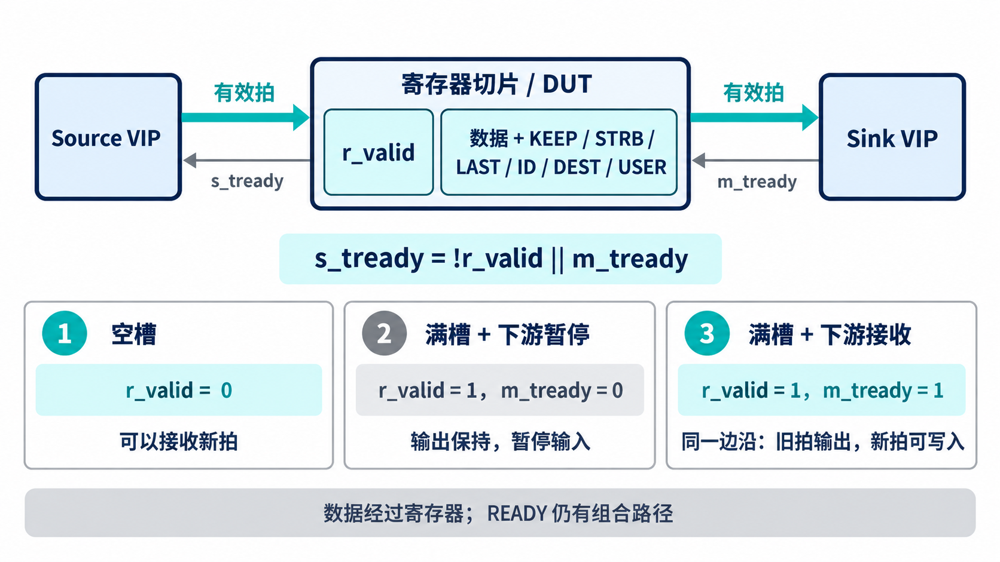

# AI 设计的 VIP 实战：验证一段流式流水线

[系列目录](../README.md)｜简体中文，英文版待补

数据从一个模块进入另一个模块，组合路径可能越来越长。流水线常用寄存器把处理分成阶段。对于带背压的流接口，这一级寄存器不能每周期无条件覆盖：下游尚未接受旧数据时，它必须保存旧内容，并在必要时阻止上游送入新内容。

本章使用当前自验证环境中的单深度寄存器切片。它是独立 RTL 夹具，已经用于 VIP 的实际运行，适合把接入结构与判断依据讲清。它不是另一个已交付产品的验收报告；后续项目可以复用这里的组件关系和验证方法。

## 一个存储位置怎样处理背压

切片保存数据、keep、strb、last、id、dest、user，以及一个表示槽位有效的 `r_valid`。输出直接由这些寄存状态提供。输入 READY 的核心关系是：

```systemverilog
s_tready = !r_valid || m_tready;
```

槽位为空时可以接收；槽位已有数据，但下游这周期能接走时，也可以同时接收替换内容。若槽位满且下游不接收，就暂停上游，保持当前数据与侧带。

因此，一个周期可以同时发生输入和输出握手。它不意味着寄存器有两个位置，而是旧数据在边沿被接走，新数据在同一边沿写入。把“发出后必须空一个周期”当作唯一正确实现，会错误地降低吞吐。

当前夹具的数据输出经过寄存器，READY 路径仍包含下游 READY 的组合关系。这里的“切片”不能自动理解成所有前向和反向路径都已被寄存隔断。



*实现原理示意：满且未被接收时保持当前内容；旧拍被接走的边沿可以同时写入新拍。图中的状态关系不是仿真波形。*

## 实际验证环境如何分工

Source agent 驱动切片输入，Sink agent 在输出端驱动 TREADY。两侧各有 monitor、checker 和 coverage；一个 scoreboard 接受两边的组包结果。顶层统一产生时钟与复位。

当前同域运行使用 64 位数据、4 位 TID、2 位 TDEST、8 位 TUSER，并启用 TKEEP、TSTRB 和 TLAST。切片保存这些侧带，因此不仅要检查 TDATA，还要检查包边界和流归属是否被保持。TUSER 的比较策略仍需按项目配置明确启用与定义。

下面是现有双侧环境中承担端到端比较的两条连接：

```systemverilog
src_agent.monitor.packet_ap.connect(scoreboard.input_imp);
snk_agent.monitor.packet_ap.connect(scoreboard.output_imp);
```

输入侧给出的预期来自实际被接受的输入，输出侧给出实际传出的结果。driver 的缓存不直接代替任一侧的物理观察。checker 则各自检查所在接口的时序，不需要等整包结束才判断一次等待稳定性问题。

## 当前用例怎样从冒烟走向复杂行为

smoke 先使用持续 READY，发一个单拍序列，再发三包、每包四拍的数据。它建立最基本的发送、流水保存、观察与比较路径。

feature 用例加入随机背压，配置参数为 ready 概率 70%、最大 stall 5；随后运行限定符序列、数据模式序列、四个 key 的逐拍交织及 1～64 字节的随机长度包。这里的“70%”是激励策略参数，不是测得的总线利用率。

corner 和其他用例继续覆盖边界长度、全 NULL TLAST、连续传输、复位、压力与调度。当前资格报告记录 feature/random/scoreboard 无 mismatch。具体源码给出了这些用例如何构造，报告给出了对应运行判断；本文没有额外制造一次执行日志。

这样的层次有利于 AI 辅助扩展。先让基础路径可以独立解释，再增加一个影响条件，检查哪一类约定被触发。直接叠加长包、随机背压、多 key 和复位，即使失败也难以知道第一处差异来自哪里。

## “两边数量一样”还需要哪些补充

对于这个透明夹具，两边拍数相同是必要条件之一，却不能代替内容和顺序比较。丢掉 A、重复一次 B，计数可能仍相等；丢失 TLAST，字节总量也可能不变。

EXACT_BEAT 适合当前保持拍组织的路径。scoreboard 需要检查预期与实际是否一一匹配，并在结束时检查未匹配预期和多余输出。未输出数据不能因为测试结束就被无条件清空；遇到复位时则按约定结算。

背压时的保持检查与这些比较互补。假设一个错误实现等待期间改了数据，又在握手前改回来，只比较最终接受的拍可能看不出来；逐周期稳定性检查有机会捕获中间违规。反过来，所有握手都合法，仍可能传错包，端到端比较仍不可少。

## 迁移到新的 AI 辅助 IP 研发

把寄存器切片替换成新 IP 之前，先写清它允许哪些变化。如果只是增加延迟，保留 EXACT_BEAT 的主要思路；如果重新打包，先定义逻辑字节和包边界的守恒；如果执行滤波、编码或张量计算，则需要产品参考模型生成正确输出。

AI 可以依据端口表和功能契约生成连接、配置与用例。人需要审阅信号所有权、可选字段、TUSER 含义、流标识变化、复位和丢弃策略。公共 VIP 提供输入输出事实，算法或产品模型提供业务答案。

一个稳妥的接入顺序是：固定数据且持续接收，随后加入确定性背压，再测试关键包边界和侧带，最后增加随机与复位。每一步先写验收条件，再扩展实现。这样，公共组件的实证可以帮助新项目起步，新的产品结论也有自己的依据。

[上一章](chapter-05.md)｜[下一章：背压、复位与统计](chapter-07.md)
