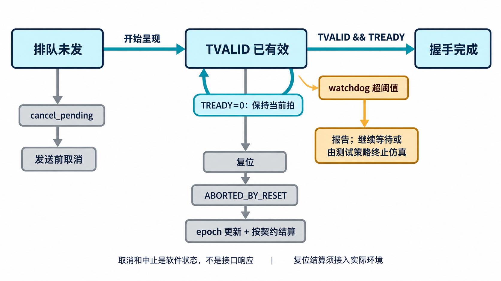

# AI 辅助流接口调试：背压、复位与统计怎样看？

[系列目录](../README.md)｜简体中文，英文版待补

仿真没有结束，日志里 TDATA 一直不变。它可能正处于正确的背压等待，也可能因为两端互等而无法前进。若 AI 只看到“卡住了”，最容易给出的修正是加超时、撤销请求或清空队列；这些动作可能反而破坏协议，或者掩盖丢失数据。

本章结合现有 driver、monitor 与 scoreboard 的行为，给出一种定位方法。文中的诊断步骤和扩展用例是方法建议，不虚构当前材料中没有记录的缺陷修复过程。

## 先确定停在发送、接受还是比较

TVALID=0 时，先看是否真有待发送请求，以及复位、序列调度和配置是否允许发起。TVALID=1、TREADY=0 时，Source 保持当前拍可能完全正确，应检查 Sink 的策略和 DUT 的容量条件。两者同时为 1 后，monitor 才应增加 accepted 计数。

若输入已被接受而输出未出现，再对照 DUT 的功能和进展约定。若两端都有接受事件但 scoreboard 失败，优先看最早的包、key 或 token 差异。不要只比较仿真结束时的总包数。

| 观察到的事实 | 优先核对 |
| --- | --- |
| 有待发请求，但 TVALID 不出现 | 调度、复位、是否错误等待 READY |
| TVALID 持续、TREADY 为零 | 背压策略、槽位容量、下游进展 |
| 已发生握手，计数未增长 | 采样边沿、接口绑定、复位状态 |
| 两边都有输出，比较不一致 | key、字节类别、边界及产品变换规则 |
| 复位后出现多余或缺失包 | epoch 与未完成数据结算 |

给 AI 的最小复现应包含具体信号和条件：固定 key、短包、不同字节值、确定的背压窗口，以及第一处偏离时间。让它先说明机制，再提出修改，比一次重写整个驱动更容易审阅。

## 超时报告不能随意撤销在途拍

当前 driver 区分未拉高 TVALID 的排队 item 和已经展示在接口上的在途 beat。`cancel_pending()` 处理前者；后者不能仅因为软件请求取消就撤掉 TVALID。

watchdog 发现等待过久时，当前默认行为是报告并继续保持等待。测试策略可以决定终止仿真，或通过定义好的复位流程处理停滞，但不能将它悄悄改成“超时后假装成功”。`wait_drained()` 则用于等待已在途工作按约定结束。

这和寄存器读写测试中的软件超时有相似之处，但流接口没有给 Source 返回一个“取消成功”的协议响应。`CANCELED_BEFORE_VALID`、`ABORTED_BY_RESET` 是测试软件状态，不能在图中画成总线应答。

*原理示意：取消、握手和复位不是三种可互换的完成方式。watchdog 报告也不会自动把一个在途拍变成已接受数据。*

## 复位前的预期，不能靠清空来“变正确”

monitor 在复位后增加 epoch，对未完成包发布中止事件。scoreboard 需要知道 DUT 的复位契约：哪些数据会被丢弃，哪些必须保留，何时允许开始新一轮比较。

若约定 BOTH_FLUSH，两侧清空期间允许丢弃的预期可以按合同结算；若约定保留，就不能无条件删除队列。当前组件提供相关配置和处理入口，项目仍需把实际复位事件接入结算，并验证所选策略。配置项存在不等于新 DUT 的复位行为已经得到证明。

跨时钟域时更要明确。两个接口的周期编号不在同一尺度上，不能直接相减得到延迟；应使用统一仿真时间，并确保比较的是同一份逻辑内容。当前 CDC 运行验证了声明范围内的数据完整性，不能由数字仿真进一步推出亚稳态安全。

## 高利用率不一定意味着有效数据吞吐高

当前 monitor 分别记录 accepted beat、DATA、POSITION、NULL、包、复位中止、空闲和 valid-not-ready 等计数。用这些信息评价产品性能时，测试还需要独立确定观察窗口，不能将某个内部“活动周期”字段直接当作完整窗口的周期数。

以一个教学观察窗口说明：20 个非复位观察周期内接受 10 拍，每拍有两个 DATA 字节，其余 lane 是 POSITION 或 NULL。则利用率为 `10/20=50%`，有效数据吞吐为 `20/20=1 byte/cycle`。不能因为接口是 64 位，就直接用十拍乘八个字节计算有效吞吐。

这些数字是定义说明，不是新增实测结果，也不对应内置汇总字段的测量值。实际报告应写清分母采用哪些周期、在哪个接口观察、有无复位，以及是否计入等待。POSITION 保留语义位置，却不计入 DATA 字节吞吐。

Source 上 VALID 到握手的等待，只描述该接口的接收等待时间，也不等于 DUT 的端到端处理延迟。要测后者，需要输入输出的对应关系和产品定义；位宽变换后更不能随意按“第 N 拍”配对。

## 把定位结果留下来

如果问题出在公共字节分类或采样，应留下独立向量或协议用例；如果是配置路径、角色或侧带连接，进入集成模板；如果是算法或 TUSER 语义，进入产品模型和用例。先确定归属，再由 AI 提出最小修正和影响范围。

修正后依次检查最小复现、相关公共回归和消费方场景。反馈最终应形成能再次发现问题的条件，而不是只留下一句“增加了超时”或“清理了队列”。下一章把这些产物组织成长期复用的方法。

[上一章](chapter-06.md)｜[下一章：让成果持续积累](chapter-08.md)
