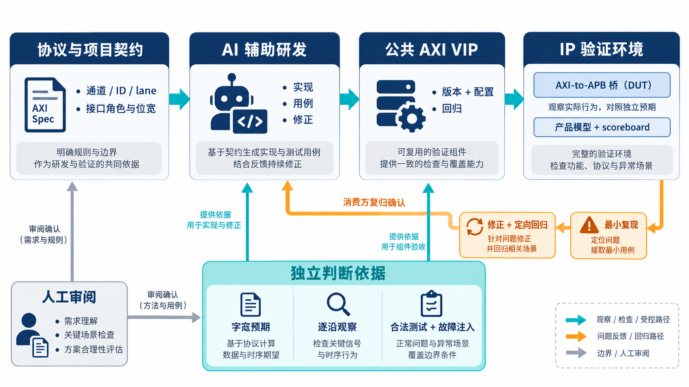

# AI 辅助芯片验证，为什么要把 AXI VIP 做成公共能力？

[系列目录](../README.md)｜简体中文，英文版待补

一段 AXI 写操作已经发出，仿真也没有报错，但写响应始终没有回到测试序列。此时该怀疑 IP 没有响应，还是验证环境漏收了响应？如果测试只在“收到响应”时检查内容，没有检查响应必须到达，整个用例甚至可能显示通过。

这正是可复用验证组件值得认真研发的原因。后续每一个 AI 辅助设计的 IP，都可能依赖它制造激励、解释接口行为和判断协议是否合法。组件的一个错误会传给许多项目；一次得到验证的修正，也能被许多项目共同使用。

本系列结合一套已实现的 AXI4 VIP，讨论怎样把 AI 产出的验证代码变成可以持续使用、持续检查和持续改进的工程能力。VIP 是 Verification IP，即可复用的验证组件；这里的“IP”并不意味着它是被综合到芯片上的电路，而是指供验证环境使用的一组模型和组件。

## 先让读者看懂 AXI，再让 AI 有明确的工作对象

AXI 常见于处理器、DMA、存储器和片上互连之间。它把地址、写数据、读数据和响应拆到不同通道，允许多笔事务重叠进行。一次简单读写容易理解，复杂性来自通道之间的关系：哪个数据属于哪个地址，哪个响应完成了哪笔请求，等待和复位又改变了哪些状态。

[第 2 章](chapter-02.md)会从五条通道讲起，解释握手、burst、ID 和背压，而不是先摆出一串 UVM 类名。理解协议之后，才能判断 VIP 应当保存哪些状态、允许哪些顺序，以及检查器要观察什么。

[第 3 章](chapter-03.md)再进入实际架构。这套 VIP 已有主动 master、主动 slave 和被动观察模式，提供读写序列、事务驱动、读写 monitor、协议 checker、功能覆盖、内存模型、错误注入与寄存器模型适配。UVM 是通用验证方法学，用来组织这些组件及其连接。它提供组织方式，具体的协议含义仍要由实现和检查承担。

## AI 参与研发，可靠性来自怎样判断产物

AI 能把需求拆成实现任务，起草事务类型和驱动逻辑，也能根据编译报错、失败断言与波形缩小问题范围。它适合连续处理这些细节，但不能独自决定“怎样才算正确”，然后再用相同假设证明自己的实现。

例如，32 位总线上的一次部分写，只应更新指定字节。若内存模型与测试程序共用同一段错误的地址计算，写入和读回仍可能完全一致。对此，[第 4 章](chapter-04.md)用实际单元向量解释：先独立算出每个地址应有的字节，再让 AI 实现模型，并由工具执行比较。

人的工作因此变得更具体：确认语义和边界、审阅独立预期、判断异常归属；AI 负责将任务落实成代码、用例和修正建议；仿真与检查工具提供可以反驳这些建议的结果。三者协作时，失败应当能够推翻原先判断。

*概念示意：上方是组件研发和使用主线，下方是独立预期与现场反馈。反馈必须变成可重复执行的检查，才能改变下一次研发的起点。*

## 成果要经得起两次使用

第一次使用发生在 VIP 的自验证环境中。当前冻结批次报告记录了 119 项单元检查通过、48 项 Full 协议预期结果通过，以及 17 项必选变异检出。负向用例故意制造错误，因此“通过”包括按预期发现错误，不能理解成所有日志都没有报错。[第 5 章](chapter-05.md)会逐项解释这些数字及其条件。

第二次使用发生在别人的 IP 环境里。自验证中的默认配置、时序安排和启动顺序，未必与消费方相同。一个只在调用 `randomize()` 后才生效的默认值，到了直接构造配置对象的项目里，就可能表现得完全不同。

本系列选择 AXI-to-APB 桥作为贯穿案例。它连接较复杂的 AXI 侧和较简单的外设 APB 侧，需要把上游事务转换成下游访问，并将结果送回。2026 年 9 月 4 日的集成记录明确记载了 `tc_sanity` 和 `tc_burst` 通过；这提供了组件进入实际 IP 环境的历史实证。[第 6 章](chapter-06.md)会解释桥的背景、环境各自承担什么，以及为什么还需要产品专属的 scoreboard。

scoreboard 是把观察结果与独立预期进行比较的组件。总线协议合法，不代表桥访问了正确地址；读写最终完成，也不代表它没有多写一次带副作用的寄存器。VIP 可以复用，产品功能的预期仍需建立。

## 把一次调试变成下一次研发的输入

AXI VIP 的历史记录里，既有默认 READY 的修正，也有后台响应线程与 ID 关联的修正。这些细节比“AI 生成了多少行代码”更能说明工程价值：组件在哪种使用方式下暴露问题，修正后有什么定向检查，下一位接入者怎样避免再踩一次。

[第 7 章](chapter-07.md)沿着“响应没回来”讲调试：先区分物理响应、monitor 观察和序列回填，再缩小失败范围。随后，[第 8 章](chapter-08.md)讨论怎样把修正、版本、用例和接入约定一起留下，以及其他 VIP 的经验怎样帮助 AXI 研发。

这里所说的持续积累有一个具体终点：新 IP 项目不必重新猜测 AXI 的基本语义；它能拿到明确的组件版本、适用配置和检查方法，把研发精力用在自身功能上。若实际使用又发现新问题，它也有一条清楚的路径，把证据送回公共组件。

[下一章：先讲清五条通道](chapter-02.md)
