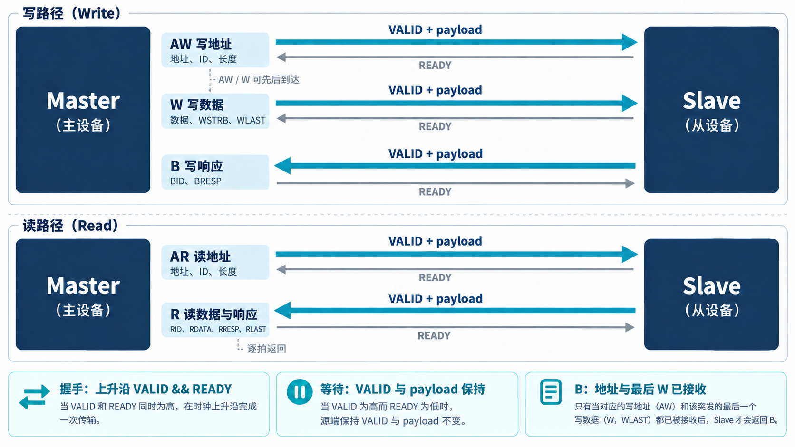

# AI 开发 AXI VIP，先讲清五条通道

[系列目录](../README.md)｜简体中文，英文版待补

如果把 AXI 理解成“地址发出去，等数据回来”，很容易写出能跑一次读写的模型，也很容易在第二笔请求到来时出错。AXI 将信息拆到不同通道，让它们可以分别推进；VIP 必须重新建立这些信息之间的关系。

本章以项目采用的 AXI4 为对象。下面的协议说明用于理解后续实现，握手与事务依赖核对基线为 [Arm IHI 0022H 的 A3 章](https://developer.arm.com/-/media/Arm%20Developer%20Community/PDF/IHI0022H_amba_axi_protocol_spec.pdf)。AXI4-Lite 的物理接口和子集约束见该规范 B1 章。

## 一次写操作经过三条通道，一次读操作经过两条

master 发起访问，slave 接收访问并返回结果。它们描述当前接口上的角色：一个桥可以在 AXI 侧充当 slave，在 APB 侧充当 master，并不存在整个模块只能有一种角色的要求。

| 通道 | 主要信息流向 | 回答的问题 |
| --- | --- | --- |
| AW，写地址 | master → slave | 写到哪里，多少拍，每拍多大？ |
| W，写数据 | master → slave | 这一拍写什么，哪些字节有效？ |
| B，写响应 | slave → master | 这笔写事务的响应是什么？ |
| AR，读地址 | master → slave | 从哪里读，多少拍，每拍多大？ |
| R，读数据与响应 | slave → master | 返回哪个 ID 的哪一拍，是否为最后一拍？ |

表中的方向指 payload，即有效载荷方向；每条通道的 READY 都沿相反方向返回。写数据 W 可以包含多拍，而一笔写 burst 对应一个 B 响应。读事务则在 R 通道逐拍返回数据，最后一拍带 `RLAST`。

*概念示意：每条通道独立握手，事务完成仍有跨通道依赖。箭头表示信息方向，不代表固定的逐拍波形。*

每条通道都有 VALID 和 READY。源端用 VALID 表示当前内容有效，接收端用 READY 表示能够接收；在时钟上升沿二者同时为 1，才发生一次传输。VALID 拉高后遇到 READY 为 0，源端要保持有效内容，直到握手。接收端这种暂缓接收的行为称为背压。

这里有一个会直接影响驱动设计的约束：源端不能以 READY 已经拉高为前提，才决定拉高 VALID。否则两端若互相等待，合法请求也可能永远无法开始。

## 通道独立，不意味着事务之间没有关系

AW 与 W 不要求同时到达，W 也可能先于 AW。因此 VIP 不能把“地址先握手、数据随后出现”当成唯一合法路径。实现需要保存已经收到的信息，等能够关联时再组成完整写事务。

但 slave 不能仅收到地址就返回写完成响应。AXI4 的 B 响应依赖于写地址和最后一拍写数据都已被接收。检查这一点时，必须比较实际握手事件，不能只检查信号是否曾经变成过 1。

读侧相对直观：AR 描述请求，R 返回数据。若 R 被背压，当前拍不能被直接替换成下一拍。测试只核对最终拼出的数组，可能漏掉等待期间的数据变化；因此 [第 3 章](chapter-03.md)会同时保留事务级观察和逐沿事件观察。

## burst 描述一组传输，字节使能决定实际更新

burst 是一次请求描述多拍数据的方式。`AxLEN` 表示拍数减一，`AxSIZE` 的编码表示每拍字节数的以 2 为底对数。例如 32 位总线上，四拍、每拍四字节的传输，其 LEN 为 3、SIZE 为 2；AW 和 AR 分别有自己的一组字段。

本项目 VIP 已实现 FIXED、INCR、WRAP 三种地址模式。FIXED 在多拍之间保持地址，适合某些 FIFO 型访问；INCR 逐拍推进；WRAP 在规定边界内回绕。使用时还要满足各自的长度、对齐条件以及不跨 4KB 边界等协议约束。并非任意一种模式都适合任意外设。

总线宽度与每拍传输大小也要分开理解。64 位总线一次容纳八个字节位置，但一个窄传输可能只使用其中两个。字节位置通常称为 byte lane，`WSTRB` 的每一位选择对应 lane 是否写入。部分写不能覆盖未选中的字节；全零 WSTRB 也不等于可以把整笔事务丢掉。

例如，原来的 32 位字为 `FFFF_FFFF`，当前 `WDATA=ABCD_1234`，`WSTRB=0011`。只有低两个 lane 更新，结果应是 `FFFF_1234`。这个结果已经出现在当前内存模型的单元检查中；[第 4 章](chapter-04.md)会进一步展开非对齐地址的独立预期。

## ID 让多笔请求可以同时存在

一笔事务发起后尚未完成，称为在途事务（outstanding transaction）。如果上一笔还没返回，master 又发出了下一笔，就需要记住多个等待结果的对象。

AXI 的 ID 用来表达事务关联和顺序关系。读响应通过 RID 关联读请求，写响应通过 BID 关联写请求。同一 ID 的同类事务需要保持相应顺序；不同 ID 可在允许条件下重排。不能将“不同 ID 可以重排”扩展成同一 ID 任意重排，也不能用 ID 自动推导所有读写之间的产品级一致性。

AXI4 的 W 通道没有 WID。写数据归属依赖写事务顺序，不能像不同 ID 的读数据那样任意交织。这也是读写两侧不能简单共用一套“按 ID 收所有数据”的逻辑的原因。

本项目将这些区别落实成 per-ID 读事务队列、写事务记录以及响应关联逻辑，并提供全局与每 ID 的在途上限。上限限制的是允许积累的未完成工作；配置项存在还不够，需要测试确实触发边界、等待并在响应后恢复发起。

## Full 和 Lite 要分别说明

AXI4-Lite 常用于控制寄存器接口，仍保留五条通道及各自握手，但去掉 ID、burst 等复杂属性。本项目提供独立的 Lite 物理接口，支持 32/64 位数据和部分字节写；它没有将 Full 的所有信号保留在端口上，再约定调用者忽略其中一部分。

当前 VIP 的 Lite 主动 master 一次保留一笔未完成事务，这是实现范围。不能由此得出“Lite 协议只允许一笔在途”的结论。类似地，Lite 的部分字节写与 Full 的可变 SIZE 窄传输也不是同一个接口能力。

响应字段同样影响判断。普通访问常见 OKAY、SLVERR、DECERR；Full 的独占访问还涉及 EXOKAY，Lite 不支持 EXOKAY。产品可能另外规定错误怎样映射，例如桥将某种下游失败转换成什么上游响应，这要由产品需求解释。

最后，AXI 协议没有统一的响应超时周期。VIP 可以设置仿真超时，防止用例永远等待；这是环境的进展检查，不能将“超过设定的 N 拍”直接称为通用 AXI 协议违规。

这些区别给 AI 开发提供了清楚的任务边界：先确定合法行为与必需状态，再写驱动、模型和检查。下一章将沿这条线进入实际组件。

[上一章](chapter-01.md)｜[下一章：多笔在途事务怎样管理](chapter-03.md)
