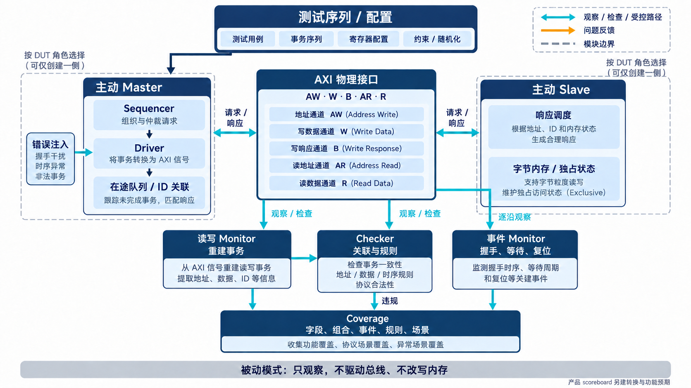

# AI 设计的 AXI VIP，怎样管理多笔在途事务？

[系列目录](../README.md)｜简体中文，英文版待补

一笔读请求已经握手，第二笔请求随后发出；第一笔响应尚未结束，另一个 ID 的数据开始返回。此时“当前正在处理的事务”不再是一个变量，而是一组等待完成的状态。

这套 AXI4 VIP 的架构围绕这些状态展开。上层用事务对象表达访问意图，driver 把它转换成引脚行为，monitor 从引脚重新观察事实，checker 检查协议关系，coverage 记录走过哪些情况。它们之间共享必要信息，但各自的职责不能被一份 driver 自报的结果取代。

## 三种角色决定谁有权驱动总线

`axi4_env` 是组装环境，依据配置创建 master 或 slave agent，也可以进入被动模式。agent 是一组负责某个接口角色的 UVM 组件。

主动 master 面对带 AXI slave 接口的 DUT（被测设计），发起读写并接收响应。主动 slave 面对 AXI master 型 DUT，接收请求、提供响应与存储行为。被动模式用于已有真实两端的接口，只观察，不争夺引脚驱动权。

当前实现中，主动角色创建相应 sequencer 和 driver；读写 monitor 负责观察。被动环境可创建两侧 agent 的观察组件，连接 checker 时避免将同一组读写观察重复送入其检查入口。它不会创建 bus driver，也不会因为观察到写事务而改写 slave 内存。这一行为已有物理五通道观察与“内存保持不变”的自测记录。

*概念示意：实线描述激励或响应，青色支路描述观察和检查。独立事件观察直接来自物理接口；被动模式保留观察能力，不驱动总线。图按职责组织，未逐一展开所有类。*

## 事务发出了，还要知道怎样结束

高层序列可以发起单拍读写或 burst 读写；需要指定 ID、地址模式或独占属性时，可构造更细的事务对象。sequence 描述“要做什么”，sequencer 组织请求，driver 才负责实际通道握手。

master driver 保存按 ID 组织的读在途队列和写在途记录。收到 RID 后，需要找到对应 ID 队列中的正确读事务，并继续累计其数据拍；收到 BID 后，需要找到对应写事务，回填响应并结束其等待。不能只因为总线上出现了一个 B，就把当前队头对象标成完成。

这套实现已有跨 ID 的 R/B 响应重排、读拍交织、W-before-AW 和在途上限控制，相应场景进入了冻结回归。slave 侧提供响应顺序与读拍交织配置，让合法复杂行为能够成为测试输入，而不只出现在意外情况里。

等待控制也分为不同位置：请求开始前、写数据阶段、响应开始前及响应之间的延迟，和五通道 READY 背压，都有对应配置。这样才能区分“地址尚未接受”“写数据被阻塞”和“响应已存在但 master 暂不接收”。这些情况都可能让序列暂时没有结果，根因却不同。

## monitor 重建发生了什么，checker 判断关系对不对

读写 monitor 从物理接口识别请求与响应，分别向 checker 提供观察结果；事务完成后，`transaction_ap` 发布事务，供覆盖或外部订阅者使用。analysis port 是 UVM 中传播观察数据的接口，订阅者不需要修改原组件就能接收它。

`axi4_event_monitor` 则直接记录五条通道上的握手、stall 开始与结束、复位事件。完整事务和逐沿事件回答不同问题：前者适合统计一次访问的属性与结果，后者能说明某个通道什么时候停住、是否真的发生过握手。

checker 结合事务关联与时序断言，检查 LAST、顺序、合法 lane、响应归属等规则。违规通过 `violation_ap` 输出规则、通道、时间和事务上下文，再接入规则覆盖。错误注入组件可按访问类型、ID、地址和通道筛选目标，为负向测试制造指定违例。

这些入口适合 AI 辅助调试，因为它们把“失败了”拆成可定位的事实。但仅从引脚无法知道上层是否已有一笔待发请求；“错误地等待 READY 才拉 VALID”还需要意图信息。[第 5 章](chapter-05.md)会说明这种独立检查为何必要。

## slave 内存模型与产品预期各有用途

主动 slave 内置按字节寻址的内存模型，支持直接预置和检查字节、按 lane 读写、WSTRB、burst 以及独占状态。独占访问要跟踪地址、ID 和相关属性；冲突写入或不匹配尝试会改变能否成功的判断，不能仅检查 LOCK 信号是否出现。

内存模型让 master 型 IP 有可交互的目标，也让 VIP 自测能够读写数据。它并不知道桥应该怎样翻译地址，更不知道一个产品寄存器是否读清零。因此，消费方仍需产品参考模型和 scoreboard。公共内存行为与产品语义的分界，会在[桥接实战](chapter-06.md)中展开。

此外，组件已有 UVM RAL 适配器，支持寄存器 frontdoor 访问和 predictor。frontdoor 表示通过真实总线访问寄存器；predictor 根据观察到的事务更新寄存器模型镜像。冻结报告核对了这些路径与物理内存的一致性，避免只在软件镜像中完成一次“读写”。

## 复位、参数和配置是运行时契约

有在途事务时发生复位，旧请求不能在复位后被新响应误完成。master driver 使用复位代际状态区分前后运行，并处理活动及排队请求；回归同时检查在途复位和恢复。具体消费方仍要决定复位后是否重试业务，不能由 VIP 暗中替项目作这个决定。

参数化接口也不是修改几个运行时数字就完成。物理 `axi4_if` 的位宽、传入 UVM 的 virtual interface 类型，以及 cfg 中声明的位宽需要一致。当前组件通过 `VIF_T` 类型参数传递接口，已运行八组独立 elaboration 与数据读回，还运行了 32/64 位混合实例。elaboration 是仿真器按参数构造实际设计层次的阶段；测试过默认实例不能替代这个步骤。

Lite 使用独立物理接口和对应适配桥，适配限定在 Lite 子集内，不承担把任意 Full burst 转成 Lite 访问的产品功能。其主动 master 的当前在途上限为一笔。

把这些约定交给 AI，比只给类名更有用：谁驱动引脚，谁关联响应，谁处理复位，哪些配置必须在构造后立即有效。下一章会把约定变成可以先执行、再实现的检查。

[上一章](chapter-02.md)｜[下一章：把预期写在实现之外](chapter-04.md)
