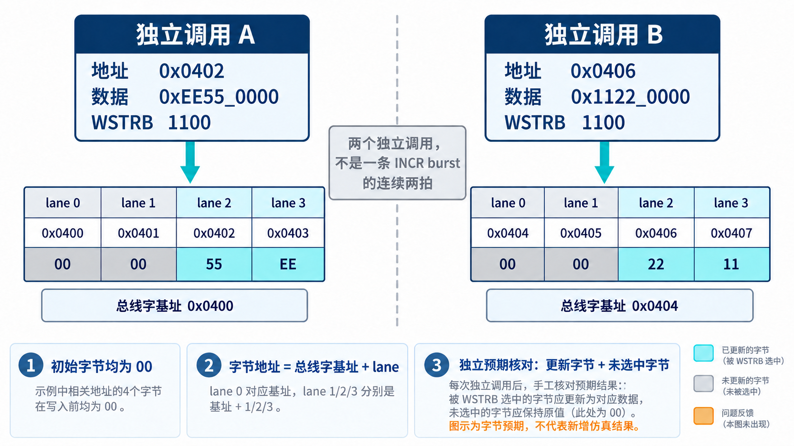

# 用 AI 开发 AXI VIP，先把预期写在实现之外

[系列目录](../README.md)｜简体中文，英文版待补

让 AI 同时生成一个内存模型和它的测试，很容易得到一段顺畅的自证过程：模型按某个公式写入，测试再按同一个公式读回，结果一致。若那个公式本身有误，两者仍会一起通过。

研发 VIP 时，这种同源错误尤其值得防范。VIP 将来要判断别的设计，检查依据需要在关键处独立建立。本章结合现有内存单元向量与运行时约定，说明一种可采用的 AI 协作方式；以下任务组织不是对历史 AI 会话的复述。

## 从四个字节开始，让预期可以手算

当前单元测试给内存模型设置 32 位地址、32 位数据和 4KB 测试空间，初始字节为零。先看两次独立的单拍内存写调用：第一次从地址 `0x0402` 写入 `0xEE55_0000`，strobe 为 `1100`；第二次从 `0x0406` 写入 `0x1122_0000`，strobe 同样为 `1100`。

它们用于检查非对齐 lane 和相邻字的隔离，**并不是一条 INCR burst 的连续两拍**。这一点必须先交代，否则例子会教错地址递进规则。

32 位总线有四个 byte lane。以第一次调用为例，地址所在总线字的基址是 `0x0400`；lane 2 和 lane 3 对应 `0x0402`、`0x0403`。数据按 lane 摆放，因此应写入 `55` 和 `EE`。第二次调用的基址是 `0x0404`，更新 `0x0406` 和 `0x0407`。

| 字节地址 | 两次调用后的预期值 | 为什么 |
| --- | --- | --- |
| `0x0400`、`0x0401` | `00`、`00` | 未被选中，保持初值 |
| `0x0402`、`0x0403` | `55`、`EE` | 第一次调用的 lane 2、3 |
| `0x0404`、`0x0405` | `00`、`00` | 未被选中，保持初值 |
| `0x0406`、`0x0407` | `22`、`11` | 第二次调用的 lane 2、3 |

表是依据调用参数推导的字节预期，不是新产生的仿真截图。现有单元断言检查了第一次读回、第二次写后第一次内容保持，以及 `0x0400` 处低两个 lane 保持零。若要进一步增强独立性，可以用 `peek_byte` 对照表中每个地址；这项建议与已有断言要分开表述。

*概念示意：先对齐总线字基址，再按 lane 定位字节。直接用原始地址再次加 lane 偏移，容易把偏移计算两遍。图中的数值是教学预期，不是新一轮执行结果。*

## 给 AI 的任务要包含反例和完成条件

这个例子适合拆成三个相互约束的产物。人先审阅字节表，确认地址和数据排列；AI 据此实现内存模型；测试直接检查固定预期，不调用被测模型内部的地址助手来生成答案。

任务可以这样写：在 32 位总线、初始内存为零的条件下，实现按总线 lane 的部分写；给定两次写调用，要求指定四个地址更新，其余地址不变。测试必须检查未选中 lane 和相邻字，不接受只有“写后读回等于输入”的判断。

之后再扩展覆盖：零 strobe、部分 strobe、合法窄传输、非对齐首拍，以及不同数据位宽。扩展时保留简单向量，因为它们失败后容易定位。随机激励能帮助探索组合，但无法取代预先确认的答案。

同样的拆法适用于响应关联。先写明发出几个 ID、允许什么返回顺序、每个对象最终应收到什么，再实现队列与回填。检查必须先确认响应数量和对象身份，再检查响应内容；否则未完成事务可能从比较逻辑的缝隙中漏掉。

## 将多通道任务拆到可以定位的层次

AXI VIP 不适合以“一次生成完整环境，最后跑个 smoke”为唯一研发节奏。可以先让纯函数和内存状态通过确定性向量，再接入单通道握手，然后增加跨通道关联，最后叠加并发、背压和复位。

每层给 AI 的反馈也不同。编译失败说明类型或接口契约尚未满足；lane 向量失败说明字节语义存在差异；物理 B 已握手但序列无结果，指向接收与回填路径；复位后旧请求仍被完成，则需要审查事务生命周期。反馈越接近实际机制，修正越不容易变成无关的大改。

当前实现保留了多层日志开关，分别记录事务、通道和数据拍。调试时应围绕失败路径开启足够的信息，而非用全部日志淹没第一处偏离。人和 AI 都应先回答：预期从哪一步开始与观察不同？

## 配置默认值也必须能被独立使用

一个易被忽略的输入是构造方式。UVM 配置对象可能由 `new()` 创建，也可能经过 `randomize()`。soft constraint 只参与随机化求解，不会自动给未经随机化的对象执行赋值。

2026 年 9 月 4 日的修正记录把默认 READY 值写入构造函数，并补了不调用 `randomize()` 的检查。它说明一个朴素的研发原则：约定“默认可用”，就要按调用者最直接的使用方式验收。不能让示例中的额外步骤悄悄成为组件的隐藏前提。[第 7 章](chapter-07.md)会展开这次问题。

在 AI 任务中，这应写成明确条件：构造后读取哪些字段、启动后何时有进展、哪些配置允许为零、哪些零值代表“不限制”。不能只要求“添加几个合理默认值”，把含义留给生成过程猜测。

## 人要审阅的是判断依据

AI 可以帮助起草测试，但关键预期需要能被独立解释。一个很有效的审阅问题是：假如实现错在这里，当前测试还可能通过吗？如果答案是可能，就继续拆开共享假设。

这种独立性并不要求所有东西都重写两遍。简单字节表、手工构造的错误响应、逐沿握手计数，往往就能提供不同于实现的观察路径。下一章将这些方法与当前冻结批次的实际结果对应起来，看看证据如何支持“这套 VIP 已经可以被使用”。

[上一章](chapter-03.md)｜[下一章：怎样建立可信证据](chapter-05.md)
