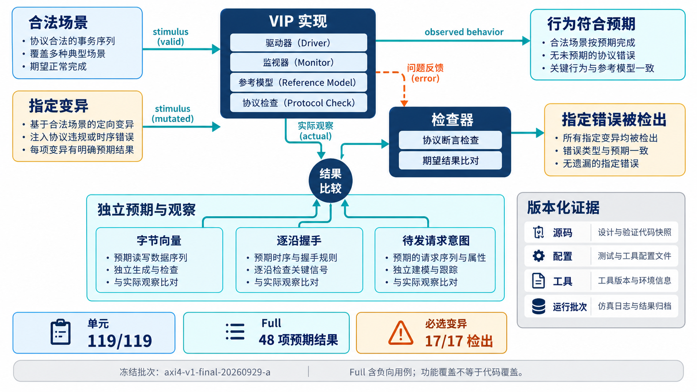

# AI 设计的 AXI VIP，凭什么相信它？

[系列目录](../README.md)｜简体中文，英文版待补

两个由同一套代码实现的 master 和 slave 能够通信，是一个有用的起点。但如果它们对某条规则有相同误解，通信成功就不足以证明协议正确。验证组件还需要独立预期、故意构造的错误，以及能够观察真实引脚的检查。

本章整理 AXI4 VIP 1.0.0 冻结批次 `axi4-v1-final-20260929-a` 的已有结果。工具条件为 VCS W-2024.09-SP1、UVM 1.2；结果来自已保存的工程报告，本次写作未重新运行仿真。它们支持明确范围内的工程判断，不代表所有参数、所有仿真器与所有未来 IP 都已验证。

## 先把“通过”拆成几种不同证据

| 证据 | 冻结批次结果 | 支持的判断 |
| --- | --- | --- |
| 单元检查 | 119 PASS，0 FAIL | 具体函数、内存、配置等基础行为符合预期 |
| AXI4 Full 回归 | 48 项预期结果通过 | 合法与指定非法场景按各自验收条件结束 |
| 参数矩阵 | 8/8 通过 | 八组参数独立构造实例，并完成实际数据读回 |
| 必选变异 | 17/17 检出 | 指定错误能够触发对应检查 |
| 独立构建入口 | smoke、example、unit 均构建运行通过 | 组件可由打包依赖入口重新组织并运行 |

这里最容易误读的是 48 项 Full 结果。负向用例会主动产生违规，验收检查指定错误是否出现、数量是否符合要求；因此它不是“48 项全部零错误”。最大 burst 长度非法输入的目标还验证了指定 fatal。只在日志末尾搜索一个 PASS，无法代替这些验收条件。

参数矩阵也有明确含义：ID、地址、数据位宽的八组组合分别为 `1:1:8`、`2:16:16`、`8:32:32`、`8:48:64`、`16:64:128`、`16:64:256`、`32:64:512`、`32:64:1024`。它覆盖了代表性宽度和边界，不是三个范围的全部笛卡尔积，也不代表这些极小地址空间都适合真实产品。

## 故意制造错误，验证检查器确实工作

变异测试在已知位置制造错误，再检查是否被识别。这个方向与普通合法测试相反：前者确认“错了能发现”，后者确认“对的行为不会被误判”。两者需要成对保留。

当前 17 项必选变异包含提前撤回 VALID、burst 跨 4KB、提前 RLAST、写数据完成前返回 B、W 等待期间 payload 变化、错误 byte lane、写数据归属错误和独占属性失配等。它们覆盖握手、事务关联、数据语义与状态管理，而不是把一种错误换十七个地址再跑一次。

比如，注入一个没有对应读请求的 R 响应，checker 应发现孤立响应；如果错误地把它挂到任意一笔现有事务上，单纯检查“收到了读数据”就可能通过。又如，同一 ID 的两笔读请求返回了错误数据关联，ID 本身仍合法，需要独立数据预期才能识别。

17 项变异与 17 条规则编号不是简单一一对应：VALID 相关规则有两个变异方向，而逐沿采样正确性通过独立语义测试检查，不计入故意违规的分母。分母如何形成，决定“检出率”究竟说明什么。

## 有些规则不能只靠总线引脚判断

VALID 一直为零，可能因为没有请求，也可能因为 driver 错误地等待 READY。仅凭这个引脚值无法区分两者。

当前 VALID 依赖检查为此引入上层“已有待发请求”的意图信息，并用独立 oracle 核对。oracle 在这里指给出预期判断的独立依据。有待发请求、满足发起条件，却以 READY 为门槛不发出 VALID，才构成所检查的问题。不能宣称一个纯被动引脚 monitor 自动看懂了所有上层意图。

采样事件则由另一个独立逐沿观察者检查五通道 handshake、stall 和 reset。这样，coverage 说发生了十次握手时，有另一条观察路径可核对它确实数对了。否则 driver、monitor 和 coverage 若共享同一个错误完成事件，统计也可能整齐而错误。

*概念示意：合法测试守护行为，变异测试检验检查能力，独立观察减少共享假设。几种证据互相补充，不相互替代。*

## 功能覆盖满了，具体满的是什么

该批次 Full 的精确功能覆盖结果如下。bin 是预先定义的覆盖目标；命中一个 bin，表示相应条件在观察中出现过。

| 覆盖类别 | 命中 / 目标 | 怎样理解 |
| --- | --- | --- |
| Field | 49/49 | 已定义的字段取值类别 |
| Cross | 43/43 | 已定义的条件组合 |
| Event | 17/17 | 握手、等待、复位等事件类别 |
| Rule | 17/17 | 规则相关命中 |
| Scenario | 10/10 | 预先组织的场景目标 |

这些结果来自同轮 Full32 运行中精确 bin 的并集合并，不能用“多次运行里最高的百分比”替代。它们表示该计划列出的功能目标均已命中；计划没有列出的行为，不能由 100% 自动推出。

这是功能覆盖，不是代码覆盖。该批次没有取得 URG 合并代码覆盖结果，因此不能将表里的百分比改写为 RTL 或验证代码的分支覆盖率。Lite 的 32/64 位测试另有记录，也不能直接套用 Full 的规则负向覆盖数字。

Lite 的已有实证包括双角色物理接口、部分写、PROT、五通道背压与复位、SLVERR/DECERR，以及两种宽度的 B/R EXOKAY 禁止负例。其主动 master 一笔在途的实现条件应与这些结果一起保留。

## 可集成性还要经过实际构建和物理观察

当前报告还记录了被动模式重建 AW/W/B/AR/R 且内存不变，RAL frontdoor/predictor 与物理内存一致，factory 扩展、配置与日志开关，以及 32/64 位混合实例运行。它们说明组件的使用入口和扩展路径也接受了检查。

FuseSoC 的 smoke、example、unit 三个入口分别独立构建运行，smoke/example 各为零 UVM_ERROR/FATAL，unit 为 119/119。这比“在开发者当前工作目录能跑通”多提供了一层交付证据。后续本地候选包的 86 项文件哈希也已核对；它说明本地打包身份得到固定，不等于远程发布或产品部署完成。

这些证据合在一起，让接入者可以有依据地选择该版本，再执行本项目需要的集成验证。下一章将来到 AXI-to-APB 桥：它会说明，公共 VIP 的通过记录怎样帮助项目，又为什么不能代替产品自己的功能判断。

[上一章](chapter-04.md)｜[下一章：AXI-to-APB 桥实战](chapter-06.md)
