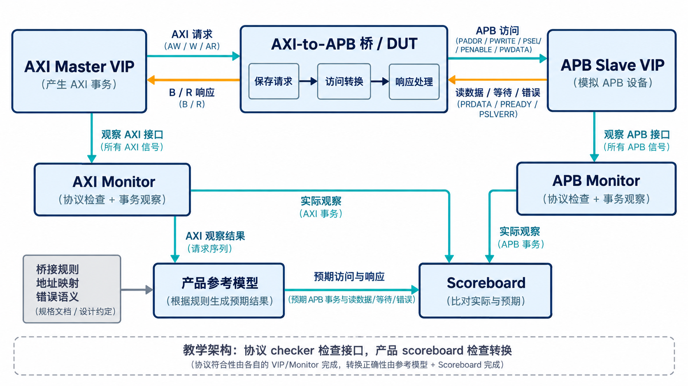

# AI 设计的 VIP 实战：验证 AXI-to-APB 桥

[系列目录](../README.md)｜简体中文，英文版待补

处理器或 DMA 经 AXI 发出访问，而目标是一个只有 APB 接口的外设寄存器。两边的节奏并不相同：AXI 可以分通道、发 burst、保留在途事务；APB 一次完成一个访问，通过 SETUP、ACCESS 和可选等待推进。连接它们的桥必须保存必要状态，将请求转换为下游访问，再把数据与响应送回。

AXI-to-APB 桥因此是检验 VIP 是否适合真实项目的好案例。它一边使用 AXI slave 接口接收请求，一边使用 APB master 接口发起外设访问；验证环境要同时看见两边，才知道事务有没有被正确转换。

## 已有接入记录说明了什么

2026 年 9 月 4 日的工程记录记载，AXI VIP 在修正 READY 默认值、B 响应线程与关联问题之后，完成了名为 x2p 的桥接 IP 集成验证。其中 `tc_sanity` 与 `tc_burst` 记录为 PASS。

这两项结果证明当时版本已经进入实际消费方，并完成了基本访问和 burst 场景。它们不是第 5 章最新冻结版在该 IP 上重新执行的结果，也不是该桥全部产品功能完成验收的声明。记录还显示，错误响应映射需要按桥自身需求另行判断——公共 AXI checker 不会替产品决定应当返回哪一种合法响应。

下面以这类桥解释接入方法。图和示例是教学组织方式，不把它们当成该次运行的逐实例拓扑，也不假定已经取得桥的全部实现细节。

## 环境围绕两端接口和一份转换预期组织

上游放 AXI master VIP，发出读写、等待 B/R 响应，并通过 monitor 观察实际事务。下游放 APB slave VIP，作为可控外设响应端，提供读数据、等待或错误。桥处于中间，是 DUT。

产品参考模型根据已接受的 AXI 请求和已确认的桥接规则，生成预期 APB 访问；scoreboard 接收两侧观察结果，核对实际访问与预期。它还需要根据下游结果判断上游应返回的内容。两侧协议检查继续各自工作。



*教学架构示意：上方是实际总线路径，下方是预期与比较路径。图中 Monitor 区域合并表示各端的观察与协议检查职责，具体实现仍分为 monitor 和 checker。产品模型从输入、下游测试配置及桥接规则推导预期，不读取 DUT 内部计算结果作为答案。该图不宣称复刻历史工程拓扑。*

下游既然可控，就可以让某一次 APB 访问多等几拍，观察桥是否保持当前访问并正确施加上游背压。也可以在选定地址返回错误，检查上游响应及下游副作用。此时要注意：APB slave VIP 用来制造受控环境，不能成为桥转换预期的唯一来源。

## 用一笔四拍写说明产品模型要补什么

取一个明确的教学配置：AXI 和 APB 数据宽度都为 32 位，地址不做偏移，目标是无副作用的测试存储区，桥接受四拍 INCR 写，每拍四字节，且不合并或丢弃这些访问。输入起始地址 `0x1000`，四拍数据分别为 D0、D1、D2、D3，WSTRB 全有效。

在这些假设下，预期下游访问如下：

| 次序 | APB 地址 | 写入数据 |
| --- | --- | --- |
| 0 | `0x1000` | D0 |
| 1 | `0x1004` | D1 |
| 2 | `0x1008` | D2 |
| 3 | `0x100C` | D3 |

这个小表已经包含协议 checker 无法独自回答的内容：桥是否递增了正确地址，数据有没有串拍，有没有少一次或多一次访问。为了让这些错误可见，D0～D3 应取互不相同的值，不宜全部写零。

若改成读事务，产品模型还要检查四个返回数据与原请求的关联、R 拍数和最后一拍标记。若加入 APB 等待，则访问表的含义不变，只改变完成时刻；scoreboard 应按接受与完成事件计数，不能把每个等待周期算成一次新访问。

真实桥可能有位宽转换、地址映射、访问过滤或写缓冲。届时必须先修改产品预期，不能把上表无条件照搬。尤其是 B 响应与下游实际完成之间的关系，要依据桥的缓冲及可见性约定判断，不能仅凭这个教学例子推导所有桥都必须等到全部 APB 操作结束才响应。

## 接入代码先把接口类型写准确

下面是依据当前 VIP 接口整理的 UVM 配置骨架，用于说明类型与层次约定，不是历史 x2p 的原始代码，也不是完整 testbench。

```systemverilog
localparam int ID_W = 8, ADDR_W = 32, DATA_W = 32;
typedef virtual axi4_if #(ID_W, ADDR_W, DATA_W, 1) VIF_T;
axi4_if #(ID_W, ADDR_W, DATA_W, 1) axi_bus(aclk, areset_n);

initial begin
  axi4_configuration cfg = axi4_configuration::get_axi4_profile();
  cfg.agent_mode = AXI4_ACTIVE_MASTER;
  cfg.id_width = ID_W;
  cfg.address_width = ADDR_W;
  cfg.data_width = DATA_W;
  cfg.strobe_width = DATA_W / 8;
  uvm_config_db #(VIF_T)::set(null, "uvm_test_top.env.axi", "vif", axi_bus);
  uvm_config_db #(axi4_configuration)::set(
      null, "uvm_test_top.env.axi", "cfg", cfg);
  run_test();
end
```

这个骨架要求 `env.axi` 实际创建为 `axi4_env #(VIF_T)`，并由 testbench 提供时钟、复位和 DUT 连线。改变 env 层次后，配置路径也要同步。配置中的数据位宽不会替代物理接口的参数，二者必须一致。

AI 适合根据明确的端口表和 UVM 层次补齐连线、配置及测试骨架；人需要先确认角色、位宽、复位 owner，以及产品支持的事务子集。没有这些输入，生成出来的环境即使编译通过，也可能测试了错误的工作模式。

## 从能跑通推进到能判断

一个有效的接入顺序是先做构造后直接可用的单拍读写，再做不同数据的 burst，随后逐项加入下游等待、部分写、错误映射和复位。每加入一类行为，都先写明两侧应观察到什么，再让 AI 扩展用例。

例如，错误映射用例要明确“哪次 APB 访问失败”“哪些副作用允许已经发生”“上游应返回什么”“剩余数据拍如何处理”。只要求 AI “增加异常测试”，很容易得到一个能够触发异常、却没有检查产品含义的用例。

历史接入已经提供了组件可进入 IP 验证流程的实证。下一步可积累的成果，是把每次现场差异变成明确的组件约定或产品检查。第 7 章就沿着这次接入暴露的 READY 和 B 响应问题，解释怎样判断该改哪里。

[上一章](chapter-05.md)｜[下一章：响应没回来怎样定位](chapter-07.md)
