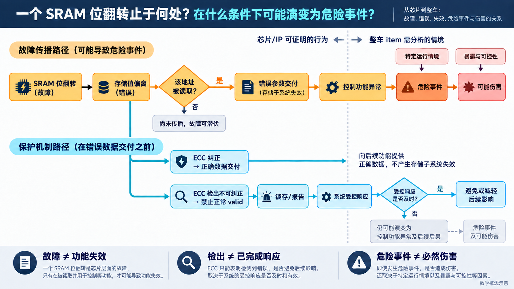
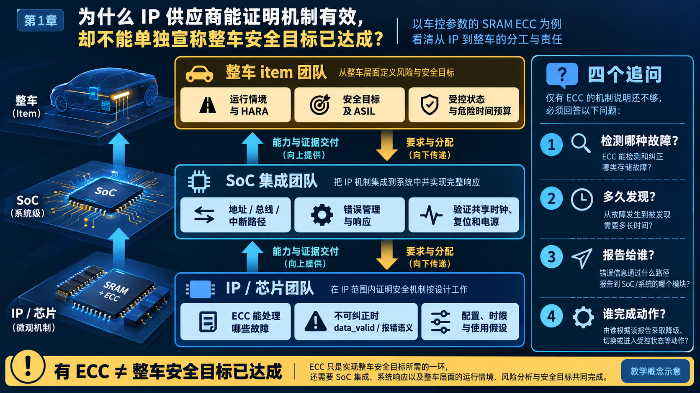

# 01｜芯片出错之后：功能安全到底要解决什么？

[返回系列索引](../INDEX.md) · 中文初稿

一块 SRAM 保存着控制软件下一轮要读取的参数。就在读取前，其中一个存储位翻转了。工程师很容易立刻问：“ECC 能不能纠正？”但这个问题只覆盖了故事的前半段。若 ECC 报告不可纠正，下游还会不会把数据当成有效值？告警能否送达？系统来不来得及采取动作？如果这次读取根本没有发生，这个故障又会潜伏多久？

功能安全关心的不是“芯片有没有出错”这一瞬间，而是**故障能否传播成不符合要求的系统行为，以及系统能否在危险出现前发现并控制它**。先沿这一次读参数，把几个常被混用的词放到各自的位置。

## 一个 bit 的变化，经过了几道门

存储位翻转可以作为一个**故障（fault）**来分析。它使原本保存的状态发生偏离；若读出的码字或内部状态与应有值不同，我们观察到了**错误（error）**。此时外部功能未必已经受影响：软件可能根本没读这个地址，ECC 也可能在读出时纠正错误。

假设这次读取确实发生，而存储子系统把错误参数连同“正常有效”的标记交给 CPU。对存储子系统而言，这已经是**失效（failure）**：它没有按要求提供正确或可辨别的读结果。到了上层，错误参数又成为控制软件的异常输入。只有它改变了控制决策，相关系统功能才可能进一步失效。同一事件在不同系统层级有不同角色，分析时必须写清“哪个对象没有履行哪条要求”。

“失效模式”则回答它**怎样**失效。数据值错、数据没有返回、无请求却返回、返回得太晚，都可能让同一功能出问题，却需要不同的观察点和安全机制。写一句“SRAM 坏了”，不足以指导 RTL、验证或故障分析。这些词的工程含义可对照 [ISO 26262-1:2018 的术语体系](https://www.iso.org/standard/68383.html)。

*图 1｜教学概念示意。橙色路径的每个箭头都有条件；蓝色路径分别表示纠正，以及检出不可纠正后阻断、报告并及时响应。图中不代表任何具体产品的诊断结果。*

图里的第一道门是“该地址是否被读取”。没被读取，错误可能留在存储器里；这不等于它已被消除。第二道门是“读出后如何处理”：纠正后交付正确数据，与检出但禁止坏数据作为正常值交付，是两种不同结果。第三道门在芯片之外：即使错误参数真的影响了控制功能，也要结合特定运行情境，才谈得上**危险事件**；危险事件又不等于伤害必然发生。

## 芯片的失效，为什么不能直接写成整车危险

以假设的车辆辅助控制功能为例，同一份参数错误，在功能未启用时可能没有即时外部影响；在另一个运行情境中，可能改变一次关键控制决策。车速、道路、驾驶员能否接管、其他控制通道是否可用，都会改变风险判断。因此，不能从“发生了一次 SRAM 位翻转”直接写到“车辆会碰撞”。

ISO 26262 把承担车辆层面功能的系统或系统组合称为 **item**，芯片和 IP 通常是其中的 **element**。危险分析与风险评估（HARA）需要围绕 item 的功能和车辆运行情境进行，进而形成安全目标与 ASIL。芯片团队可以给出故障模型、错误输出语义、检测时间和使用条件，却通常不能仅凭一颗 IP 的单元测试替整车确定风险。第二章会把这条传播路径放进一个完整的教学场景继续推演。

## 检出错误之后，还有一段路

假设 ECC 在一次读操作中检出不可纠正错误。设计至少要规定：本次读数据是否还能带正常有效标记；错误状态是否锁存；地址和故障类型如何送到 Error Manager；CPU 无法执行或普通中断被屏蔽时，是否存在其他响应路径。若错误已经作为有效参数被控制逻辑使用，稍后出现一个 error_irq 并不能撤销那次使用。

时间也要从头算到尾。故障可能先等待下一次读访问，随后经过 ECC 检测、事件传递、处理决策和实际输出动作。一个 IP 宣称“一个周期内报错”，只描述了其中一段。系统要求的是在危险输出出现前完成必要的阻断或受控响应；如果这条路径没有有界的最坏时间，就不能凭局部报警声称风险已得到控制。[ISO 26262-5:2018](https://www.iso.org/standard/68387.html)把硬件安全需求、设计、硬件架构指标和集成验证放在相应的研发活动中，正是因为机制有效性需要放回具体要求和时间条件评价。

这也解释了为何“安全状态”不能简单写成“复位”。复位期间外部输出会怎样？复位后谁重新装载可信参数？功能能否停机，还是必须先维持有限服务再降级？这些答案来自 item 的安全概念；芯片应提供可核查的接口行为和时序，使系统能够实现选定的响应。

## 有 ECC，谁来兑现剩下的要求

一颗可复用 IP 可能按 **SEooC（Safety Element out of Context，脱离具体 item 开发的安全相关元素）**思路设计。供应方先提出预期用途、假设性上层要求、配置限制和集成责任，再由实际系统的团队核对这些假设是否成立。若 IP 假定软件会处理不可纠正告警，而 SoC 集成时没有连通错误管理路径，ECC 的局部测试再充分，系统也没有得到那条完整的响应链。[ISO 26262-11:2018](https://www.iso.org/standard/69604.html)专门给出了面向半导体和可复用 IP 的应用指导。

*图 2｜教学概念示意。向下的是要求和分配，向上的是能力与证据。IP 的 ECC 能力需要与 SoC 的报告、响应路径及整车运行情境接起来。*

因此，评价 ECC、lockstep、watchdog 或任何新加的安全机制时，可以连续问四件事：**检测哪种故障？多久发现？报告给谁？谁完成动作？** 第一个问题由故障模型与设计决定，第二个需要最坏时间，后两个必须跨越 IP 接口。任何一个答案含糊，都说明安全主张仍有边界未交代。

最后还要分清成因。随机硬件失效可以在规定条件下结合失效率和诊断机制做定量分析；系统性失效则可能来自错误需求、设计或实现。例如 ECC 编码器从设计起接错了矩阵，用漂亮的随机故障覆盖率无法补救。两者可能表现为同样的错误输出，却需要不同的预防与验证证据。后面的章节会逐项展开这些机制与分析方法。

从这一章带走的判断很简单：**先确定故障怎样传播，再问每一段由谁发现、阻断和证明。** 安全机制的名字只是起点；功能安全最终要落在特定系统、特定故障和可核查的响应上。
